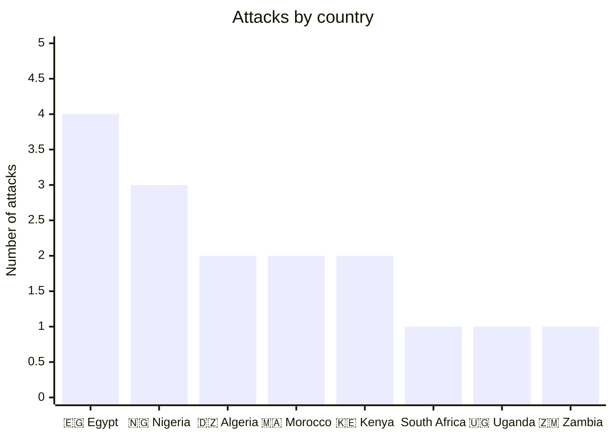
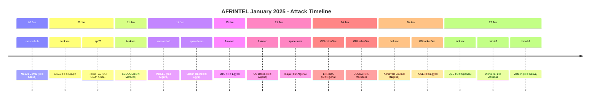

[](https://github.com/Hatchepsoute/AFRINTEL)

# CTI Report: Cyber attacks in Africa - January 2025
👉🏾 [**French version available here** ](./README_FR.md)
## 1. Introduction
This Cyber Threat Intelligence (CTI) report provides a detailed analysis of cyber attacks that occurred in Africa during January 2025. The information is derived from OSINT sources and ransomware group leak sites, compiled as part of the AFRINTEL project. The objective is to provide a clear overview of trends, threat actors, targeted sectors, and associated indicators of compromise.

## 2. Executive summary
- **Total number of recorded attacks:** 16
- **Most active ransomware groups:** funksec (5 attacks), GDLockerSec (3), babuk2 (2), ransomhub (2), spacebears (2), apt73 (1).
- **Most targeted sectors:** Education (5), Public Administrations (3), Healthcare (2), Business Services (2), Retail (1), Logistics (1), Marketing (1), Hospitality (1).
- **Most affected countries:** Egypt (4), Nigeria (3), Algeria (2), Morocco (2), Kenya (2), South Africa (1), Uganda (1), Zambia (1).
- **Exfiltrated data volume:** At least 1.5 TB for INTELS Nigeria, 19 GB for molars.co.ke. Other volumes are not specified.

## 3. Key statistics

### 3.1 Breakdown by ransomware group
| Ransomware Group | Number of Attacks |
|-------------------|-------------------|
| funksec           | 5                 |
| GDLockerSec       | 3                 |
| babuk2            | 2                 |
| ransomhub         | 2                 |
| spacebears        | 2                 |
| apt73             | 1                 |
| **Total**         | **16**            |

### 3.2 Breakdown by sector
| Sector | Number of attacks |
|---------|-------------------|
| Education | 5 |
| Public Administrations | 3 |
| Healthcare | 2 |
| Business Services | 2 |
| Retail | 1 |
| Logistics | 1 |
| Digital Marketing | 1 |
| Hospitality | 1 |
| **Total** | **16** |

### 3.3 Breakdown by Country
| Country | Number of attacks |
|------|-------------------|
| 🇪🇬 Egypt | 4 |
| 🇳🇬 Nigeria | 3 |
| 🇩🇿 Algeria | 2 |
| 🇲🇦 Morocco | 2 |
| 🇰🇪 Kenya | 2 |
| 🇿🇦 South Africa | 1 |
| 🇺🇬 Uganda | 1 |
| 🇿🇲 Zambia | 1 |
| **Total** | **16** |

### 3.4 CTI map of Africa
A visual representation of attacks per country.

🇪🇬 Egypt          	████
🇳🇬 Nigeria          	███
🇲🇦 Morocco      	██
🇰🇪 Kenya              	██
🇩🇿Algeria         	██
🇿🇦 South Africa 	█
🇺🇬 Uganda   		█
🇿🇲 Zambia       	█

## 4. Detailed attacks by ransomware group


### 4.1 FunkSec (5 attacks)
- **09/01/2025:** gags.gov.eg (Egypt, administrations)
- **11/01/2025:** seocommarrakech.com (Morocco, marketing)
- **15/01/2025:** mts.gov.eg (Egypt, administrations)
- **21/01/2025:** cu-barika.dz (Algeria, education)
- **26/01/2025:** achieverssciencejournal.org (Nigeria, education)
- **27/01/2025:** qed.co.ug (Uganda, education/services)

*Note:* funksec primarily targeted administrations and education, with a varied geographic distribution.

### 4.2 GDLockerSec (3 attacks)
- **24/01/2025:** lnrbda.gov.ng (Nigeria, administrations)
- **24/01/2025:** usmba.ac.ma (Morocco, education)
- **26/01/2025:** fgse.cu.edu.eg (Egypt, education)

*Note:* GDLockerSec struck educational and governmental institutions, with seemingly small data volumes (a few MB).

### 4.3 Babuk2 (2 attacks)
- **27/01/2025:** workers.com.zm (Zambia, HR services)
- **27/01/2025:** zetech.ac.ke (Kenya, education)

*Note:* Babuk2 targeted a service company and a university.

### 4.4 Ransomhub (2 attacks)
- **06/01/2025:** molars.co.ke (Kenya, healthcare) - 19 GB exfiltrated
- **14/01/2025:** INTELS Nigeria (Nigeria, logistics) - 1.5 TB exfiltrated

*Note:* Ransomhub carried out two significant attacks with large data volumes, notably on a Nigerian critical infrastructure.

### 4.5 spacebears (2 attacks)
- **14/01/2025:** Sharm Reef Hotel (Egypt, hospitality)
- **21/01/2025:** Inaya Clinique (Algeria, healthcare)

*Note:* Space Bears targeted tourism and healthcare.

### 4.6 apt73 (1 attack)
- **09/01/2025:** pnp.co.za (South Africa, retail) - Pick n Pay, a major retailer.

## 5. Sectoral Analysis
- **Education:** 5 attacks (universities, schools, academic journals). Groups funksec, GDLockerSec, and babuk2 are particularly active in this sector.
- **Public administrations:** 3 attacks (government websites, agencies). funksec and GDLockerSec are the main actors.
- **Healthcare:** 2 attacks (dental clinic, hospital). Ransomhub and Spacebears.
- **Business Services:** 2 attacks (consulting firm in Uganda and HR services in Zambia). funksec and babuk2.
- **Retail:** 1 attack (Pick n Pay) by apt73.
- **Logistics:** 1 major attack (INTELS Nigeria) by Ransomhub.
- **Marketing:** 1 attack (SEO agency) by Funksec.
- **Hospitality:** 1 attack (hotel) by Spacebears.

## 6. Geographic analysis
- **Egypt:** 4 attacks, mainly administrations and education.
- **Nigeria:** 3 attacks, including a critical one on the oil sector.
- **Algeria:** 2 attacks (education and healthcare).
- **Morocco:** 2 attacks (marketing and education).
- **Kenya:** 2 attacks (healthcare and education).
- **South Africa:** 1 attack on a major retailer.
- **Uganda:** 1 attack (consulting).
- **Zambia:** 1 attack (HR services).

East and North Africa are the most affected, with a notable presence in West Africa (Nigeria).
### 6.1. Actor → victim → country graph
```mermaid
graph LR
    funksec -->|gags.gov.eg, mts.gov.eg| 🇪🇬 Egypt
    funksec -->|seocommarrakech.com|🇲🇦 Morocco
    funksec -->|cu-barika.dz|🇩🇿 Algeria
    funksec -->|achieverssciencejournal.org| 🇳🇬 Nigeria
    funksec -->|qed.co.ug| 🇺🇬 Uganda

    GDLockerSec -->|lnrbda.gov.ng|🇳🇬 Nigeria
    GDLockerSec -->|usmba.ac.ma|🇲🇦 Morocco
    GDLockerSec -->|fgse.cu.edu.eg|🇪🇬 Egypt

    ransomhub -->|Molars Dental|🇰🇪 Kenya
    ransomhub -->|INTELS|🇳🇬 Nigeria

    spacebears -->|Sharm Reef Hotel|🇪🇬 Egypt
    spacebears -->|Clinique Inaya| 🇩🇿Algeria

    babuk2 -->|workers.com.zm|🇿🇲 Zambia
    babuk2 -->|Zetech University|🇰🇪 Kenya

    apt73 -->|Pick n Pay| 🇿🇦 South Africa
```
### 6.2. Attack timeline

## 7. Observed TTPs
Based on the limited descriptions, we note:
- **Data Exfiltration:** Groups claim significant volumes (1.5 TB for INTELS, 19 GB for molars).
- **Targeting Specific Sectors:** Administrations and education are prioritized.
- **Use of Leak Sites:** Groups publish data samples to apply pressure.
- **Diversity of Groups:** 6 different groups active in January 2025.

## 8. Recommendations
- **Public sector:** Strengthen security for government websites and educational institutions, which are often vulnerable.
- **Private sector:** Logistics and healthcare companies must prioritize the protection of sensitive data.
- **Group monitoring:** Track activities of funksec, GDLockerSec, and ransomhub, which appear most prolific.
- **Awareness:** Train employees on phishing and social engineering risks, likely initial access vectors.

## 9. Conclusion
January 2025 was marked by sustained activity from several ransomware groups in Africa, with a focus on public and educational institutions. The group funksec stands out for its frequency, while ransomhub carried out the largest attack. The diversity of actors and affected sectors underscores the need for increased vigilance and regional cooperation in cybersecurity.

## ✍🏿 Author
*Adama ASSIONGBON*  
*SOC & Cyber Threat Intelligence Consultant*  
[LinkedIn Profile](https://www.linkedin.com/in/adama-assiongbon-9029893a/)

---
*AFRINTEL - Open CTI Monitoring Initiative on Africa*
