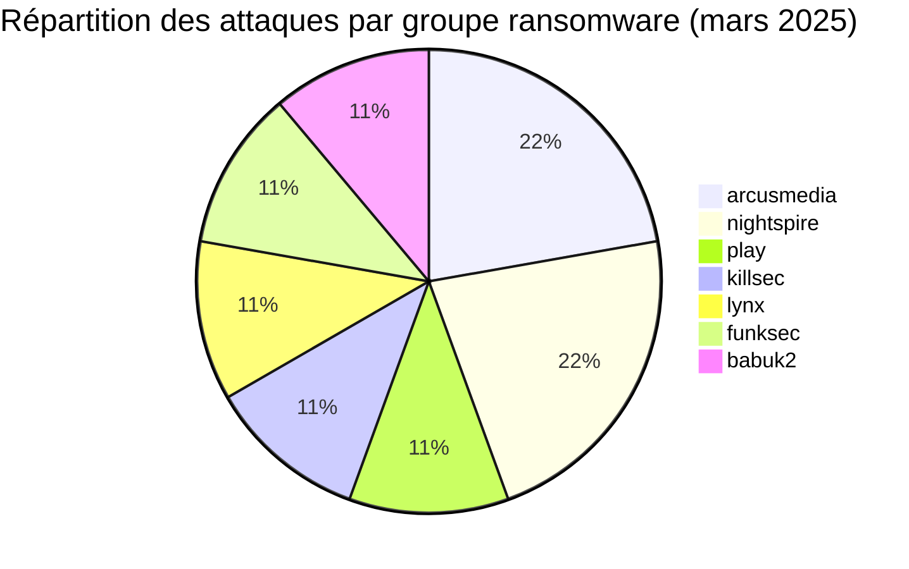
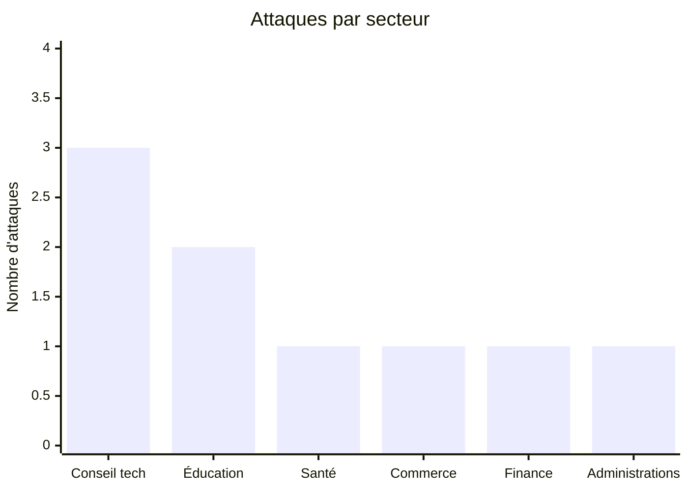
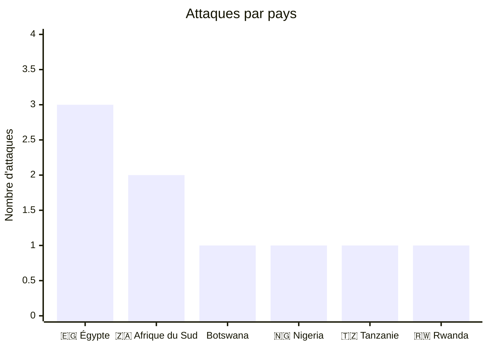
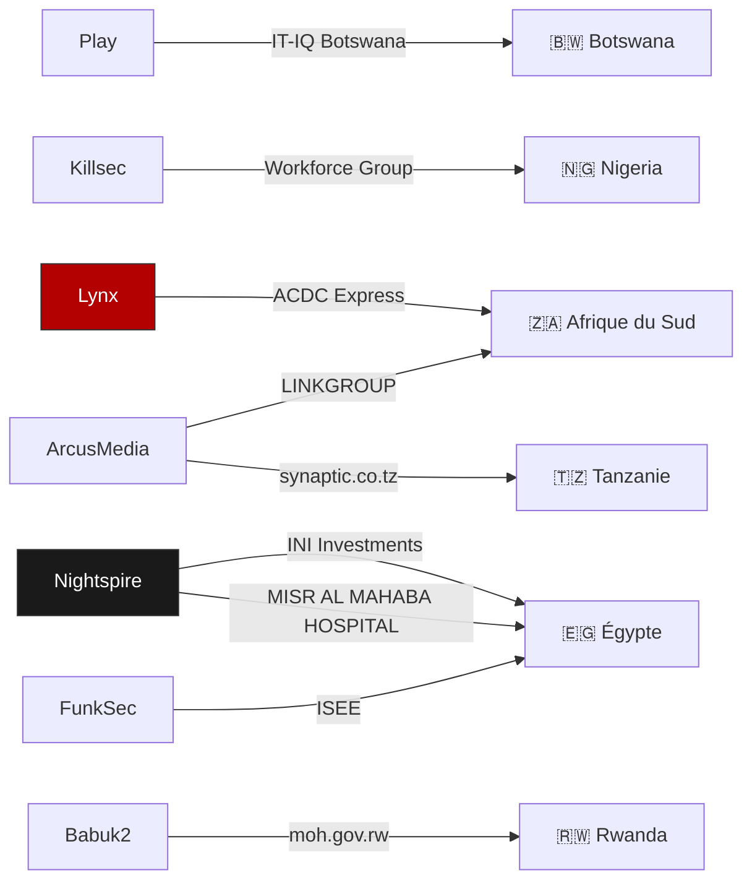
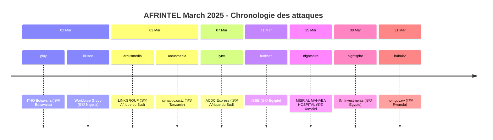

# Rapport CTI : Cyberattaques en Afrique - Mars 2025
👉🏾 [**English version available here** ](./README.md)
## 1. Introduction
Ce rapport de Cyber Threat Intelligence (CTI) présente une analyse détaillée des cyberattaques survenues en Afrique durant le mois de mars 2025. Les informations sont issues de sources OSINT et de sites de fuites de groupes ransomware, compilées dans le cadre du projet AFRINTEL. L'objectif est de fournir une vision claire des tendances, des acteurs menaçants, des secteurs ciblés et des indicateurs de compromission associés.

## 2. Résumé exécutif
- **Nombre total d'attaques recensées** : 9
- **Groupes ransomware les plus actifs** : arcusmedia (2 attaques), nightspire (2), play (1), killsec (1), lynx (1), funksec (1), babuk2 (1).
- **Secteurs les plus ciblés** : Conseil en technologies (3), Éducation (2), Santé (1), Commerce de détail (1), Finance (1), Administrations publiques (1).
- **Pays les plus touchés** : Égypte (3), Afrique du Sud (2), Botswana (1), Nigeria (1), Tanzanie (1), Rwanda (1).
- **Volume de données exfiltrées** : 400 Go pour INI Investments (Égypte). Les autres volumes ne sont pas précisés.

## 3. Statistiques clés

### 3.1 Répartition par groupe ransomware
| Groupe ransomware | Nombre d'attaques |
|-------------------|-------------------|
| arcusmedia        | 2                 |
| nightspire        | 2                 |
| play              | 1                 |
| killsec           | 1                 |
| lynx              | 1                 |
| funksec           | 1                 |
| babuk2            | 1                 |
| **Total**         | **09**            |

### 3.2 Répartition par secteur d'activité
| Secteur | Nombre d'attaques |
|---------|-------------------|
| Conseil en technologies | 3 |
| Éducation | 2 |
| Santé | 1 |
| Commerce de détail | 1 |
| Finance | 1 |
| Administrations publiques | 1 |
| **Total** | **09** |

### 3.3 Répartition par pays
| Pays | Nombre d'attaques |
|------|-------------------|
| 🇪🇬 Égypte | 3 |
| 🇿🇦 Afrique du Sud | 2 |
| 🇧🇼  Botswana | 1 |
| 🇳🇬 Nigeria | 1 |
| 🇹🇿  Tanzanie | 1 |
| 🇷🇼 Rwanda | 1 |
| **Total** | **09** |

## 4. Détail des attaques par groupe ransomware

### 4.1 arcusmedia (2 attaques)
- **03/03/2025** : LINKGROUP (Afrique du Sud, conseil en technologies)
- **03/03/2025** : synaptic.co.tz (Tanzanie, conseil en technologies)

*Remarque* : arcusmedia a ciblé deux sociétés de conseil en informatique le même jour, en Afrique du Sud et en Tanzanie.

### 4.2 nightspire (2 attaques)
- **25/03/2025** : MISR AL MAHABA HOSPITAL (Égypte, santé)
- **30/03/2025** : INI Investments (Égypte, finance) – 400 Go exfiltrés

*Remarque* : nightspire a frappé deux entités égyptiennes, un hôpital privé et une holding financière, avec un volume de données important.

### 4.3 play (1 attaque)
- **02/03/2025** : IT-IQ Botswana (Botswana, conseil en technologies)

### 4.4 killsec (1 attaque)
- **02/03/2025** : Workforce Group (Nigeria, éducation/RH)

### 4.5 lynx (1 attaque)
- **07/03/2025** : ACDC Express (Afrique du Sud, commerce de détail)

### 4.6 funksec (1 attaque)
- **11/03/2025** : ISEE (Égypte, éducation)

### 4.7 babuk2 (1 attaque)
- **31/03/2025** : moh.gov.rw (Rwanda, administrations publiques – santé)

## 5. Analyse sectorielle
- **Conseil en technologies** : 3 attaques (IT-IQ Botswana, LINKGROUP, synaptic.co.tz). Les groupes play et arcusmedia sont les principaux acteurs, ciblant des prestataires de services IT dans trois pays différents.
- **Éducation** : 2 attaques (Workforce Group, ISEE). killsec et funksec ont visé une entreprise de services éducatifs et une école privée.
- **Santé** : 1 attaque (MISR AL MAHABA HOSPITAL) par nightspire, touchant un hôpital privé au Caire.
- **Commerce de détail** : 1 attaque (ACDC Express) par lynx, visant un distributeur majeur en Afrique du Sud.
- **Finance** : 1 attaque (INI Investments) par nightspire, avec exfiltration massive de 400 Go.
- **Administrations publiques** : 1 attaque (Ministère de la Santé du Rwanda) par babuk2.

## 6. Analyse géographique
- **Égypte** : 3 attaques (ISEE, MISR AL MAHABA HOSPITAL, INI Investments) - éducation, santé et finance. L'Égypte reste le pays le plus ciblé du mois.
- **Afrique du Sud** : 2 attaques (LINKGROUP, ACDC Express) - technologies et commerce de détail.
- **Botswana** : 1 attaque (IT-IQ Botswana) - technologies.
- **Nigeria** : 1 attaque (Workforce Group) - éducation/RH.
- **Tanzanie** : 1 attaque (synaptic.co.tz) - technologies.
- **Rwanda** : 1 attaque (Ministère de la Santé) - administration publique.
### 6.1. Graphe acteur → victime → pays

L'Afrique du Nord (Égypte) et l'Afrique australe (Afrique du Sud, Botswana) concentrent la majorité des attaques, avec une présence en Afrique de l'Est (Tanzanie, Rwanda) et de l'Ouest (Nigeria).

### 6.2. Timeline des attaques

## 7. TTPs observées
D'après les descriptions disponibles, on note :
- **Exfiltration massive** : INI Investments (400 Go) démontre une capacité à collecter de grands volumes de données sensibles.
- **Ciblage de secteurs stratégiques** : finance, santé, administrations publiques.
- **Diversité géographique** : les attaques couvrent six pays, montrant une expansion des groupes ransomware sur le continent.
- **Double extorsion probable** : revendications accompagnées de menaces de divulgation.
- **Ciblage des prestataires IT** : 3 attaques sur des sociétés de conseil en technologies, potentiellement utilisées comme tremplin vers leurs clients.

## 8. Recommandations
- **Égypte** : renforcer la cybersécurité dans les secteurs de la finance et de la santé, particulièrement ciblés par nightspire.
- **Sociétés de conseil IT** : mettre en place une segmentation réseau stricte et une surveillance renforcée, car elles sont des cibles privilégiées.
- **Secteur éducatif** : sensibiliser les établissements privés et publics aux risques de ransomware.
- **Administrations publiques** : le ministère rwandais de la Santé doit revoir ses protocoles de sécurité et ses sauvegardes.
- **Tous secteurs** : former les employés à la détection des phishing et mettre en œuvre l'authentification multi-facteurs.

## 9. Conclusion
Mars 2025 a été marqué par une activité soutenue des groupes ransomware en Afrique, avec une diversification géographique et sectorielle. L'Égypte reste le pays le plus touché, notamment par nightspire qui a réalisé l'attaque la plus volumineuse du mois (INI Investments, 400 Go). Le secteur du conseil en technologies est particulièrement visé, avec 3 attaques. La présence de groupes comme play, arcusmedia ou babuk2 sur plusieurs pays montre une professionnalisation et une expansion des menaces sur le continent.

## ✍🏿 Auteur
*Adama ASSIONGBON*  
*Consultant SOC & Cyber Threat Intelligence*  
[LinkedIn Profile](https://www.linkedin.com/in/adama-assiongbon-9029893a/)

---
*AFRINTEL - Initiative ouverte de veille CTI sur l’Afrique*
