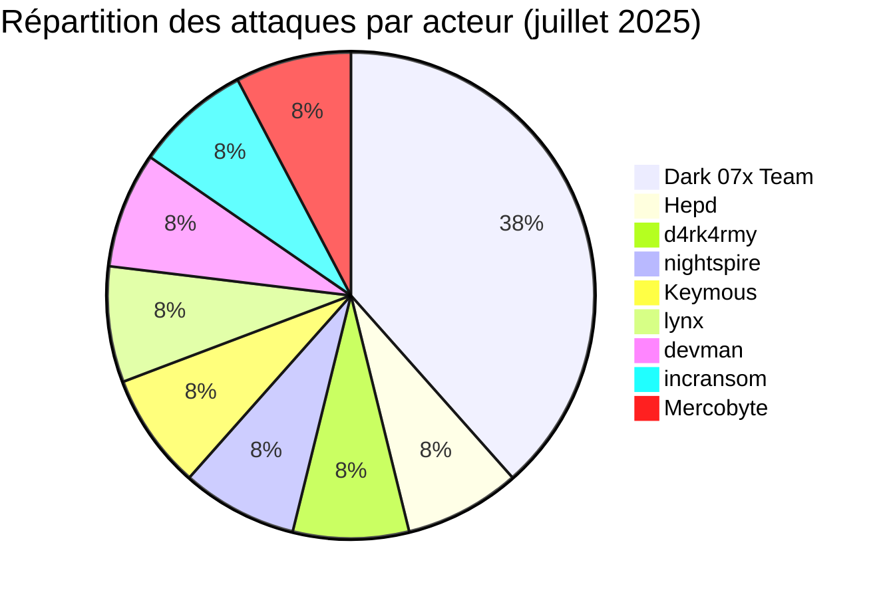
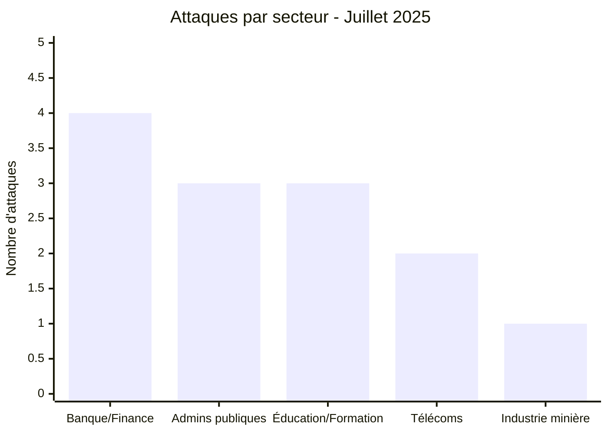
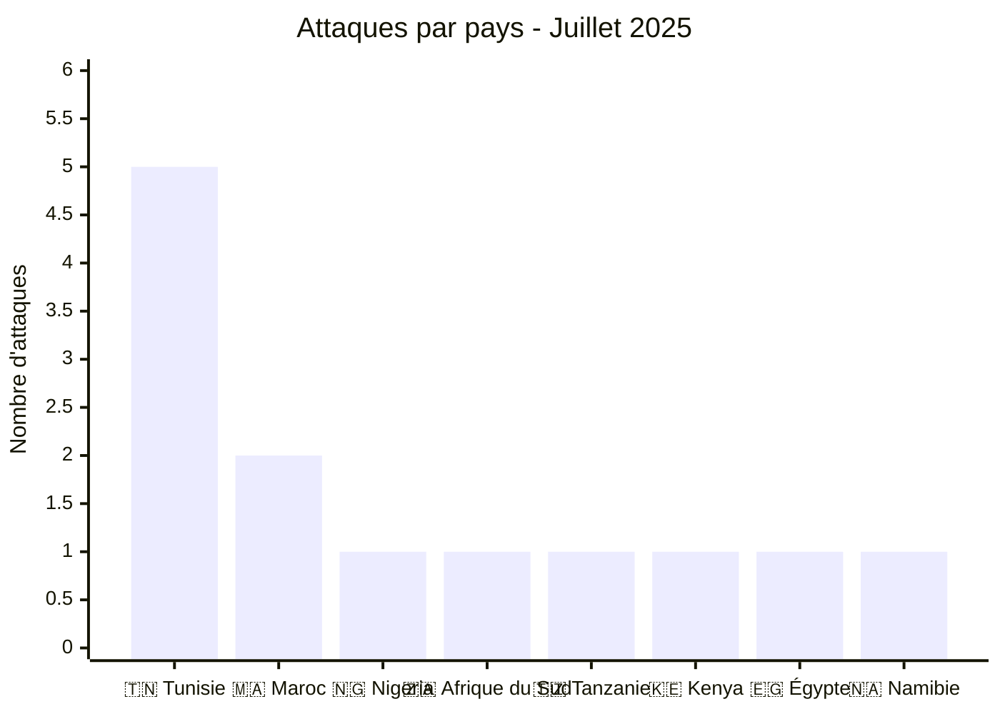
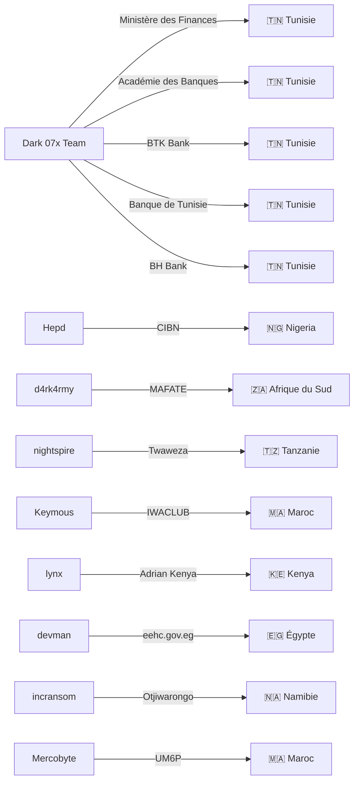
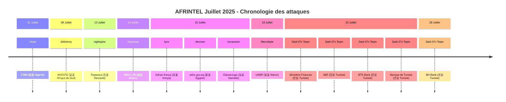

# Rapport CTI : Cyberattaques en Afrique - Juillet 2025 (13 victimes)
👉🏾 [**English version available here**](./README.md)

## 1. Introduction
Ce rapport de Cyber Threat Intelligence (CTI) présente une analyse détaillée des cyberattaques survenues en Afrique durant le mois de juillet 2025. Les informations sont issues de sources OSINT et de sites de fuites de groupes ransomware, compilées dans le cadre du projet AFRINTEL. L'objectif est de fournir une vision claire des tendances, des acteurs menaçants, des secteurs ciblés et des indicateurs de compromission associés.

## 2. Résumé exécutif
- **Nombre total d'attaques recensées** : 13
- **Acteurs les plus actifs** : Dark 07x Team (5 attaques), Hepd (1), d4rk4rmy (1), nightspire (1), Keymous (1), lynx (1), devman (1), incransom (1), Mercobyte (1).
- **Secteurs les plus ciblés** : Banque/Finance (4), Administrations publiques (3), Télécommunications (2), Éducation/Formation (2), Industrie minière (1), ONG (1).
- **Pays les plus touchés** : Tunisie (5), Maroc (2), Nigeria (1), Afrique du Sud (1), Tanzanie (1), Kenya (1), Égypte (1), Namibie (1).
- **Volumes de données exfiltrés notables** : Rançon de 2,27 M$ demandée pour eehc.gov.eg (Égypte). Autres volumes non précisés.

## 3. Statistiques clés

### 3.1 Répartition par groupe/acteur
| Groupe/Acteur | Nombre d'attaques |
|---------------|-------------------|
| Dark 07x Team | 5                 |
| Hepd          | 1                 |
| d4rk4rmy      | 1                 |
| nightspire    | 1                 |
| Keymous       | 1                 |
| lynx          | 1                 |
| devman        | 1                 |
| incransom     | 1                 |
| Mercobyte     | 1                 |
| **Total**     | **13**            |

### 3.2 Répartition par secteur d'activité

| Secteur | Nombre d'attaques |
|---------|-------------------|
| Banque / Finance| 4 |
| Administrations publiques| 3 |
| Éducation / Formation | 3 |
| Télécommunications | 2 |
| Industrie minière | 1 |
| **Total** | **13** |

### 3.3 Répartition par pays
| Pays | Nombre d'attaques |
|------|-------------------|
| 🇹🇳 Tunisie | 5 |
| 🇲🇦 Maroc | 2 |
| 🇿🇦 Afrique du Sud | 1 |
| 🇳🇬 Nigeria | 1 |
| 🇹🇿 Tanzanie | 1 |
| 🇰🇪 Kenya | 1 |
| 🇪🇬 Égypte | 1 |
| 🇳🇦 Namibie | 1 |
| **Total** | **13** |

## 4. Détail des attaques par groupe/acteur
### 4.1 Dark 07x Team (5 attaques)
- **25/07/2025 :** Ministère des Finances (Tunisie, gouvernement) - Revendication "Full Access".
- **25/07/2025 :** Académie des Banques et des Finances (Tunisie, formation) - Compromission interface admin.
- **25/07/2025 :** BTK Bank (Tunisie, banque) - Compromission de comptes (ATO) et mise en vente.
- **25/07/2025 :** Banque de Tunisie (Tunisie, banque) - Exfiltration de données financières et identités.
- **28/07/2025 :** BH Bank (Tunisie, banque) - Compromission majeure et prise de contrôle de comptes (ATO).

**Remarque :** Dark 07x Team a mené une campagne coordonnée contre le secteur financier et gouvernemental tunisien, avec cinq attaques en quelques jours, démontrant une capacité opérationnelle élevée.

### 4.2 Hepd (1 attaque)
- **01/07/2025** : Chartered Institute of Bankers of Nigeria (CIBN) (Nigeria, régulation bancaire) – Fuite de données sur l'élite bancaire.

### 4.3 d4rk4rmy (1 attaque)
- **08/07/2025** : MAFATE BUSINESS ENTERPRISE (Afrique du Sud, services miniers) – Revendication & divulgation.

### 4.4 nightspire (1 attaque)
- **13/07/2025** : Twaweza (Tanzanie, ONG éducative) – Revendication & divulgation.

### 4.5 Keymous (1 attaque)
- **14/07/2025** : IWACLUB (Maroc, télécommunications/distribution) – Fuite de données.

### 4.6 lynx (1 attaque)
- **15/07/2025** : Adrian Kenya (Kenya, télécommunications/ingénierie) – Revendication & divulgation.

### 4.7 devman (1 attaque)
- **15/07/2025** : eehc.gov.eg (Égypte, gouvernement) – Rançon de 2,27 M$ demandée.

### 4.8 incransom (1 attaque)
- **15/07/2025** : Otjiwarongo Municipality (Namibie, gouvernement local) – Revendication & divulgation.

### 4.9 Mercobyte (1 attaque)
- **18/07/2025** : Université Mohammed VI Polytechnique (Maroc, éducation) – Fuite de données ciblée et opération d'influence.

### 4.10 Graphe acteur → victime → pays

## 5. Analyse sectorielle
- **Banque/Finance** : 4 attaques (CIBN, BTK, Banque de Tunisie, BH Bank). Dark 07x Team a ciblé trois banques tunisiennes et Hepd a visé l'organisme de régulation nigérian, montrant une attention soutenue au secteur financier.
- **Administrations publiques** : 3 attaques (eehc.gov.eg, Otjiwarongo Municipality, Ministère des Finances Tunisie). Les acteurs devman, incransom et Dark 07x Team ont frappé des institutions gouvernementales, avec une demande de rançon élevée pour l'Égypte.
- **Éducation/Formation** : 3 attaques (Twaweza, ABF, UM6P). Nightspire a visé une ONG éducative en Tanzanie, Dark 07x Team une académie bancaire et Mercobyte une université de prestige au Maroc avec une opération d'influence.
- **Télécommunications** : 2 attaques (IWACLUB, Adrian Kenya). Keymous et lynx ont ciblé des entreprises du secteur au Maroc et au Kenya.
- **Industrie minière** : 1 attaque (MAFATE) par d4rk4rmy en Afrique du Sud.

## 6. Analyse géographique
- **Tunisie** : 5 attaques, toutes menées par Dark 07x Team, ciblant le gouvernement et le secteur bancaire. La Tunisie est le pays le plus touché du mois, avec une campagne coordonnée.
- **Maroc** : 2 attaques (IWACLUB, UM6P) par Keymous et Mercobyte, touchant les télécoms et l'éducation.
- **Nigeria** : 1 attaque (CIBN) par Hepd, visant l'organisme de régulation bancaire.
- **Afrique du Sud** : 1 attaque (MAFATE) par d4rk4rmy dans le secteur minier.
- **Tanzanie** : 1 attaque (Twaweza) par nightspire, touchant une ONG éducative.
- **Kenya** : 1 attaque (Adrian Kenya) par lynx dans les télécoms.
- **Égypte** : 1 attaque (eehc.gov.eg) par devman, avec une demande de rançon élevée.
- **Namibie** : 1 attaque (Otjiwarongo Municipality) par incransom, visant une administration locale.

L'Afrique du Nord (Tunisie, Maroc, Égypte) concentre 8 attaques sur 13, confirmant la pression sur cette région. La Tunisie est particulièrement frappée par une campagne massive.

### 6.1 Chronologie des attaques

        
## 7. TTPs observées
- **Campagnes coordonnées** : Dark 07x Team a mené plusieurs attaques simultanées contre des cibles tunisiennes, montrant une planification avancée.
- **Compromission de comptes (ATO)** : observée sur BTK Bank et BH Bank, avec mise en vente d'accès.
- **Exfiltration de données sensibles** : données financières, identités, informations sur l'élite bancaire (CIBN).
- **Demande de rançon** : devman a exigé 2,27 M$ pour eehc.gov.eg.
- **Opérations d'influence** : Mercobyte a publié des photos d'étudiants avec un message politique, allant au-delà de l'extorsion classique.
- **Hacktivisme** : Dark 07x Team semble avoir des motivations multiples (financières et politiques).

## 8. Recommandations
- **Tunisie** : les institutions financières et gouvernementales doivent renforcer leur cybersécurité de manière urgente face à des campagnes coordonnées. Mettre en place une cellule de veille et de réponse aux incidents.
- **Secteur bancaire** : les banques (CIBN, BTK, BT, BH) doivent revoir leurs protocoles d'authentification et segmenter leurs réseaux pour limiter les compromissions de comptes.
- **Éducation** : les universités (UM6P), académies (ABF) et ONG éducatives (Twaweza) doivent protéger les données personnelles et former le personnel aux risques.
- **Administrations publiques** : renforcer la sécurité des sites web gouvernementaux (eehc.gov.eg, Otjiwarongo) et mettre en place des sauvegardes hors ligne.
- **Tous secteurs** : sensibiliser les employés aux risques de phishing, mettre en place l'authentification multi-facteurs et des audits de sécurité réguliers.

## 9. Conclusion
Juillet 2025 a été marqué par une campagne majeure du groupe Dark 07x Team contre la Tunisie, avec cinq attaques visant le gouvernement et le secteur bancaire. La diversité des acteurs (ransomwares traditionnels, hacktivistes) et des cibles (banques, administrations, éducation, télécoms) montre une menace protéiforme. La demande de rançon de 2,27 M$ en Égypte et les fuites de données sensibles au Nigeria et en Tunisie soulignent l'urgence d'une coopération régionale renforcée en matière de cybersécurité.

## ✍🏿 Auteur
*Adama ASSIONGBON*  
*Consultant SOC & Cyber Threat Intelligence*  
[LinkedIn Profile](https://www.linkedin.com/in/adama-assiongbon-9029893a/)

