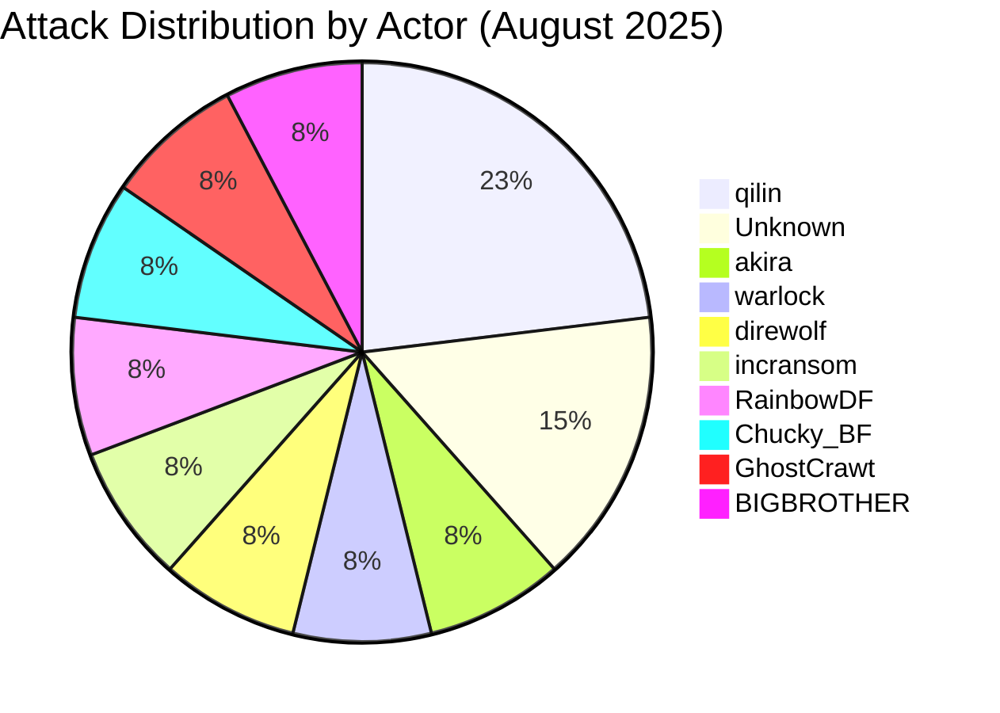
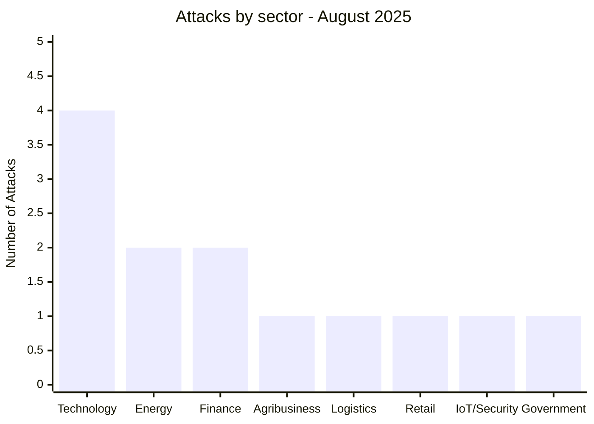
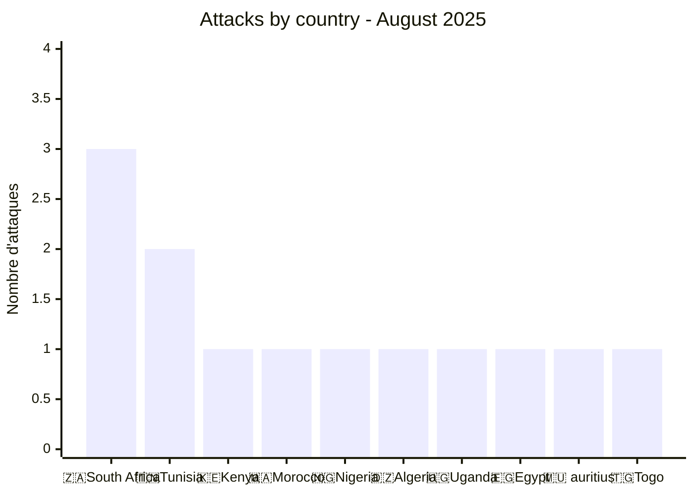
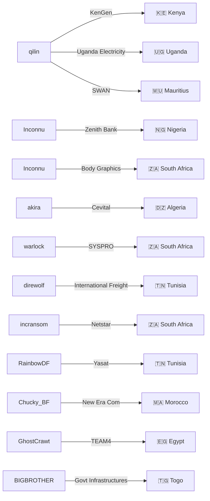
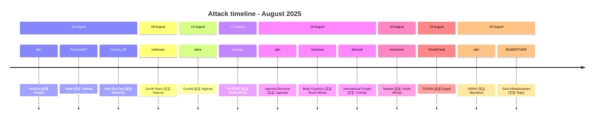

# CTI Report: Cyberattacks in Africa - August 2025 (13 Victims)
👉🏾 [**French version available here**](./README_FR.md)
## 1. Introduction
This Cyber Threat Intelligence (CTI) report provides a detailed analysis of cyberattacks that occurred across Africa during August 2025. The information was collected from OSINT sources and ransomware leak sites and compiled as part of the AFRINTEL project. The goal is to provide a clear overview of threat trends, threat actors, targeted sectors, and associated compromise indicators.

## 2. Executive summary
- **Total number of recorded attacks**: 13
- **Most active actors**: qilin (3 attacks), unknown (2), akira (1), warlock (1), direwolf (1), incransom (1), RainbowDF (1), Chucky_BF (1), GhostCrawt (1), BIGBROTHER (1).
- **Most targeted sectors**: Technology (4), Energy (2), Banking/Finance (2), Agri‑food/Industry (1), Logistics (1), Retail (1), IoT/Security (1), Government (1).
- **Most affected countries**: South Africa (3), Tunisia (2), Kenya (1), Morocco (1), Nigeria (1), Algeria (1), Uganda (1), Egypt (1), Mauritius (1), Togo (1).
- **Notable data exfiltration volumes**: Zenith Bank (Nigeria) - 1.8 million records; New Era Com (Morocco) - 607 MB SQL dump; Body Graphics (South Africa) - over 6,500 client records; TEAM4 Security (Egypt) - multiple data sets.

## 3. Key Statistics

### 3.1 Distribution by threat actor
| Actor | Number of attacks |
|------|-------------------|
| qilin | 3 |
| Unknown | 2 |
| akira | 1 |
| warlock | 1 |
| direwolf | 1 |
| incransom | 1 |
| RainbowDF | 1 |
| Chucky_BF | 1 |
| GhostCrawt | 1 |
| BIGBROTHER | 1 |
| **Total** | **13** |

### 3.2 Distribution by sector
| Sector | Number of attacks |
|------|-------------------|
| Technology | 4 |
| Energy | 2 |
| Banking / Finance | 2 |
| Agri‑food / Industry | 1 |
| Logistics | 1 |
| Retail / E‑commerce | 1 |
| IoT / Telematics Security | 1 |
| Government | 1 |
| **Total** | **13** |

### 3.3 Distribution by country
| Country | Number of attacks |
|------|-------------------|
| 🇿🇦 South Africa | 3 |
| 🇹🇳 Tunisia | 2 |
| 🇰🇪 Kenya | 1 |
| 🇲🇦 Morocco | 1 |
| 🇳🇬 Nigeria | 1 |
| 🇩🇿 Algeria | 1 |
| 🇺🇬 Uganda | 1 |
| 🇪🇬 Egypt | 1 |
| 🇲🇺 Mauritius | 1 |
| 🇹🇬 Togo | 1 |
| **Total** | **13** |

## 4. Attack details by actor

### 4.1 qilin (3 attacks)
- **06/08/2025**: KenGen (Kenya, energy) - claim & disclosure.
- **18/08/2025**: Uganda Electricity Transmission Company Limited (Uganda, energy) - claim & disclosure.
- **25/08/2025**: SWAN Mauritius (Mauritius, insurance) - claim & disclosure.

*Note*: qilin targeted critical energy infrastructure in East Africa and a major insurance company in Mauritius.

### 4.2 Unknown Actors (2 attacks)
- **09/08/2025**: Zenith Bank (Nigeria, banking) - massive leak and sale of 1.8 million records.
- **18/08/2025**: Body Graphics Tattoo Supply (South Africa, retail) - full leak of more than 6,500 customer and administrator records.

### 4.3 akira (1 attack)
- **13/08/2025**: Cevital (Algeria, agri‑food/industry) - claim & disclosure.

### 4.4 warlock (1 attack)
- **17/08/2025**: SYSPRO (South Africa, ERP technology) - claim & disclosure.

### 4.5 direwolf (1 attack)
- **18/08/2025**: International Freight & Commerce (Tunisia, logistics) - claim & disclosure.

### 4.6 incransom (1 attack)
- **20/08/2025**: Netstar South Africa (IoT/telematics security) - second attack against this company.

### 4.7 RainbowDF (1 attack)
- **06/08/2025**: Yasat (Tunisia, multimedia technology distribution) - massive SQL dump of the production database.

### 4.8 Chucky_BF (1 attack)
- **06/08/2025**: New Era Com (Morocco, telecom/IT services) - public SQL dump of 607 MB containing more than 476,000 records.

### 4.9 GhostCrawt (1 attack)
- **23/08/2025**: TEAM4 Security (Egypt, security/defense/RH services) - massive leak and sale of five datasets including HR, medical, civil, and financial records.

### 4.10 BIGBROTHER (1 attack)
- **25/08/2025**: Government Infrastructure (Togo) - privileged administrative access offered for sale for $1,000.
### 4.11 Graph: Actor → victim → country

## 5. Sector Analysis
- **Technology**: 4 attacks (Yasat, New Era Com, SYSPRO, TEAM4 Security).
- **Energy**: 2 attacks (KenGen, Uganda Electricity).
- **Banking/Finance**: 2 attacks (Zenith Bank, SWAN Mauritius).
- **Agri‑food/Industry**: 1 attack (Cevital).
- **Logistics**: 1 attack (International Freight & Commerce).
- **Retail/E‑commerce**: 1 attack (Body Graphics).
- **IoT/Security**: 1 attack (Netstar).
- **Government**: 1 attack (Togo infrastructure).

## 6. Geographic Analysis
- **South Africa**: 3 attacks.
- **Tunisia**: 2 attacks.
- **Kenya, Morocco, Nigeria, Algeria, Uganda, Egypt, Mauritius, Togo**: 1 attack each.

North Africa accounts for five incidents while Sub‑Saharan Africa records eight, highlighting the widespread nature of cyber threats across the continent.
### 6.1 Attack timeline

## 7. Observed TTPs
- SQL injection leading to database dumps.
- Data exfiltration and sale on underground forums.
- Targeting of critical infrastructure.
- Repeat attacks against previously compromised organizations.
- Sale of privileged administrative access likely obtained through RDP/VPN compromise.

## 8. Recommendations
- Deploy Web Application Firewalls and input validation to prevent SQL injections.
- Implement network segmentation and continuous monitoring for critical infrastructure.
- Enforce multi‑factor authentication and encryption for sensitive financial data.
- Strengthen employee phishing awareness training.
- Maintain offline backups and apply security patches regularly.

## 9. Conclusion
August 2025 saw a diverse range of cyberattacks across Africa, with the technology and energy sectors being the most impacted. Multiple threat actors were involved, and the sale of privileged access indicates an evolving threat landscape. Increased regional cooperation and intelligence sharing remain critical to mitigating these threats.

## Author
Adama ASSIONGBON  
SOC & Cyber Threat Intelligence Consultant
