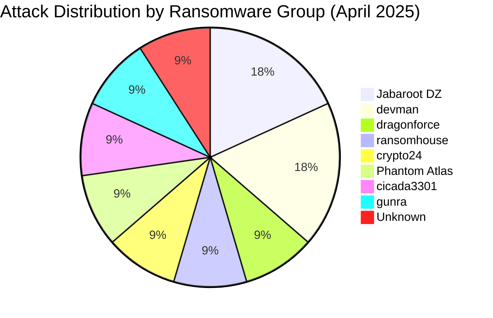
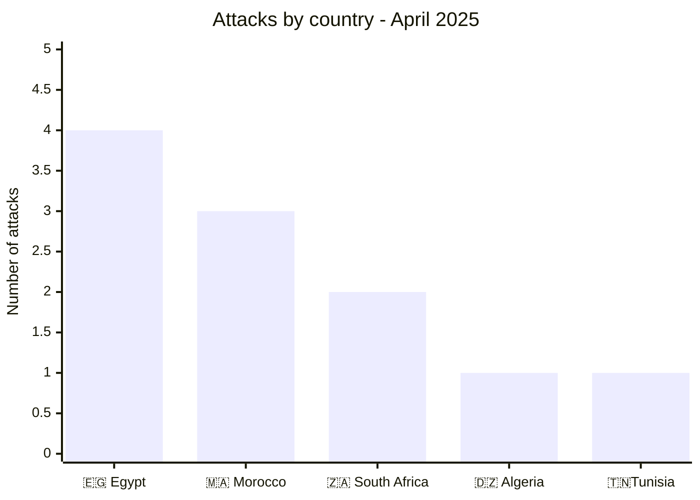
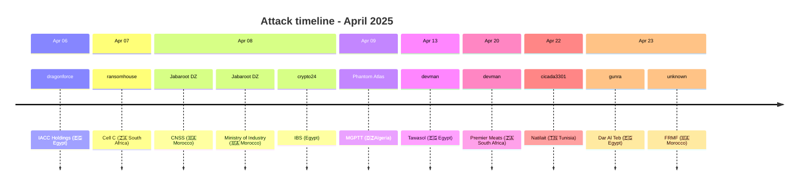

[](https://github.com/Hatchepsoute/AFRINTEL)

# CTI Report: Cyber attacks in Africa - April 2025
👉🏾 [**French version available here**](README_FR.md)
## 1. Introduction
This Cyber Threat Intelligence (CTI) report provides a detailed analysis of cyber attacks that occurred in Africa during April 2025. The information is derived from OSINT sources and ransomware group leak sites, compiled as part of the AFRINTEL project. The objective is to provide a clear overview of trends, threat actors, targeted sectors, and associated indicators of compromise.

## 2. Executive Summary
- **Total number of recorded attacks:** 11
- **Most active ransomware groups:** Jabaroot DZ (2 attacks), devman (2), dragonforce (1), ransomhouse (1), crypto24 (1), Phantom Atlas (1), cicada3301 (1), gunra (1), unknown (1).
- **Most targeted sectors:** Public Administrations (4), Agribusiness (2), Finance/Logistics (1), Telecommunications (1), Business Services (1), Technology (1), Healthcare (1).
- **Most affected countries:** Egypt (4), Morocco (3), South Africa (2), Algeria (1), Tunisia (1).
- **Exfiltrated data volume:** 27.75 GB for IACC Holdings. Other volumes are not specified.

## 3. Key statistics

### 3.1 Breakdown by ransomware group
| Ransomware Group | Number of Attacks |
|-------------------|-------------------|
| Jabaroot DZ       | 2                 |
| devman            | 2                 |
| dragonforce       | 1                 |
| ransomhouse       | 1                 |
| crypto24          | 1                 |
| Phantom Atlas     | 1                 |
| cicada3301        | 1                 |
| gunra             | 1                 |
| Unknown           | 1                 |
| **Total**         | **11**            |



### 3.2 Breakdown by sector
| Sector | Number of Attacks |
|---------|-------------------|
| Public Administrations | 4 |
| Agribusiness | 2 |
| Finance / Logistics | 1 |
| Telecommunications | 1 |
| Business Services (BPO) | 1 |
| Technology (IT) | 1 |
| Healthcare | 1 |
| **Total** | **11** |

### 3.3 Breakdown by country
| Country | Number of Attacks |
|------|-------------------|
|🇪🇬 Egypt | 4 |
|🇲🇦 Morocco | 3 |
|🇿🇦 South Africa | 2 |
|🇩🇿 Algeria | 1 |
|🇹🇳 Tunisia | 1 |
| **Total** | **11** |


## 4. Detailed attacks by ransomware group

### 4.1 Jabaroot DZ (2 attacks)
- **08/04/2025:** CNSS (Morocco, public administrations)
- **08/04/2025:** Ministry of Industry and Commerce (Morocco, government)

*Note:* Jabaroot DZ targeted two Moroccan public institutions on the same day, demonstrating the ability to strike critical infrastructures.

### 4.2 Devman (2 attacks)
- **13/04/2025:** Tawasol (Egypt, technology)
- **20/04/2025:** Premier Meats (South Africa, agribusiness)

*Note:* Devman operated in two different countries and sectors, showing geographic diversification.

### 4.3 Dragonforce (1 attack)
- **06/04/2025:** IACC Holdings (Egypt, finance/logistics) - 27.75 GB exfiltrated

### 4.4 Ransomhouse (1 attack)
- **07/04/2025:** Cell C (South Africa, telecommunications)

### 4.5 Crypto24 (1 attack)
- **08/04/2025:** International Business Service (Egypt, business services)

### 4.6 Phantom Atlas (1 attack)
- **09/04/2025:** MGPTT (Algeria, health insurance fund)

### 4.7 Cicada3301 (1 attack)
- **22/04/2025:** Natilait (Tunisia, agribusiness)

### 4.8 Gunra (1 attack)
- **23/04/2025:** Dar Al Teb (Egypt, healthcare)

### 4.9 Unknown (1 attack)
- **23/04/2025:** FRMF (Morocco, sports/administration)
### 4.10 Threat Actor → Victim → Country Mapping
```mermaid
graph LR
    JabarootDZ["Jabaroot DZ"] -->|CNSS, Ministry of Industry| 🇲🇦 Morocco
    devman -->|Tawasol| 🇪🇬 Egypt
    devman -->|Premier Meats| SouthAfrica["🇿🇦 South Africa"]
    dragonforce -->|IACC Holdings| 🇪🇬 Egypt
    ransomhouse -->|Cell C| 🇿🇦 SouthAfrica
    crypto24 -->|IBS| 🇪🇬 Egypt
    PhantomAtlas["Phantom Atlas"] -->|MGPTT| 🇩🇿 Algeria
    cicada3301 -->|Natilait|🇹🇳 Tunisia
    gunra -->|Dar Al Teb|🇪🇬 Egypt
    unknown["Unknown"] -->|FRMF|🇲🇦 Morocco
```
## 5. Sectoral analysis
- **Public Administrations:** 4 attacks (CNSS, Ministry of Industry, MGPTT, FRMF). Groups Jabaroot DZ and Phantom Atlas targeted key institutions in Morocco and Algeria, with sensitive data (beneficiaries, administrative documents).
- **Agribusiness:** 2 attacks (Premier Meats, Natilait) by devman and cicada3301, targeting food processing companies in South Africa and Tunisia.
- **Finance/Logistics:** 1 attack (IACC Holdings) by dragonforce, with 27.75 GB exfiltrated.
- **Telecommunications:** 1 attack (Cell C) by ransomhouse, hitting a major South African operator.
- **Business Services:** 1 attack (IBS) by crypto24, targeting an Egyptian BPO provider.
- **Technology:** 1 attack (Tawasol) by devman, targeting an IT solutions integrator.
- **Healthcare:** 1 attack (Dar Al Teb) by gunra, striking a specialized medical center.
### 5.1 Attack timeline


## 6. Geographic analysis
- **Egypt:** 4 attacks (IACC, IBS, Tawasol, Dar Al Teb) - finance, BPO, IT, healthcare. Egypt remains the most targeted country on the continent.
- **Morocco:** 3 attacks (CNSS, Ministry, FRMF) - public administrations and sports. Two coordinated attacks by Jabaroot DZ on the same day.
- **South Africa:** 2 attacks (Cell C, Premier Meats) - telecoms and agribusiness.
- **Algeria:** 1 attack (MGPTT) - health insurance fund, with publication of personal data.
- **Tunisia:** 1 attack (Natilait) - agribusiness.

North Africa (Egypt, Morocco, Algeria, Tunisia) concentrates 9 out of 11 attacks, confirming high pressure on the region.

## 7. Observed TTPs
- **Data Exfiltration:** IACC Holdings (27.75 GB) and MGPTT (beneficiary lists) illustrate the collection of sensitive data.
- **Targeting of Public Institutions:** 4 attacks on government bodies, with potentially political motivations ("retaliation" claim for MGPTT).
- **Diversity of Actors:** 9 different groups active, including hacktivists (Jabaroot DZ, Phantom Atlas) and traditional ransomware groups.
- **Double Extortion:** Claims accompanied by data leaks to pressure victims.
- **Web Exploitation:** Likely for government websites.

## 8. Recommendations
- **Public Sector:** Strengthen security of administrative portals and citizen databases, especially in Morocco and Algeria.
- **Egypt:** Increase vigilance in finance, BPO, and healthcare sectors, which are heavily targeted.
- **Agribusiness:** Companies like Premier Meats and Natilait must secure their digital supply chains.
- **Telecoms:** Operators like Cell C should protect subscriber data.
- **All Sectors:** Implement multi-factor authentication and offline backups.

## 9. Conclusion
April 2025 was marked by sustained activity in north Africa, with a high proportion of attacks against public administrations. Groups Jabaroot DZ and devman stand out for their versatility. The diversity of actors (hacktivists, ransomware) underscores the complexity of the threat. Enhanced regional cooperation is needed to counter these cyber attacks.

## ✍🏿 Author
*Adama ASSIONGBON*  
*SOC & Cyber Threat Intelligence Consultant*  
[LinkedIn profile](https://www.linkedin.com/in/adama-assiongbon-9029893a/)

---
*AFRINTEL - Open CTI Monitoring Initiative on Africa*
