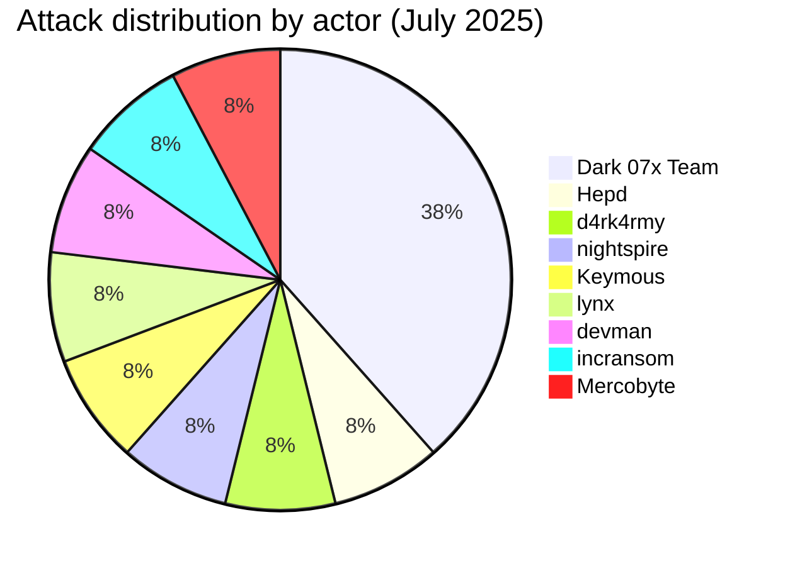
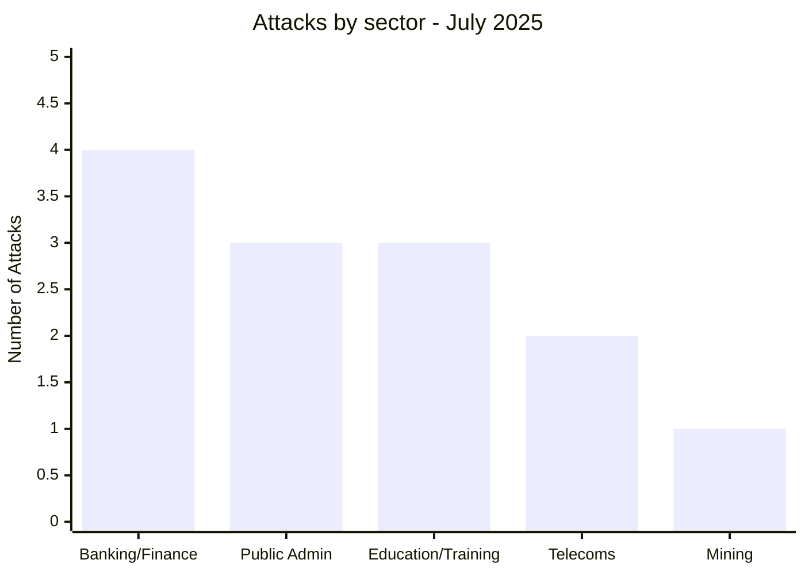
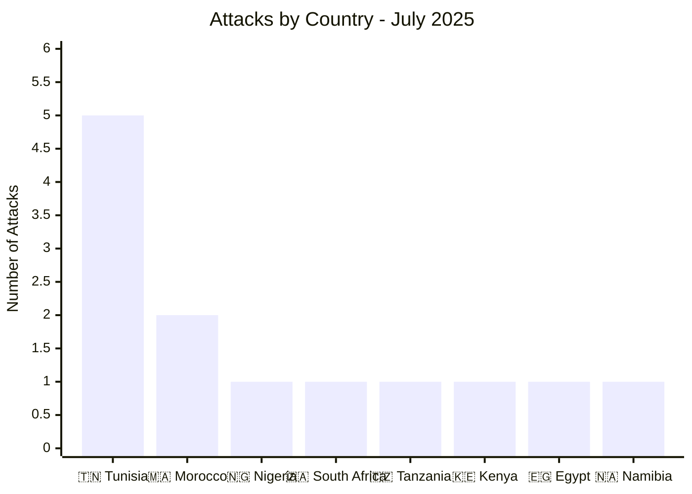
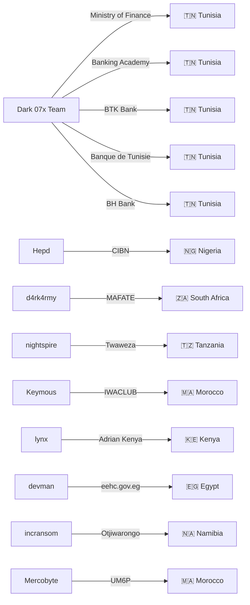
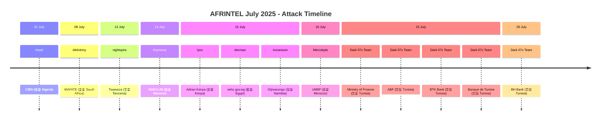

# CTI Report: Cyber attacks in Africa - July 2025 (13 victims)
👉🏾 [**French version available here**](./README_FR.md)

## 1. Introduction
This Cyber Threat Intelligence (CTI) report provides a detailed analysis of cyber attacks that occurred in Africa during July 2025. The information is derived from OSINT sources and ransomware group leak sites, compiled as part of the AFRINTEL project. The objective is to provide a clear overview of trends, threat actors, targeted sectors, and associated indicators of compromise.

## 2. Executive summary
- **Total number of recorded attacks:** 13
- **Most active actors:** Dark 07x Team (5 attacks), Hepd (1), d4rk4rmy (1), nightspire (1), Keymous (1), lynx (1), devman (1), incransom (1), Mercobyte (1).
- **Most targeted sectors:** Banking/Finance (4), Public Administrations (3), Education/Training (3), Telecommunications (2), Mining (1).
- **Most affected countries:** Tunisia (5), Morocco (2), Nigeria (1), South Africa (1), Tanzania (1), Kenya (1), Egypt (1), Namibia (1).
- **Notable exfiltrated data volumes:** Ransom demand of $2.27M for eehc.gov.eg (Egypt). Other volumes not specified.

## 3. Key Statistics

### 3.1 Breakdown by group/actor
| Group/Actor | Number of Attacks |
|-------------|-------------------|
| Dark 07x Team | 5 |
| Hepd | 1 |
| d4rk4rmy | 1 |
| nightspire | 1 |
| Keymous | 1 |
| lynx | 1 |
| devman | 1 |
| incransom | 1 |
| Mercobyte | 1 |
| **Total** | **13** |

### 3.2 Breakdown by sector
| Sector | Number of Attacks |
|--------|-------------------|
| Banking / Finance | 4 |
| Public Administrations | 3 |
| Education / Training | 3 |
| Telecommunications | 2 |
| Mining | 1 |
| **Total** | **13** |

### 3.3 Breakdown by country
| Country | Number of attacks |
|---------|-------------------|
| 🇹🇳 Tunisia | 5 |
| 🇲🇦 Morocco | 2 |
| 🇳🇬 Nigeria | 1 |
| 🇿🇦 South Africa | 1 |
| 🇹🇿 Tanzania | 1 |
| 🇰🇪 Kenya | 1 |
| 🇪🇬 Egypt | 1 |
| 🇳🇦 Namibia | 1 |
| **Total** | **13** |

## 4. Detailed attacks by group/actor

### 4.1 Dark 07x Team (5 attacks)
- **25/07/2025:** Ministry of Finance (Tunisia, government) – "Full Access" claim.
- **25/07/2025:** Academy of Banks and Finance (Tunisia, training) – Admin interface compromise.
- **25/07/2025:** BTK Bank (Tunisia, bank) – Account compromise (ATO) and sale listing.
- **25/07/2025:** Banque de Tunisie (Tunisia, bank) – Exfiltration of financial data and identities.
- **28/07/2025:** BH Bank (Tunisia, bank) – Major compromise and account takeover (ATO).

*Note:* Dark 07x Team conducted a coordinated campaign against the Tunisian financial and government sector, with five attacks in a few days, demonstrating high operational capability.

### 4.2 Hepd (1 attack)
- **01/07/2025:** Chartered Institute of Bankers of Nigeria (CIBN) (Nigeria, banking regulation) – Data leak on the country's banking elite.

### 4.3 d4rk4rmy (1 attack)
- **08/07/2025:** MAFATE BUSINESS ENTERPRISE (South Africa, mining services) – Claim & data leak.

### 4.4 nightspire (1 attack)
- **13/07/2025:** Twaweza (Tanzania, educational NGO) – Claim & data leak.

### 4.5 Keymous (1 attack)
- **14/07/2025:** IWACLUB (Morocco, telecommunications/distribution) – Data leak.

### 4.6 lynx (1 attack)
- **15/07/2025:** Adrian Kenya (Kenya, telecommunications/engineering) – Claim & data leak.

### 4.7 devman (1 attack)
- **15/07/2025:** eehc.gov.eg (Egypt, government) – Ransom demand of $2.27M.

### 4.8 incransom (1 attack)
- **15/07/2025:** Otjiwarongo Municipality (Namibia, local government) – Claim & data leak.

### 4.9 Mercobyte (1 attack)
- **18/07/2025:** Mohammed VI Polytechnic University (Morocco, education) – Targeted data leak and influence operation.
### 4.10 Graph: Actor → victim → country

## 5. Sectoral analysis
- **Banking/Finance:** 4 attacks (CIBN, BTK, Banque de Tunisie, BH Bank). Dark 07x Team targeted three Tunisian banks and Hepd targeted the Nigerian regulatory body, showing sustained attention to the financial sector.
- **Public Administrations:** 3 attacks (eehc.gov.eg, Otjiwarongo Municipality, Tunisian Ministry of Finance). Actors devman, incransom and Dark 07x Team struck government institutions, with a high ransom demand for Egypt.
- **Education/Training:** 3 attacks (Twaweza, ABF, UM6P). Nightspire targeted an educational NGO in Tanzania, Dark 07x Team a banking academy, and Mercobyte a prestigious university in Morocco with an influence operation.
- **Telecommunications:** 2 attacks (IWACLUB, Adrian Kenya). Keymous and lynx targeted companies in this sector in Morocco and Kenya.
- **Mining:** 1 attack (MAFATE) by d4rk4rmy in South Africa.

## 6. Geographic analysis
- **Tunisia:** 5 attacks, all by Dark 07x Team, targeting the government and banking sector. Tunisia is the most affected country of the month, with a coordinated campaign.
- **Morocco:** 2 attacks (IWACLUB, UM6P) by Keymous and Mercobyte, affecting telecoms and education.
- **Nigeria:** 1 attack (CIBN) by Hepd, targeting the banking regulatory body.
- **South Africa:** 1 attack (MAFATE) by d4rk4rmy in the mining sector.
- **Tanzania:** 1 attack (Twaweza) by nightspire, hitting an educational NGO.
- **Kenya:** 1 attack (Adrian Kenya) by lynx in telecoms.
- **Egypt:** 1 attack (eehc.gov.eg) by devman, with a high ransom demand.
- **Namibia:** 1 attack (Otjiwarongo Municipality) by incransom, targeting a local administration.

North Africa (Tunisia, Morocco, Egypt) concentrates 8 out of 13 attacks, confirming pressure on this region. Tunisia is particularly hit by a massive campaign.
### 6.1 Attack timeline

## 7. Observed TTPs
- **Coordinated campaigns:** Dark 07x Team conducted multiple simultaneous attacks against Tunisian targets, showing advanced planning.
- **Account compromise (ATO):** observed on BTK Bank and BH Bank, with access for sale.
- **Exfiltration of sensitive data:** financial data, identities, information on banking elite (CIBN).
- **Ransom demand:** devman demanded $2.27M for eehc.gov.eg.
- **Influence operations:** Mercobyte published student ID photos with a political message, going beyond classic extortion.
- **Hacktivism:** Dark 07x Team appears to have multiple motivations (financial and political).

## 8. Recommendations
- **Tunisia:** financial and government institutions must urgently strengthen their cybersecurity in the face of coordinated campaigns. Establish a monitoring and incident response cell.
- **Banking sector:** banks (CIBN, BTK, BT, BH) must review their authentication protocols and segment their networks to limit account compromises.
- **Education:** universities (UM6P), academies (ABF) and educational NGOs (Twaweza) must protect personal data and train staff on risks.
- **Public administrations:** strengthen security of government websites (eehc.gov.eg, Otjiwarongo) and implement offline backups.
- **All sectors:** train employees on phishing risks, implement multi-factor authentication and regular security audits.

## 9. Conclusion
July 2025 was marked by a major campaign by the Dark 07x Team against Tunisia, with five attacks targeting the government and banking sector. The diversity of actors (traditional ransomware, hacktivists) and targets (banks, administrations, education, telecoms) shows a multifaceted threat. The $2.27M ransom demand in Egypt and sensitive data leaks in Nigeria and Tunisia underscore the urgency of strengthened regional cybersecurity cooperation.

## ✍🏿 Author
*Adama ASSIONGBON*  
*SOC & Cyber Threat Intelligence Consultant*  
[LinkedIn Profile](https://www.linkedin.com/in/adama-assiongbon-9029893a/)
