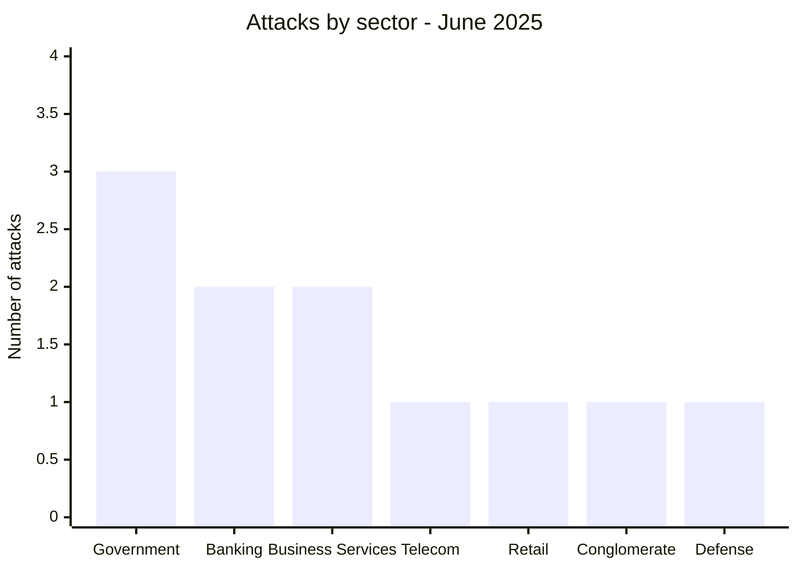
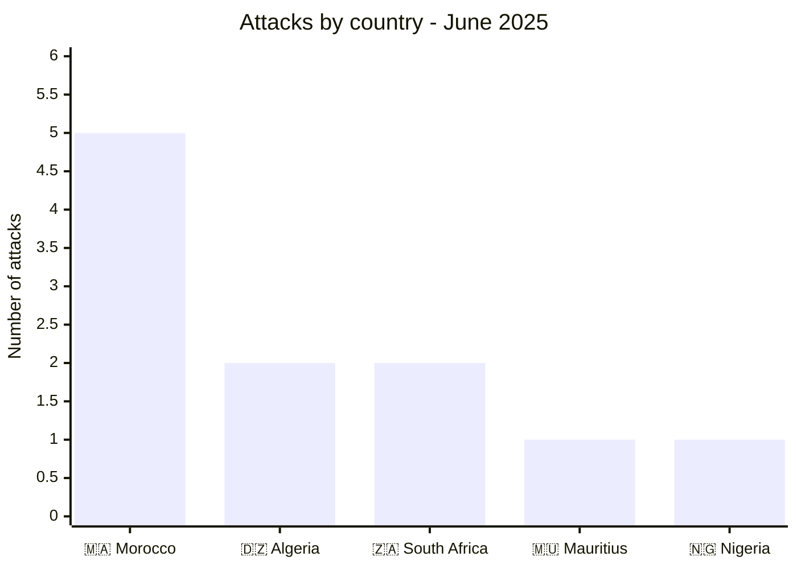
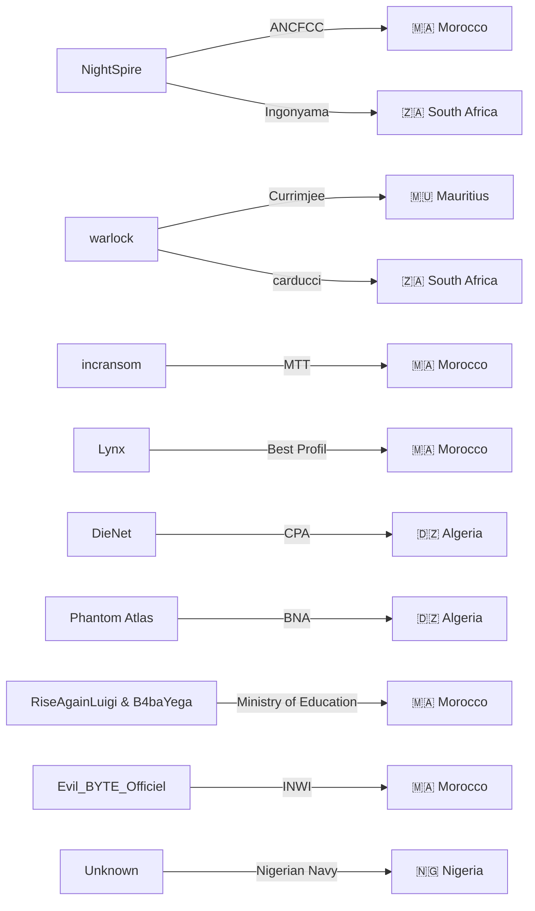
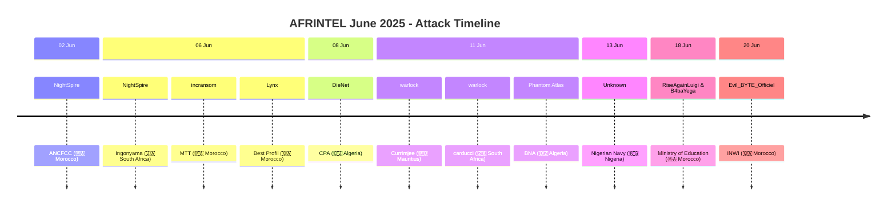

# CTI Report: Cyber attacks in Africa - June 2025
👉🏾 [**French version available here**](./README_FR.md)

## 1. Introduction
This Cyber Threat Intelligence (CTI) report provides a detailed analysis of cyber attacks that occurred in Africa during June 2025. The information is derived from OSINT sources and ransomware group leak sites, compiled as part of the AFRINTEL project. The objective is to provide a clear overview of trends, threat actors, targeted sectors, and associated indicators of compromise.

## 2. Executive summary
- **Total number of recorded attacks:** 11
- **Most active actors:** NightSpire (2 attacks), warlock (2), incransom (1), Lynx (1), DieNet (1), Phantom Atlas (1), RiseAgainLuigi & B4baYega (1), Evil_BYTE_Officiel (1), unknown (1).
- **Most targeted sectors:** Government / Administrations (3), Banking / Finance (2), Business Services (2), Telecommunications (1), Retail (1), Conglomerate (1), Defense (1).
- **Most affected countries:** Morocco (5), Algeria (2), South Africa (2), Mauritius (1), Nigeria (1).
- **Notable exfiltrated data volumes:** 90 GB (BNA Algeria), 26 GB (Best Profil Morocco), 3.1 GB (ANCFCC Morocco), over 200 documents (Nigerian Navy).

## 3. Key statistics

### 3.1 Breakdown by group/actor
| Group/Actor | Number of Attacks |
|---------------|-------------------|
| NightSpire    | 2                 |
| warlock       | 2                 |
| incransom     | 1                 |
| Lynx          | 1                 |
| DieNet        | 1                 |
| Phantom Atlas | 1                 |
| RiseAgainLuigi & B4baYega | 1 |
| Evil_BYTE_Officiel | 1          |
| Unknown       | 1                 |
| **Total**     | **11**            |

### 3.2 Breakdown by sector
| Sector | Number of Attacks |
|---------|-------------------|
| Government / Administrations | 3 |
| Banking / Finance | 2 |
| Business Services | 2 |
| Telecommunications | 1 |
| Retail | 1 |
| Conglomerate | 1 |
| Defense | 1 |
| **Total** | **11** |

### 3.3 Breakdown by country
| Country | Number of Attacks |
|------|-------------------|
| 🇲🇦 Morocco | 5 |
| 🇩🇿 Algeria | 2 |
| 🇿🇦 South Africa | 2 |
| 🇲🇺 Mauritius | 1 |
| 🇳🇬 Nigeria | 1 |
| **Total** | **11** |

## 4. Detailed attacks by group/actor

### 4.1 NightSpire (2 attacks)
- **02/06/2025:** ANCFCC (Morocco, government) - 3.1 GB of data exfiltrated (10,080 land certificates).
- **06/06/2025:** Ingonyama Trust Board (South Africa, land administration).

*Note:* NightSpire targeted two land management bodies in two different countries, with significant volumes of sensitive data.

### 4.2 warlock (2 attacks)
- **11/06/2025:** Currimjee (Mauritius, conglomerate)
- **11/06/2025:** carducci (South Africa, retail)

*Note:* warlock struck two companies in different sectors on the same day, demonstrating the ability to conduct simultaneous operations.

### 4.3 incransom (1 attack)
- **06/06/2025:** MTT EXPERTISES (Morocco, business services)

### 4.4 Lynx (1 attack)
- **06/06/2025:** Best Profil (Morocco, human resources) - 26 GB exfiltrated, data published after ransom negotiations failed.

### 4.5 DieNet (hacktivism) (1 attack)
- **08/06/2025:** Crédit Populaire d'Algérie (Algeria, banking) - leak of data samples.

### 4.6 Phantom Atlas (1 attack)
- **11/06/2025:** Banque Nationale d'Algérie (Algeria, banking) - 90 GB exfiltrated, partial publication of 7 GB.

### 4.7 RiseAgainLuigi & B4baYega (1 attack)
- **18/06/2025:** Ministry of National Education (Morocco, government) - leak of over 6 million student records (Massar platform).

### 4.8 Evil_BYTE_Officiel (1 attack)
- **20/06/2025:** INWI (Morocco, telecommunications) - massive leak of personal data (PII, password hashes).

### 4.9 Unknown (1 attack)
- **13/06/2025:** Nigerian Navy (Nigeria, defense) - exfiltration and sale listing of over 200 sensitive documents.
### 4.10 Actor → Victim → country graph

## 5. Sectoral analysis
- **Government / Administrations:** 3 attacks (ANCFCC, Ingonyama, Ministry of Education). Actors NightSpire and the duo RiseAgainLuigi/B4baYega targeted key institutions, with leaks of sensitive data (land certificates, student records).
- **Banking / Finance:** 2 attacks (CPA, BNA) by DieNet and Phantom Atlas, two hacktivist groups, with significant volumes (90 GB for BNA).
- **Business Services:** 2 attacks (MTT EXPERTISES, Best Profil) by incransom and Lynx, the latter publishing 26 GB of HR data.
- **Telecommunications:** 1 attack (INWI) by Evil_BYTE_Officiel, exposing subscriber personal data.
- **Retail:** 1 attack (carducci) by warlock.
- **Conglomerate:** 1 attack (Currimjee) by warlock.
- **Defense:** 1 attack (Nigerian Navy) by an unknown actor, with sale listing of sensitive documents.

## 6. Geographic analysis
- **Morocco:** 5 attacks, affecting various sectors: government (ANCFCC, Ministry of Education), services (MTT, Best Profil), telecoms (INWI). Morocco is by far the most targeted country of the month.
- **Algeria:** 2 attacks targeting the banking sector (CPA, BNA), with very large data volumes.
- **South Africa:** 2 attacks (Ingonyama, carducci) in land administration and retail.
- **Mauritius:** 1 attack on a historic conglomerate (Currimjee).
- **Nigeria:** 1 attack on the national navy, which is particularly concerning for national security.

North Africa (Morocco, Algeria) concentrates 7 out of 11 attacks, confirming persistent pressure on this region.
### 6.2 Attack timeline

## 7. Observed TTPs
- **Massive exfiltration:** significant volumes for BNA (90 GB), Best Profil (26 GB), ANCFCC (3.1 GB).
- **Targeting of government institutions:** ANCFCC, Ingonyama, Ministry of Education, Nigerian Navy.
- **Use of hacktivism:** DieNet and Phantom Atlas claim politically motivated leaks (e.g., "retaliation").
- **Double extortion / publication:** Lynx published Best Profil's data after negotiation failure.
- **Exploitation of personal data:** leak of PII (INWI, Massar) and sensitive documents (Nigerian Navy).
- **Diversity of actors:** traditional ransomware (incransom, Lynx, warlock) and hacktivist groups.

## 8. Recommendations
- **Morocco:** strengthen security of government infrastructures (ANCFCC, Ministry of Education) and telecom operators (INWI). Implement data leak monitoring.
- **Algeria:** banks (CPA, BNA) must review their security protocols and segment networks to limit massive exfiltration.
- **South Africa:** protect land data (Ingonyama) and customer databases (carducci).
- **Defense sector:** the Nigerian Navy must investigate the leak of classified documents and strengthen access controls.
- **All sectors:** train employees on phishing risks, implement multi-factor authentication and offline backups.

## 9. Conclusion
June 2025 was marked by high activity in Morocco, with attacks targeting government institutions and strategic companies. The presence of hacktivist groups (DieNet, Phantom Atlas) alongside traditional ransomware shows a diversification of threats. Massive data leaks (BNA, Best Profil) and breaches of Nigerian defense underscore the urgency of regional cybersecurity cooperation.

## ✍🏿 Author
*Adama ASSIONGBON*  
*SOC & Cyber Threat Intelligence Consultant*  
[LinkedIn Profile](https://www.linkedin.com/in/adama-assiongbon-9029893a/)

---
*AFRINTEL - Open CTI Monitoring Initiative on Africa*
