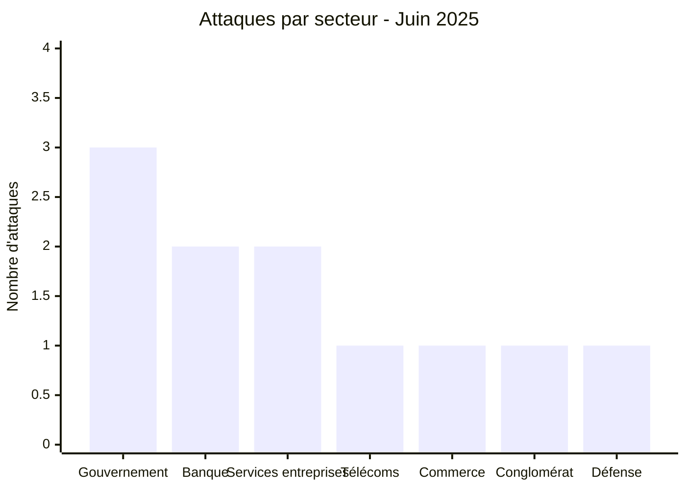
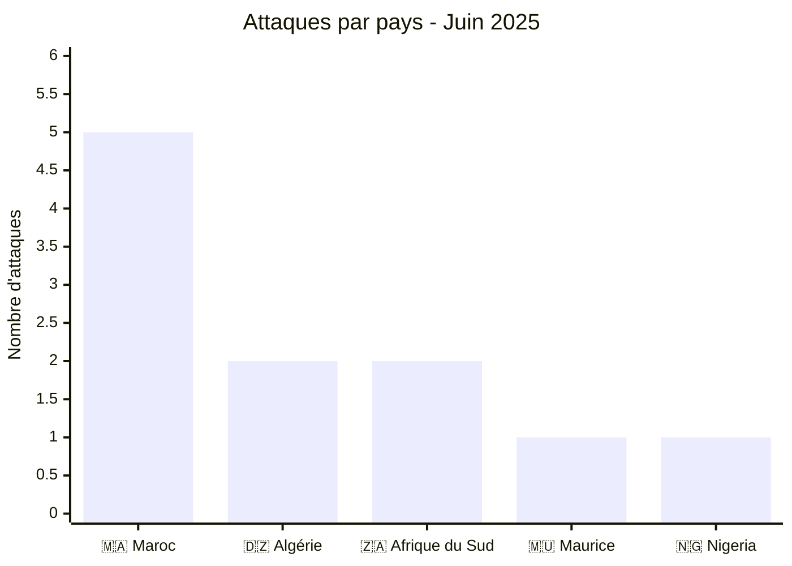
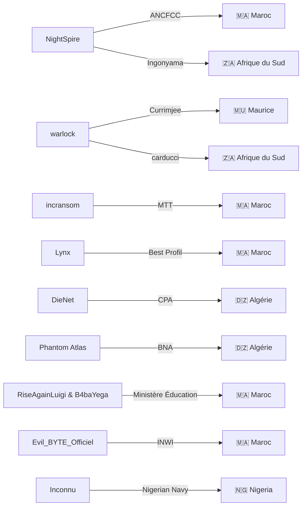
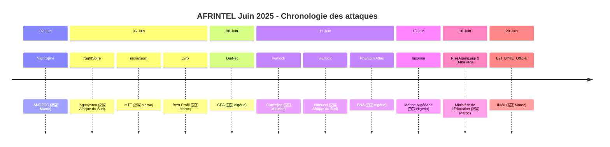

# Rapport CTI : Cyberattaques en Afrique - Juin 2025
👉🏾 [**English version available here**](./README.md)

## 1. Introduction
Ce rapport de Cyber Threat Intelligence (CTI) présente une analyse détaillée des cyberattaques survenues en Afrique durant le mois de juin 2025. Les informations sont issues de sources OSINT et de sites de fuites de groupes ransomware, compilées dans le cadre du projet AFRINTEL. L'objectif est de fournir une vision claire des tendances, des acteurs menaçants, des secteurs ciblés et des indicateurs de compromission associés.

## 2. Résumé exécutif
- **Nombre total d'attaques recensées** : 11
- **Acteurs les plus actifs** : NightSpire (2 attaques), warlock (2), incransom (1), Lynx (1), DieNet (1), Phantom Atlas (1), RiseAgainLuigi & B4baYega (1), Evil_BYTE_Officiel (1), inconnu (1).
- **Secteurs les plus ciblés** : Gouvernement / Administrations (3), Banque / Finance (2), Services aux entreprises (2), Télécommunications (1), Commerce de détail (1), Conglomérat (1), Défense (1).
- **Pays les plus touchés** : Maroc (5), Algérie (2), Afrique du Sud (2), Maurice (1), Nigeria (1).
- **Volumes de données exfiltrés notables** : 90 Go (BNA Algérie), 26 Go (Best Profil Maroc), 3,1 Go (ANCFCC Maroc), plus de 200 documents (Nigerian Navy).

## 3. Statistiques clés

### 3.1 Répartition par groupe/acteur
| Groupe/Acteur | Nombre d'attaques |
|---------------|-------------------|
| NightSpire    | 2                 |
| warlock       | 2                 |
| incransom     | 1                 |
| Lynx          | 1                 |
| DieNet        | 1                 |
| Phantom Atlas | 1                 |
| RiseAgainLuigi & B4baYega | 1 |
| Evil_BYTE_Officiel | 1          |
| Inconnu       | 1                 |
| **Total**     | **11**            |

### 3.2 Répartition par secteur d'activité
| Secteur | Nombre d'attaques |
|---------|-------------------|
| Gouvernement / Administrations | 3 |
| Banque / Finance | 2 |
| Services aux entreprises | 2 |
| Télécommunications | 1 |
| Commerce de détail | 1 |
| Conglomérat | 1 |
| Défense | 1 |
| **Total** | **11** |

### 3.3 Répartition par pays
| Pays | Nombre d'attaques |
|------|-------------------|
| 🇲🇦 Maroc | 5 |
| 🇩🇿 Algérie | 2 |
| 🇿🇦 Afrique du Sud | 2 |
| 🇲🇺 Maurice | 1 |
| 🇳🇬 Nigeria | 1 |
| **Total** | **11** |

## 4. Détail des attaques par groupe/acteur

### 4.1 NightSpire (2 attaques)
- **02/06/2025** : ANCFCC (Maroc, gouvernement) – 3,1 Go de données exfiltrées (10 080 certificats fonciers).
- **06/06/2025** : Ingonyama Trust Board (Afrique du Sud, administration foncière).

*Remarque* : NightSpire a ciblé deux organismes de gestion foncière dans deux pays différents, avec des volumes de données sensibles importants.

### 4.2 warlock (2 attaques)
- **11/06/2025** : Currimjee (Maurice, conglomérat)
- **11/06/2025** : carducci (Afrique du Sud, commerce de détail)

*Remarque* : warlock a frappé le même jour deux entreprises dans des secteurs différents, montrant une capacité d'opérations simultanées.

### 4.3 incransom (1 attaque)
- **06/06/2025** : MTT EXPERTISES (Maroc, services aux entreprises)

### 4.4 Lynx (1 attaque)
- **06/06/2025** : Best Profil (Maroc, ressources humaines) – 26 Go exfiltrés, données publiées après échec des négociations.

### 4.5 DieNet (hacktivisme) (1 attaque)
- **08/06/2025** : Crédit Populaire d'Algérie (Algérie, banque) – fuite d'échantillons de données.

### 4.6 Phantom Atlas (1 attaque)
- **11/06/2025** : Banque Nationale d'Algérie (Algérie, banque) – 90 Go exfiltrés, publication partielle de 7 Go.

### 4.7 RiseAgainLuigi & B4baYega (1 attaque)
- **18/06/2025** : Ministère de l'Éducation Nationale (Maroc, gouvernement) – fuite de plus de 6 millions de dossiers d'élèves (plateforme Massar).

### 4.8 Evil_BYTE_Officiel (1 attaque)
- **20/06/2025** : INWI (Maroc, télécommunications) – fuite massive de données personnelles (PII, hashs de mots de passe).

### 4.9 Inconnu (1 attaque)
- **13/06/2025** : Nigerian Navy (Nigeria, défense) – exfiltration et mise en vente de plus de 200 documents sensibles.
### 4.10 Graphe acteur → victime → pays

## 5. Analyse sectorielle
- **Gouvernement / Administrations** : 3 attaques (ANCFCC, Ingonyama, Ministère Éducation). Les acteurs NightSpire et le duo RiseAgainLuigi/B4baYega ont ciblé des institutions clés, avec des fuites de données sensibles (certificats fonciers, dossiers scolaires).
- **Banque / Finance** : 2 attaques (CPA, BNA) par DieNet et Phantom Atlas, deux groupes hacktivistes, avec des volumes importants (90 Go pour la BNA).
- **Services aux entreprises** : 2 attaques (MTT EXPERTISES, Best Profil) par incransom et Lynx, ce dernier ayant publié 26 Go de données RH.
- **Télécommunications** : 1 attaque (INWI) par Evil_BYTE_Officiel, exposant des données personnelles d'abonnés.
- **Commerce de détail** : 1 attaque (carducci) par warlock.
- **Conglomérat** : 1 attaque (Currimjee) par warlock.
- **Défense** : 1 attaque (Nigerian Navy) par un acteur inconnu, avec mise en vente de documents sensibles.

## 6. Analyse géographique
- **Maroc** : 5 attaques, touchant des secteurs variés : gouvernement (ANCFCC, Ministère Éducation), services (MTT, Best Profil), télécoms (INWI). Le Maroc est de loin le pays le plus ciblé du mois.
- **Algérie** : 2 attaques visant le secteur bancaire (CPA, BNA), avec des volumes de données très importants.
- **Afrique du Sud** : 2 attaques (Ingonyama, carducci) dans l'administration foncière et le commerce.
- **Maurice** : 1 attaque sur un conglomérat historique (Currimjee).
- **Nigeria** : 1 attaque sur la marine nationale, ce qui est particulièrement préoccupant pour la sécurité nationale.

L'Afrique du Nord (Maroc, Algérie) concentre 7 attaques sur 11, confirmant la pression persistante sur cette région.
### 6.2 Chronologie des attaques

## 7. TTPs observées
- **Exfiltration massive** : volumes importants pour la BNA (90 Go), Best Profil (26 Go), ANCFCC (3,1 Go).
- **Ciblage d'institutions gouvernementales** : ANCFCC, Ingonyama, Ministère Éducation, Nigerian Navy.
- **Utilisation de l'hacktivisme** : DieNet et Phantom Atlas revendiquent des fuites à caractère politique (ex: "représailles").
- **Double extorsion / publication** : Lynx a publié les données de Best Profil après échec des négociations.
- **Exploitation de données personnelles** : fuite de PII (INWI, Massar) et de documents sensibles (Nigerian Navy).
- **Diversité des acteurs** : ransomwares traditionnels (incransom, Lynx, warlock) et groupes hacktivistes.

## 8. Recommandations
- **Maroc** : renforcer la sécurité des infrastructures gouvernementales (ANCFCC, Ministère Éducation) et des opérateurs télécoms (INWI). Mettre en place une surveillance des fuites de données.
- **Algérie** : les banques (CPA, BNA) doivent revoir leurs protocoles de sécurité et segmenter leurs réseaux pour limiter l'exfiltration massive.
- **Afrique du Sud** : protéger les données foncières (Ingonyama) et les bases de données clients (carducci).
- **Secteur de la défense** : la Nigerian Navy doit enquêter sur la fuite de documents classifiés et renforcer les contrôles d'accès.
- **Tous secteurs** : sensibiliser les employés aux risques de phishing, mettre en place l'authentification multi-facteurs et des sauvegardes hors ligne.

## 9. Conclusion
Juin 2025 a été marqué par une forte activité au Maroc, avec des attaques visant des institutions gouvernementales et des entreprises stratégiques. La présence de groupes hacktivistes (DieNet, Phantom Atlas) à côté de ransomwares traditionnels montre une diversification des menaces. Les fuites massives de données (BNA, Best Profil) et les atteintes à la défense nigériane soulignent l'urgence d'une coopération régionale en matière de cybersécurité.

## ✍🏿 Auteur
*Adama ASSIONGBON*  
*Consultant SOC & Cyber Threat Intelligence*  
[LinkedIn Profile](https://www.linkedin.com/in/adama-assiongbon-9029893a/)

---
*AFRINTEL - Initiative ouverte de veille CTI sur l’Afrique*
