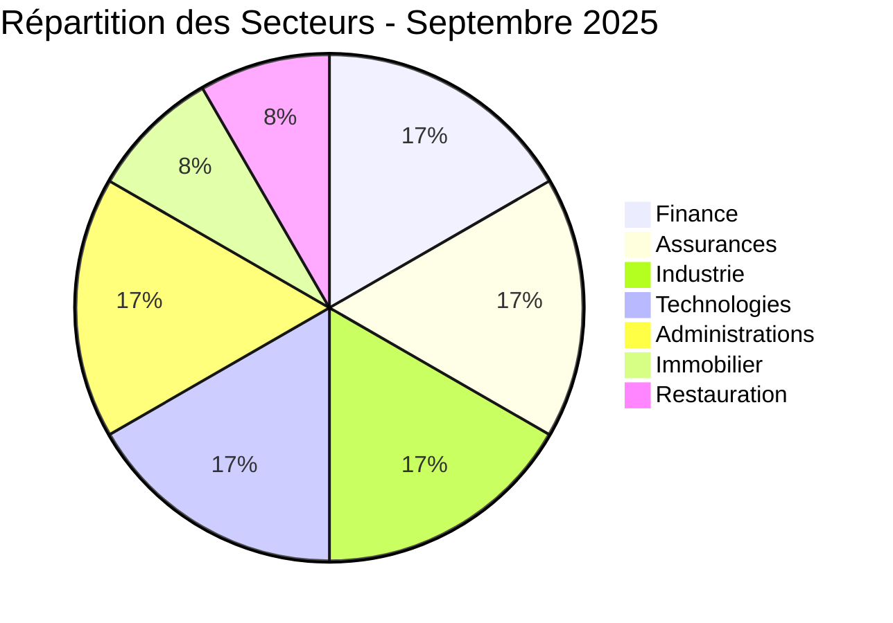
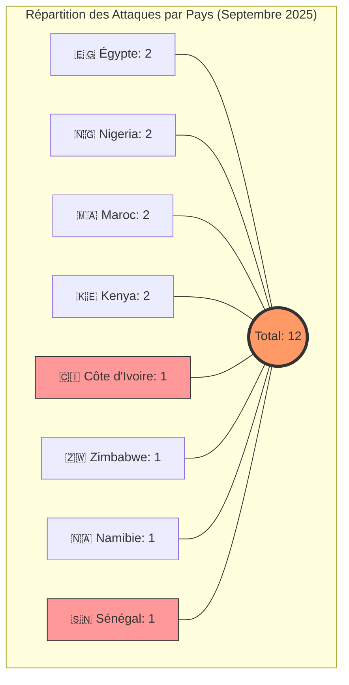
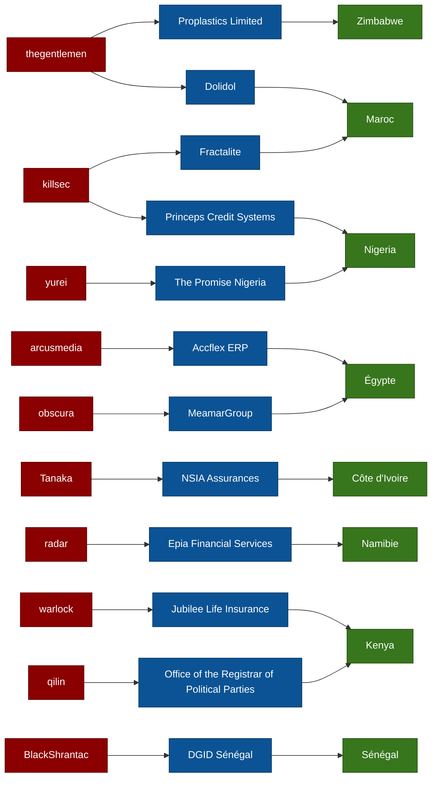

# 🛡️ AFRINTEL | Rapport CTI : Cyberattaques en Afrique
## 📅 Période : Septembre 2025 (12 victimes recensées)
👉🏾 [**English version available here**](./README.md)

---

## 1. Introduction
Ce rapport de **Cyber Threat Intelligence (CTI)** présente une analyse détaillée des cyberattaques survenues en Afrique durant le mois de septembre 2025. Les informations sont issues de sources **OSINT** et de sites de fuites de groupes ransomware, compilées dans le cadre du projet **AFRINTEL**. L'objectif est de fournir une vision claire des tendances, des acteurs menaçants et des secteurs ciblés sur le continent.

## 2. Résumé Exécutif
* **Nombre total d'attaques recensées :** 12.
* **Acteurs les plus actifs :** `thegentlemen` (2 attaques) et `killsec` (2 attaques).
* **Secteurs les plus ciblés :** Finance, Assurances, Industrie, Technologies et Administrations publiques.
* **Volumes de données critiques :** * **Direction Générale des Impôts et des Domaines (Sénégal) :** 1 To de données fiscales exfiltrées.
    * **NSIA Assurances (Côte d'Ivoire) :** 2,5 millions d'enregistrements transactionnels mis en vente.

---

## 3. Statistiques Clés

### 📊 3.1 Répartition par groupe/acteur
| Groupe / Acteur | Nombre d'attaques |
| :--- | :---: |
| **thegentlemen** | 2 |
| **killsec** | 2 |
| **obscura** | 1 |
| **Tanaka** | 1 |
| **yurei** | 1 |
| **radar** | 1 |
| **qilin** | 1 |
| **warlock** | 1 |
| **arcusmedia** | 1 |
| **BlackShrantac** | 1 |

### 🏗️ 3.2 Répartition par secteur d'activité
| Secteur | Nombre d'attaques |
| :--- | :---: |
| Finance | 2 |
| Assurances | 2 |
| Industrie manufacturière | 2 |
| Technologies | 2 |
| Administrations publiques | 2 |
| Immobilier / Construction | 1 |
| Restauration / Services alimentaires | 1 |

#### 3.2.1 Top secteurs ciblés
Finance/Assurances  [████████████████████] 4
Administrations     [██████████] 2
Industrie           [██████████] 2
Technologies        [██████████] 2
Autres              [██████████] 2

 
### 🌍 3.3 Répartition par pays
| Pays | Nombre d'attaques |
| :--- | :---: |
| 🇪🇬 Égypte | 2 |
| 🇳🇬 Nigeria | 2 |
| 🇲🇦 Maroc | 2 |
| 🇰🇪 Kenya | 2 |
| 🇨🇮 Côte d'Ivoire | 1 |
| 🇿🇼 Zimbabwe | 1 |
| 🇳🇦 Namibie | 1 |
| 🇸🇳 Sénégal | 1 |
| **Total** | **12** |

---

## 4. Détail des attaques par groupe/acteur

#### 4.1 thegentlemen (2 attaques)
* **09/09/2025 : Dolidol (Maroc)** - Secteur Industrie Manufacturière. Revendication et divulgation des données.
* **09/09/2025 : Proplastics Limited (Zimbabwe)** - Secteur Industrie (Plastiques). Revendication et divulgation des données.
> **Note CTI :** Le groupe a frappé deux cibles industrielles majeures dans deux zones géographiques distinctes le même jour, démontrant une planification coordonnée.

#### 4.2 killsec (2 attaques)
* **10/09/2025 : Princeps Credit Systems Limited (Nigeria)** - Secteur Finance. Revendication et divulgation.
* **22/09/2025 : Fractalite (Maroc)** - Secteur Technologies / Services Numériques. Revendication et divulgation.

#### 4.3 obscura (1 attaque)
* **05/09/2025 : MeamarGroup (Égypte)** - Secteur Immobilier / Construction. Revendication et divulgation.

#### 4.4 Tanaka (1 attaque)
* **06/09/2025 : NSIA Assurances (Côte d'Ivoire)** - Secteur Assurances / Finance. Fuite massive de **2,5 millions d'enregistrements** transactionnels et mise en vente.

#### 4.5 yurei (1 attaque)
* **08/09/2025 : The Promise Nigeria (Nigeria)** - Secteur Restauration / Traiteur. Revendication et divulgation.

#### 4.6 radar (1 attaque)
* **11/09/2025 : Epia Financial Services (Namibie)** - Secteur Services Financiers. Revendication et divulgation.

#### 4.7 qilin (1 attaque)
* **14/09/2025 : Office of the Registrar of Political Parties (Kenya)** - Secteur Administrations Publiques. Revendication et divulgation.

#### 4.8 warlock (1 attaque)
* **16/09/2025 : Jubilee Life Insurance (Kenya)** - Secteur Assurances / Finance. Revendication et divulgation.

#### 4.9 arcusmedia (1 attaque)
* **17/09/2025 : Accflex ERP (Égypte)** - Secteur Technologies / Édition de logiciels. Revendication et divulgation.

#### 4.10 BlackShrantac (1 attaque)
* **29/09/2025 : Direction Générale des Impôts et des Domaines (Sénégal)** - Secteur Administration Fiscale. Exfiltration massive de **1 To de données sensibles** (bases fiscales, registres fonciers, informations bancaires).

---

---

## 5. TTPs Observées (Tactiques, Techniques & Procédures)
* **Exfiltration Massive :** Capacité à collecter et exfiltrer des volumes dépassant le téraoctet (DGID) ou des millions de lignes de données (NSIA).
* **Double Extorsion & Monétisation :** Mise en vente systématique des données sur des forums clandestins pour forcer le paiement (ex: Tanaka).
* **Ciblage d'Infrastructures d'État :** Recrudescence des attaques contre les organismes de régulation et les ministères financiers.
* **Agilité Géo-Opérationnelle :** Capacité de certains groupes à mener des attaques simultanées dans différentes régions du continent (ex: thegentlemen).

## 6. Recommandations
1.  **Gouvernance des Données :** Pour les administrations publiques, prioriser le chiffrement des bases de données sensibles et les sauvegardes hors ligne.
2.  **Segmentation Réseau :** Isoler les systèmes de gestion de paie et les registres clients des réseaux exposés à Internet.
3.  **Hygiène Cyber :** Généralisation de l'authentification multi-facteurs (MFA) et audits réguliers des accès tiers (VPN/ERP).

---

## 7. Conclusion
Le mois de septembre 2025 confirme que l'Afrique est un terrain d'opération majeur pour les groupes ransomware. La diversité des acteurs (10 groupes différents) et l'ampleur des exfiltrations (DGID, NSIA) appellent à une vigilance accrue et à un partage d'intelligence (CTI) renforcé entre les pays du continent.

---

### ✍🏿 Auteur
**Adama ASSIONGBON**
*Consultant SOC & Cyber Threat Intelligence*
[LinkedIn Profile](https://www.linkedin.com/in/adama-assiongbon/)

---
*Initiative ouverte de veille CTI sur l’Afrique - AFRINTEL*
