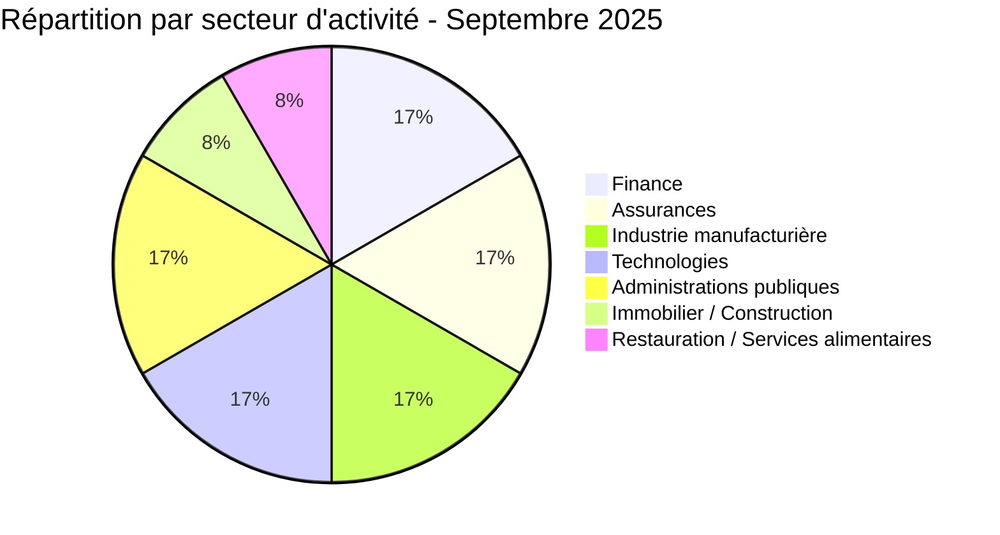
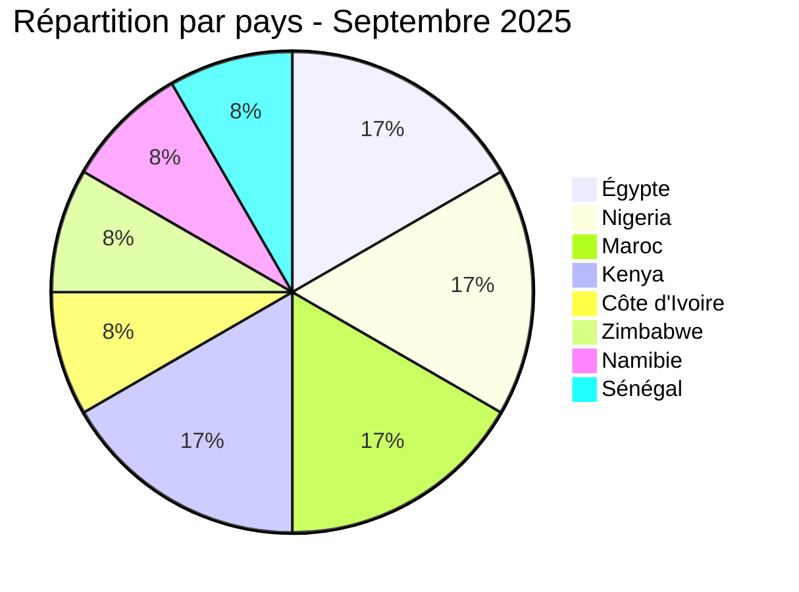
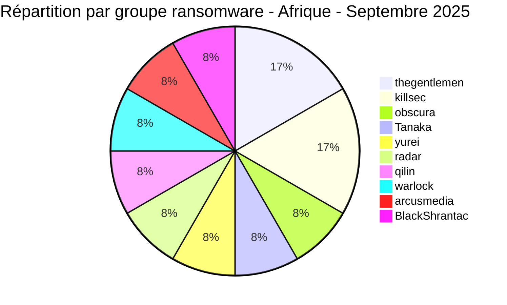
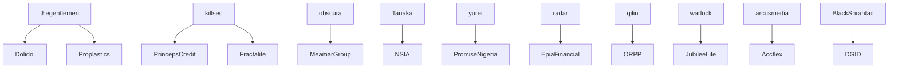
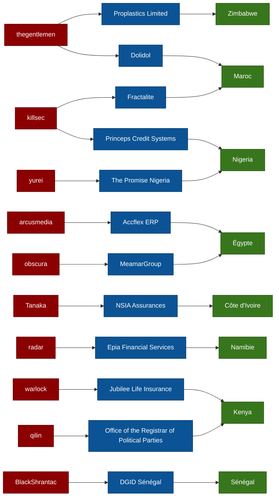

# Rapport CTI : Cyberattaques en Afrique - Septembre 2025 (12 victimes)

👉🏾 English version available in README.md

---

# 1. Introduction

Ce rapport de **Cyber Threat Intelligence (CTI)** présente une analyse des cyberattaques observées en Afrique durant **septembre 2025**.
Les informations proviennent de **sources OSINT**, notamment de la surveillance de **sites de fuite de groupes ransomware** et d’écosystèmes d’extorsion numérique.
Ce rapport s’inscrit dans le cadre du projet **AFRINTEL**, une initiative visant à documenter les cybermenaces affectant les organisations africaines.

Objectifs :

- Identifier les **acteurs ransomware actifs**
- Analyser les **secteurs ciblés**
- Comprendre la **répartition géographique des attaques**
- Extraire des **tendances CTI exploitables pour les défenseurs**

---

# 2. Résumé exécutif

**Nombre total d'incidents observés : 12**

### Acteurs les plus actifs

- thegentlemen (2 attaques)
- killsec (2 attaques)
- 8 autres groupes (1 attaque chacun)

### Secteurs les plus ciblés

| Secteur | Nombre |
|---|---|
Finance | 2 |
Assurances | 2 |
Industrie manufacturière | 2 |
Technologies | 2 |
Administrations publiques | 2 |
Immobilier / Construction | 1 |
Restauration | 1 |

### Pays les plus touchés

| Pays | Nombre |
|---|---|
Égypte | 2 |
Nigeria | 2 |
Maroc | 2 |
Kenya | 2 |
Côte d'Ivoire | 1 |
Zimbabwe | 1 |
Namibie | 1 |
Sénégal | 1 |

### Exfiltration de données notable

| Organisation | Pays | Volume |
|---|---|---|
NSIA Assurances | Côte d'Ivoire | 2,5 millions d'enregistrements |
DGID | Sénégal | 1 To |

---

# 3. Statistiques clés

## Répartition par groupe ransomware

| Groupe | Attaques |
|---|---|
thegentlemen | 2 |
killsec | 2 |
obscura | 1 |
Tanaka | 1 |
yurei | 1 |
radar | 1 |
qilin | 1 |
warlock | 1 |
arcusmedia | 1 |
BlackShrantac | 1 |

---

# 4. Cartographie CTI (Acteurs → Victimes)

---

# 5. Détail des attaques

## thegentlemen

09/09/2025  
- 🇲🇦 Dolidol - Industrie manufacturière  
- 🇿🇼 Proplastics Limited - Industrie manufacturière  

Observation CTI :  
Le groupe a mené **deux opérations simultanées dans deux pays différents**.

---

## killsec

- 10/09/2025 - 🇳🇬 Princeps Credit Systems (Finance)
- 22/09/2025 - 🇲🇦 Fractalite (Technologies)

Observation :  
Ciblage de **secteurs économiques sensibles**.

---

## obscura

05/09/2025  
🇪🇬 MeamarGroup - Immobilier / Construction

---

## Tanaka

06/09/2025  
🇨🇮 NSIA Assurances

Incident notable :  
Fuite massive de **2,5 millions d’enregistrements financiers**.

---

## yurei

08/09/2025  
🇳🇬 The Promise Nigeria - Restauration

---

## radar

11/09/2025  
🇳🇦 Epia Financial Services - Finance

---

## qilin

14/09/2025  
🇰🇪 Office of the Registrar of Political Parties

Institution publique stratégique.

---

## warlock

16/09/2025  
🇰🇪 Jubilee Life Insurance

---

## arcusmedia

17/09/2025  
🇪🇬 Accflex ERP

Entreprise spécialisée dans les solutions ERP.

---

## BlackShrantac

29/09/2025  
🇸🇳 Direction Générale des Impôts et des Domaines (DGID)

Exfiltration massive : **1 To de données sensibles**.

Données concernées :

- bases fiscales
- registres fonciers
- informations bancaires

---

# 6. Analyse sectorielle

Les secteurs les plus exposés sont :

### Finance / Assurances

- Princeps Credit
- Epia Financial
- NSIA Assurances
- Jubilee Life

Ces organisations détiennent :

- données financières
- identités clients
- informations KYC

---

### Administrations publiques

- Registrar of Political Parties (Kenya)
- DGID (Sénégal)

Ces attaques présentent un **impact potentiel sur la souveraineté numérique**.

---

### Industrie

- Dolidol
- Proplastics

Les environnements industriels restent vulnérables aux attaques d’extorsion.

---

# 7. Analyse géographique

Répartition régionale :

| Région | Attaques |
|---|---|
Afrique du Nord | 4 |
Afrique de l'Ouest | 4 |
Afrique de l'Est / Australe | 4 |

Cette répartition indique une **activité ransomware équilibrée sur l'ensemble du continent africain**.

---

# 8. TTP observées

### Exfiltration massive de données

- NSIA : 2,5 millions d’enregistrements
- DGID : 1 To

---

### Double extorsion

Les données sont utilisées pour :

- pression financière
- publication sur leak sites
- vente sur forums clandestins

---

### Ciblage d'institutions publiques

Les groupes ransomware ciblent désormais :

- administrations fiscales
- organismes électoraux
- institutions gouvernementales

---

# 9. Recommandations stratégiques

### Secteur financier

- surveillance SIEM avancée
- segmentation réseau
- surveillance des accès privilégiés

### Administrations publiques

- sauvegardes hors ligne
- chiffrement des bases fiscales
- audit de sécurité régulier

### Tous secteurs

- authentification MFA
- formation phishing
- plans de réponse aux incidents
- supervision SOC 24/7

---

# 10. Conclusion

Le mois de **septembre 2025** confirme une activité soutenue des groupes ransomware sur le continent africain.

Deux incidents se distinguent particulièrement :

- fuite massive de données chez **NSIA Assurances**
- exfiltration **1 To de données fiscales au Sénégal**

La diversité des acteurs et la dispersion géographique des attaques démontrent que :

> les organisations africaines doivent renforcer leur posture de cybersécurité et améliorer la coopération régionale en matière de CTI.

---

# ✍🏿 Auteur

*Adama ASSIONGBON*  
*Consultant SOC & Cyber Threat Intelligence* 
[LinkedIn Profile](https://www.linkedin.com/in/adama-assiongbon-9029893a/)
---

# Projet AFRINTEL

**AFRINTEL** est une initiative de veille collaborative dédiée aux cybermenaces ciblant le continent africain.

Objectifs :

- documenter les cyberattaques
- analyser les campagnes ransomware
- améliorer la visibilité CTI en Afrique
