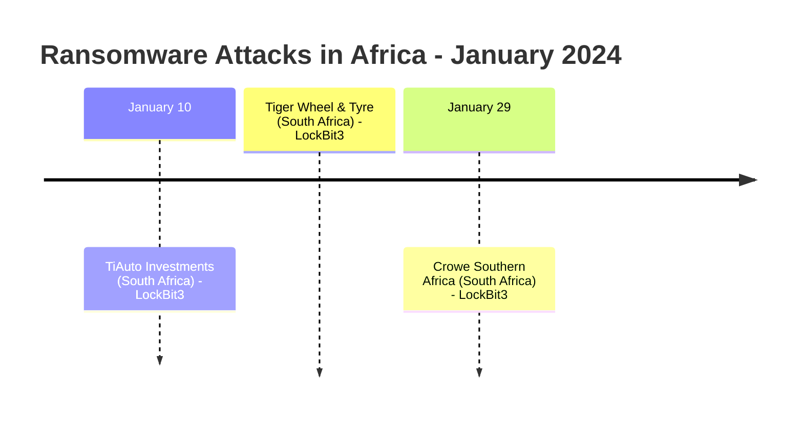
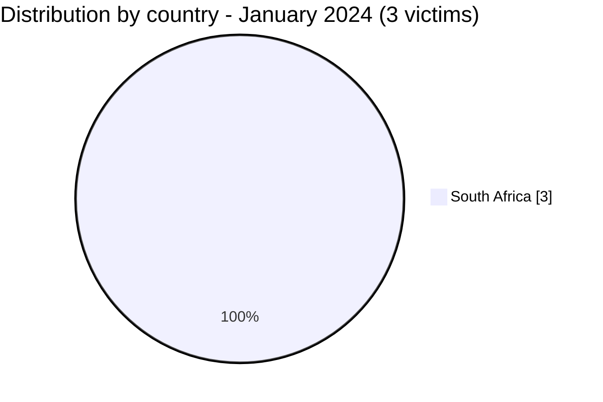

[](https://github.com/Hatchepsoute/AFRINTEL)


# CTI Report - January 2024: LockBit3 opens the year against South African businesses

👉🏾 [Version française disponible ici](./README_FR.md)

### 1. Executive summary

In January 2024, Africa recorded **3 documented ransomware victims**, all located in **South Africa** and all claimed by the **LockBit3** group. The month is marked by a concentration of attacks on the South African private sector, automotive distribution and professional services.

👉🏾 [Victims list](./victims.md)

**Key figures:**
- 🔹 **3 victims** identified
- 🔹 **1 active group**: LockBit3 (3)
- 🔹 **Country affected**: South Africa (3)
- 🔹 **Sectors**: Automotive & Retail (2), Audit / Tax & Advisory (1)

---

### 2. Attack timeline

| Date | Victim | Country | Ransomware group |
|------|--------|---------|-----------------|
| January 10 | TiAuto Investments | South Africa | LockBit3 |
| January 10 | Tiger Wheel & Tyre | South Africa | LockBit3 |
| January 29 | Crowe Southern Africa | South Africa | LockBit3 |



---

### 3. Victim analysis

#### 3.1 By country

| Country | Number of attacks |
|---------|-----------------|
| South Africa | 3 |



#### 3.2 By sector

| Sector | Count |
|--------|-------|
| Automotive & Retail | 2 |
| Audit / Tax & Advisory | 1 |

```mermaid
xychart-beta
    title "Targeted Sectors - January 2024"
    x-axis ["Automotive & Retail", "Audit / Tax & Advisory"]
    y-axis "Number of attacks" 0 to 3
    bar [2, 1]
```

#### 3.3 Ransomware groups

| Ransomware group | Number of attacks |
|-----------------|-----------------|
| LockBit3 | 3 |

---

### 4. Key observations

- **LockBit3 monopoly**: all 3 claims in January 2024 are attributed to LockBit3, confirming its dominant position on the African continent at the start of the year.
- **South Africa only**: geographic concentration on a single country, suggesting targeted prospection or opportunistic exploitation of South African infrastructure.
- **Automotive sector targeted**: TiAuto Investments and its subsidiary Tiger Wheel & Tyre are attacked on the same date (January 10), likely via a shared infrastructure or a supply chain compromise.
- **Professional services**: Crowe Southern Africa (audit, tax) demonstrates interest in firms holding sensitive financial data on multiple clients.

---

```mermaid
xychart-beta
    title "Monthly Evolution of Attacks - Start of 2024"
    x-axis ["Jan"]
    y-axis "Number of attacks" 0 to 5
    bar [3]
```

### 5. Recommendations

| Domain | Recommended action |
|--------|--------------------|
| Automotive & retail distribution | Audit RDP/VPN access, enforce MFA, monitor lateral movements. |
| Professional services (audit, tax) | Encrypt client data, segment file servers, verify third-party access. |
| All organizations | Monitor LockBit3 TTPs: phishing, credential stuffing, exposed RDP exploitation. |

---

*Report generated from AFRINTEL OSINT data. Free distribution (TLP:CLEAR)*
