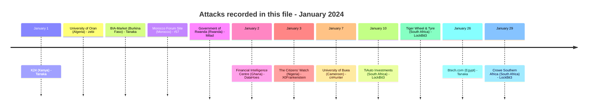
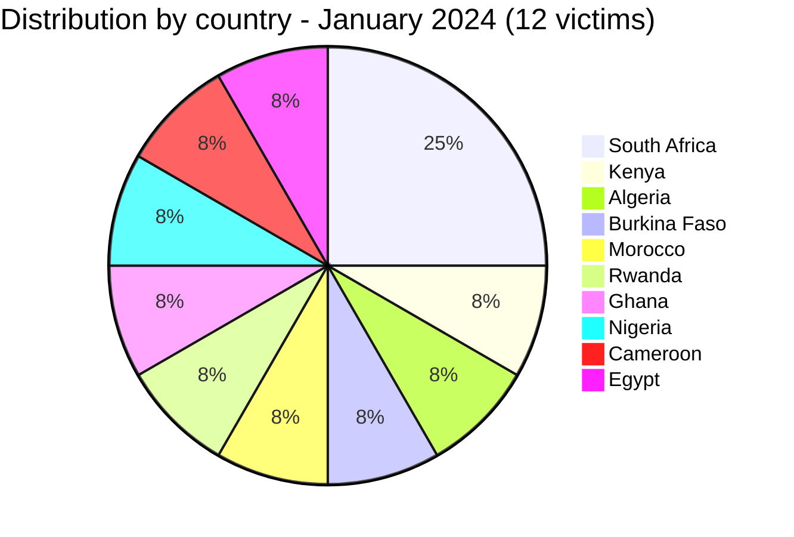

[](https://github.com/Hatchepsoute/AFRINTEL)


# CTI Report - January 2024: LockBit3 opens the year against South African businesses

👉🏾 [Version française disponible ici](./README_FR.md)

### 1. Executive summary

In January 2024, Africa recorded **12 documented victims**: **3 ransomware victims**, all located in **South Africa** and all claimed by the **LockBit3** group; **8 data leak claims** spanning **Kenya, Algeria, Burkina Faso, Morocco, Rwanda, Ghana, Nigeria and Egypt**; and **1 access sale claim** in **Cameroon**. Several of the data leak entries concern posts whose leak or source-publication date precedes January 2024; AFRINTEL places them in this monthly file based on their discovery or requested detection period, while preserving the original leak date in each entry. The month is marked by a concentration of LockBit3 attacks on the South African private sector, automotive distribution and professional services, alongside a wide spread of unrelated data leak and access sale claims affecting education, government, civil society, media, retail and technology sectors across nine additional countries.

👉🏾 [Victims list](./victims.md)

**Key figures:**
- 🔹 **12 victims** identified
- 🔹 **8 sources**: LockBit3 (3), Tanaka (3), zebi (1), r57 (1), Milad (1), DataHoes (1), X0Frankenstein (1), cnHunter (1)
- 🔹 **Countries affected**: South Africa (3), Kenya (1), Algeria (1), Burkina Faso (1), Morocco (1), Rwanda (1), Ghana (1), Nigeria (1), Cameroon (1), Egypt (1)
- 🔹 **Sectors**: Automotive & Retail (2), Education / Higher Education (2), Audit / Tax & Advisory (1), Government / Financial Intelligence (1), Government / Public Administration (1), E-commerce / Retail (1), Media / Broadcasting (1), Technology / Online Community (1), Civil Society / Governance / Non-profit (1), Retail / Electronics (1)
- 🔹 **Incident types**: Ransomware (3), Data Leak (8), Access Sale (1)

---

### 2. Attack timeline

| Discovery date | Victim | Country | Actor / Group | Type | Leak date |
|-----------------|--------|---------|----------------|------|-----------|
| January 1, 2024 | Kenya News Broadcasting Company (K24) | Kenya | Tanaka | Data leak (SQL sample) | 2023 |
| January 1, 2024 | University of Oran | Algeria | zebi | Data leak (repost) | September 12, 2023 |
| January 1, 2024 | BIA-Market | Burkina Faso | Tanaka | Data leak (SQL sample) | 2023 |
| January 1, 2024 | Morocco Forum Site | Morocco | r57 | Data leak (claim) | Source published September 29, 2023 |
| January 1, 2024 | Government of Rwanda (multiple domains) | Rwanda | Milad | Data leak (claim) | Source published June 17, 2023 |
| January 2, 2024 | Financial Intelligence Centre (FIC) | Ghana | DataHoes | Data leak | December 3, 2023 |
| January 3, 2024 | The Citizens' Watch | Nigeria | X0Frankenstein | Data leak (claim) | 2023 |
| January 7, 2024 | University of Buea (UB) | Cameroon | cnHunter | Access sale (unverified claim) | - |
| January 10, 2024 | TiAuto Investments | South Africa | LockBit3 | Ransomware | - |
| January 10, 2024 | Tiger Wheel & Tyre | South Africa | LockBit3 | Ransomware | - |
| January 26, 2024 | Btech.com | Egypt | Tanaka | Data leak (CSV sample) | 2023 (source published February 23, 2023) |
| January 29, 2024 | Crowe Southern Africa | South Africa | LockBit3 | Ransomware | - |



---

### 3. Victim analysis

#### 3.1 By country

| Country | Number of attacks |
|---------|-----------------|
| South Africa | 3 |
| Kenya | 1 |
| Algeria | 1 |
| Burkina Faso | 1 |
| Morocco | 1 |
| Rwanda | 1 |
| Ghana | 1 |
| Nigeria | 1 |
| Cameroon | 1 |
| Egypt | 1 |



#### 3.2 By sector

| Sector | Count |
|--------|-------|
| Automotive & Retail | 2 |
| Education / Higher Education | 2 |
| Audit / Tax & Advisory | 1 |
| Government / Financial Intelligence | 1 |
| Government / Public Administration | 1 |
| E-commerce / Retail | 1 |
| Media / Broadcasting | 1 |
| Technology / Online Community | 1 |
| Civil Society / Governance / Non-profit | 1 |
| Retail / Electronics | 1 |

```mermaid
xychart-beta
    title "Targeted Sectors - January 2024"
    x-axis ["Automotive & Retail", "Education / Higher Education", "Audit / Tax & Advisory", "Government / Financial Intelligence", "Government / Public Administration", "E-commerce / Retail", "Media / Broadcasting", "Technology / Online Community", "Civil Society / Non-profit", "Retail / Electronics"]
    y-axis "Number of attacks" 0 to 3
    bar [2, 2, 1, 1, 1, 1, 1, 1, 1, 1]
```

#### 3.3 Ransomware groups

| Ransomware group | Number of attacks |
|-----------------|-----------------|
| LockBit3 | 3 |

#### 3.4 Data leak and access sale sources

| Source | Number of claims |
|--------|-----------------|
| Tanaka | 3 |
| zebi | 1 |
| r57 | 1 |
| Milad | 1 |
| DataHoes | 1 |
| X0Frankenstein | 1 |
| cnHunter | 1 |

---

### 4. Key observations

- **LockBit3 monopoly on ransomware claims**: all 3 ransomware claims in January 2024 are attributed to LockBit3, confirming its dominant position on the African continent at the start of the year.
- **South Africa concentration**: the January 2024 ransomware claims are all located in South Africa, suggesting targeted prospection or opportunistic exploitation of South African infrastructure.
- **Automotive sector targeted**: TiAuto Investments and its subsidiary Tiger Wheel & Tyre are attacked on the same date (January 10), likely via a shared infrastructure or a supply chain compromise.
- **Professional services**: Crowe Southern Africa (audit, tax) demonstrates interest in firms holding sensitive financial data on multiple clients.
- **Algeria data leak claim**: the University of Oran entry, discovered January 1, 2024, concerns a repost of a data sample on a cybercriminal forum, attributed to the actor `zebi`. The underlying data sample was originally leaked on September 12, 2023. It is not attributed to LockBit3 and is not a ransomware claim; it is tracked separately as a data leak claim.
- **Burkina Faso data leak claim**: the BIA-Market entry, placed in January 2024 as the requested detection period, concerns a SQL sample published on SQL.ticanalyse.org on June 23, 2023. The source identifies BIA-Market and Burkina Faso-related site filters, but does not independently confirm the dataset or compromise.
- **Ghana data leak claim**: the Financial Intelligence Centre (FIC) entry, discovered January 2, 2024, concerns a forum post by the account `DataHoes` describing an extraction of internal HR, payroll and finance-department documents, stated by the actor to date from December 3, 2023. This claim is under investigation, is not attributed to a ransomware group, and is tracked separately as a data leak claim against Ghana's national financial-intelligence unit.
- **Morocco data leak claim**: the Morocco Forum Site entry, discovered January 1, 2024, concerns a claim by the threat actor `r57` on a cybercriminal forum advertising a sample from a claimed 180,000-record dataset for USD 50. The source publication predates January 2024 (September 29, 2023); the forum's ownership and the dataset's authenticity are not independently confirmed.
- **Rwanda data leak claim**: the Government of Rwanda entry, discovered January 1, 2024, concerns a claim by the threat actor `Milad` covering four government domains, including bodies associated with genocide remembrance and national reconciliation. The posting account is now shown as banned. A CMS-attribution inconsistency in the source (declared as "Custom" but structurally resembling TYPO3) limits AFRINTEL's confidence; the claim is tracked as unverified beyond the visible sample.
- **Nigeria data leak claim**: The Citizens' Watch entry, discovered January 3, 2024, concerns a claim by the threat actor `X0Frankenstein` targeting a pan-African civic-tech non-profit's promise-tracking platform. The visible sample mixes several distinct table structures; AFRINTEL cannot independently confirm each segment's origin.
- **Cameroon access sale claim**: the University of Buea entry, discovered January 7, 2024, concerns a claim by the threat actor `cnHunter` of administrative access to a REDCap instance. The posting account was subsequently permanently banned for suspected scamming, which materially reduces confidence; AFRINTEL tracks this as a low-confidence, unverified access sale claim.
- **Egypt data leak claim**: the Btech.com entry, discovered January 26, 2024, concerns a claim by the actor `Tanaka` of a CSV export with customer records including names, addresses and possible Egyptian national identity numbers. The consistency of the sample supports a higher confidence level, though the total claimed volume is not independently verified.

---

```mermaid
xychart-beta
    title "Monthly Evolution of Attacks - Start of 2024"
    x-axis ["Jan"]
    y-axis "Number of attacks" 0 to 12
    bar [12]
```

### 5. Recommendations

| Domain | Recommended action |
|--------|--------------------|
| Automotive & retail distribution | Audit RDP/VPN access, enforce MFA, monitor lateral movements. |
| Professional services (audit, tax) | Encrypt client data, segment file servers, verify third-party access. |
| All organizations | Monitor LockBit3 TTPs: phishing, credential stuffing, exposed RDP exploitation. |
| E-commerce / retail | BIA-Market and Btech.com should verify the claims, review application and database logs, rotate potentially exposed credentials and invalidate active sessions or activation keys if confirmed. |
| Education / higher education | Identify affected institutions and applications, review authentication and access logs, reset exposed accounts, and search for redistribution of the University of Oran and University of Buea material across other leak sources. |
| Government / financial intelligence | FIC should verify whether the described extraction originates from its own systems, review access logs around December 3, 2023, and assess exposure of the banking, payroll and HR data referenced in the post. |
| Government / public administration | The relevant Rwandan institutions should verify the claimed backend-administration credentials, rotate any exposed passwords and review CMS access logs for the affected domains. |
| Civil society / non-profit | The Citizens' Watch should verify the claimed database export, rotate credentials tied to admin accounts, and notify registrants whose personal data may be exposed. |
| Media / broadcasting | K24 should review WordPress administrator accounts and plugin configuration, and monitor the domain for unauthorized changes. |
| Technology / online community | The operator of the claimed Moroccan forum platform, once identified, should assess exposure of account credentials and warn users of phishing and credential-reuse risk. |

---

*Report generated from AFRINTEL OSINT data. Free distribution (TLP:CLEAR)*
