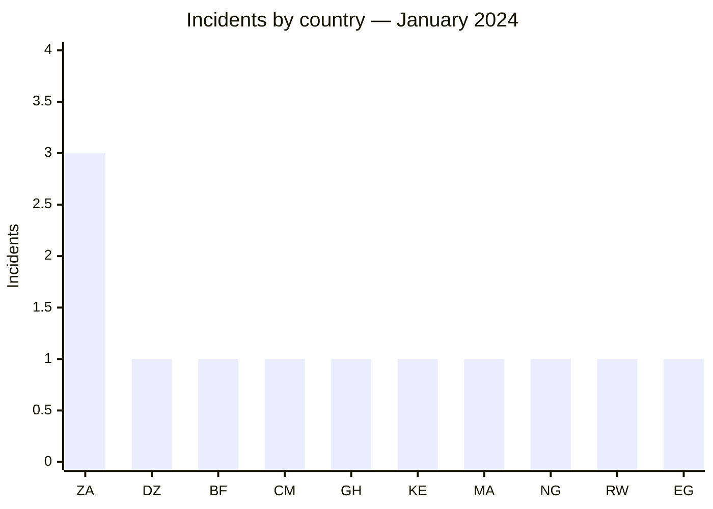
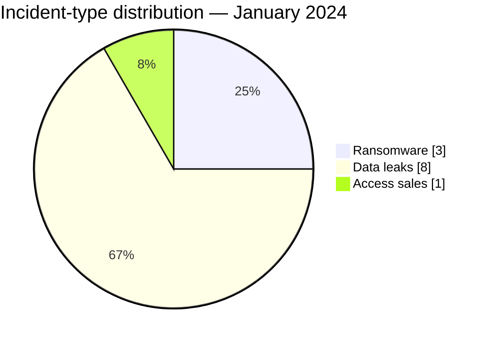

# AFRINTEL CTI Report — January 2024

👉🏾 [Version française](./README_FR.md)

## 1. Executive summary

AFRINTEL documents **12 incidents** in January 2024: **3 ransomware claims**, **8 data leaks**, and **1 access sale**. South Africa accounts for all three ransomware publications, each attributed to LockBit3. The remaining nine incidents span nine countries and primarily involve databases, administrative information, and user accounts.

The month's most sensitive signals are the publications concerning Ghana's **Financial Intelligence Centre** and several Rwandan government domains. Available evidence increases confidence that exposed data existed, but it does not confirm the acquisition method or the full scope of the advertised datasets. The University of Buea access sale remains a **low-confidence** claim because the seller's account was subsequently flagged as suspicious.

Incident-level detail is available in [victims.md](./victims.md).

## 2. Methodology

This report covers publications discovered or assigned between January 1 and 31, 2024. Sources include ransomware leak sites, cybercriminal forums, and OSINT material retained in aggregate form. Each organization is counted once; inclusion does not amount to confirmation of compromise. Some leaks predate January and are assigned to this month based on their documented discovery date.

All statistics derive from the **12 incidents** in [victims.md](./victims.md), synchronized with [victims_FR.md](./victims_FR.md).

## 3. Global overview

| Indicator | Value |
|---|---:|
| Documented incidents | **12** |
| Countries affected | **10** |
| Ransomware | **3** |
| Data leaks | **8** |
| Access sales | **1** |
| Defacement | **0** |

### Country ranking

| Country | Incidents | Ransomware | Data leak | Access sale |
|---|---:|---:|---:|---:|
| 🇿🇦 South Africa | 3 | 3 | 0 | 0 |
| 🇩🇿 Algeria | 1 | 0 | 1 | 0 |
| 🇧🇫 Burkina Faso | 1 | 0 | 1 | 0 |
| 🇨🇲 Cameroon | 1 | 0 | 0 | 1 |
| 🇬🇭 Ghana | 1 | 0 | 1 | 0 |
| 🇰🇪 Kenya | 1 | 0 | 1 | 0 |
| 🇲🇦 Morocco | 1 | 0 | 1 | 0 |
| 🇳🇬 Nigeria | 1 | 0 | 1 | 0 |
| 🇷🇼 Rwanda | 1 | 0 | 1 | 0 |
| 🇪🇬 Egypt | 1 | 0 | 1 | 0 |
| **Total** | **12** | **3** | **8** | **1** |

### Regional distribution

| Region | Incidents | Observation |
|---|---:|---|
| Southern Africa | 3 | Three ransomware claims in South Africa |
| North Africa | 3 | Algeria, Morocco, and Egypt |
| West Africa | 3 | Burkina Faso, Ghana, and Nigeria |
| East Africa | 2 | Kenya and Rwanda |
| Central Africa | 1 | Access sale in Cameroon |
| **Total** | **12** | |

### Normalized sector distribution

| Sector | Incidents | Share |
|---|---:|---:|
| Retail / E-commerce | 4 | 33.3% |
| Government / Administration | 2 | 16.7% |
| Education / University | 2 | 16.7% |
| Media / Entertainment | 1 | 8.3% |
| Technology / IT | 1 | 8.3% |
| Civil Society / NGO | 1 | 8.3% |
| Professional / Business Services | 1 | 8.3% |
| **Total** | **12** | **100%** |

### Most visible actors

| Actor or source | Incidents | Assessment |
|---|---:|---|
| LockBit3 | 3 | Ransomware claims in South Africa |
| Tanaka and associated publications | 3 | Data leaks attributed across several sources |
| Other actors or accounts | 6 | One publication each |

## 4. Detailed analysis by incident type

### 4.1 Ransomware

The three South African organizations — TiAuto Investments, Tiger Wheel & Tyre, and Crowe Southern Africa — were published under the LockBit3 name. No usable public technical evidence in the January corpus establishes initial access, the encrypted scope, or confirmed exfiltration. The established fact is the actor's publication of the organizations.

### 4.2 Data leaks and access sale

The eight leaks cover website data, user accounts, and administrative environments. Observed samples support the existence of plausible data structures, but full volumes remain actor claims. The Financial Intelligence Centre publication carries the highest potential impact because of the institution's role.

The advertised administrator access to a University of Buea REDCap instance is kept separate. The access was not tested and its validity remains unknown.

## 5. Sectoral impact

Retail and e-commerce rank first, partly because several publications concern platforms or distributors exposed before January. Government and education account for fewer incidents but higher sensitivity through administrative information, student data, and institutional application access. Frequency and criticality therefore need to be assessed separately.

## 6. Threat actor profile and risk assessment

| Country or scope | Level | Rationale |
|---|---|---|
| 🇿🇦 South Africa | 🔴 High | Concentration of three ransomware claims |
| 🇬🇭 Ghana | 🔴 High | Publication concerning a financial-intelligence body |
| 🇷🇼 Rwanda | 🔴 High | Data attributed to several government domains |
| 🇨🇲 Cameroon | 🟠 Medium | Unvalidated, low-confidence access sale |
| Other countries | 🟡 Low to medium | One publication per country, with varying scope |

## 7. Key trends and intelligence gaps

- **Observed — high confidence:** leaks and access sales dominate the corpus, accounting for 9 of 12 incidents.
- **Observed — high confidence:** all three ransomware claims concern South Africa and are associated with LockBit3.
- **Priority gap:** no public DFIR report was identified in the sources reviewed to establish initial access or confirm the ransomware scope.
- **Priority gap:** full advertised database volumes cannot be inferred from the observed excerpts alone.
- **Collection need:** monitor victim statements, regulatory notices, and later publications that may distinguish old data, reposts, and contemporary incidents.

## 8. Contextual MITRE ATT&CK mapping

| Analytical status | Phase | Technique | Application to the corpus |
|---|---|---|---|
| Preventive | Impact | T1486 — Data Encrypted for Impact | Relevant monitoring for the three ransomware claims; encryption is not confirmed by public telemetry |
| Assumption | Initial Access / Persistence | T1078 — Valid Accounts | Plausible scenario for the University of Buea access sale; access validity is unknown |
| Preventive | Exfiltration | T1567 — Exfiltration Over Web Service | Defensive control relevant to leak cases; no exfiltration channel was observed |

## 9. Recommendations

- **Government bodies:** inventory exposed applications, review privileged accounts, and prepare notification procedures.
- **Education organizations:** deploy phishing-resistant MFA for administrators and review access to research applications.
- **Retail and media organizations:** review database exports, CMS accounts, and application secrets.
- **Ransomware-listed organizations:** perform a full restoration test from isolated, immutable backups.

## 10. SOC and tactical recommendations

| Qualification | Action |
|---|---|
| **Observed** | Search IAM, VPN, and application logs for accounts tied to the published environments; no intrusion TTP is publicly confirmed. |
| **Assumption** | Review unusual administrative authentication around publication dates, particularly for REDCap and exposed CMS platforms. |
| **Preventive** | Detect large archive creation, unusual SQL exports, backup inhibition, and mass file-extension changes. |
| **Preventive** | Correlate EDR, WAF, IAM, DNS, and proxy data to identify exfiltration or encryption activity not visible through OSINT. |

## 11. Strategic recommendations

| Priority | Qualification | Measure |
|---:|---|---|
| 1 | **Observed** | Reduce exposure of the government and education applications cited in the corpus. |
| 2 | **Assumption** | Treat the access sale as a valid-account risk without assuming the advertised access still works. |
| 3 | **Preventive** | Standardize phishing-resistant MFA, secret rotation, and quarterly privileged-account reviews. |
| 4 | **Preventive** | Maintain isolated, immutable critical backups and test them through restoration exercises. |

## 12. Conclusion

January 2024 shows two distinct patterns: ransomware concentrated in South Africa and a much wider circulation of data and access claims. Government-related publications carry the greatest sensitivity, but the available evidence does not turn those claims into confirmed compromises. Priorities are to validate exposure, reduce external access, and preserve an independent restoration capability.

**AFRINTEL — TLP:CLEAR**
[AFRINTEL repository](https://github.com/Hatchepsoute/AFRINTEL)
