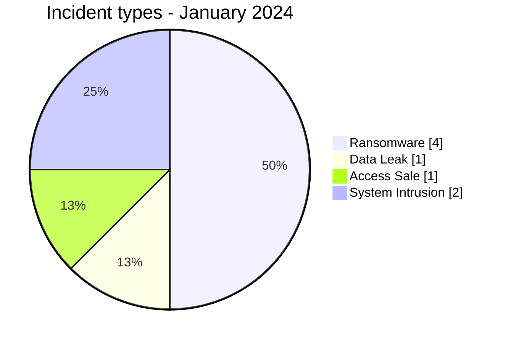
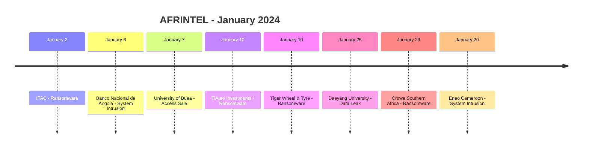

# AFRINTEL CTI Report - Cyber Threats in Africa - January 2024

👉🏾 [Version française](./README_FR.md)

## 1. Executive summary

In January 2024, AFRINTEL retains **8 canonical cyber incidents across 4 countries**. The month is led by **Ransomware (4, 50.0%)**, followed by **System Intrusion (2, 25.0%)**, **Data Leak (1, 12.5%)**, and **Access Sale (1, 12.5%)**.

The most represented countries are **South Africa (4)** and **Cameroon (2)**, followed by **Angola (1)** and **Malawi (1)**. The leading sectors are **Retail / E-commerce (2)** and **Education / University (2)**. The most frequent actor/group labels are `Unknown` (3) and `lockbit3` (3), followed by `cnHunter` (1) and `X0Frankenstein` (1). `Unknown` means missing attribution, not an actor.

The January baseline has been corrected following the retrospective integration of the **Daeyang University Data Leak**, initially published on **January 25, 2024** with a visible SQL sample. The actor claims more than 224,000 SQL lines; AFRINTEL does not equate this figure with a number of affected persons.

## 2. Methodology

- One canonical incident equals one event retained in the 2024 year.
- Historical discoveries/republications are preserved separately and do not inflate 2024 statistics.
- Incident date or best-supported window takes precedence; AFRINTEL discovery date remains separate.
- Nine AFRINTEL types are used; attempts are represented by status, never by an `Attempted Attack` type.
- Coordinated DDoS is counted by campaign.
- Type, status, confidence, impact, attribution, and source remain separate.

## 3. Incident-type distribution

| Type | Records | Share |
|---|---:|---:|
| Ransomware | 4 | 50.0% |
| Data Leak | 1 | 12.5% |
| Access Sale | 1 | 12.5% |
| DDoS | 0 | 0.0% |
| Defacement | 0 | 0.0% |
| Account Takeover | 0 | 0.0% |
| System Intrusion | 2 | 25.0% |
| Malware | 0 | 0.0% |
| Operational Fraud | 0 | 0.0% |

## 4. Country x type

| Country | Total | Ransomware | Data Leak | Access Sale | DDoS | Defacement | Account Takeover | System Intrusion | Malware | Operational Fraud |
|---|---:|---:|---:|---:|---:|---:|---:|---:|---:|---:|
| South Africa | 4 | 4 | 0 | 0 | 0 | 0 | 0 | 0 | 0 | 0 |
| Cameroon | 2 | 0 | 0 | 1 | 0 | 0 | 0 | 1 | 0 | 0 |
| Angola | 1 | 0 | 0 | 0 | 0 | 0 | 0 | 1 | 0 | 0 |
| Malawi | 1 | 0 | 1 | 0 | 0 | 0 | 0 | 0 | 0 | 0 |

## 5. Regional distribution

| Region | Records | Share |
|---|---:|---:|
| Southern Africa | 6 | 75.0% |
| Central Africa | 2 | 25.0% |

## 6. Sector distribution

| Sector | Records | Share |
|---|---:|---:|
| Retail / E-commerce | 2 | 25.0% |
| Education / University | 2 | 25.0% |
| Government / Administration | 1 | 12.5% |
| Finance / Banking | 1 | 12.5% |
| Professional / Business Services | 1 | 12.5% |
| Energy / Utilities | 1 | 12.5% |

## 7. Actors / groups

| Actor / Group | Records | Share |
|---|---:|---:|
| Unknown | 3 | 37.5% |
| lockbit3 | 3 | 37.5% |
| cnHunter | 1 | 12.5% |
| X0Frankenstein | 1 | 12.5% |

## 8. Evidence maturity

| Evidence position | Records | Share |
|---|---:|---:|
| Claim - Unverified | 4 | 50.0% |
| Confirmed | 3 | 37.5% |
| Claim - Data Sample Published | 1 | 12.5% |

### Confidence

| Confidence | Records | Share |
|---|---:|---:|
| Low | 4 | 50.0% |
| Very High | 2 | 25.0% |
| High | 2 | 25.0% |
## 9. Timeline

> Detailed incident cards, evidence notes and source references are maintained in [`victims.md`](./victims.md).
## 10. CTI analysis by type

### Ransomware - 4
**4 records (50.0%).** All four are associated with South African targets in the January canonical corpus. Leak-site or criminal claims remain claims unless stronger evidence is available.

### System Intrusion - 2
**2 records (25.0%).** Angola (1) and Cameroon (1). The available evidence supports intrusion and disruption but does not justify forcing those cases into ransomware or data-leak categories.

### Data Leak - 1
**1 record (12.5%).** Malawi (Daeyang University). A visible SQL sample supports the presence of student-related and application data, including plaintext credentials in some records. The actor's claim of more than 224,000 SQL lines remains unverified and is not treated as a count of affected persons.

### Access Sale - 1
**1 record (12.5%).** Cameroon (University of Buea). The claim remains low-confidence and unverified.
## 11. Priority incidents for review

| Country | Organization | Type | Status | Impact | Confidence |
|---|---|---|---|---|---|
| South Africa | International Trade Administration Commission of South Africa (ITAC) | Ransomware | Victim Confirmed | Level 4 | Very High |
| Cameroon | Eneo Cameroon | System Intrusion | Victim Confirmed | Level 4 | High |
| Malawi | Daeyang University | Data Leak | Claim - Data Sample Published | Level 4 | High |
| Cameroon | University of Buea (UB) | Access Sale | Claim - Unverified | Level 3 | Low |
| Angola | Banco Nacional de Angola (BNA) | System Intrusion | Victim Confirmed | Level 2 | Very High |

> Structured selection based on impact, status, and confidence; not an absolute severity ranking.
## 12. Intelligence gaps and corrections

- initial-access vector often unknown;
- technical compromise date may differ from publication date;
- claimed volumes are rarely fully verifiable;
- technical attribution is often limited to the publication account;
- historical republications are tracked separately.

## 13. Recommendations

- phishing-resistant MFA, PAM, and least privilege;
- segmentation, immutable backups, and restoration testing;
- centralized EDR/IAM/VPN/WAF/DNS/cloud/application logging;
- detection of mass exports, unusual archives, and outbound transfers;
- separate preservation of incident, initial-publication, repost, and AFRINTEL discovery dates.

## 14. Conclusion

January 2024 contains **8 canonical incidents**. Month-over-month comparison uses the same taxonomy and chronology rules, except January where December 2023 remains `N/A` because no equivalent re-audit has been completed.

👉🏾 [Canonical victims](./victims.md)

**AFRINTEL** - TLP:CLEAR
