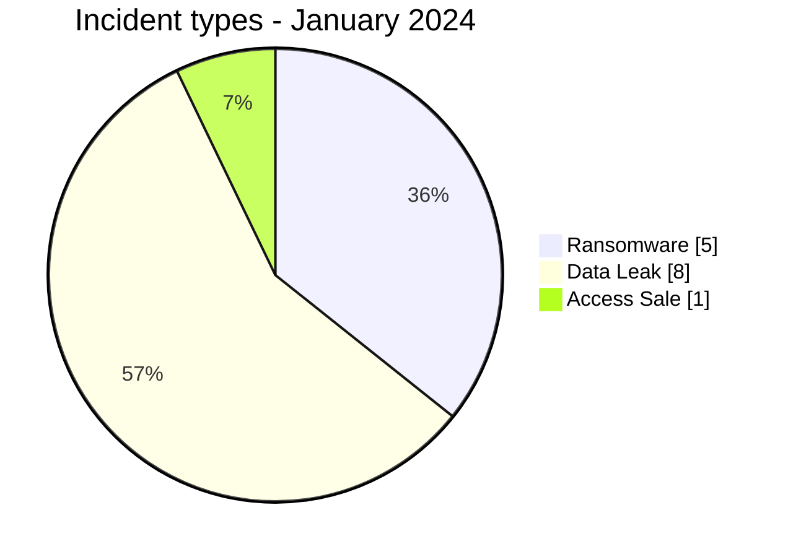
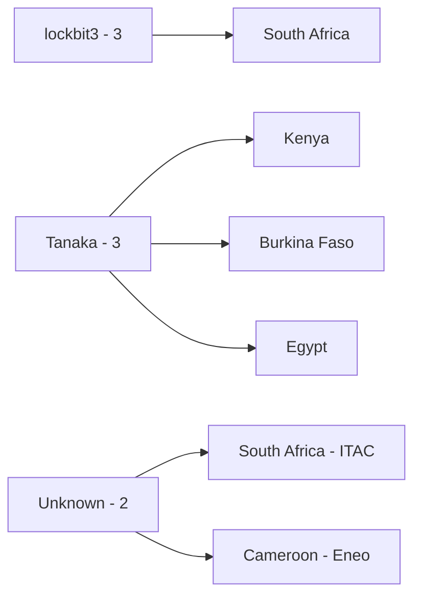
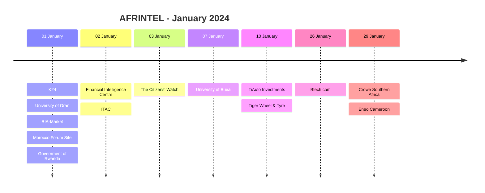

# AFRINTEL CTI Report - January 2024

👉🏾 [Version française](./README_FR.md)

## 1. Executive summary

AFRINTEL documents **14 incident records** in January 2024: **5 Ransomware**, **8 Data Leak** and **1 Access Sale**, across **10 African countries**. No DDoS, Defacement or Operational Fraud record is present in the validated January corpus.

South Africa records **4 incidents**, including the victim-confirmed ITAC ransomware event. Cameroon now records **2 incidents**, including the University of Buea Access Sale and the victim-confirmed Eneo cyberattack. Eneo is mapped provisionally to the Ransomware taxonomy because secondary CTI sources use that classification, while the victim-facing reporting reviewed does not independently confirm ransomware deployment.

👉🏾 [View the full victim list](./victims.md)

### 1.1 Month-over-month comparison

> A validated AFRINTEL monthly corpus for **December 2023 is not available in the repository used for this update**. December values and month-over-month changes therefore remain `N/A`.

| Indicator | December 2023 | January 2024 | Change |
|---|---:|---:|---:|
| Total incidents | N/A | **14** | N/A |
| Ransomware | N/A | **5** | N/A |
| Data Leak | N/A | **8** | N/A |
| Access Sale | N/A | **1** | N/A |
| DDoS | N/A | **0** | N/A |
| Defacement | N/A | **0** | N/A |
| Operational Fraud | N/A | **0** | N/A |

## 2. Methodology

- **Period:** 1-31 January 2024.
- **Source of truth:** harmonized `victims_FR.md` / `victims.md`.
- **Counting:** one harmonized card equals one documented incident record.
- **Taxonomy:** Ransomware, Data Leak, Access Sale, DDoS, Defacement, Operational Fraud.
- **Retrospective corrections:** incidents discovered during the 23 August 2026 historical audit are placed in their real 2024 incident month and retain a separate AFRINTEL correction date.
- **Evidence qualification:** victim confirmation, threat-actor claim, published sample and technical confirmation remain distinct.
- **Eneo caveat:** the cyberattack and disruption are victim-confirmed; its Ransomware type is a provisional controlled-taxonomy mapping based on secondary CTI classification, not victim-confirmed malware evidence.

## 3. Global overview

### 3.1 Incident-type distribution

| Incident type | Records | Share |
|---|---:|---:|
| Ransomware | **5** | **35.7%** |
| Data Leak | **8** | **57.1%** |
| Access Sale | **1** | **7.1%** |
| DDoS | 0 | 0.0% |
| Defacement | 0 | 0.0% |
| Operational Fraud | 0 | 0.0% |
| **Total** | **14** | **100%** |

### 3.2 Country distribution

| Country | Ransomware | Data Leak | Access Sale | Total |
|---|---:|---:|---:|---:|
| 🇿🇦 South Africa | 4 | 0 | 0 | **4** |
| 🇨🇲 Cameroon | 1 | 0 | 1 | **2** |
| 🇩🇿 Algeria | 0 | 1 | 0 | 1 |
| 🇧🇫 Burkina Faso | 0 | 1 | 0 | 1 |
| 🇬🇭 Ghana | 0 | 1 | 0 | 1 |
| 🇰🇪 Kenya | 0 | 1 | 0 | 1 |
| 🇲🇦 Morocco | 0 | 1 | 0 | 1 |
| 🇳🇬 Nigeria | 0 | 1 | 0 | 1 |
| 🇷🇼 Rwanda | 0 | 1 | 0 | 1 |
| 🇪🇬 Egypt | 0 | 1 | 0 | 1 |
| **Total** | **5** | **8** | **1** | **14** |

### 3.3 Regional distribution

| Region | Ransomware | Data Leak | Access Sale | Total |
|---|---:|---:|---:|---:|
| Southern Africa | 4 | 0 | 0 | **4** |
| North Africa | 0 | 3 | 0 | **3** |
| West Africa | 0 | 3 | 0 | **3** |
| East Africa | 0 | 2 | 0 | **2** |
| Central Africa | 1 | 0 | 1 | **2** |
| **Total** | **5** | **8** | **1** | **14** |

### 3.4 Harmonized sector distribution

| Sector | Records |
|---|---:|
| Retail / E-commerce | 4 |
| Government / Administration | 3 |
| Education / University | 2 |
| Media / Entertainment | 1 |
| Technology / IT | 1 |
| Civil Society / NGO | 1 |
| Professional / Business Services | 1 |
| Energy / Utilities | 1 |
| **Total** | **14** |

### 3.5 Actors / groups

| Actor / Group | Records |
|---|---:|
| lockbit3 | 3 |
| Tanaka | 3 |
| Unknown | 2 |
| zebi | 1 |
| r57 | 1 |
| Milad | 1 |
| DataHoes | 1 |
| X0Frankenstein | 1 |
| cnHunter | 1 |
| **Total** | **14** |

## 4. Detailed analysis

### 4.1 Ransomware - 5 records

The original January corpus contained three `lockbit3` claims in South Africa. The historical correction adds two records:

- **ITAC, South Africa:** victim-confirmed Ransomware on 2 January. File encryption, loss of system access and ransom demand are confirmed by ITAC. Possible personal-data access/exfiltration remains qualified as possible.
- **Eneo Cameroon:** victim-confirmed cyberattack and operational disruption beginning 29 January. Ransomware is retained only as a provisional AFRINTEL taxonomy mapping because the reviewed victim-facing reporting does not independently confirm ransomware deployment.

### 4.2 Data Leak - 8 records

The eight Data Leak records remain unchanged from the previously harmonized January corpus.

### 4.3 Access Sale - 1 record

The University of Buea record remains the single Access Sale and retains a low-confidence, unverified status.

## 5. Key findings and intelligence gaps

- Data Leak remains the largest category with **8 of 14 records (57.1%)**.
- South Africa increases from 3 to **4 records** after adding ITAC.
- Cameroon increases from 1 to **2 records** after adding Eneo.
- January Ransomware rises from 3 to **5 records**, but one of the two added records, Eneo, carries an explicit taxonomy caveat.
- Retrospective discoveries are assigned to their real incident month while preserving the later AFRINTEL correction date.

## 6. Contextual MITRE ATT&CK mapping

| Status | Technique | Application |
|---|---|---|
| Observed / ITAC | T1486 - Data Encrypted for Impact | ITAC confirms file encryption during the ransomware event. |
| Preventive / other Ransomware claims | T1486 - Data Encrypted for Impact | Relevant monitoring where encryption is not technically confirmed. |
| Assumption | T1078 - Valid Accounts | Relevant to the University of Buea Access Sale; access validity is unknown. |
| Contextual | T1213 - Data from Information Repositories | Relevant to structured database and CMS samples in Data Leak records. |

## 7. Recommendations

- Keep victim-confirmed facts separate from secondary ransomware classifications.
- Preserve incident date, initial publication date and retrospective AFRINTEL correction date as separate fields.
- Prioritize resilience and segmentation reviews for critical infrastructure operators such as electricity utilities.
- Validate potential personal-data exfiltration independently before converting a ransomware record into an additional Data Leak record.
- Maintain lifecycle and deduplication checks when later publications refer to the same underlying event.

## 8. Timeline

## 9. Conclusion

January 2024 now contains **14 documented incident records across 10 African countries**, comprising **5 Ransomware, 8 Data Leak and 1 Access Sale**.

The retrospective correction adds ITAC and Eneo Cameroon while preserving the distinction between confirmed incident effects and uncertain technical classification.

**AFRINTEL** - TLP:CLEAR
