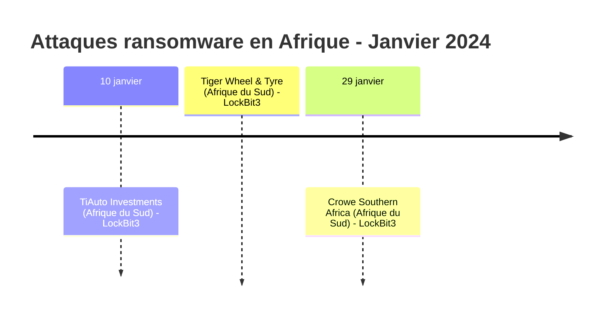
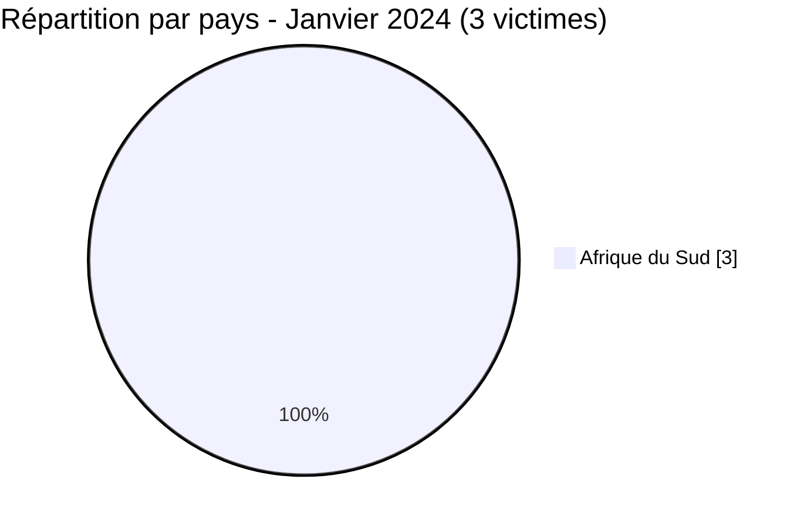

[](https://github.com/Hatchepsoute/AFRINTEL)


# Rapport CTI - Janvier 2024 : LockBit3 ouvre l'année contre les entreprises sud-africaines

👉🏾 [English version available here](./README.md)

### 1. Résumé exécutif

En janvier 2024, l'Afrique a enregistré **3 victimes** documentées d'attaques par ransomware, toutes localisées en **Afrique du Sud** et toutes revendiquées par le groupe **LockBit3**. Le mois est marqué par une concentration des attaques sur le secteur privé sud-africain, distribution automobile et services professionnels.

👉🏾 [Liste des victimes](./victims_FR.md)

**Chiffres clés :**
- 🔹 **3 victimes** identifiées
- 🔹 **1 groupe actif** : LockBit3 (3)
- 🔹 **Pays touché** : Afrique du Sud (3)
- 🔹 **Secteurs** : Automobile & Retail (2), Audit / Conseil Fiscal (1)

---

### 2. Chronologie des attaques

| Date | Victime | Pays | Groupe ransomware |
|------|---------|------|-------------------|
| 10 janvier | TiAuto Investments | Afrique du Sud | LockBit3 |
| 10 janvier | Tiger Wheel & Tyre | Afrique du Sud | LockBit3 |
| 29 janvier | Crowe Southern Africa | Afrique du Sud | LockBit3 |



---

### 3. Analyse des victimes

#### 3.1 Par pays

| Pays | Nombre d'attaques |
|------|-----------------|
| Afrique du Sud | 3 |



#### 3.2 Par secteur

| Secteur | Nombre |
|---------|--------|
| Automobile & Retail | 2 |
| Audit / Conseil Fiscal | 1 |

```mermaid
xychart-beta
    title "Secteurs ciblés - Janvier 2024"
    x-axis ["Automobile & Retail", "Audit / Conseil Fiscal"]
    y-axis "Nombre d'attaques" 0 to 3
    bar [2, 1]
```

#### 3.3 Groupes ransomware

| Groupe ransomware | Nombre d'attaques |
|-----------------|-----------------|
| LockBit3 | 3 |

---

### 4. Points d'attention

- **Monopole LockBit3** : les 3 revendications de janvier 2024 sont attribuées à LockBit3, confirmant sa position dominante sur le continent africain en début d'année.
- **Afrique du Sud uniquement** : concentration géographique sur un seul pays, suggérant une prospection ciblée ou une exploitation opportuniste des infrastructures sud-africaines.
- **Secteur automobile visé** : TiAuto Investments et sa filiale Tiger Wheel & Tyre sont attaquées le même jour (10 janvier), probablement via une infrastructure partagée ou une compromission de la chaîne d'approvisionnement.
- **Services professionnels** : Crowe Southern Africa (audit, fiscalité) illustre l'intérêt des acteurs malveillants pour les entreprises détenant des données financières sensibles sur de multiples clients.

---

```mermaid
xychart-beta
    title "Évolution mensuelle des attaques - Début 2024"
    x-axis ["Jan"]
    y-axis "Nombre d'attaques" 0 to 5
    bar [3]
```

### 5. Recommandations

| Domaine | Action recommandée |
|---------|--------------------|
| Distribution automobile & retail | Auditer les accès RDP/VPN, imposer le MFA, surveiller les mouvements latéraux. |
| Services professionnels (audit, fiscal) | Chiffrer les données clients, segmenter les serveurs de fichiers, vérifier les accès tiers. |
| Toutes organisations | Surveiller les TTPs de LockBit3 : phishing, credential stuffing, exploitation RDP exposé. |

---

*Rapport généré à partir des données OSINT AFRINTEL. Diffusion libre (TLP:CLEAR)*
