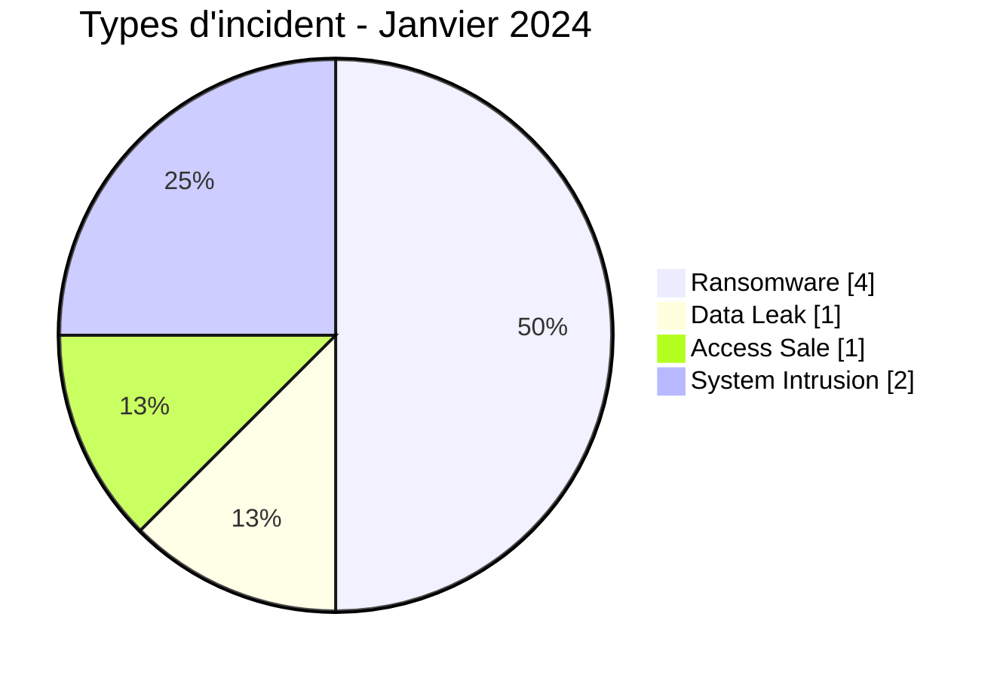
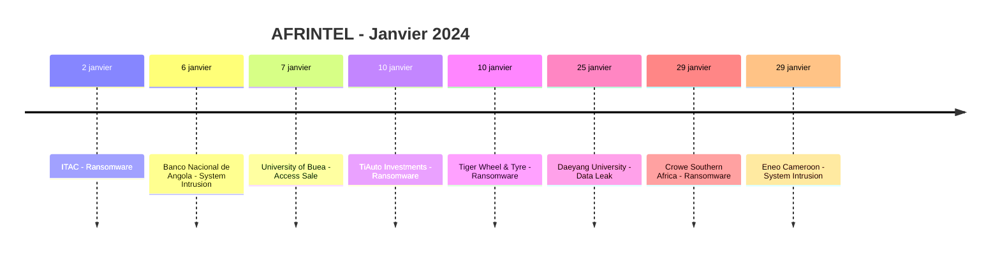

# Rapport CTI AFRINTEL - Cybermenaces en Afrique - Janvier 2024

👉🏾 [English version](./README.md)

## 1. Synthèse exécutive

En janvier 2024, AFRINTEL retient **8 cyberincidents canoniques dans 4 pays**. Le mois est dominé par **Ransomware (4, 50,0 %)**, suivi de **System Intrusion (2, 25,0 %)**, **Data Leak (1, 12,5 %)** et **Access Sale (1, 12,5 %)**.

Les pays les plus représentés sont **l'Afrique du Sud (4)** et le **Cameroun (2)**, suivis de **l'Angola (1)** et du **Malawi (1)**. Les secteurs les plus visibles sont **Commerce / E-commerce (2)** et **Éducation / Université (2)**. Les labels acteur/groupe les plus fréquents sont `Unknown` (3) et `lockbit3` (3), suivis de `cnHunter` (1) et `X0Frankenstein` (1). `Unknown` désigne une absence d'attribution, pas un groupe.

La baseline de janvier a été corrigée après l'intégration rétrospective de la **Data Leak de Daeyang University**, publiée initialement le **25 janvier 2024** avec un échantillon SQL visible. L'acteur revendique plus de 224 000 lignes SQL ; AFRINTEL n'assimile pas ce chiffre à un nombre de personnes affectées.

## 2. Méthodologie

- Un incident canonique correspond à un événement retenu dans le millésime 2024.
- Les découvertes/republications historiques sont conservées séparément et ne gonflent pas les statistiques 2024.
- La date d'incident ou la meilleure fenêtre soutenue prime ; la date de découverte AFRINTEL reste distincte.
- Les 9 types AFRINTEL sont utilisés ; une tentative est représentée par le statut, jamais par un type `Attempted Attack`.
- Un DDoS coordonné est compté par campagne.
- Type, statut, confiance, impact, attribution et source restent distincts.

## 3. Répartition par type d'incident

| Type | Fiches | Part |
|---|---:|---:|
| Ransomware | 4 | 50,0 % |
| Data Leak | 1 | 12,5 % |
| Access Sale | 1 | 12,5 % |
| DDoS | 0 | 0,0 % |
| Defacement | 0 | 0,0 % |
| Account Takeover | 0 | 0,0 % |
| System Intrusion | 2 | 25,0 % |
| Malware | 0 | 0,0 % |
| Operational Fraud | 0 | 0,0 % |

## 4. Pays x type

| Pays | Total | Ransomware | Data Leak | Access Sale | DDoS | Defacement | Account Takeover | System Intrusion | Malware | Operational Fraud |
|---|---:|---:|---:|---:|---:|---:|---:|---:|---:|---:|
| Afrique du Sud | 4 | 4 | 0 | 0 | 0 | 0 | 0 | 0 | 0 | 0 |
| Cameroun | 2 | 0 | 0 | 1 | 0 | 0 | 0 | 1 | 0 | 0 |
| Angola | 1 | 0 | 0 | 0 | 0 | 0 | 0 | 1 | 0 | 0 |
| Malawi | 1 | 0 | 1 | 0 | 0 | 0 | 0 | 0 | 0 | 0 |

## 5. Répartition régionale

| Région | Fiches | Part |
|---|---:|---:|
| Afrique australe | 6 | 75,0 % |
| Afrique centrale | 2 | 25,0 % |

## 6. Répartition sectorielle

| Secteur | Fiches | Part |
|---|---:|---:|
| Commerce / E-commerce | 2 | 25,0 % |
| Éducation / Université | 2 | 25,0 % |
| Gouvernement / Administration | 1 | 12,5 % |
| Finance / Banque | 1 | 12,5 % |
| Services professionnels / Business | 1 | 12,5 % |
| Énergie / Services publics | 1 | 12,5 % |

## 7. Acteurs / groupes

| Acteur / Groupe | Fiches | Part |
|---|---:|---:|
| Unknown | 3 | 37,5 % |
| lockbit3 | 3 | 37,5 % |
| cnHunter | 1 | 12,5 % |
| X0Frankenstein | 1 | 12,5 % |

## 8. Maturité des preuves

| Position de preuve | Fiches | Part |
|---|---:|---:|
| Claim - Unverified | 4 | 50,0 % |
| Confirmed | 3 | 37,5 % |
| Claim - Data Sample Published | 1 | 12,5 % |

### Confiance

| Confiance | Fiches | Part |
|---|---:|---:|
| Low | 4 | 50,0 % |
| Very High | 2 | 25,0 % |
| High | 2 | 25,0 % |
## 9. Chronologie

> Les fiches détaillées, notes de preuve et références sont conservées dans [`victims_FR.md`](./victims_FR.md).
## 10. Analyse CTI par type

### Ransomware - 4
**4 fiches (50,0 %).** Les quatre concernent des cibles sud-africaines dans le corpus canonique de janvier. Une publication criminelle ou sur leak site reste une revendication tant qu'aucune preuve plus forte n'est disponible.

### System Intrusion - 2
**2 fiches (25,0 %).** Angola (1) et Cameroun (1). Les éléments disponibles soutiennent l'intrusion et la perturbation sans justifier de forcer ces dossiers dans ransomware ou Data Leak.

### Data Leak - 1
**1 fiche (12,5 %).** Malawi (Daeyang University). L'échantillon SQL visible soutient l'exposition de données étudiantes et applicatives, avec des identifiants en clair dans certains enregistrements. La revendication de plus de 224 000 lignes SQL reste non vérifiée et n'est pas traitée comme un nombre de personnes affectées.

### Access Sale - 1
**1 fiche (12,5 %).** Cameroun (University of Buea). La revendication reste non vérifiée et à faible niveau de confiance.
## 11. Incidents prioritaires pour revue

| Pays | Organisation | Type | Statut | Impact | Confiance |
|---|---|---|---|---|---|
| Afrique du Sud | International Trade Administration Commission of South Africa (ITAC) | Ransomware | Victim Confirmed | Level 4 | Very High |
| Cameroun | Eneo Cameroon | System Intrusion | Victim Confirmed | Level 4 | High |
| Malawi | Daeyang University | Data Leak | Claim - Data Sample Published | Level 4 | High |
| Cameroun | University of Buea (UB) | Access Sale | Claim - Unverified | Level 3 | Low |
| Angola | Banco Nacional de Angola (BNA) | System Intrusion | Victim Confirmed | Level 2 | Very High |

> Sélection structurée selon impact, statut et confiance ; ce n'est pas un classement absolu de gravité.
## 12. Intelligence gaps et corrections

- vecteur d'accès initial souvent inconnu ;
- date technique de compromission parfois différente de la date de publication ;
- volumes revendiqués rarement vérifiables intégralement ;
- attribution technique souvent limitée au compte de publication ;
- republications historiques suivies séparément.

## 13. Recommandations

- MFA résistante au phishing, PAM et moindre privilège ;
- segmentation, sauvegardes immuables et tests de restauration ;
- centralisation EDR/IAM/VPN/WAF/DNS/cloud/applications ;
- détection des exports massifs, archives inhabituelles et transferts sortants ;
- conservation séparée des dates d'incident, publication initiale, repost et découverte AFRINTEL.

## 14. Conclusion

Janvier 2024 contient **8 incidents canoniques**. La comparaison avec le mois précédent est calculée sur la même taxonomie et les mêmes règles chronologiques, sauf janvier où décembre 2023 reste `N/A` faute de réaudit homogène.

👉🏾 [Victimes canoniques](./victims_FR.md)

**AFRINTEL** - TLP:CLEAR
