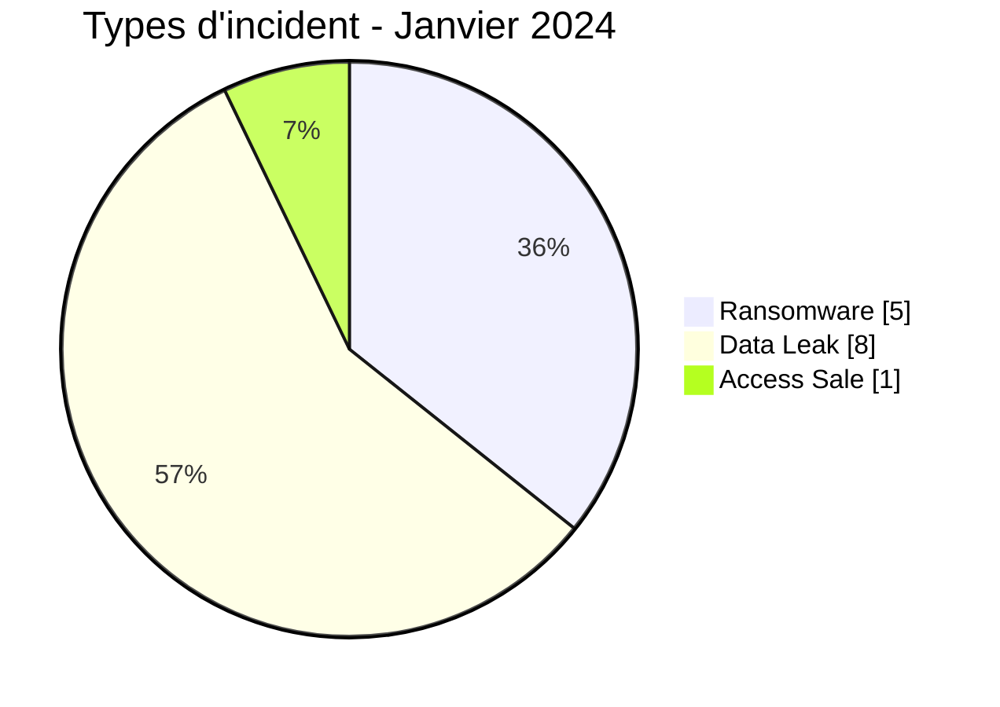
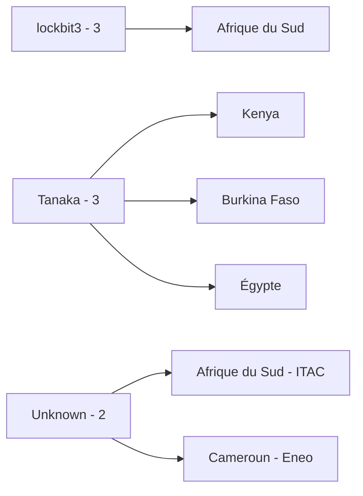
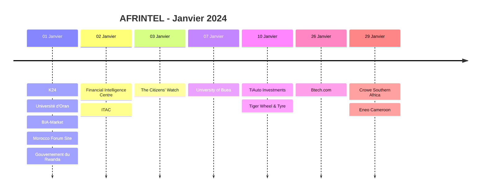

# Rapport CTI AFRINTEL - Janvier 2024

👉🏾 [English version](./README.md)

## 1. Résumé exécutif

AFRINTEL documente désormais **14 fiches incident** en janvier 2024 : **5 Ransomware**, **8 Data Leak** et **1 Access Sale**, dans **10 pays africains**. Aucun DDoS, Defacement ou Operational Fraud n'est présent dans le corpus validé de janvier.

L'Afrique du Sud compte **4 incidents**, avec l'ajout du ransomware ITAC confirmé par la victime. Le Cameroun compte désormais **2 incidents**, avec l'Access Sale de l'University of Buea et la cyberattaque confirmée contre Eneo Cameroon. Eneo est classé provisoirement dans la taxonomie Ransomware car des sources CTI secondaires utilisent cette qualification, alors que les déclarations de la victime examinées ne permettent pas de confirmer indépendamment le déploiement d'un ransomware.

👉🏾 [Voir la liste complète des victimes](./victims_FR.md)

### 1.1 Comparaison avec le mois précédent

> Aucun corpus mensuel AFRINTEL validé pour **décembre 2023** n'est disponible dans le dépôt utilisé pour cette mise à jour. Les valeurs de décembre et les évolutions restent donc `N/A`.

| Indicateur | Décembre 2023 | Janvier 2024 | Évolution |
|---|---:|---:|---:|
| Total incidents | N/A | **14** | N/A |
| Ransomware | N/A | **5** | N/A |
| Data Leak | N/A | **8** | N/A |
| Access Sale | N/A | **1** | N/A |
| DDoS | N/A | **0** | N/A |
| Defacement | N/A | **0** | N/A |
| Operational Fraud | N/A | **0** | N/A |

## 2. Méthodologie

- **Période :** 1er au 31 janvier 2024.
- **Source de vérité :** couple harmonisé `victims_FR.md` / `victims.md`.
- **Comptage :** une fiche harmonisée correspond à un incident documenté.
- **Taxonomie :** Ransomware, Data Leak, Access Sale, DDoS, Defacement, Operational Fraud.
- **Corrections rétrospectives :** les incidents découverts pendant l'audit historique du 23 août 2026 sont replacés dans leur mois réel de 2024 et conservent séparément la date de correction AFRINTEL.
- **Qualification des preuves :** confirmation victime, revendication d'acteur, échantillon publié et confirmation technique restent distincts.
- **Réserve Eneo :** la cyberattaque et la perturbation sont confirmées par la victime ; le type Ransomware est un classement provisoire de taxonomie contrôlée fondé sur des sources CTI secondaires, et non une preuve malware confirmée par la victime.

## 3. Vue globale

### 3.1 Répartition par type d'incident

| Type d'incident | Fiches | Part |
|---|---:|---:|
| Ransomware | **5** | **35,7 %** |
| Data Leak | **8** | **57,1 %** |
| Access Sale | **1** | **7,1 %** |
| DDoS | 0 | 0,0 % |
| Defacement | 0 | 0,0 % |
| Operational Fraud | 0 | 0,0 % |
| **Total** | **14** | **100 %** |

### 3.2 Répartition par pays

| Pays | Ransomware | Data Leak | Access Sale | Total |
|---|---:|---:|---:|---:|
| 🇿🇦 Afrique du Sud | 4 | 0 | 0 | **4** |
| 🇨🇲 Cameroun | 1 | 0 | 1 | **2** |
| 🇩🇿 Algérie | 0 | 1 | 0 | 1 |
| 🇧🇫 Burkina Faso | 0 | 1 | 0 | 1 |
| 🇬🇭 Ghana | 0 | 1 | 0 | 1 |
| 🇰🇪 Kenya | 0 | 1 | 0 | 1 |
| 🇲🇦 Maroc | 0 | 1 | 0 | 1 |
| 🇳🇬 Nigeria | 0 | 1 | 0 | 1 |
| 🇷🇼 Rwanda | 0 | 1 | 0 | 1 |
| 🇪🇬 Égypte | 0 | 1 | 0 | 1 |
| **Total** | **5** | **8** | **1** | **14** |

### 3.3 Répartition régionale

| Région | Ransomware | Data Leak | Access Sale | Total |
|---|---:|---:|---:|---:|
| Afrique australe | 4 | 0 | 0 | **4** |
| Afrique du Nord | 0 | 3 | 0 | **3** |
| Afrique de l'Ouest | 0 | 3 | 0 | **3** |
| Afrique de l'Est | 0 | 2 | 0 | **2** |
| Afrique centrale | 1 | 0 | 1 | **2** |
| **Total** | **5** | **8** | **1** | **14** |

### 3.4 Répartition sectorielle harmonisée

| Secteur | Fiches |
|---|---:|
| Retail / E-commerce | 4 |
| Government / Administration | 3 |
| Education / University | 2 |
| Media / Entertainment | 1 |
| Technology / IT | 1 |
| Civil Society / NGO | 1 |
| Professional / Business Services | 1 |
| Energy / Utilities | 1 |
| **Total** | **14** |

### 3.5 Acteurs / groupes

| Acteur / Groupe | Fiches |
|---|---:|
| lockbit3 | 3 |
| Tanaka | 3 |
| Unknown | 2 |
| zebi | 1 |
| r57 | 1 |
| Milad | 1 |
| DataHoes | 1 |
| X0Frankenstein | 1 |
| cnHunter | 1 |
| **Total** | **14** |

## 4. Analyse détaillée

### 4.1 Ransomware - 5 fiches

Le corpus initial de janvier contenait trois revendications `lockbit3` en Afrique du Sud. La correction historique ajoute deux fiches :

- **ITAC, Afrique du Sud :** ransomware confirmé par la victime le 2 janvier. Le chiffrement de fichiers, la perte d'accès aux systèmes et la demande de rançon sont confirmés par l'ITAC. L'accès ou l'exfiltration de données personnelles reste qualifié de possible.
- **Eneo Cameroon :** cyberattaque et perturbation opérationnelle confirmées à compter du 29 janvier. Le classement Ransomware reste uniquement un mapping provisoire AFRINTEL, car les déclarations de la victime examinées ne permettent pas de confirmer indépendamment le déploiement d'un ransomware.

### 4.2 Data Leak - 8 fiches

Les huit Data Leak restent inchangés par rapport au corpus de janvier précédemment harmonisé.

### 4.3 Access Sale - 1 fiche

L'University of Buea reste l'unique Access Sale et conserve son statut de revendication non vérifiée à faible confiance.

## 5. Principaux constats et lacunes

- Les Data Leak restent la première catégorie avec **8 fiches sur 14 (57,1 %)**.
- L'Afrique du Sud passe de 3 à **4 fiches** avec l'ajout d'ITAC.
- Le Cameroun passe de 1 à **2 fiches** avec l'ajout d'Eneo.
- Les Ransomware de janvier passent de 3 à **5 fiches**, mais Eneo conserve une réserve explicite sur la qualification ransomware.
- Les découvertes rétrospectives sont replacées dans leur mois réel tout en conservant séparément leur date de correction AFRINTEL.

## 6. Cartographie MITRE ATT&CK contextuelle

| Statut | Technique | Application |
|---|---|---|
| Observé / ITAC | T1486 - Data Encrypted for Impact | L'ITAC confirme le chiffrement de fichiers pendant l'événement ransomware. |
| Préventif / autres revendications Ransomware | T1486 - Data Encrypted for Impact | Surveillance pertinente lorsque le chiffrement n'est pas techniquement confirmé. |
| Hypothèse | T1078 - Valid Accounts | Contexte pertinent pour l'Access Sale de l'University of Buea ; validité de l'accès inconnue. |
| Contextuel | T1213 - Data from Information Repositories | Pertinent pour les échantillons structurés de bases et CMS des Data Leak. |

## 7. Recommandations

- Séparer les faits confirmés par les victimes des classifications ransomware issues de sources secondaires.
- Conserver séparément date de l'incident, date de publication initiale et date de correction AFRINTEL.
- Prioriser la résilience et la segmentation des opérateurs d'infrastructures critiques, notamment les services électriques.
- Valider l'exfiltration de données personnelles avant de convertir un incident ransomware en Data Leak supplémentaire.
- Maintenir les contrôles de cycle de vie et de déduplication lorsque des publications ultérieures concernent le même événement.

## 8. Chronologie

## 9. Conclusion

Janvier 2024 contient désormais **14 fiches incident documentées dans 10 pays africains**, réparties entre **5 Ransomware, 8 Data Leak et 1 Access Sale**.

La correction rétrospective ajoute ITAC et Eneo Cameroon tout en conservant la distinction entre effets d'incident confirmés et classification technique incertaine.

**AFRINTEL** - TLP:CLEAR
