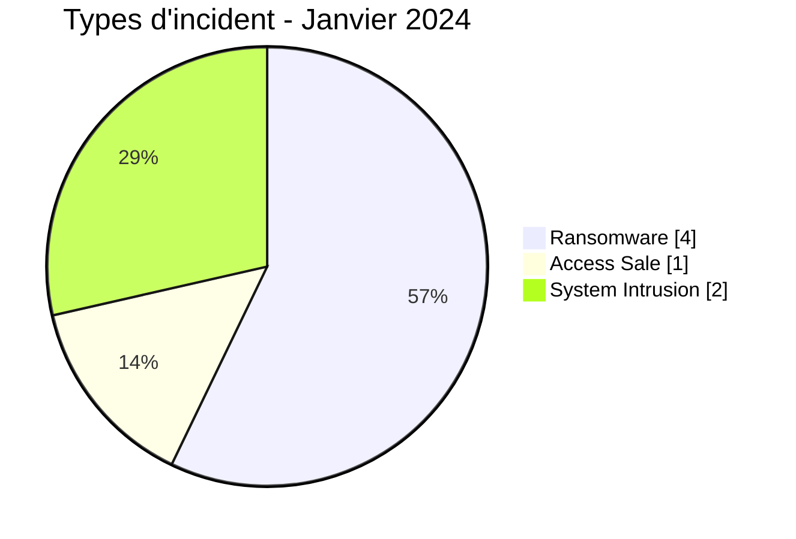

# Rapport CTI AFRINTEL - Cybermenaces en Afrique - Janvier 2024

👉🏾 [English version](./README.md)

## 1. Synthèse exécutive

En Janvier 2024, AFRINTEL retient **7 cyberincidents canoniques dans 3 pays**. Le mois est dominé par **Ransomware (4, 57,1 %)** puis **System Intrusion (2, 28,6 %)**. Les pays les plus représentés sont **Afrique du Sud (4)**, **Cameroun (2)**, **Angola (1)**. Les secteurs les plus visibles sont **Commerce / E-commerce (2)**, **Gouvernement / Administration (1)**, **Finance / Banque (1)**. Les labels acteur/groupe les plus fréquents sont `Unknown` (3), `lockbit3` (3), `cnHunter` (1). `Unknown` désigne une absence d'attribution, pas un groupe.

La maturité de preuve est répartie entre **Claim - Unverified: 4**, **Confirmed: 3**. Les claims ne sont pas convertis en confirmations sans preuve supplémentaire.

### 1.1 Étude comparative avec le mois précédent

| Indicateur | Décembre 2023 | Janvier 2024 | Évolution |
|---|---|---|---|
| Total | N/A | 7 | N/A |
| Ransomware | N/A | 4 | N/A |
| Data Leak | N/A | 0 | N/A |
| Access Sale | N/A | 1 | N/A |
| DDoS | N/A | 0 | N/A |
| Defacement | N/A | 0 | N/A |
| Account Takeover | N/A | 0 | N/A |
| System Intrusion | N/A | 2 | N/A |
| Malware | N/A | 0 | N/A |
| Operational Fraud | N/A | 0 | N/A |

### 1.2 Analyse comparative

La comparaison avec décembre 2023 n'est pas calculée : le corpus 2023 n'a pas été réaudité avec la taxonomie et les règles chronologiques utilisées ici. Afficher un pourcentage créerait une fausse précision.

## 2. Méthodologie

- Un incident canonique correspond à un événement retenu dans le millésime 2024.
- Les découvertes/republications historiques sont conservées séparément et ne gonflent pas les statistiques 2024.
- La date d'incident ou la meilleure fenêtre soutenue prime ; la date de découverte AFRINTEL reste distincte.
- Les 9 types AFRINTEL sont utilisés ; une tentative est représentée par le statut, jamais par un type `Attempted Attack`.
- Un DDoS coordonné est compté par campagne.
- Type, statut, confiance, impact, attribution et source restent distincts.

## 3. Répartition par type d'incident

| Type | Fiches | Part |
|---|---|---|
| Ransomware | 4 | 57,1 % |
| Data Leak | 0 | 0,0 % |
| Access Sale | 1 | 14,3 % |
| DDoS | 0 | 0,0 % |
| Defacement | 0 | 0,0 % |
| Account Takeover | 0 | 0,0 % |
| System Intrusion | 2 | 28,6 % |
| Malware | 0 | 0,0 % |
| Operational Fraud | 0 | 0,0 % |

## 4. Pays x type

| Pays | Total | Ransomware | Data Leak | Access Sale | DDoS | Defacement | Account Takeover | System Intrusion | Malware | Operational Fraud |
|---|---|---|---|---|---|---|---|---|---|---|
| Afrique du Sud | 4 | 4 | 0 | 0 | 0 | 0 | 0 | 0 | 0 | 0 |
| Cameroun | 2 | 0 | 0 | 1 | 0 | 0 | 0 | 1 | 0 | 0 |
| Angola | 1 | 0 | 0 | 0 | 0 | 0 | 0 | 1 | 0 | 0 |

## 5. Répartition régionale

| Région | Fiches | Part |
|---|---|---|
| Afrique australe | 5 | 71,4 % |
| Afrique centrale | 2 | 28,6 % |

## 6. Répartition sectorielle

| Secteur | Fiches | Part |
|---|---|---|
| Commerce / E-commerce | 2 | 28,6 % |
| Gouvernement / Administration | 1 | 14,3 % |
| Finance / Banque | 1 | 14,3 % |
| Éducation / Université | 1 | 14,3 % |
| Services professionnels / Business | 1 | 14,3 % |
| Énergie / Services publics | 1 | 14,3 % |

## 7. Acteurs / groupes

| Acteur / Groupe | Fiches | Part |
|---|---|---|
| Unknown | 3 | 42,9 % |
| lockbit3 | 3 | 42,9 % |
| cnHunter | 1 | 14,3 % |

## 8. Maturité des preuves

| Position de preuve | Fiches | Part |
|---|---|---|
| Claim - Unverified | 4 | 57,1 % |
| Confirmed | 3 | 42,9 % |

### Confiance

| Confiance | Fiches | Part |
|---|---|---|
| Low | 4 | 57,1 % |
| Very High | 2 | 28,6 % |
| High | 1 | 14,3 % |

## 9. Chronologie

```mermaid
timeline
    title AFRINTEL - Janvier 2024
    2 Janvier 2024 : International Trade Administration Commission of South Africa (ITAC)
- **Date de l'incident -** 2 janvier 2024
- **Date de publication initiale -** 15 avril 2024
- **Date de correction AFRINTEL -** 23 août 2026
- **Acteur / Groupe -** Unknown
- **Secteur -** Government / Administration
- **Site web -** [itac.org.za](https -//itac.org.za/)
- **Statut -** Victim Confirmed
- **Type d'incident -** Ransomware
- **Niveau de confiance -** Very High
- **Niveau d'impact -** Level 4
- **Note de preuve -** L'ITAC a officiellement confirmé une attaque ransomware. L'accès potentiel à des informations personnelles et leur éventuelle exfiltration sont mentionnés par la victime, mais restent qualifiés de possibles et non confirmés.
- **Description victime -** L'ITAC est l'autorité sud-africaine chargée de l'administration du commerce international et traite des informations concernant les employés, prestataires, importateurs, exportateurs et autres parties prenantes.
- **Analyse -** L'ITAC indique avoir subi une attaque ransomware le 2 janvier 2024. Des acteurs malveillants ont chiffré des fichiers, empêché les utilisateurs d'accéder aux systèmes et exigé une rançon. L'ITAC a arrêté les serveurs affectés, restauré des sauvegardes et lancé des travaux forensiques. La notification officielle précise également que l'attaquant a pu accéder à des informations personnelles présentes sur les serveurs et éventuellement les extraire. L'acteur, le vecteur d'accès initial, le montant de la rançon et l'étendue exacte d'une éventuelle exfiltration n'ont pas été établis publiquement dans la source examinée. L'événement ransomware est donc confirmé par la victime, tandis que l'exfiltration reste possible et non confirmée.
- **Source publique -** [Notification officielle ITAC](https -//itac.org.za/notification-of-a-personal-information-security-compromise/)

----------------------------
    6 Janvier 2024 : Banco Nacional de Angola (BNA)
- **Date de l'incident -** 6 Janvier 2024
- **Date de publication initiale / source retenue -** 17 janvier 2024
- **Date de découverte AFRINTEL -** 23 août 2026 - audit rétrospectif
- **Précision chronologique -** Date exacte de l'attaque confirmée par les sources de l'audit.
- **Acteur / Groupe -** Unknown
- **Secteur -** Finance / Banking
- **Site web -** [bna.ao](https -//www.bna.ao/)
- **Statut -** Victim Confirmed
- **Type d'incident -** System Intrusion
- **Niveau de confiance -** Very High
- **Niveau d'impact -** Level 2
- **Analyse -** La BNA a déclaré avoir subi une cyberattaque le 6 janvier 2024. L'incident a été contenu sans impact significatif annoncé sur l'infrastructure ou les données ; les accès aux infrastructures technologiques ont été contrôlés pendant la réponse. Les sources disponibles ne permettent pas d'établir un ransomware, un DDoS, une fuite de données ou une vente d'accès. AFRINTEL retient donc `System Intrusion` sans extrapoler le mécanisme d'accès.
- **Sources publiques -** [Recorded Future News](https -//therecord.media/angola-national-bank-cyberattack-mitigated) | [VerAngola](https -//www.verangola.net/va/en/012024/BankingInsurance/38523/National-Bank-of-Angola-targeted-by-computer-attack.htm) | [KonBriefing](https -//konbriefing.com/en-topics/cyber-attacks-2024.html)

----------------------------
    7 Janvier 2024 : University of Buea (UB)

- **Acteur / Groupe -** cnHunter
- **Secteur -** Education / University
- **Statut -** Claim - Unverified
- **Site web -** [ubuea.cm](https -//ubuea.cm)
- **Niveau de confiance -** Low
- **Niveau d'impact -** Level 3
- **Type d'incident -** Access Sale
- **Date de découverte -** 7 janvier 2024

- **Note de fiabilité -**
  Une publication de forum intitulée « [Admin Access] ubuea.cm », publiée le 7 janvier 2024 et modifiée le même jour, revendique un accès de niveau administrateur à une instance REDCap hébergée sur redcap.ubuea.cm, en référençant un chemin de gestionnaire d'importation/upload et un fichier externe hébergé sur un service de partage de fichiers présenté comme « preuve ». AFRINTEL n'a pas accédé au fichier de preuve référencé ni au système ciblé revendiqué. Le compte à l'origine de la publication, cnHunter, a ensuite été définitivement banni du forum pour suspicion d'arnaque, ce qui réduit fortement la fiabilité de la revendication.

- **Description -**
  L'University of Buea (UB) est une université publique située dans la région du Sud-Ouest du Cameroun, proposant des formations dans plusieurs facultés dont les sciences, les sciences de la santé, l'ingénierie, les lettres, le droit et les sciences sociales et de gestion. Les instances REDCap déployées par les universités sont généralement utilisées pour gérer des données académiques, d'enquête ou de recherche clinique.

- **Analyse -**
  La publication revendique un accès administrateur à une instance REDCap associée au domaine de l'université, marquée ultérieurement comme « Unlocked » dans une modification, mais ne fournit aucun échantillon de données visible, aucune preuve indépendamment vérifiable ni prix indiqué. Combiné au bannissement définitif ultérieur du compte pour suspicion d'arnaque, AFRINTEL traite cette publication comme une revendication non vérifiée à faible niveau de confiance. Si elle était authentique, un accès administrateur non autorisé à une instance REDCap pourrait exposer des données académiques, d'enquête ou de recherche liées à des étudiants, membres du personnel ou participants à des études ; ni l'accès ni un éventuel jeu de données sous-jacent ne sont confirmés.

----------------------------
    10 Janvier 2024 : TiAuto Investments
- **Acteur / Groupe -** lockbit3
- **Secteur -** Retail / E-commerce
- **Site web -** [tiautoinvestments.co.za](https -//www.tiautoinvestments.co.za)
- **Statut -** Claim - Unverified
- **Type d'incident -** Ransomware
- **Niveau de confiance -** Low
- **Niveau d'impact -** Level 2
- **Description victime -** TiAuto Investments est un groupe de premier plan en Afrique du Sud spécialisé dans le commerce de gros et de détail de jantes, de pneus et de produits automobiles. Fondé en 2006 et basé à Midrand, il détient des marques phares du continent telles que Tiger Wheel & Tyre et Tyres & More.

----------------------------
    10 Janvier 2024 : Tiger Wheel & Tyre
- **Acteur / Groupe -** lockbit3
- **Secteur -** Retail / E-commerce
- **Site web -** [twt.co.za](https -//twt.co.za)
- **Statut -** Claim - Unverified
- **Type d'incident -** Ransomware
- **Niveau de confiance -** Low
- **Niveau d'impact -** Level 2
- **Description victime -** Tiger Wheel & Tyre est une filiale majeure du groupe TiAuto Investments, forte de plus de 50 ans d'existence et exploitant plus de 100 centres de services à travers l'Afrique du Sud et l'Afrique australe. Elle est spécialisée dans les services de géométrie, d'équilibrage et la vente de pneumatiques toutes catégories.

----------------------------
    29 Janvier 2024 : Crowe Southern Africa
- **Acteur / Groupe -** lockbit3
- **Secteur -** Professional / Business Services
- **Site web -** [crowe.com/za](https -//www.crowe.com/za)
- **Statut -** Claim - Unverified
- **Type d'incident -** Ransomware
- **Niveau de confiance -** Low
- **Niveau d'impact -** Level 2
- **Description victime -** Crowe Southern Africa est un cabinet de services professionnels de premier plan et membre indépendant du réseau mondial Crowe Global. Établi de longue date avec des bureaux à Johannesburg, Cape Town et Stellenbosch, il fournit des services d'audit, de fiscalité, de juricomptabilité (forensics) et de conseil financier.

----------------------------
    29 Janvier 2024 : Eneo Cameroon
- **Date de l'incident -** 29 janvier 2024
- **Date de publication initiale -** 2 février 2024
- **Date de correction AFRINTEL -** 23 août 2026
- **Acteur / Groupe -** Unknown
- **Secteur -** Energy / Utilities
- **Site web -** [eneocameroon.cm](https -//eneocameroon.cm/)
- **Statut -** Victim Confirmed
- **Type d'incident -** System Intrusion
- **Niveau de confiance -** High
- **Niveau d'impact -** Level 4
- **Note de taxonomie -** La cyberattaque et la perturbation opérationnelle sont confirmées. Les déclarations de la victime examinées ne permettent pas de confirmer indépendamment un déploiement ransomware ; cette qualification reste secondaire.
- **Description victime -** Eneo Cameroon est le principal opérateur électrique du pays et exploite notamment les services de facturation ainsi que les services d'électricité prépayés et postpayés.
- **Analyse -** Eneo a confirmé qu'une cyberattaque débutée le 29 janvier 2024 avait fortement perturbé ses systèmes informatiques. Certaines applications ont été désactivées par précaution et les opérations prépayées/postpayées ont été affectées, notamment l'achat d'unités d'électricité. Les informations publiques et des évaluations africaines ultérieures corroborent l'attaque. Certaines sources CTI classent l'événement comme ransomware, mais les déclarations de la victime examinées ne fournissent pas suffisamment d'éléments techniques pour confirmer indépendamment le déploiement d'un ransomware. Les faits confirmés sont donc la cyberattaque et la perturbation opérationnelle importante ; le ransomware reste une qualification secondaire.
- **Sources publiques -** [ITWeb Africa](https -//itweb.africa/article/cameroons-power-utility-suffers-a-cyber-attack/8OKdWqDXArbqbznQ) | [OBS-CC](https -//obs-cc.org/incident/eneo-cameroon/)

----------------------------
```

## 10. Analyse CTI par type

### Ransomware - 4

**4 fiche(s) (57,1 %).** Principaux pays : Afrique du Sud (4). Les conclusions restent limitées aux éléments documentés ; le type ne permet pas d'inférer un vecteur ou un impact non observé.

### System Intrusion - 2

**2 fiche(s) (28,6 %).** Principaux pays : Angola (1), Cameroun (1). Les conclusions restent limitées aux éléments documentés ; le type ne permet pas d'inférer un vecteur ou un impact non observé.

### Access Sale - 1

**1 fiche(s) (14,3 %).** Principaux pays : Cameroun (1). Les conclusions restent limitées aux éléments documentés ; le type ne permet pas d'inférer un vecteur ou un impact non observé.

## 11. Incidents prioritaires pour revue

| Pays | Organisation | Type | Statut | Impact | Confiance |
|---|---|---|---|---|---|
| Afrique du Sud | International Trade Administration Commission of South Africa (ITAC)
- **Date de l'incident:** 2 janvier 2024
- **Date de publication initiale:** 15 avril 2024
- **Date de correction AFRINTEL:** 23 août 2026
- **Acteur / Groupe:** Unknown
- **Secteur:** Government / Administration
- **Site web:** [itac.org.za](https://itac.org.za/)
- **Statut:** Victim Confirmed
- **Type d'incident:** Ransomware
- **Niveau de confiance:** Very High
- **Niveau d'impact:** Level 4
- **Note de preuve:** L'ITAC a officiellement confirmé une attaque ransomware. L'accès potentiel à des informations personnelles et leur éventuelle exfiltration sont mentionnés par la victime, mais restent qualifiés de possibles et non confirmés.
- **Description victime:** L'ITAC est l'autorité sud-africaine chargée de l'administration du commerce international et traite des informations concernant les employés, prestataires, importateurs, exportateurs et autres parties prenantes.
- **Analyse:** L'ITAC indique avoir subi une attaque ransomware le 2 janvier 2024. Des acteurs malveillants ont chiffré des fichiers, empêché les utilisateurs d'accéder aux systèmes et exigé une rançon. L'ITAC a arrêté les serveurs affectés, restauré des sauvegardes et lancé des travaux forensiques. La notification officielle précise également que l'attaquant a pu accéder à des informations personnelles présentes sur les serveurs et éventuellement les extraire. L'acteur, le vecteur d'accès initial, le montant de la rançon et l'étendue exacte d'une éventuelle exfiltration n'ont pas été établis publiquement dans la source examinée. L'événement ransomware est donc confirmé par la victime, tandis que l'exfiltration reste possible et non confirmée.
- **Source publique:** [Notification officielle ITAC](https://itac.org.za/notification-of-a-personal-information-security-compromise/)

---------------------------- | Ransomware | Victim Confirmed | Level 4 | Very High |
| Cameroun | Eneo Cameroon
- **Date de l'incident:** 29 janvier 2024
- **Date de publication initiale:** 2 février 2024
- **Date de correction AFRINTEL:** 23 août 2026
- **Acteur / Groupe:** Unknown
- **Secteur:** Energy / Utilities
- **Site web:** [eneocameroon.cm](https://eneocameroon.cm/)
- **Statut:** Victim Confirmed
- **Type d'incident:** System Intrusion
- **Niveau de confiance:** High
- **Niveau d'impact:** Level 4
- **Note de taxonomie:** La cyberattaque et la perturbation opérationnelle sont confirmées. Les déclarations de la victime examinées ne permettent pas de confirmer indépendamment un déploiement ransomware ; cette qualification reste secondaire.
- **Description victime:** Eneo Cameroon est le principal opérateur électrique du pays et exploite notamment les services de facturation ainsi que les services d'électricité prépayés et postpayés.
- **Analyse:** Eneo a confirmé qu'une cyberattaque débutée le 29 janvier 2024 avait fortement perturbé ses systèmes informatiques. Certaines applications ont été désactivées par précaution et les opérations prépayées/postpayées ont été affectées, notamment l'achat d'unités d'électricité. Les informations publiques et des évaluations africaines ultérieures corroborent l'attaque. Certaines sources CTI classent l'événement comme ransomware, mais les déclarations de la victime examinées ne fournissent pas suffisamment d'éléments techniques pour confirmer indépendamment le déploiement d'un ransomware. Les faits confirmés sont donc la cyberattaque et la perturbation opérationnelle importante ; le ransomware reste une qualification secondaire.
- **Sources publiques:** [ITWeb Africa](https://itweb.africa/article/cameroons-power-utility-suffers-a-cyber-attack/8OKdWqDXArbqbznQ) | [OBS-CC](https://obs-cc.org/incident/eneo-cameroon/)

---------------------------- | System Intrusion | Victim Confirmed | Level 4 | High |
| Cameroun | University of Buea (UB)

- **Acteur / Groupe:** cnHunter
- **Secteur:** Education / University
- **Statut:** Claim - Unverified
- **Site web:** [ubuea.cm](https://ubuea.cm)
- **Niveau de confiance:** Low
- **Niveau d'impact:** Level 3
- **Type d'incident:** Access Sale
- **Date de découverte:** 7 janvier 2024

- **Note de fiabilité:**
  Une publication de forum intitulée « [Admin Access] ubuea.cm », publiée le 7 janvier 2024 et modifiée le même jour, revendique un accès de niveau administrateur à une instance REDCap hébergée sur redcap.ubuea.cm, en référençant un chemin de gestionnaire d'importation/upload et un fichier externe hébergé sur un service de partage de fichiers présenté comme « preuve ». AFRINTEL n'a pas accédé au fichier de preuve référencé ni au système ciblé revendiqué. Le compte à l'origine de la publication, cnHunter, a ensuite été définitivement banni du forum pour suspicion d'arnaque, ce qui réduit fortement la fiabilité de la revendication.

- **Description:**
  L'University of Buea (UB) est une université publique située dans la région du Sud-Ouest du Cameroun, proposant des formations dans plusieurs facultés dont les sciences, les sciences de la santé, l'ingénierie, les lettres, le droit et les sciences sociales et de gestion. Les instances REDCap déployées par les universités sont généralement utilisées pour gérer des données académiques, d'enquête ou de recherche clinique.

- **Analyse:**
  La publication revendique un accès administrateur à une instance REDCap associée au domaine de l'université, marquée ultérieurement comme « Unlocked » dans une modification, mais ne fournit aucun échantillon de données visible, aucune preuve indépendamment vérifiable ni prix indiqué. Combiné au bannissement définitif ultérieur du compte pour suspicion d'arnaque, AFRINTEL traite cette publication comme une revendication non vérifiée à faible niveau de confiance. Si elle était authentique, un accès administrateur non autorisé à une instance REDCap pourrait exposer des données académiques, d'enquête ou de recherche liées à des étudiants, membres du personnel ou participants à des études ; ni l'accès ni un éventuel jeu de données sous-jacent ne sont confirmés.

---------------------------- | Access Sale | Claim - Unverified | Level 3 | Low |
| Angola | Banco Nacional de Angola (BNA)
- **Date de l'incident:** 6 Janvier 2024
- **Date de publication initiale / source retenue:** 17 janvier 2024
- **Date de découverte AFRINTEL:** 23 août 2026 - audit rétrospectif
- **Précision chronologique:** Date exacte de l'attaque confirmée par les sources de l'audit.
- **Acteur / Groupe:** Unknown
- **Secteur:** Finance / Banking
- **Site web:** [bna.ao](https://www.bna.ao/)
- **Statut:** Victim Confirmed
- **Type d'incident:** System Intrusion
- **Niveau de confiance:** Very High
- **Niveau d'impact:** Level 2
- **Analyse:** La BNA a déclaré avoir subi une cyberattaque le 6 janvier 2024. L'incident a été contenu sans impact significatif annoncé sur l'infrastructure ou les données ; les accès aux infrastructures technologiques ont été contrôlés pendant la réponse. Les sources disponibles ne permettent pas d'établir un ransomware, un DDoS, une fuite de données ou une vente d'accès. AFRINTEL retient donc `System Intrusion` sans extrapoler le mécanisme d'accès.
- **Sources publiques:** [Recorded Future News](https://therecord.media/angola-national-bank-cyberattack-mitigated) | [VerAngola](https://www.verangola.net/va/en/012024/BankingInsurance/38523/National-Bank-of-Angola-targeted-by-computer-attack.htm) | [KonBriefing](https://konbriefing.com/en-topics/cyber-attacks-2024.html)

---------------------------- | System Intrusion | Victim Confirmed | Level 2 | Very High |
| Afrique du Sud | TiAuto Investments
- **Acteur / Groupe:** lockbit3
- **Secteur:** Retail / E-commerce
- **Site web:** [tiautoinvestments.co.za](https://www.tiautoinvestments.co.za)
- **Statut:** Claim - Unverified
- **Type d'incident:** Ransomware
- **Niveau de confiance:** Low
- **Niveau d'impact:** Level 2
- **Description victime:** TiAuto Investments est un groupe de premier plan en Afrique du Sud spécialisé dans le commerce de gros et de détail de jantes, de pneus et de produits automobiles. Fondé en 2006 et basé à Midrand, il détient des marques phares du continent telles que Tiger Wheel & Tyre et Tyres & More.

---------------------------- | Ransomware | Claim - Unverified | Level 2 | Low |

> Sélection structurée selon impact, statut et confiance ; ce n'est pas un classement absolu de gravité.

## 12. Intelligence gaps et corrections

- vecteur d'accès initial souvent inconnu ;
- date technique de compromission parfois différente de la date de publication ;
- volumes revendiqués rarement vérifiables intégralement ;
- attribution technique souvent limitée au compte de publication ;
- republications historiques suivies séparément.

## 13. Recommandations

- MFA résistante au phishing, PAM et moindre privilège ;
- segmentation, sauvegardes immuables et tests de restauration ;
- centralisation EDR/IAM/VPN/WAF/DNS/cloud/applications ;
- détection des exports massifs, archives inhabituelles et transferts sortants ;
- conservation séparée des dates d'incident, publication initiale, repost et découverte AFRINTEL.

## 14. Conclusion

Janvier 2024 contient **7 incidents canoniques**. La comparaison avec le mois précédent est calculée sur la même taxonomie et les mêmes règles chronologiques, sauf janvier où décembre 2023 reste `N/A` faute de réaudit homogène.

👉🏾 [Victimes canoniques](./victims_FR.md)

**AFRINTEL** - TLP:CLEAR
