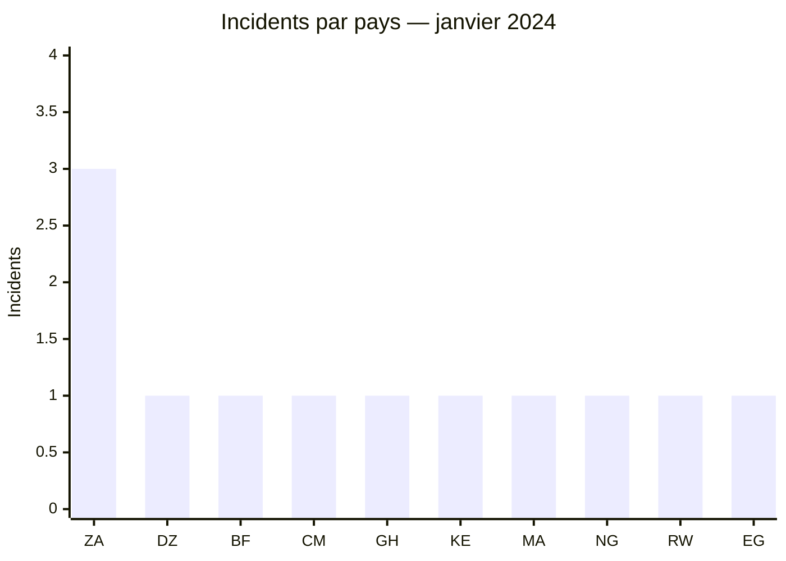
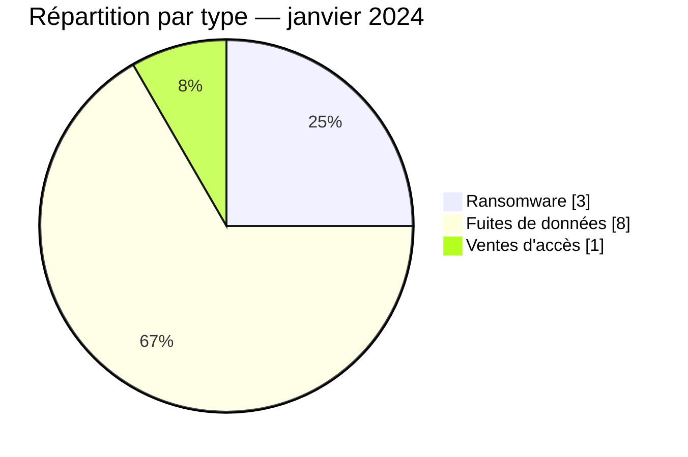

# Rapport CTI AFRINTEL — Janvier 2024

👉🏾 [English version](./README.md)

## 1. Résumé exécutif

AFRINTEL documente **12 incidents** en janvier 2024 : **3 revendications ransomware**, **8 fuites de données** et **1 vente d’accès**. L’Afrique du Sud concentre les trois publications ransomware, toutes attribuées à LockBit3. Les neuf autres incidents sont répartis entre neuf pays et concernent surtout des bases de données, des informations administratives et des comptes utilisateurs.

Le signal le plus sensible du mois vient des publications visant le **Financial Intelligence Centre du Ghana** et plusieurs domaines gouvernementaux rwandais. Les éléments disponibles renforcent la crédibilité de l’existence de données exposées, sans confirmer la méthode d’acquisition ni l’étendue complète des jeux annoncés. La vente d’accès visant l’University of Buea reste, elle, de **faible confiance** : le compte vendeur a ensuite été signalé comme suspect.

Le détail des incidents est disponible dans [victims_FR.md](./victims_FR.md).

## 2. Méthodologie

Le rapport couvre les publications découvertes ou classées entre le 1er et le 31 janvier 2024. Les sources comprennent des sites de groupes ransomware, des forums cybercriminels et des éléments OSINT conservés de manière agrégée. Une publication est comptée une fois par organisation ; sa présence dans le corpus ne vaut pas confirmation de compromission. Certaines fuites ont une date d’origine antérieure à janvier, mais sont rattachées à ce mois selon leur date de découverte documentée.

Les statistiques dérivent des **12 incidents** de [victims_FR.md](./victims_FR.md), synchronisés avec [victims.md](./victims.md).

## 3. Vue globale

| Indicateur | Valeur |
|---|---:|
| Incidents documentés | **12** |
| Pays concernés | **10** |
| Ransomware | **3** |
| Fuites de données | **8** |
| Ventes d’accès | **1** |
| Défacement | **0** |

### Classement par pays

| Pays | Incidents | Ransomware | Fuite | Vente d’accès |
|---|---:|---:|---:|---:|
| 🇿🇦 Afrique du Sud | 3 | 3 | 0 | 0 |
| 🇩🇿 Algérie | 1 | 0 | 1 | 0 |
| 🇧🇫 Burkina Faso | 1 | 0 | 1 | 0 |
| 🇨🇲 Cameroun | 1 | 0 | 0 | 1 |
| 🇬🇭 Ghana | 1 | 0 | 1 | 0 |
| 🇰🇪 Kenya | 1 | 0 | 1 | 0 |
| 🇲🇦 Maroc | 1 | 0 | 1 | 0 |
| 🇳🇬 Nigeria | 1 | 0 | 1 | 0 |
| 🇷🇼 Rwanda | 1 | 0 | 1 | 0 |
| 🇪🇬 Égypte | 1 | 0 | 1 | 0 |
| **Total** | **12** | **3** | **8** | **1** |

### Répartition régionale

| Région | Incidents | Observation |
|---|---:|---|
| Afrique australe | 3 | Trois revendications ransomware en Afrique du Sud |
| Afrique du Nord | 3 | Algérie, Maroc et Égypte |
| Afrique de l’Ouest | 3 | Burkina Faso, Ghana et Nigeria |
| Afrique de l’Est | 2 | Kenya et Rwanda |
| Afrique centrale | 1 | Vente d’accès au Cameroun |
| **Total** | **12** | |

### Répartition sectorielle normalisée

| Secteur | Incidents | Part |
|---|---:|---:|
| Commerce / E-commerce | 4 | 33,3 % |
| Gouvernement / Administration | 2 | 16,7 % |
| Éducation / Université | 2 | 16,7 % |
| Médias / Divertissement | 1 | 8,3 % |
| Technologies / Informatique | 1 | 8,3 % |
| Société civile / ONG | 1 | 8,3 % |
| Services professionnels / Entreprises | 1 | 8,3 % |
| **Total** | **12** | **100 %** |

### Acteurs les plus visibles

| Acteur ou source | Incidents | Lecture |
|---|---:|---|
| LockBit3 | 3 | Revendications ransomware en Afrique du Sud |
| Tanaka et publications associées | 3 | Fuites de données attribuées à plusieurs sources |
| Autres acteurs ou comptes | 6 | Une publication chacun |

## 4. Analyse détaillée par type d’incident

### 4.1 Ransomware

Les trois victimes sud-africaines — TiAuto Investments, Tiger Wheel & Tyre et Crowe Southern Africa — ont été publiées sous le nom de LockBit3. Aucun élément technique public exploitable ne permet, dans le corpus de janvier, d’établir l’accès initial, le périmètre chiffré ou une exfiltration effective. Le fait solide est la publication des organisations par l’acteur.

### 4.2 Fuites de données et vente d’accès

Les huit fuites couvrent des données de sites web, des comptes utilisateurs et des environnements administratifs. Les échantillons observés soutiennent l’existence de structures de données plausibles, mais leurs volumes complets restent revendiqués. La publication visant le Financial Intelligence Centre du Ghana présente l’impact potentiel le plus élevé en raison de la nature de l’organisme.

La vente d’un accès administrateur à une instance REDCap de l’University of Buea est conservée séparément. L’accès n’a pas été testé et sa validité demeure inconnue.

## 5. Impact sectoriel

Le commerce et l’e-commerce arrivent en tête, en partie à cause de publications concernant des plateformes ou distributeurs déjà exposés avant janvier. Les secteurs gouvernemental et éducatif présentent moins d’incidents, mais une sensibilité supérieure : données administratives, informations d’étudiants et accès à des applications institutionnelles. Cette différence justifie de ne pas confondre fréquence et criticité.

## 6. Profil des acteurs et évaluation du risque

| Pays ou périmètre | Niveau | Justification |
|---|---|---|
| 🇿🇦 Afrique du Sud | 🔴 Élevé | Concentration de trois revendications ransomware |
| 🇬🇭 Ghana | 🔴 Élevé | Publication visant un organisme de renseignement financier |
| 🇷🇼 Rwanda | 🔴 Élevé | Données attribuées à plusieurs domaines gouvernementaux |
| 🇨🇲 Cameroun | 🟠 Moyen | Vente d’accès non validée et de faible confiance |
| Autres pays | 🟡 Faible à moyen | Une publication par pays, portée variable |

## 7. Tendances et lacunes de renseignement

- **Observé — confiance élevée :** le corpus est dominé par les fuites et ventes d’accès, qui représentent 9 incidents sur 12.
- **Observé — confiance élevée :** les trois revendications ransomware sont concentrées en Afrique du Sud et associées à LockBit3.
- **Lacune prioritaire :** aucun rapport DFIR public n’a été identifié dans les sources consultées pour déterminer l’accès initial ou confirmer l’étendue des incidents ransomware.
- **Lacune prioritaire :** les volumes complets des bases annoncées ne peuvent pas être déduits des seuls extraits observés.
- **Besoin de collecte :** rechercher des confirmations des organisations, des notifications réglementaires et de nouvelles publications permettant de distinguer données anciennes, republications et incidents contemporains.

## 8. Cartographie MITRE ATT&CK contextuelle

| Statut analytique | Phase | Technique | Application au corpus |
|---|---|---|---|
| Préventif | Impact | T1486 — Data Encrypted for Impact | Surveillance pertinente pour les trois revendications ransomware ; chiffrement non confirmé par télémétrie publique |
| Hypothèse | Initial Access / Persistence | T1078 — Valid Accounts | Scénario plausible pour la vente d’accès à l’University of Buea ; validité de l’accès inconnue |
| Préventif | Exfiltration | T1567 — Exfiltration Over Web Service | Contrôle défensif adapté aux incidents de fuite ; canal d’exfiltration non observé |

## 9. Recommandations

- **Administrations :** inventorier les applications exposées, revoir les comptes privilégiés et préparer les procédures de notification.
- **Établissements d’enseignement :** imposer une MFA résistante au phishing pour les administrateurs et examiner les accès aux applications de recherche.
- **Commerce et médias :** vérifier les exports de bases, les comptes CMS et les secrets applicatifs.
- **Organisations ciblées par ransomware :** tester une restauration complète depuis des sauvegardes isolées et immuables.

## 10. Recommandations SOC et tactiques

| Qualification | Action |
|---|---|
| **Observé** | Rechercher dans les journaux IAM, VPN et applications les comptes liés aux environnements cités dans les publications ; aucune TTP d’intrusion n’est confirmée publiquement. |
| **Hypothèse** | Examiner les authentifications administratives inhabituelles autour des dates de publication, notamment pour REDCap et les CMS exposés. |
| **Préventif** | Détecter les créations d’archives volumineuses, les exports SQL inhabituels, les désactivations de sauvegardes et les extensions de fichiers modifiées en masse. |
| **Préventif** | Corréler EDR, WAF, IAM, DNS et proxy afin d’identifier une exfiltration ou une activité de chiffrement qui ne serait pas visible dans les sources OSINT. |

## 11. Recommandations stratégiques

| Priorité | Qualification | Mesure |
|---:|---|---|
| 1 | **Observé** | Réduire l’exposition des applications administratives et éducatives citées dans le corpus. |
| 2 | **Hypothèse** | Traiter la vente d’accès comme un risque d’usage de comptes valides, sans présumer que l’accès fonctionne encore. |
| 3 | **Préventif** | Généraliser MFA résistante au phishing, rotation des secrets et revue trimestrielle des comptes privilégiés. |
| 4 | **Préventif** | Maintenir des sauvegardes critiques isolées, immuables et testées par restauration. |

## 12. Conclusion

Janvier 2024 oppose deux profils distincts : une concentration ransomware limitée à l’Afrique du Sud et une circulation beaucoup plus diffuse de données et d’accès. Les publications administratives sont les plus sensibles, mais les informations disponibles ne permettent pas de transformer ces revendications en compromissions confirmées. La priorité consiste à valider les expositions, réduire les accès externes et conserver une capacité de restauration indépendante.

**AFRINTEL — TLP:CLEAR**
[Dépôt AFRINTEL](https://github.com/Hatchepsoute/AFRINTEL)
