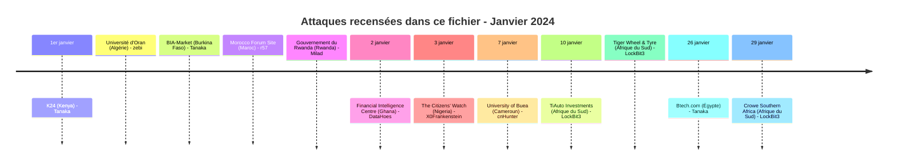
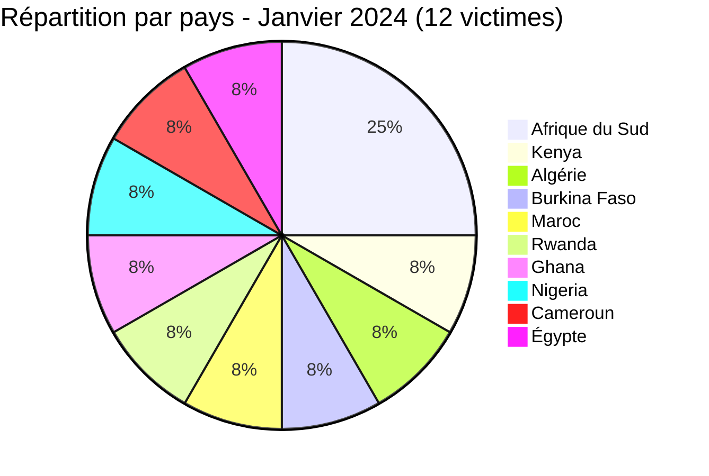

[](https://github.com/Hatchepsoute/AFRINTEL)


# Rapport CTI - Janvier 2024 : LockBit3 ouvre l'année contre les entreprises sud-africaines

👉🏾 [English version available here](./README.md)

### 1. Résumé exécutif

En janvier 2024, l'Afrique a enregistré **12 victimes** documentées dans ce fichier : **3 victimes de ransomware**, toutes localisées en **Afrique du Sud** et toutes revendiquées par le groupe **LockBit3** ; **8 revendications de fuite de données** réparties entre le **Kenya, l'Algérie, le Burkina Faso, le Maroc, le Rwanda, le Ghana, le Nigeria et l'Égypte** ; et **1 revendication de vente d'accès** au **Cameroun**. Plusieurs entrées de fuite de données concernent des publications dont la date de fuite ou de publication source est antérieure à janvier 2024 ; AFRINTEL les classe dans ce fichier mensuel selon leur date de découverte ou la période de détection demandée, tout en conservant la date de fuite d'origine dans chaque fiche. Le mois est marqué par une concentration des attaques LockBit3 sur le secteur privé sud-africain, distribution automobile et services professionnels, ainsi que par un large éventail de revendications de fuite de données et de vente d'accès distinctes touchant les secteurs de l'éducation, du gouvernement, de la société civile, des médias, du commerce de détail et de la technologie dans neuf autres pays.

👉🏾 [Liste des victimes](./victims_FR.md)

**Chiffres clés :**
- 🔹 **12 victimes** identifiées
- 🔹 **8 sources** : LockBit3 (3), Tanaka (3), zebi (1), r57 (1), Milad (1), DataHoes (1), X0Frankenstein (1), cnHunter (1)
- 🔹 **Pays touchés** : Afrique du Sud (3), Kenya (1), Algérie (1), Burkina Faso (1), Maroc (1), Rwanda (1), Ghana (1), Nigeria (1), Cameroun (1), Égypte (1)
- 🔹 **Secteurs** : Automobile & Retail (2), Éducation / Enseignement supérieur (2), Audit / Conseil Fiscal (1), Gouvernement / Renseignement financier (1), Gouvernement / Administration publique (1), E-commerce / Retail (1), Médias / Audiovisuel (1), Technologie / Communauté en ligne (1), Société civile / Gouvernance / Organisation à but non lucratif (1), Commerce de détail / Électronique (1)
- 🔹 **Types d'incident** : Ransomware (3), Fuite de données (8), Vente d'accès (1)
### Vue agrégée mensuelle de l’exposition

La vue CTI mensuelle regroupe les fuites de données et les ventes d’accès sous **exposition des données** : **9 fiches** (75.0% du corpus mensuel). Les fiches sources restent la référence ; une vente d’accès ne prouve pas à elle seule l’exfiltration de données.


---

### 2. Chronologie des attaques

| Date de découverte | Victime | Pays | Acteur / Groupe | Type | Date de la fuite |
|---------------------|---------|------|------------------|------|-------------------|
| 1er janvier 2024 | Kenya News Broadcasting Company (K24) | Kenya | Tanaka | Fuite de données (échantillon SQL) | 2023 |
| 1er janvier 2024 | Université d'Oran | Algérie | zebi | Fuite de données (republication) | 12 septembre 2023 |
| 1er janvier 2024 | BIA-Market | Burkina Faso | Tanaka | Fuite de données (échantillon SQL) | 2023 |
| 1er janvier 2024 | Morocco Forum Site | Maroc | r57 | Fuite de données (revendication) | Publication source du 29 septembre 2023 |
| 1er janvier 2024 | Gouvernement du Rwanda (plusieurs domaines) | Rwanda | Milad | Fuite de données (revendication) | Publication source du 17 juin 2023 |
| 2 janvier 2024 | Financial Intelligence Centre (FIC) | Ghana | DataHoes | Fuite de données | 3 décembre 2023 |
| 3 janvier 2024 | The Citizens' Watch | Nigeria | X0Frankenstein | Fuite de données (revendication) | 2023 |
| 7 janvier 2024 | University of Buea (UB) | Cameroun | cnHunter | Vente d'accès (revendication non vérifiée) | - |
| 10 janvier 2024 | TiAuto Investments | Afrique du Sud | LockBit3 | Ransomware | - |
| 10 janvier 2024 | Tiger Wheel & Tyre | Afrique du Sud | LockBit3 | Ransomware | - |
| 26 janvier 2024 | Btech.com | Égypte | Tanaka | Fuite de données (échantillon CSV) | 2023 (publication source du 23 février 2023) |
| 29 janvier 2024 | Crowe Southern Africa | Afrique du Sud | LockBit3 | Ransomware | - |



---

### 3. Analyse des victimes

#### 3.1 Par pays

| Pays | Nombre d'attaques |
|------|-----------------|
| Afrique du Sud | 3 |
| Kenya | 1 |
| Algérie | 1 |
| Burkina Faso | 1 |
| Maroc | 1 |
| Rwanda | 1 |
| Ghana | 1 |
| Nigeria | 1 |
| Cameroun | 1 |
| Égypte | 1 |



#### 3.2 Par secteur

| Secteur | Nombre |
|---------|--------|
| Automobile & Retail | 2 |
| Éducation / Enseignement supérieur | 2 |
| Audit / Conseil Fiscal | 1 |
| Gouvernement / Renseignement financier | 1 |
| Gouvernement / Administration publique | 1 |
| E-commerce / Retail | 1 |
| Médias / Audiovisuel | 1 |
| Technologie / Communauté en ligne | 1 |
| Société civile / Organisation à but non lucratif | 1 |
| Commerce de détail / Électronique | 1 |

```mermaid
xychart-beta
    title "Secteurs ciblés - Janvier 2024"
    x-axis ["Automobile & Retail", "Éducation / Enseignement supérieur", "Audit / Conseil Fiscal", "Gouvernement / Renseignement financier", "Gouvernement / Administration publique", "E-commerce / Retail", "Médias / Audiovisuel", "Technologie / Communauté en ligne", "Société civile / Non-lucratif", "Commerce détail / Électronique"]
    y-axis "Nombre d'attaques" 0 to 3
    bar [2, 2, 1, 1, 1, 1, 1, 1, 1, 1]
```

#### 3.3 Groupes ransomware

| Groupe ransomware | Nombre d'attaques |
|-----------------|-----------------|
| LockBit3 | 3 |

#### 3.4 Sources de fuite de données et de vente d'accès

| Source | Nombre de revendications |
|--------|--------------------------|
| Tanaka | 3 |
| zebi | 1 |
| r57 | 1 |
| Milad | 1 |
| DataHoes | 1 |
| X0Frankenstein | 1 |
| cnHunter | 1 |

---

### 4. Points d'attention

- **Monopole de LockBit3 sur les revendications ransomware** : les 3 revendications ransomware de janvier 2024 sont attribuées à LockBit3, confirmant sa position dominante sur le continent africain en début d'année.
- **Concentration sur l'Afrique du Sud** : les revendications ransomware de janvier 2024 sont toutes localisées en Afrique du Sud, suggérant une prospection ciblée ou une exploitation opportuniste des infrastructures sud-africaines.
- **Secteur automobile visé** : TiAuto Investments et sa filiale Tiger Wheel & Tyre sont attaquées le même jour (10 janvier), probablement via une infrastructure partagée ou une compromission de la chaîne d'approvisionnement.
- **Services professionnels** : Crowe Southern Africa (audit, fiscalité) illustre l'intérêt des acteurs malveillants pour les entreprises détenant des données financières sensibles sur de multiples clients.
- **Revendication algérienne** : l'entrée Université d'Oran, découverte le 1er janvier 2024, correspond à une republication sur un forum cybercriminel, attribuée à l'acteur `zebi`. L'échantillon de données a été initialement divulgué le 12 septembre 2023. Elle n'est pas attribuée à LockBit3 et n'est pas une revendication ransomware ; elle est comptabilisée séparément comme une fuite de données.
- **Revendication burkinabè** : l’entrée BIA-Market, classée en janvier 2024 comme période de détection demandée, concerne un échantillon SQL publié sur SQL.ticanalyse.org le 23 juin 2023. La source identifie BIA-Market et des filtres liés au Burkina Faso, mais ne confirme pas indépendamment le jeu de données ni la compromission.
- **Revendication ghanéenne** : l'entrée Financial Intelligence Centre (FIC), découverte le 2 janvier 2024, correspond à une publication du compte de forum `DataHoes` décrivant une extraction de documents internes RH, de paie et financiers, que l'acteur situe au 3 décembre 2023. Ce cas est enregistré comme en cours d'investigation, n'est pas attribué à un groupe ransomware, et est comptabilisé séparément comme une fuite de données visant l'unité nationale de renseignement financier du Ghana.
- **Revendication marocaine** : l'entrée Morocco Forum Site, découverte le 1er janvier 2024, correspond à une revendication de l'acteur malveillant `r57` sur un forum cybercriminel, annonçant un échantillon issu d'un jeu de données revendiqué de 180 000 enregistrements pour 50 dollars américains. La publication source est antérieure à janvier 2024 (29 septembre 2023) ; la propriété du forum et l'authenticité du jeu de données ne sont pas confirmées de manière indépendante.
- **Revendication rwandaise** : l'entrée Gouvernement du Rwanda, découverte le 1er janvier 2024, correspond à une revendication de l'acteur malveillant `Milad` couvrant quatre domaines gouvernementaux, dont des organismes liés à la mémoire du génocide et à la réconciliation nationale. Le compte à l'origine de la publication est désormais affiché comme banni. Une incohérence dans l'attribution du CMS (déclaré « Custom » mais structurellement proche de TYPO3) limite la confiance d'AFRINTEL ; la revendication reste non vérifiée au-delà de l'échantillon visible.
- **Revendication nigériane** : l'entrée The Citizens' Watch, découverte le 3 janvier 2024, correspond à une revendication de l'acteur malveillant `X0Frankenstein` visant la plateforme de suivi des promesses d'une organisation panafricaine de civic-tech à but non lucratif. L'échantillon visible mélange plusieurs structures de table distinctes ; AFRINTEL ne peut pas confirmer indépendamment l'origine de chaque segment.
- **Revendication camerounaise** : l'entrée University of Buea, découverte le 7 janvier 2024, correspond à une revendication de l'acteur malveillant `cnHunter` d'un accès administrateur à une instance REDCap. Le compte à l'origine de la publication a ensuite été définitivement banni pour suspicion d'arnaque, ce qui réduit fortement la fiabilité ; AFRINTEL classe cette revendication de vente d'accès comme non vérifiée et à faible confiance.
- **Revendication égyptienne** : l'entrée Btech.com, découverte le 26 janvier 2024, correspond à une revendication de l'acteur `Tanaka` d'un export CSV contenant des enregistrements clients avec noms, adresses et possibles numéros d'identification nationale égyptiens. La cohérence de l'échantillon appuie un niveau de confiance plus élevé, bien que le volume total revendiqué ne soit pas vérifié de manière indépendante.

---

```mermaid
xychart-beta
    title "Évolution mensuelle des attaques - Début 2024"
    x-axis ["Jan"]
    y-axis "Nombre d'attaques" 0 to 12
    bar [12]
```

### 5. Recommandations

| Domaine | Action recommandée |
|---------|--------------------|
| Distribution automobile & retail | Auditer les accès RDP/VPN, imposer le MFA, surveiller les mouvements latéraux. |
| Services professionnels (audit, fiscal) | Chiffrer les données clients, segmenter les serveurs de fichiers, vérifier les accès tiers. |
| Toutes organisations | Surveiller les TTPs de LockBit3 : phishing, credential stuffing, exploitation RDP exposé. |
| E-commerce / retail | BIA-Market et Btech.com devraient vérifier les revendications, examiner les journaux applicatifs et de base de données, faire pivoter les identifiants potentiellement exposés et invalider les sessions ou clés d'activation si la fuite est confirmée. |
| Éducation / enseignement supérieur | Identifier les établissements et applications potentiellement concernés, vérifier les journaux d'authentification et d'accès, réinitialiser les comptes exposés et rechercher toute réutilisation des jeux de données de l'Université d'Oran et de l'University of Buea dans d'autres publications. |
| Gouvernement / renseignement financier | Le FIC devrait vérifier si l'extraction décrite provient de ses propres systèmes, examiner les journaux d'accès autour du 3 décembre 2023, et évaluer l'exposition des données bancaires, de paie et RH mentionnées dans la publication. |
| Gouvernement / administration publique | Les institutions rwandaises concernées devraient vérifier les identifiants d'administration backend revendiqués, faire pivoter tout mot de passe exposé et examiner les journaux d'accès au CMS des domaines concernés. |
| Société civile / non-profit | The Citizens' Watch devrait vérifier l'export de base de données revendiqué, faire pivoter les identifiants des comptes administrateurs et informer les inscrits dont les données personnelles pourraient être exposées. |
| Médias / audiovisuel | K24 devrait examiner les comptes administrateurs WordPress et la configuration des extensions, et surveiller le domaine contre toute modification non autorisée. |
| Technologie / communauté en ligne | L'exploitant de la plateforme de forum marocaine revendiquée, une fois identifié, devrait évaluer l'exposition des identifiants de comptes et alerter les utilisateurs sur les risques de phishing et de réutilisation d'identifiants. |

---

*Rapport généré à partir des données OSINT AFRINTEL. Diffusion libre (TLP:CLEAR)*
