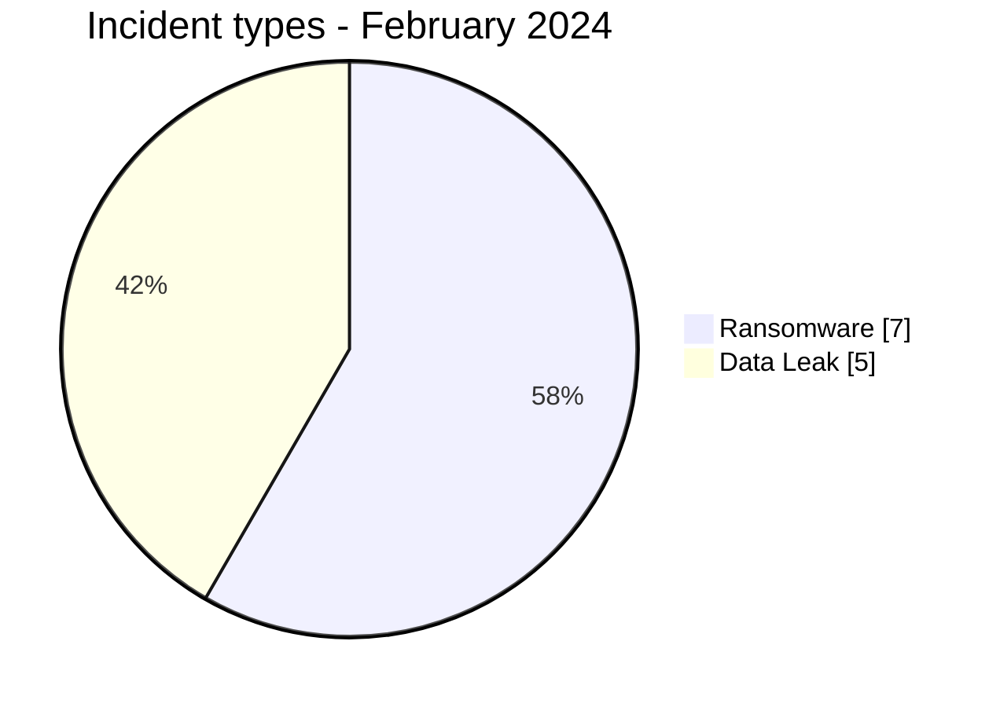
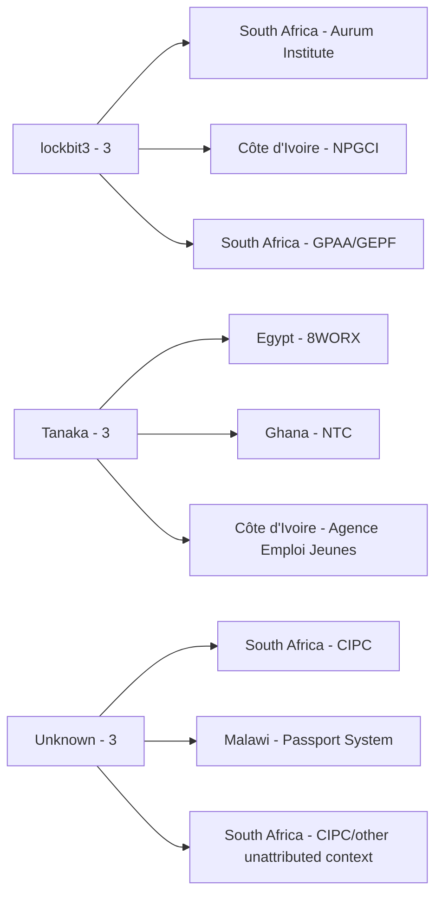
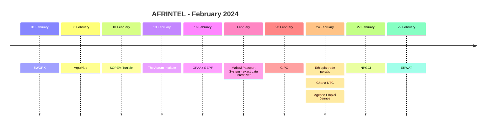

# AFRINTEL CTI Report - February 2024

👉🏾 [Version française](./README_FR.md)

## 1. Executive summary

AFRINTEL now documents **12 incident records** in February 2024: **7 Ransomware** and **5 Data Leak**, across **7 African countries**. No Access Sale, DDoS, Defacement or Operational Fraud record is present in the corrected February corpus.

This retrospective update adds three previously missing records: **GPAA/GEPF**, **CIPC** and the **Malawi passport-issuance system**. GPAA/GEPF is a victim-confirmed ransomware and personal-data compromise. CIPC is recorded primarily as Data Leak with extortion and defacement as secondary effects. Malawi is mapped provisionally to Ransomware because the government reported a cybersecurity breach and ransom demand, while the exact technical root cause remains contested.

👉🏾 [View the full victim list](./victims.md)

### 1.1 Month-over-month comparison

| Indicator | January 2024 | February 2024 | Change |
|---|---:|---:|---:|
| Total incidents | 14 | **12** | **-2 (-14.3%)** |
| Ransomware | 5 | **7** | **+2 (+40.0%)** |
| Data Leak | 8 | **5** | **-3 (-37.5%)** |
| Access Sale | 1 | **0** | **-1 (-100.0%)** |
| DDoS | 0 | **0** | Stable |
| Defacement | 0 | **0** | Stable |
| Operational Fraud | 0 | **0** | Stable |

The corrected comparison is materially different from the earlier 12-to-9 comparison. February remains lower in total volume than January, but only by **14.3%**, while Ransomware increases from 5 to 7.

## 2. Methodology

- **Period:** 1-29 February 2024.
- **Source of truth:** harmonized `victims_FR.md` / `victims.md`.
- **Counting:** one harmonized card equals one documented incident record.
- **Taxonomy:** Ransomware, Data Leak, Access Sale, DDoS, Defacement, Operational Fraud.
- **Retrospective corrections:** incidents identified during the 23 August 2026 historical audit are assigned to their real 2024 incident month and retain a separate AFRINTEL correction date.
- **GPAA/GEPF:** primary type Ransomware; confirmed personal-data compromise remains an effect of the same incident, not a second incident.
- **CIPC:** primary type Data Leak; extortion and defacement are secondary effects.
- **Malawi passport system:** provisional Ransomware mapping; breach and disruption are government-confirmed, while exact technical ransomware deployment remains contested.

## 3. Global overview

### 3.1 Incident-type distribution

| Incident type | Records | Share |
|---|---:|---:|
| Ransomware | **7** | **58.3%** |
| Data Leak | **5** | **41.7%** |
| Access Sale | 0 | 0.0% |
| DDoS | 0 | 0.0% |
| Defacement | 0 | 0.0% |
| Operational Fraud | 0 | 0.0% |
| **Total** | **12** | **100%** |

### 3.2 Country distribution

| Country | Ransomware | Data Leak | Total |
|---|---:|---:|---:|
| 🇿🇦 South Africa | 3 | 1 | **4** |
| 🇪🇬 Egypt | 1 | 1 | 2 |
| 🇨🇮 Côte d'Ivoire | 1 | 1 | 2 |
| 🇬🇭 Ghana | 0 | 1 | 1 |
| 🇹🇳 Tunisia | 1 | 0 | 1 |
| 🇪🇹 Ethiopia | 0 | 1 | 1 |
| 🇲🇼 Malawi | 1 | 0 | 1 |
| **Total** | **7** | **5** | **12** |

### 3.3 Regional distribution

| Region | Ransomware | Data Leak | Total |
|---|---:|---:|---:|
| Southern Africa | 4 | 1 | **5** |
| North Africa | 2 | 1 | **3** |
| West Africa | 1 | 2 | **3** |
| East Africa | 0 | 1 | **1** |
| Central Africa | 0 | 0 | **0** |
| **Total** | **7** | **5** | **12** |

### 3.4 Harmonized sector distribution

| Sector | Records |
|---|---:|
| Government / Administration | **6** |
| Technology / IT | 2 |
| Manufacturing / Industry | 2 |
| Healthcare / Medical | 1 |
| Water / Utilities | 1 |
| **Total** | **12** |

### 3.5 Actors / groups

| Actor / Group | Records |
|---|---:|
| lockbit3 | **3** |
| Tanaka | **3** |
| Unknown | **3** |
| medusa | 1 |
| hunters | 1 |
| ThreatSec | 1 |
| dragonforce | 1 |

> Actor totals can exceed the number of unique actor labels but not the incident count; `Unknown` represents unattributed records.

## 4. Detailed analysis

### 4.1 Ransomware - 7 records

The corrected February corpus contains seven Ransomware records.

The most significant retrospective addition is **GPAA/GEPF**, where the ransomware event and access to approximately **168,000 data-subject records** are victim-confirmed. The additional Malawi passport-system record carries an explicit qualification: the government confirmed a cybersecurity breach and ransom demand, but technical ransomware deployment remains contested.

### 4.2 Data Leak - 5 records

The corrected Data Leak corpus adds **CIPC** to the four previously documented cases. CIPC officially reported unauthorized access and exposure of personal information. Extortion threats and e-Services defacement are preserved as secondary effects instead of creating additional incident records.

### 4.3 Evidence qualification

The corrected February dataset deliberately separates:
- victim-confirmed facts;
- threat-actor attribution;
- secondary effects;
- provisional taxonomy mappings;
- claimed volumes versus confirmed affected records.

## 5. Key findings and intelligence gaps

- February rises from the previously documented **9 records to 12** after retrospective correction.
- South Africa becomes the most represented country with **4 records**.
- Government / Administration becomes the dominant sector with **6 of 12 records**.
- Ransomware represents **58.3%** of the corrected corpus.
- GPAA/GEPF materially increases the month's confirmed impact through the approximately 168,000 affected data-subject records.
- Malawi remains analytically sensitive because the disruption and government breach declaration are confirmed while the technical root cause remains disputed.

## 6. Contextual MITRE ATT&CK mapping

| Status | Technique | Application |
|---|---|---|
| Observed / confirmed ransomware context | T1486 - Data Encrypted for Impact | Directly relevant to victim-confirmed ransomware cases such as GPAA/GEPF; not automatically extended to every claim. |
| Contextual | T1005 - Data from Local System | Relevant to locally exposed files and structured data. |
| Contextual | T1213 - Data from Information Repositories | Relevant to database and administrative repository exposures. |
| Preventive | T1567 - Exfiltration Over Web Service | Defensive monitoring context where an exfiltration channel is not publicly established. |

## 7. Recommendations

- Treat GPAA/GEPF confirmed impact separately from broader LockBit publication claims.
- Keep CIPC as one multi-effect incident, not separate Data Leak and Defacement incidents.
- Preserve the Malawi technical-dispute note and avoid upgrading the ransomware classification without primary technical evidence.
- Prioritize public-sector privileged access, identity protection and database-export monitoring.
- Maintain separate incident, publication and AFRINTEL correction dates for retrospective additions.

## 8. Timeline

## 9. Conclusion

February 2024 now contains **12 documented incident records across 7 African countries**, comprising **7 Ransomware and 5 Data Leak**.

Compared with the corrected January baseline of 14 incidents, February decreases by **14.3%**, while Ransomware increases by **40.0%** and Data Leak decreases by **37.5%**.

**AFRINTEL** - TLP:CLEAR
