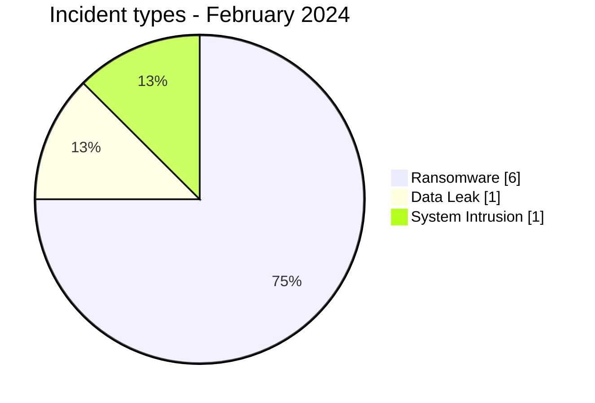

# AFRINTEL CTI Report - Cyber Threats in Africa - February 2024

👉🏾 [Version française](./README_FR.md)

## 1. Executive summary

In February 2024, AFRINTEL retains **8 canonical cyber incidents across 5 countries**. The month is led by **Ransomware (6, 75.0%)** followed by **Data Leak (1, 12.5%)**. Leading countries are **South Africa (4)**, **Egypt (1)**, **Tunisia (1)**. Leading sectors are **Government / Administration (3)**, **Manufacturing / Industry (2)**, **Technology / IT (1)**. Most frequent actor/group labels are `lockbit3` (3), `Unknown` (2), `medusa` (1). `Unknown` means missing attribution, not an actor.

### 1.1 Comparative study - January vs February 2024

> This comparison uses the **corrected January 2024 baseline of 8 canonical incidents**, including the Daeyang University Data Leak retrospectively added to 25 January 2024. February remains at **8 canonical incidents**.

#### 1.1.1 Overall volume and incident-type evolution

| Indicator | January 2024 | February 2024 | Change |
|---|---:|---:|---:|
| Total | **8** | **8** | **Stable (0.0%)** |
| Ransomware | 4 | 6 | **+2 (+50.0%)** |
| Data Leak | 1 | 1 | **Stable** |
| Access Sale | 1 | 0 | **-1 (-100.0%)** |
| DDoS | 0 | 0 | **Stable** |
| Defacement | 0 | 0 | **Stable** |
| Account Takeover | 0 | 0 | **Stable** |
| System Intrusion | 2 | 1 | **-1 (-50.0%)** |
| Malware | 0 | 0 | **Stable** |
| Operational Fraud | 0 | 0 | **Stable** |

The documented monthly volume is therefore **stable at 8 incidents**, but the internal composition changes materially. Ransomware rises from **4 to 6 records**, increasing its share from **50.0% to 75.0%**. Data Leak remains stable at one record, while Access Sale disappears and System Intrusion falls from two records to one.

```mermaid
xychart-beta
    title "Incident-type comparison - January vs February 2024"
    x-axis ["Ransomware", "Data Leak", "Access Sale", "System Intrusion"]
    y-axis "Incidents" 0 --> 6
    bar [4, 1, 1, 2]
    bar [6, 1, 0, 1]
```

**Series legend:** first series = January 2024 | second series = February 2024.

#### 1.1.2 Geographic evolution

January covers **4 countries**, compared with **5 in February**.

- **January:** South Africa (4), Cameroon (2), Angola (1), Malawi (1).
- **February:** South Africa (4), Egypt (1), Tunisia (1), Ivory Coast (1), Malawi (1).

South Africa remains the most represented country in both months with **4 incidents (50.0%)**. Cameroon and Angola disappear from the February corpus, while Egypt, Tunisia and Ivory Coast appear.

| Region | January 2024 | February 2024 |
|---|---:|---:|
| Southern Africa | 6 (75.0%) | 5 (62.5%) |
| Central Africa | 2 (25.0%) | 0 |
| North Africa | 0 | 2 (25.0%) |
| West Africa | 0 | 1 (12.5%) |

February is therefore geographically more dispersed, with the corpus extending from Southern Africa into North and West Africa.

#### 1.1.3 Sector evolution

| Sector signal | January 2024 | February 2024 | Reading |
|---|---:|---:|---|
| Retail / E-commerce | 2 | 0 | Lower visibility in February |
| Education / University | 2 | 0 | Lower visibility in February |
| Government / Administration | 1 | 3 | **+2; becomes leading sector** |
| Manufacturing / Industry | 0 | 2 | **Newly prominent** |
| Finance / Banking | 1 | 0 | No February record |
| Healthcare / Medical | 0 | 1 | Appears in February |
| Water / Utilities | 0 | 1 | Appears in February |

January was led by **Retail / E-commerce** and **Education / University**, with two records each. February shifts toward **Government / Administration (3)** and **Manufacturing / Industry (2)**.

#### 1.1.4 Actor / group visibility

- **January:** `Unknown` (3), `lockbit3` (3), `cnHunter` (1), `X0Frankenstein` (1).
- **February:** `lockbit3` (3), `Unknown` (2), `medusa` (1), `hunters` (1), `dragonforce` (1).

`lockbit3` remains stable at **3 records**. `Unknown` decreases from 3 to 2. The remaining actor labels change completely between the two months, illustrating why monthly actor rankings should be treated as visibility indicators rather than stable prevalence measures.

#### 1.1.5 Evidence maturity

| Evidence position | January 2024 | February 2024 |
|---|---:|---:|
| Claim - Unverified | 4 (50.0%) | 5 (62.5%) |
| Confirmed | 3 (37.5%) | 3 (37.5%) |
| Claim - Data Sample Published | 1 (12.5%) | 0 |
| **Total** | **8** | **8** |

The number of confirmed incidents remains **stable at three**, but February contains a higher proportion of unverified claims. January additionally contains one sample-backed Data Leak, Daeyang University.

#### 1.1.6 CTI assessment

Five comparative signals stand out:

1. **Overall volume is stable:** 8 incidents in both months.
2. **Ransomware becomes more dominant:** its share rises from 50.0% to 75.0%.
3. **Geographic dispersion increases:** from 4 to 5 countries and from 2 to 3 represented regions.
4. **Public-sector visibility rises sharply:** Government / Administration increases from 1 to 3 records.
5. **Evidence maturity weakens slightly:** unverified claims rise from 50.0% to 62.5%, while confirmed incidents remain unchanged.

For SOC teams, the February profile supports prioritizing **ransomware resilience, privileged-access controls, backup integrity, public-service continuity, and monitoring for unauthorized access to sensitive citizen or employee data**. For CTI teams, the comparison shows that stable incident volume can still conceal meaningful shifts in threat type, sector exposure, geography and evidence quality.
## 2. Methodology

- One canonical incident equals one event retained in the 2024 year.
- Historical discoveries/republications are preserved separately and do not inflate 2024 statistics.
- Incident date or best-supported window takes precedence; AFRINTEL discovery date remains separate.
- Nine AFRINTEL types are used; attempts are represented by status, never by an `Attempted Attack` type.
- Coordinated DDoS is counted by campaign.
- Type, status, confidence, impact, attribution, and source remain separate.

## 3. Incident-type distribution

| Type | Records | Share |
|---|---|---|
| Ransomware | 6 | 75.0% |
| Data Leak | 1 | 12.5% |
| Access Sale | 0 | 0.0% |
| DDoS | 0 | 0.0% |
| Defacement | 0 | 0.0% |
| Account Takeover | 0 | 0.0% |
| System Intrusion | 1 | 12.5% |
| Malware | 0 | 0.0% |
| Operational Fraud | 0 | 0.0% |

## 4. Country x type

| Country | Total | Ransomware | Data Leak | Access Sale | DDoS | Defacement | Account Takeover | System Intrusion | Malware | Operational Fraud |
|---|---|---|---|---|---|---|---|---|---|---|
| South Africa | 4 | 3 | 1 | 0 | 0 | 0 | 0 | 0 | 0 | 0 |
| Egypt | 1 | 1 | 0 | 0 | 0 | 0 | 0 | 0 | 0 | 0 |
| Tunisia | 1 | 1 | 0 | 0 | 0 | 0 | 0 | 0 | 0 | 0 |
| Ivory Coast | 1 | 1 | 0 | 0 | 0 | 0 | 0 | 0 | 0 | 0 |
| Malawi | 1 | 0 | 0 | 0 | 0 | 0 | 0 | 1 | 0 | 0 |

## 5. Regional distribution

| Region | Records | Share |
|---|---|---|
| Southern Africa | 5 | 62.5% |
| North Africa | 2 | 25.0% |
| West Africa | 1 | 12.5% |

## 6. Sector distribution

| Sector | Records | Share |
|---|---|---|
| Government / Administration | 3 | 37.5% |
| Manufacturing / Industry | 2 | 25.0% |
| Technology / IT | 1 | 12.5% |
| Healthcare / Medical | 1 | 12.5% |
| Water / Utilities | 1 | 12.5% |

## 7. Actors / groups

| Actor / Group | Records | Share |
|---|---|---|
| lockbit3 | 3 | 37.5% |
| Unknown | 2 | 25.0% |
| medusa | 1 | 12.5% |
| hunters | 1 | 12.5% |
| dragonforce | 1 | 12.5% |

## 8. Evidence maturity

| Evidence position | Records | Share |
|---|---|---|
| Claim - Unverified | 5 | 62.5% |
| Confirmed | 3 | 37.5% |

### Confidence

| Confidence | Records | Share |
|---|---|---|
| Low | 5 | 62.5% |
| Very High | 2 | 25.0% |
| High | 1 | 12.5% |

## 9. Timeline

```mermaid
timeline
    title AFRINTEL - February 2024
    6 Février 2024 : ArpuPlus
- **Acteur / Groupe -** medusa
- **Secteur -** Technology / IT
- **Site web -** [arpuplus.com](https -//www.arpuplus.com)
- **Statut -** Claim - Unverified
- **Type d'incident -** Ransomware
- **Niveau de confiance -** Low
- **Niveau d'impact -** Level 2
- **Description victime -** ArpuPlus, fondée en 2003 au Caire en tant que filiale du groupe A15, est un constructeur de projets numériques (*venture builder*) et un fournisseur de services mobiles de premier plan dans la région MENA. Présente via 11 bureaux, elle fournit des plateformes de vidéo à la demande, de distribution musicale, de télésanté et de communication d'entreprise.

----------------------------
    10 Février 2024 : SOPEM Tunisie
- **Acteur / Groupe -** hunters
- **Secteur -** Manufacturing / Industry
- **Site web -** [sopem.com.tn](https -//www.sopem.com.tn)
- **Statut -** Claim - Unverified
- **Type d'incident -** Ransomware
- **Niveau de confiance -** Low
- **Niveau d'impact -** Level 2
- **Description victime -** SOPEM Tunisie (Société Tunisienne de Profilage de Métaux) est une entreprise manufacturière spécialisée dans le profilage et la transformation industrielle des métaux. Basée en Tunisie, elle fournit des composants industriels et des structures métalliques pour les secteurs du bâtiment et de l'ingénierie.

----------------------------
    13 Février 2024 : The Aurum Institute
- **Acteur / Groupe -** lockbit3
- **Secteur -** Healthcare / Medical
- **Site web -** [auruminstitute.org](https -//www.auruminstitute.org)
- **Statut -** Claim - Unverified
- **Type d'incident -** Ransomware
- **Niveau de confiance -** Low
- **Niveau d'impact -** Level 3
- **Description victime -** The Aurum Institute est une organisation africaine d'utilité publique de premier plan fondée en 1998 et basée à Johannesburg. Axée sur la recherche médicale et la santé publique, l'organisation génère des données scientifiques et déploie des programmes sanitaires mondiaux d'envergure, notamment contre le VIH et la tuberculose.

----------------------------
    16 Février 2024 : Government Pensions Administration Agency (GPAA) / Government Employees Pension Fund (GEPF)
- **Date de l'incident -** 16 février 2024
- **Date de publication initiale -** 12 mars 2024
- **Date de correction AFRINTEL -** 23 août 2026
- **Acteur / Groupe -** lockbit3
- **Secteur -** Government / Administration
- **Site web -** [gepf.co.za](https -//www.gepf.co.za/)
- **Statut -** Victim Confirmed + Threat Actor Claim
- **Type d'incident -** Ransomware
- **Niveau de confiance -** Very High
- **Niveau d'impact -** Level 4
- **Note de preuve -** L'événement ransomware et la compromission de données personnelles sont confirmés par la victime. Les affirmations de l'acteur sur l'exhaustivité ou une portée supplémentaire des données publiées restent séparées des faits confirmés.
- **Description victime -** La GPAA administre les prestations de retraite pour le compte du GEPF, l'un des plus importants fonds de pension d'Afrique, au service des fonctionnaires, retraités et bénéficiaires.
- **Analyse -** La GPAA a subi une cyberattaque le 16 février 2024. Le GEPF a ensuite confirmé que des criminels avaient lancé un ransomware contre les systèmes de la GPAA et qu'environ **168 000 dossiers de personnes** avaient été consultés. Les catégories de données confirmées incluent des informations d'identité, de pension, d'emploi, de salaire, d'état civil, bancaires et fiscales. LockBit a publié des données et revendiqué l'attaque. L'événement ransomware et la compromission de données sont confirmés par la victime ; AFRINTEL conserve l'impact confirmé de 168 000 dossiers séparément de toute revendication plus large de l'acteur.
- **Sources publiques -** [Notification officielle GEPF](https -//www.gepf.co.za/notice/notification-of-security-compromise-as-per-section-22-of-the-protection-of-personal-information-act-4-of-2013-popia/2/) | [Communiqué GEPF](https -//www.gepf.co.za/government-pensions-administration-agency-gpaa-data-breach/)

----------------------------
    23 Février 2024 : Companies and Intellectual Property Commission (CIPC)
- **Date de l'incident -** 23 février 2024
- **Date de publication initiale -** 29 février 2024
- **Date de correction AFRINTEL -** 23 août 2026
- **Acteur / Groupe -** Unknown
- **Secteur -** Government / Administration
- **Site web -** [cipc.co.za](https -//www.cipc.co.za/)
- **Statut -** Victim Confirmed - Multi-effect Incident
- **Type d'incident -** Data Leak
- **Niveau de confiance -** Very High
- **Niveau d'impact -** Level 4
- **Note de taxonomie -** `Data Leak` est retenu comme type AFRINTEL principal car l'accès non autorisé à des informations personnelles et leur exposition sont étayés par des sources officielles. Le comportement d'extorsion et le défacement du site sont conservés comme effets secondaires ; le déploiement d'un malware ransomware n'est pas établi.
- **Description victime -** La CIPC est l'autorité sud-africaine chargée des sociétés et de la propriété intellectuelle et conserve des dossiers relatifs aux entreprises, clients et employés.
- **Analyse -** Les rapports officiels de la CIPC indiquent qu'une violation de données a été détectée le 23 février 2024 et impliquait un accès non autorisé à ses systèmes. Des informations personnelles de clients et d'employés ont été illégalement consultées et exposées. Le rapport annuel de la CIPC précise également que les intrus ont menacé de chiffrer et de publier les données contre rançon, défiguré le site e-Services et envoyé des courriels malveillants à des employés. Les systèmes ont été isolés puis restaurés et les autorités policières et réglementaires ont été notifiées. L'attaquant reste non attribué publiquement. AFRINTEL enregistre donc `Data Leak` comme type contrôlé principal et conserve l'extorsion et le défacement comme effets secondaires.
- **Sources publiques -** [Notification POPIA CIPC](https -//www.cipc.co.za/?p=20614) | [Rapport Q4 CIPC](https -//www.cipc.co.za/wp-content/uploads/2026/04/CIPC_2023-24_Q4-Report-Narrative_vf_20240430.pdf) | [Rapport annuel CIPC](https -//www.cipc.co.za/wp-content/uploads/2025/01/CIPC-Annual-Report-2023-2024.pdf)

----------------------------
    27 Février 2024 : Nouvelle Parfumerie Gandour (NPGCI)
- **Acteur / Groupe -** lockbit3
- **Secteur -** Manufacturing / Industry
- **Site web -** [npgandour.com](https -//npgandour.com)
- **Statut -** Claim - Unverified
- **Type d'incident -** Ransomware
- **Niveau de confiance -** Low
- **Niveau d'impact -** Level 2
- **Description victime -** La Nouvelle Parfumerie Gandour (NPGCI) est une entreprise industrielle cosmétique leader en Afrique de l'Ouest, basée dans la zone industrielle de Yopougon à Abidjan, en Côte d'Ivoire. Fondée sur des principes de fabrication rigoureux, elle produit une vaste gamme de produits corporels, capillaires, bucco-dentaires et de parfumerie.

----------------------------
    29 Février 2024 : ERWAT (Ekurhuleni Water Care Company)
- **Acteur / Groupe -** dragonforce
- **Secteur -** Water / Utilities
- **Site web -** [erwat.co.za](https -//erwat.co.za)
- **Statut -** Claim - Unverified
- **Type d'incident -** Ransomware
- **Niveau de confiance -** Low
- **Niveau d'impact -** Level 3
- **Description victime -** ERWAT (Ekurhuleni Water Care Company) est une entreprise publique sud-africaine de premier plan créée en 1992, spécialisée dans l'assainissement et le traitement des eaux usées industrielles et domestiques. Elle assure la gestion des infrastructures d'épuration pour des milliers d'industries et plus de 3,5 millions d'habitants.

----------------------------
    Février 2024 - date exacte de l'incident non établie publiquement : Department of Immigration and Citizenship Services - Passport Issuance System
- **Date de l'incident -** Février 2024 - date exacte non établie publiquement
- **Date de publication initiale -** 21 février 2024
- **Date de correction AFRINTEL -** 23 août 2026
- **Acteur / Groupe -** Unknown
- **Secteur -** Government / Administration
- **Site web -** [immigration.gov.mw](https -//www.immigration.gov.mw/)
- **Statut -** Government Confirmed
- **Type d'incident -** System Intrusion
- **Niveau de confiance -** High
- **Niveau d'impact -** Level 4
- **Note de taxonomie -** La violation cyber et la perturbation du service sont confirmées. La demande de rançon a été déclarée publiquement, mais la cause technique exacte et le déploiement d'un ransomware restent contestés ou non résolus ; `System Intrusion` est retenu comme type principal.
- **Description victime -** Le Department of Immigration and Citizenship Services du Malawi exploite l'infrastructure nationale de délivrance des passeports.
- **Analyse -** Le président du Malawi a publiquement décrit l'indisponibilité du système de passeports comme une grave violation de cybersécurité et déclaré que des attaquants exigeaient une rançon. Le Department of Immigration a ensuite confirmé que les services de passeports avaient été perturbés par une violation de cybersécurité et que les données démographiques perdues avaient été récupérées. Toutefois, des organisations de la société civile et des déclarations de fournisseurs ont contesté certains aspects du récit technique gouvernemental et suggéré que des problèmes de licence ou de gestion du système avaient également pu contribuer à la panne. AFRINTEL enregistre donc la perturbation du service et la déclaration officielle de violation comme confirmées tout en maintenant la cause technique exacte et le déploiement d'un ransomware comme contestés.
- **Sources publiques -** [Communiqué du gouvernement du Malawi](https -//www.malawi.gov.mw/index.php/resources/documents/press-releases?download=145%3Aofficial-passport-press-release-from-the-department-of-immigration-and-citizenship-services) | [Malawi Broadcasting Corporation](https -//mbc.mw/?p=10487) | [Contexte VOA](https -//www.voanews.com/a/some-question-malawi-president-s-claim-that-cyberattack-caused-passport-problems-/7498879.html)

----------------------------
```

## 10. CTI analysis by type

### Ransomware - 6

**6 record(s) (75.0%).** Leading countries: South Africa (3), Egypt (1), Tunisia (1). Conclusions remain limited to documented evidence; the incident type does not justify inferring an unobserved vector or impact.

### Data Leak - 1

**1 record(s) (12.5%).** Leading countries: South Africa (1). Conclusions remain limited to documented evidence; the incident type does not justify inferring an unobserved vector or impact.

### System Intrusion - 1

**1 record(s) (12.5%).** Leading countries: Malawi (1). Conclusions remain limited to documented evidence; the incident type does not justify inferring an unobserved vector or impact.

## 11. Priority incidents for review

| Country | Organization | Type | Status | Impact | Confidence |
|---|---|---|---|---|---|
| South Africa | Government Pensions Administration Agency (GPAA) / Government Employees Pension Fund (GEPF)
- **Date de l'incident:** 16 février 2024
- **Date de publication initiale:** 12 mars 2024
- **Date de correction AFRINTEL:** 23 août 2026
- **Acteur / Groupe:** lockbit3
- **Secteur:** Government / Administration
- **Site web:** [gepf.co.za](https://www.gepf.co.za/)
- **Statut:** Victim Confirmed + Threat Actor Claim
- **Type d'incident:** Ransomware
- **Niveau de confiance:** Very High
- **Niveau d'impact:** Level 4
- **Note de preuve:** L'événement ransomware et la compromission de données personnelles sont confirmés par la victime. Les affirmations de l'acteur sur l'exhaustivité ou une portée supplémentaire des données publiées restent séparées des faits confirmés.
- **Description victime:** La GPAA administre les prestations de retraite pour le compte du GEPF, l'un des plus importants fonds de pension d'Afrique, au service des fonctionnaires, retraités et bénéficiaires.
- **Analyse:** La GPAA a subi une cyberattaque le 16 février 2024. Le GEPF a ensuite confirmé que des criminels avaient lancé un ransomware contre les systèmes de la GPAA et qu'environ **168 000 dossiers de personnes** avaient été consultés. Les catégories de données confirmées incluent des informations d'identité, de pension, d'emploi, de salaire, d'état civil, bancaires et fiscales. LockBit a publié des données et revendiqué l'attaque. L'événement ransomware et la compromission de données sont confirmés par la victime ; AFRINTEL conserve l'impact confirmé de 168 000 dossiers séparément de toute revendication plus large de l'acteur.
- **Sources publiques:** [Notification officielle GEPF](https://www.gepf.co.za/notice/notification-of-security-compromise-as-per-section-22-of-the-protection-of-personal-information-act-4-of-2013-popia/2/) | [Communiqué GEPF](https://www.gepf.co.za/government-pensions-administration-agency-gpaa-data-breach/)

---------------------------- | Ransomware | Victim Confirmed + Threat Actor Claim | Level 4 | Very High |
| South Africa | Companies and Intellectual Property Commission (CIPC)
- **Date de l'incident:** 23 février 2024
- **Date de publication initiale:** 29 février 2024
- **Date de correction AFRINTEL:** 23 août 2026
- **Acteur / Groupe:** Unknown
- **Secteur:** Government / Administration
- **Site web:** [cipc.co.za](https://www.cipc.co.za/)
- **Statut:** Victim Confirmed - Multi-effect Incident
- **Type d'incident:** Data Leak
- **Niveau de confiance:** Very High
- **Niveau d'impact:** Level 4
- **Note de taxonomie:** `Data Leak` est retenu comme type AFRINTEL principal car l'accès non autorisé à des informations personnelles et leur exposition sont étayés par des sources officielles. Le comportement d'extorsion et le défacement du site sont conservés comme effets secondaires ; le déploiement d'un malware ransomware n'est pas établi.
- **Description victime:** La CIPC est l'autorité sud-africaine chargée des sociétés et de la propriété intellectuelle et conserve des dossiers relatifs aux entreprises, clients et employés.
- **Analyse:** Les rapports officiels de la CIPC indiquent qu'une violation de données a été détectée le 23 février 2024 et impliquait un accès non autorisé à ses systèmes. Des informations personnelles de clients et d'employés ont été illégalement consultées et exposées. Le rapport annuel de la CIPC précise également que les intrus ont menacé de chiffrer et de publier les données contre rançon, défiguré le site e-Services et envoyé des courriels malveillants à des employés. Les systèmes ont été isolés puis restaurés et les autorités policières et réglementaires ont été notifiées. L'attaquant reste non attribué publiquement. AFRINTEL enregistre donc `Data Leak` comme type contrôlé principal et conserve l'extorsion et le défacement comme effets secondaires.
- **Sources publiques:** [Notification POPIA CIPC](https://www.cipc.co.za/?p=20614) | [Rapport Q4 CIPC](https://www.cipc.co.za/wp-content/uploads/2026/04/CIPC_2023-24_Q4-Report-Narrative_vf_20240430.pdf) | [Rapport annuel CIPC](https://www.cipc.co.za/wp-content/uploads/2025/01/CIPC-Annual-Report-2023-2024.pdf)

---------------------------- | Data Leak | Victim Confirmed - Multi-effect Incident | Level 4 | Very High |
| Malawi | Department of Immigration and Citizenship Services - Passport Issuance System
- **Date de l'incident:** Février 2024 - date exacte non établie publiquement
- **Date de publication initiale:** 21 février 2024
- **Date de correction AFRINTEL:** 23 août 2026
- **Acteur / Groupe:** Unknown
- **Secteur:** Government / Administration
- **Site web:** [immigration.gov.mw](https://www.immigration.gov.mw/)
- **Statut:** Government Confirmed
- **Type d'incident:** System Intrusion
- **Niveau de confiance:** High
- **Niveau d'impact:** Level 4
- **Note de taxonomie:** La violation cyber et la perturbation du service sont confirmées. La demande de rançon a été déclarée publiquement, mais la cause technique exacte et le déploiement d'un ransomware restent contestés ou non résolus ; `System Intrusion` est retenu comme type principal.
- **Description victime:** Le Department of Immigration and Citizenship Services du Malawi exploite l'infrastructure nationale de délivrance des passeports.
- **Analyse:** Le président du Malawi a publiquement décrit l'indisponibilité du système de passeports comme une grave violation de cybersécurité et déclaré que des attaquants exigeaient une rançon. Le Department of Immigration a ensuite confirmé que les services de passeports avaient été perturbés par une violation de cybersécurité et que les données démographiques perdues avaient été récupérées. Toutefois, des organisations de la société civile et des déclarations de fournisseurs ont contesté certains aspects du récit technique gouvernemental et suggéré que des problèmes de licence ou de gestion du système avaient également pu contribuer à la panne. AFRINTEL enregistre donc la perturbation du service et la déclaration officielle de violation comme confirmées tout en maintenant la cause technique exacte et le déploiement d'un ransomware comme contestés.
- **Sources publiques:** [Communiqué du gouvernement du Malawi](https://www.malawi.gov.mw/index.php/resources/documents/press-releases?download=145%3Aofficial-passport-press-release-from-the-department-of-immigration-and-citizenship-services) | [Malawi Broadcasting Corporation](https://mbc.mw/?p=10487) | [Contexte VOA](https://www.voanews.com/a/some-question-malawi-president-s-claim-that-cyberattack-caused-passport-problems-/7498879.html)

---------------------------- | System Intrusion | Government Confirmed | Level 4 | High |
| South Africa | The Aurum Institute
- **Acteur / Groupe:** lockbit3
- **Secteur:** Healthcare / Medical
- **Site web:** [auruminstitute.org](https://www.auruminstitute.org)
- **Statut:** Claim - Unverified
- **Type d'incident:** Ransomware
- **Niveau de confiance:** Low
- **Niveau d'impact:** Level 3
- **Description victime:** The Aurum Institute est une organisation africaine d'utilité publique de premier plan fondée en 1998 et basée à Johannesburg. Axée sur la recherche médicale et la santé publique, l'organisation génère des données scientifiques et déploie des programmes sanitaires mondiaux d'envergure, notamment contre le VIH et la tuberculose.

---------------------------- | Ransomware | Claim - Unverified | Level 3 | Low |
| South Africa | ERWAT (Ekurhuleni Water Care Company)
- **Acteur / Groupe:** dragonforce
- **Secteur:** Water / Utilities
- **Site web:** [erwat.co.za](https://erwat.co.za)
- **Statut:** Claim - Unverified
- **Type d'incident:** Ransomware
- **Niveau de confiance:** Low
- **Niveau d'impact:** Level 3
- **Description victime:** ERWAT (Ekurhuleni Water Care Company) est une entreprise publique sud-africaine de premier plan créée en 1992, spécialisée dans l'assainissement et le traitement des eaux usées industrielles et domestiques. Elle assure la gestion des infrastructures d'épuration pour des milliers d'industries et plus de 3,5 millions d'habitants.

---------------------------- | Ransomware | Claim - Unverified | Level 3 | Low |

> Structured selection based on impact, status, and confidence; not an absolute severity ranking.

## 12. Intelligence gaps and corrections

- initial-access vector often unknown;
- technical compromise date may differ from publication date;
- claimed volumes are rarely fully verifiable;
- technical attribution is often limited to the publication account;
- historical republications are tracked separately.

## 13. Recommendations

- phishing-resistant MFA, PAM, and least privilege;
- segmentation, immutable backups, and restoration testing;
- centralized EDR/IAM/VPN/WAF/DNS/cloud/application logging;
- detection of mass exports, unusual archives, and outbound transfers;
- separate preservation of incident, initial-publication, repost, and AFRINTEL discovery dates.

## 14. Conclusion

February 2024 contains **8 canonical incidents**, the same documented volume as the corrected January 2024 baseline. The comparison therefore shows stable volume but stronger ransomware concentration, broader geographic dispersion, and greater public-sector visibility in February.

👉🏾 [Canonical victims](./victims.md)

**AFRINTEL** - TLP:CLEAR
