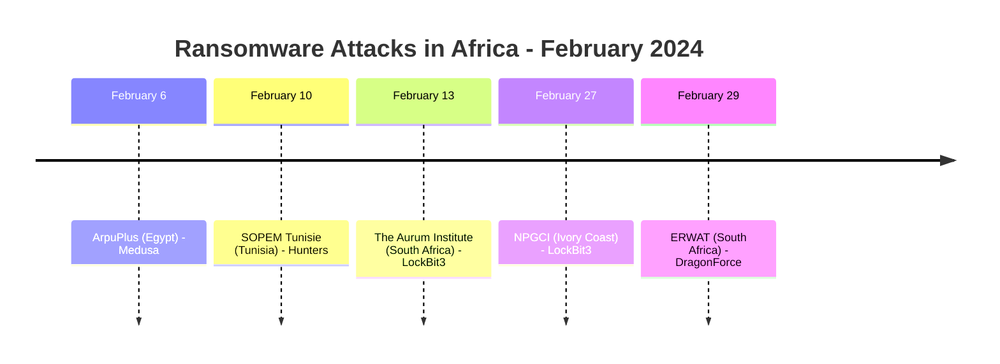
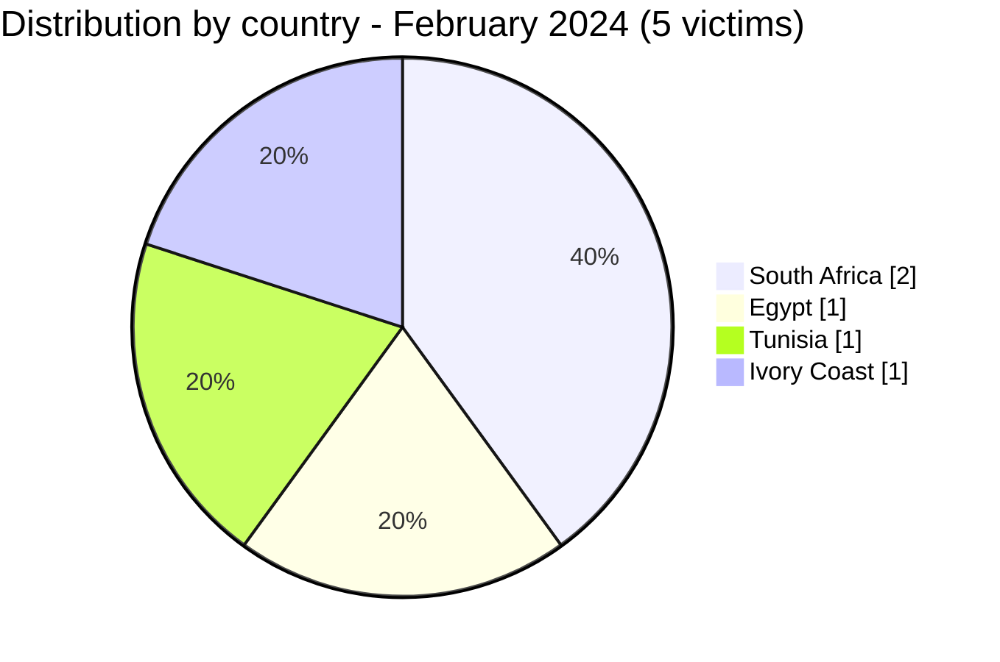

[](https://github.com/Hatchepsoute/AFRINTEL)


# CTI Report - February 2024: Geographic expansion across North and West Africa

👉🏾 [Version française disponible ici](./README_FR.md)

### 1. Executive summary

In February 2024, Africa recorded **5 documented ransomware victims** across 4 countries. Compared to January (3 victims, all South Africa), the month marks a clear **geographic expansion**. Egypt, Tunisia, Ivory Coast and South Africa are all targeted. Four distinct ransomware groups are active.

👉🏾 [Victims list](./victims.md)

**Key figures:**
- 🔹 **5 victims** identified
- 🔹 **4 active groups**: Medusa (1), Hunters (1), LockBit3 (2), DragonForce (1)
- 🔹 **Countries affected**: South Africa (2), Egypt (1), Tunisia (1), Ivory Coast (1)
- 🔹 **Sectors**: Digital Services/Telecom, Manufacturing, Healthcare & Research, Consumer Goods, Utilities

---

### 2. Attack timeline

| Date | Victim | Country | Ransomware group |
|------|--------|---------|-----------------|
| February 6 | ArpuPlus | Egypt | Medusa |
| February 10 | SOPEM Tunisie | Tunisia | Hunters |
| February 13 | The Aurum Institute | South Africa | LockBit3 |
| February 27 | Nouvelle Parfumerie Gandour (NPGCI) | Ivory Coast | LockBit3 |
| February 29 | ERWAT | South Africa | DragonForce |



---

### 3. Victim analysis

#### 3.1 By country

| Country | Number of attacks |
|---------|-----------------|
| South Africa | 2 |
| Egypt | 1 |
| Tunisia | 1 |
| Ivory Coast | 1 |



#### 3.2 By sector

| Sector | Count |
|--------|-------|
| Digital Services / Telecom | 1 |
| Manufacturing (Metallurgy) | 1 |
| Healthcare & Research | 1 |
| Consumer Goods (Cosmetics) | 1 |
| Utilities (Wastewater) | 1 |

```mermaid
xychart-beta
    title "Targeted Sectors - February 2024"
    x-axis ["Digital/Telecom", "Manufacturing", "Healthcare", "Consumer Goods", "Utilities"]
    y-axis "Number of attacks" 0 to 2
    bar [1, 1, 1, 1, 1]
```

#### 3.3 Ransomware groups

| Ransomware group | Number of attacks |
|-----------------|-----------------|
| LockBit3 | 2 |
| Medusa | 1 |
| Hunters | 1 |
| DragonForce | 1 |

```mermaid
gantt
    title Active Ransomware Groups - February 2024
    dateFormat X
    axisFormat %s
    section LockBit3
    LockBit3 : 0, 2
    section Medusa
    Medusa : 0, 1
    section Hunters
    Hunters : 0, 1
    section DragonForce
    DragonForce : 0, 1
```



---

### 4. Key observations

- **Geographic expansion**: February 2024 is the first month to see simultaneous attacks across North Africa (Egypt, Tunisia), West Africa (Ivory Coast) and Southern Africa (South Africa).
- **DragonForce first appearance**: the group claims ERWAT (wastewater utility serving 3.5 million people), a critical infrastructure attack signalling interest in essential services.
- **Healthcare under fire**: The Aurum Institute, a major HIV/TB research organization, is targeted by LockBit3, sensitive public health data at risk.
- **West African manufacturing**: NPGCI (FMCG cosmetics, Abidjan) marks LockBit3's first West African victim of the year.
- **Digital services in North Africa**: ArpuPlus (Egypt) shows emerging interest in MENA telecom and digital value-added service providers.

---

```mermaid
xychart-beta
    title "Monthly Evolution of Attacks (Jan - Feb 2024)"
    x-axis ["Jan", "Feb"]
    y-axis "Number of attacks" 0 to 6
    bar [3, 5]
```

### 5. Recommendations

| Domain | Recommended action |
|--------|--------------------|
| Critical infrastructure (water, energy) | Segment OT/IT networks, enforce offline backups, monitor SCADA access. |
| Healthcare & research | Encrypt research databases, restrict external access, monitor for data exfiltration. |
| Digital/Telecom providers | Patch API and platform vulnerabilities, monitor for credential leaks. |
| Manufacturing | Audit industrial systems exposure, enforce endpoint protection. |
| All organizations | Track DragonForce and Medusa as emerging groups, review their IOCs. |

---

*Report generated from AFRINTEL OSINT data. Free distribution (TLP:CLEAR)*
