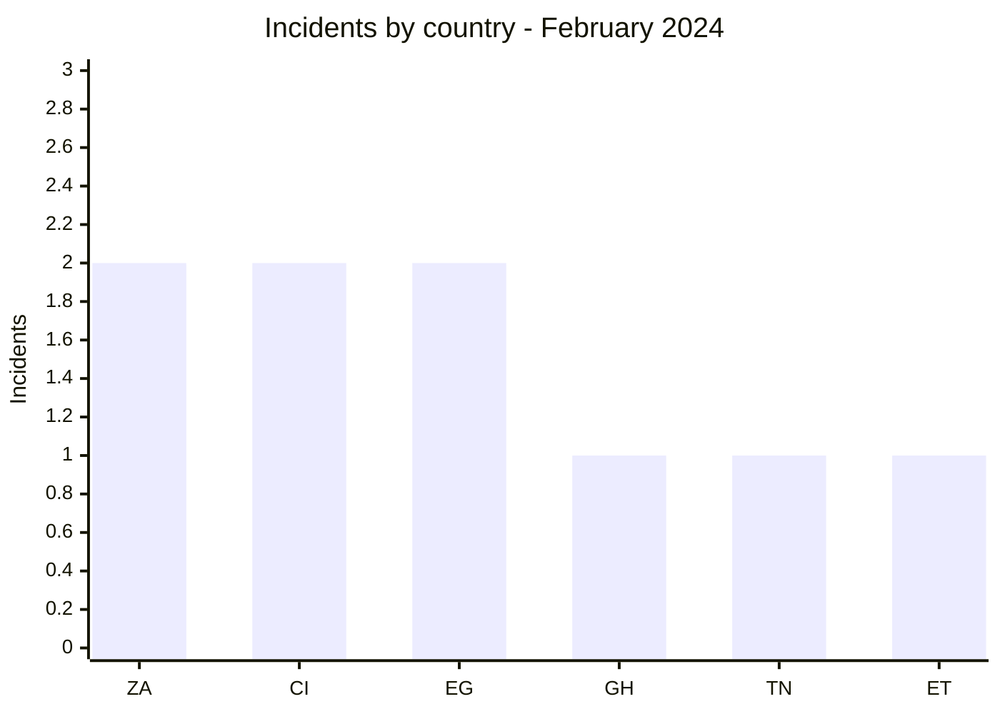
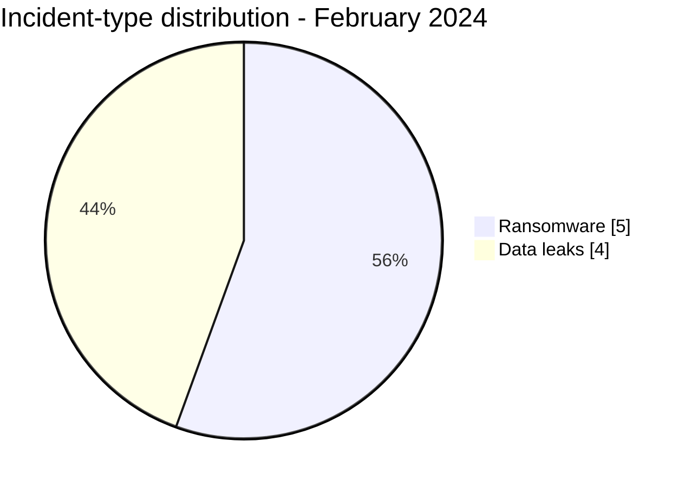

# AFRINTEL CTI Report - February 2024

👉🏾 [Version française](./README_FR.md)

## 1. Executive summary

February 2024 contains **9 documented incidents**: **5 ransomware claims** and **4 data leaks**. Activity spans six countries, without the concentration seen in South Africa the previous month. Egypt and Côte d’Ivoire each record two incidents; North Africa and West Africa each account for three occurrences.

The four leaks mainly concern digital services and public bodies. The 8WORX publication provides the month's most structured evidence and carries high confidence in the corpus. The five ransomware publications remain claims: no public telemetry establishes their entry point or operational scope.

See [victims.md](./victims.md) for incident-level data.

## 2. Methodology

This report covers publications assigned from February 1 to 29, 2024. Each organization is counted once, while **Ransomware**, **Data Leak**, **Access Sale**, and **Defacement** remain separate categories. Results describe activity visible in the reviewed sources, not every incident that occurred in Africa.

Statistics derive from the **9 incidents** in [victims.md](./victims.md), synchronized with [victims_FR.md](./victims_FR.md).

## 3. Global overview

| Indicator | Value |
|---|---:|
| Incidents | **9** |
| Countries | **6** |
| Ransomware | **5** |
| Data leaks | **4** |
| Access sales / Defacement | **0 / 0** |

### Country ranking

| Country | Total | Ransomware | Data leak |
|---|---:|---:|---:|
| 🇿🇦 South Africa | 2 | 2 | 0 |
| 🇨🇮 Côte d’Ivoire | 2 | 1 | 1 |
| 🇪🇬 Egypt | 2 | 1 | 1 |
| 🇬🇭 Ghana | 1 | 0 | 1 |
| 🇹🇳 Tunisia | 1 | 1 | 0 |
| 🇪🇹 Ethiopia | 1 | 0 | 1 |
| **Total** | **9** | **5** | **4** |

### Regional distribution

| Region | Incidents | Ransomware | Data leak |
|---|---:|---:|---:|
| North Africa | 3 | 2 | 1 |
| West Africa | 3 | 1 | 2 |
| Southern Africa | 2 | 2 | 0 |
| East Africa | 1 | 0 | 1 |
| **Total** | **9** | **5** | **4** |

### Normalized sector distribution

| Sector | Incidents | Share |
|---|---:|---:|
| Government / Administration | 3 | 33.3% |
| Technology / IT | 2 | 22.2% |
| Manufacturing / Industry | 2 | 22.2% |
| Healthcare / Medical | 1 | 11.1% |
| Water / Utilities | 1 | 11.1% |
| **Total** | **9** | **100%** |

### Most visible actors

| Actor or source | Incidents |
|---|---:|
| Tanaka and associated publications | 3 |
| LockBit3 | 2 |
| DragonForce, Hunters, Medusa, ThreatSec | 1 each |

## 4. Detailed analysis by incident type

### 4.1 Ransomware

The five publications concern ArpuPlus, SOPEM Tunisie, The Aurum Institute, NPGCI, and ERWAT. Two affect South Africa; the others extend visible ransomware activity to Egypt, Tunisia, and Côte d’Ivoire. This distribution is a collection fact, not evidence of a coordinated campaign.

### 4.2 Data leaks

The four leaks concern 8WORX, Ethiopian ministries involved in regional trade, Ghana's National Teaching Council, and Côte d’Ivoire's Agence Emploi Jeunes. Samples increase confidence that structured data existed, but do not validate the total volumes or acquisition method.

## 5. Sectoral impact

The public sector accounts for one third of the corpus. Publications involve general administration, employment, and teacher-training regulation. The most direct risks are targeted phishing, account impersonation, and administrative-data exposure. In water and healthcare, even an unconfirmed claim warrants checks on essential-service continuity.

## 6. Threat actor profile and risk assessment

| Country | Level | Rationale |
|---|---|---|
| 🇪🇬 Egypt | 🔴 High | Two incidents, including a high-confidence leak |
| 🇨🇮 Côte d’Ivoire | 🔴 High | Ransomware and a leak involving a public body |
| 🇿🇦 South Africa | 🟠 Medium | Two ransomware claims |
| 🇬🇭 Ghana | 🟠 Medium | Data publication involving a regulator |
| 🇹🇳 Tunisia / 🇪🇹 Ethiopia | 🟡 Low to medium | One publication each |

## 7. Key trends and intelligence gaps

- **Observed - high confidence:** incidents are almost evenly split between ransomware and leaks.
- **Observed - high confidence:** three of the four leaks directly concern public bodies.
- **Gap:** no public DFIR report was identified in the sources reviewed to qualify the five ransomware cases.
- **Gap:** the age and representativeness of some samples do not support extrapolation to advertised volumes.
- **Collection need:** victim confirmation, official notices, and later evidence of republication.

## 8. Contextual MITRE ATT&CK mapping

| Status | Technique | Use |
|---|---|---|
| Preventive | T1486 - Data Encrypted for Impact | Encryption monitoring for five ransomware claims; technique not confirmed |
| Preventive | T1567 - Exfiltration Over Web Service | Outbound-data monitoring; channel not observed |
| Assumption | T1078 - Valid Accounts | Scenario to test in administrative environments; no compromised account confirmed |

## 9. Recommendations

- **Public sector:** review privileged access, data exports, and notification procedures.
- **Healthcare and water:** isolate critical systems and test continuity plans.
- **Technology companies:** strengthen MFA, secret management, and administrator-action logging.
- **All organizations:** maintain immutable backups and a tested restoration capability.

## 10. SOC and tactical recommendations

| Qualification | Action |
|---|---|
| **Observed** | Monitor the applications and domains explicitly cited; no intrusion chain is confirmed. |
| **Assumption** | Hunt for abnormal administrator logins, bulk exports, and archive creation around publication dates. |
| **Preventive** | Alert on backup inhibition, mass encryption, high-volume outbound transfers, and unusual remote-administration tooling. |

## 11. Strategic recommendations

| Priority | Qualification | Measure |
|---:|---|---|
| 1 | **Observed** | Prioritize protection of public bodies represented in the corpus. |
| 2 | **Assumption** | Check whether shared credentials or applications connect several publications without presuming a common campaign. |
| 3 | **Preventive** | Reduce external exposure, require phishing-resistant MFA, and isolate backups. |

## 12. Conclusion

February is more geographically dispersed than January. The weight of the public sector and the coexistence of ransomware and leaks require parallel work on business continuity and data-exposure validation. Public sources do not support stronger conclusions about attacker tradecraft.

**AFRINTEL - TLP:CLEAR**
[AFRINTEL repository](https://github.com/Hatchepsoute/AFRINTEL)
