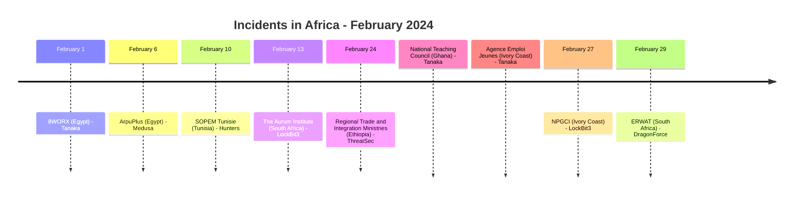
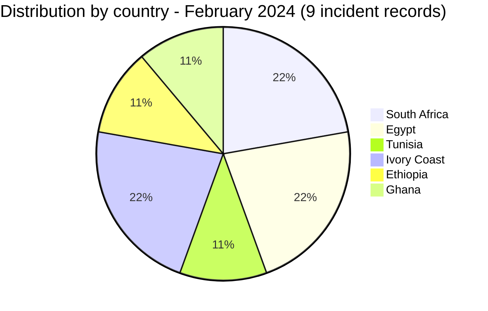
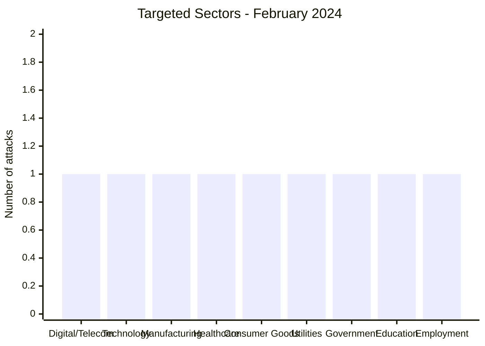
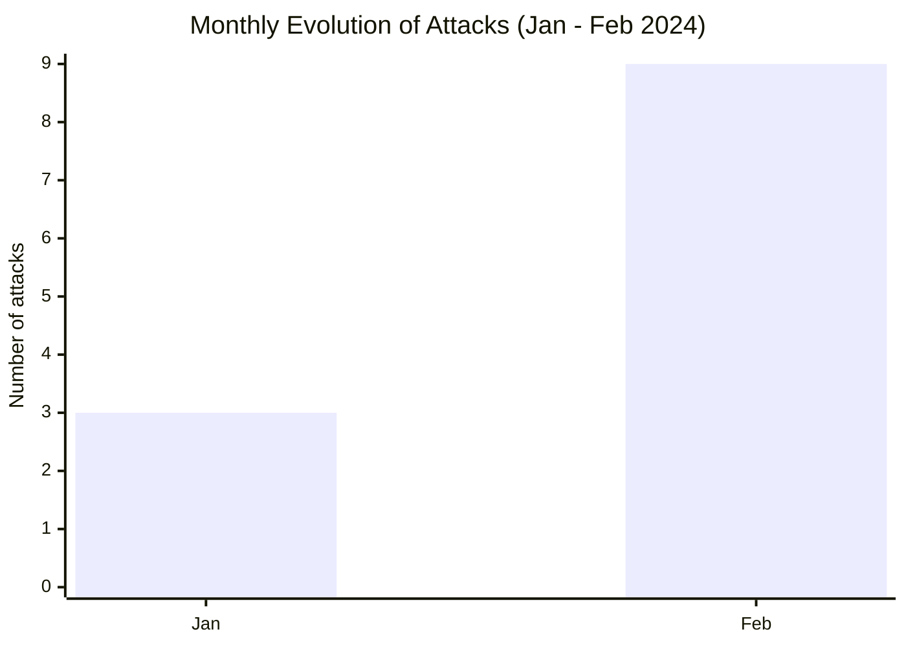

# CTI Report - February 2024: Geographic expansion across North and West Africa

👉🏾 [Version française disponible ici](./README_FR.md)

### 1. Executive summary

In February 2024, Africa recorded **9 incident records** across 6 countries: **5 ransomware claims and 4 data leak claims**. Compared to January (3 victims, all South Africa), the month marks a clear **geographic expansion**. Egypt, Tunisia, Ivory Coast, Ethiopia, Ghana and South Africa are all represented.

👉🏾 [Victims list](./victims.md)

**Key figures:**
- 🔹 **9 incident records** identified
- 🔹 **6 active actors/groups**: Medusa (1), Hunters (1), LockBit3 (2), DragonForce (1), ThreatSec (1), Tanaka (3)
- 🔹 **Countries affected**: South Africa (2), Ethiopia (1), Egypt (2), Tunisia (1), Ivory Coast (2), Ghana (1)
- 🔹 **Sectors**: Government/Public Administration, Government/Education, Government/Employment Services, Digital Services/Telecom, Technology/Software Services, Manufacturing, Healthcare & Research, Consumer Goods, Utilities

### Monthly aggregate exposure view

The monthly CTI view combines data leaks and access sales as **data exposure**: **4 records** (44.4% of the monthly corpus). Source cards remain authoritative; an access sale does not by itself prove data exfiltration.

---

### 2. Attack timeline

| Date | Victim | Country | Actor / Group | Type |
|------|--------|---------|-----------------|------|
| February 1 | 8WORX | Egypt | Tanaka | Data Leak |
| February 6 | ArpuPlus | Egypt | Medusa | Ransomware |
| February 10 | SOPEM Tunisie | Tunisia | Hunters | Ransomware |
| February 13 | The Aurum Institute | South Africa | LockBit3 | Ransomware |
| February 24 | Regional Trade and Integration Ministries of Ethiopia | Ethiopia | ThreatSec | Data Leak |
| February 24 | National Teaching Council (tpg.ntc.gov.gh) | Ghana | Tanaka | Data Leak |
| February 24 | Agence Emploi Jeunes | Ivory Coast | Tanaka | Data Leak |
| February 27 | Nouvelle Parfumerie Gandour (NPGCI) | Ivory Coast | LockBit3 | Ransomware |
| February 29 | ERWAT | South Africa | DragonForce | Ransomware |

---

### 3. Victim analysis

#### 3.1 By country

| Country | Number of attacks |
|---------|-----------------|
| South Africa | 2 |
| Ethiopia | 1 |
| Egypt | 2 |
| Tunisia | 1 |
| Ivory Coast | 2 |
| Ghana | 1 |

#### 3.2 By sector

| Sector | Count |
|--------|-------|
| Digital Services / Telecom | 1 |
| Technology / Software Services | 1 |
| Manufacturing (Metallurgy) | 1 |
| Healthcare & Research | 1 |
| Consumer Goods (Cosmetics) | 1 |
| Utilities (Wastewater) | 1 |
| Government / Public Administration | 1 |
| Government / Education | 1 |
| Government / Employment Services | 1 |

#### 3.3 Ransomware groups and data-leak actors

| Actor / group | Number of incidents |
|-----------------|-----------------|
| LockBit3 | 2 |
| Medusa | 1 |
| Hunters | 1 |
| DragonForce | 1 |
| ThreatSec | 1 |
| Tanaka | 3 |

```mermaid
gantt
    title Active Ransomware Groups - February 2024
    dateFormat X
    axisFormat %s
    section LockBit3
    LockBit3 : 0, 2
    section Medusa
    Medusa : 0, 1
    section Hunters
    Hunters : 0, 1
    section DragonForce
    DragonForce : 0, 1
    section Tanaka
    Tanaka : 0, 3
```

---

### 4. Key observations

- **Geographic expansion**: February 2024 is the first month to see simultaneous attacks across North Africa (Egypt, Tunisia), West Africa (Ivory Coast) and Southern Africa (South Africa).
- **DragonForce first appearance**: the group claims ERWAT (wastewater utility serving 3.5 million people), a critical infrastructure attack signalling interest in essential services.
- **Healthcare under fire**: The Aurum Institute, a major HIV/TB research organization, is targeted by LockBit3, sensitive public health data at risk.
- **West African manufacturing**: NPGCI (FMCG cosmetics, Abidjan) marks LockBit3's first West African victim of the year.
- **Digital services in North Africa**: ArpuPlus (Egypt) shows emerging interest in MENA telecom and digital value-added service providers.
- **Ethiopian government exposure**: a ThreatSec claim published on 24 August 2023 and discovered by AFRINTEL on 24 February 2024 concerns 43 government files linked to trade and certification portals.
- **Ivorian public-employment leak**: the Tanaka publication advertises a 3.2 GB SQL file associated with agenceemploijeunes.ci, with approximately 2,300 rows and 296,000 unique users or email addresses claimed; these figures remain internally inconsistent and the full dataset is unverified.
- **Ghanaian education-sector leak**: a Tanaka forum post originally published on 16 July 2023 and discovered by AFRINTEL on 24 February 2024 advertises a ~41,000-row SQL export of student-teacher records from Ghana's National Teaching Council, covering identity, contact and academic data across multiple colleges of education.
- **Egyptian CRM-platform leak**: a Tanaka forum post originally published on 30 June 2023 and discovered by AFRINTEL on 1 February 2024 advertises a 1.3 GB SQL export of 8WORX, a Delaware-registered technology provider focused on Egypt and the Middle East, with roughly 4 million rows spanning phone, activity-log and lead/account data.

---

### 5. Recommendations

| Domain | Recommended action |
|--------|--------------------|
| Critical infrastructure (water, energy) | Segment OT/IT networks, enforce offline backups, monitor SCADA access. |
| Healthcare & research | Encrypt research databases, restrict external access, monitor for data exfiltration. |
| Digital/Telecom providers | Patch API and platform vulnerabilities, monitor for credential leaks. |
| Manufacturing | Audit industrial systems exposure, enforce endpoint protection. |
| Education / Public administration | Restrict access to student-record databases, encrypt personal data at rest, and audit third-party portal access. |
| All organizations | Track DragonForce and Medusa as emerging groups, review their IOCs. |

---

*Report generated from AFRINTEL OSINT data. Free distribution (TLP:CLEAR)*
