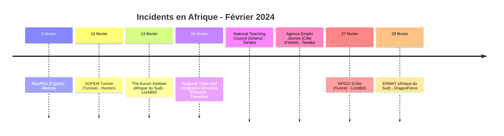
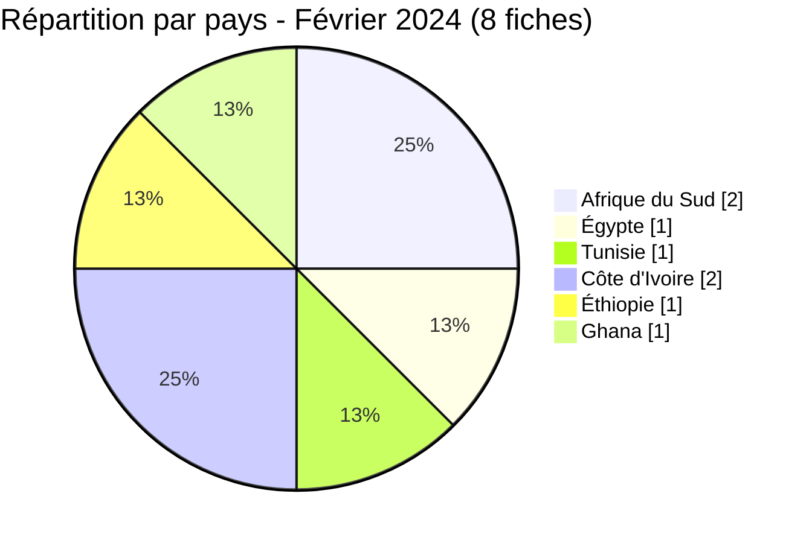
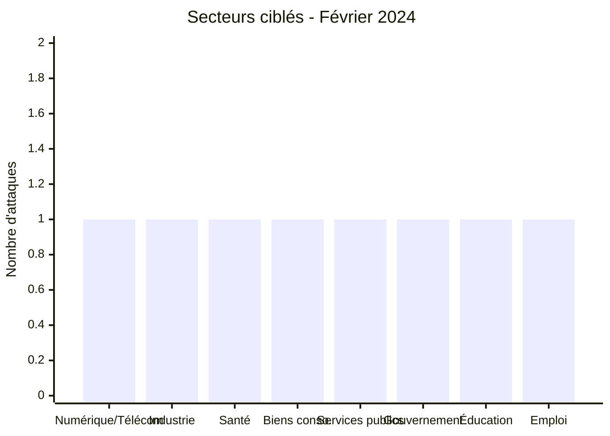
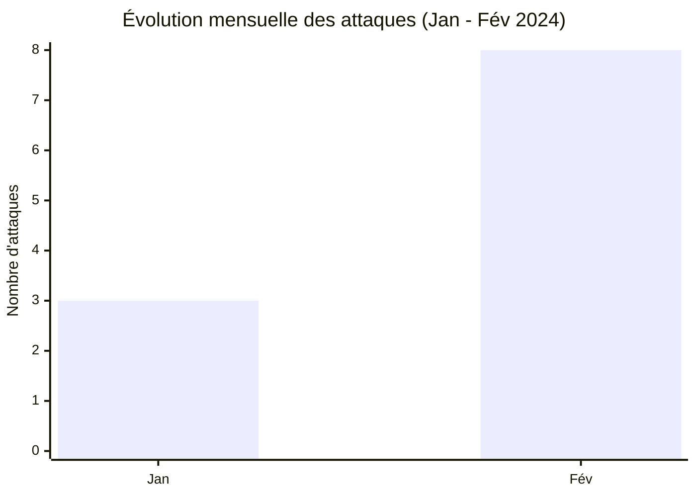

# Rapport CTI - Février 2024 : Expansion géographique vers l'Afrique du Nord et de l'Ouest

👉🏾 [English version available here](./README.md)

### 1. Résumé exécutif

En février 2024, l'Afrique a enregistré **8 fiches d'incident** dans 6 pays : **5 revendications ransomware et 3 revendications de fuite de données**. Par rapport à janvier (3 victimes, toutes en Afrique du Sud), le mois marque une **expansion géographique nette** : l'Égypte, la Tunisie, la Côte d'Ivoire, l'Éthiopie, le Ghana et l'Afrique du Sud sont représentés.

👉🏾 [Liste des victimes](./victims_FR.md)

**Chiffres clés :**
- 🔹 **8 fiches d'incident** identifiées
- 🔹 **6 acteurs/groupes actifs** : Medusa (1), Hunters (1), LockBit3 (2), DragonForce (1), ThreatSec (1), Tanaka (2)
- 🔹 **Pays touchés** : Afrique du Sud (2), Éthiopie (1), Égypte (1), Tunisie (1), Côte d'Ivoire (2), Ghana (1)
- 🔹 **Secteurs** : Gouvernement/Administration publique, Gouvernement/Éducation, Gouvernement/Services d'emploi, Services numériques/Télécom, Industrie, Santé & Recherche, Biens de consommation, Services publics

---

### 2. Chronologie des attaques

| Date | Victime | Pays | Acteur / Groupe | Type |
|------|---------|------|-------------------|
| 6 février | ArpuPlus | Égypte | Medusa | Ransomware |
| 10 février | SOPEM Tunisie | Tunisie | Hunters | Ransomware |
| 13 février | The Aurum Institute | Afrique du Sud | LockBit3 | Ransomware |
| 24 février | Regional Trade and Integration Ministries of Ethiopia | Éthiopie | ThreatSec | Fuite de données |
| 24 février | National Teaching Council (tpg.ntc.gov.gh) | Ghana | Tanaka | Fuite de données |
| 24 février | Agence Emploi Jeunes | Côte d'Ivoire | Tanaka | Fuite de données |
| 27 février | Nouvelle Parfumerie Gandour (NPGCI) | Côte d'Ivoire | LockBit3 | Ransomware |
| 29 février | ERWAT | Afrique du Sud | DragonForce | Ransomware |

---

### 3. Analyse des victimes

#### 3.1 Par pays

| Pays | Nombre d'attaques |
|------|-----------------|
| Afrique du Sud | 2 |
| Éthiopie | 1 |
| Égypte | 1 |
| Tunisie | 1 |
| Côte d'Ivoire | 2 |
| Ghana | 1 |

#### 3.2 Par secteur

| Secteur | Nombre |
|---------|--------|
| Services numériques / Télécom | 1 |
| Industrie (Métallurgie) | 1 |
| Santé & Recherche | 1 |
| Biens de consommation (Cosmétiques) | 1 |
| Services publics (Traitement des eaux) | 1 |
| Gouvernement / Administration publique | 1 |
| Gouvernement / Éducation | 1 |
| Gouvernement / Services d'emploi | 1 |

#### 3.3 Groupes ransomware et acteurs de fuite

| Acteur / groupe | Nombre d'incidents |
|-----------------|-----------------|
| LockBit3 | 2 |
| Medusa | 1 |
| Hunters | 1 |
| DragonForce | 1 |
| ThreatSec | 1 |
| Tanaka | 2 |

```mermaid
gantt
    title Groupes ransomware actifs - Février 2024
    dateFormat X
    axisFormat %s
    section LockBit3
    LockBit3 : 0, 2
    section Medusa
    Medusa : 0, 1
    section Hunters
    Hunters : 0, 1
    section DragonForce
    DragonForce : 0, 1
    section Tanaka
    Tanaka : 0, 2
```

---

### 4. Points d'attention

- **Expansion géographique** : Février 2024 est le premier mois à voir des attaques simultanées en Afrique du Nord (Égypte, Tunisie), Afrique de l'Ouest (Côte d'Ivoire) et Afrique australe (Afrique du Sud).
- **Première apparition de DragonForce** : le groupe revendique ERWAT (traitement des eaux usées desservant 3,5 millions de personnes), une attaque d'infrastructure critique signalant un intérêt pour les services essentiels.
- **Santé sous pression** : The Aurum Institute, organisation majeure de recherche VIH/Tuberculose, est ciblée par LockBit3, des données de santé publique sensibles sont exposées.
- **Industrie ouest-africaine** : NPGCI (cosmétiques grand public, Abidjan) marque la première victime ouest-africaine de LockBit3 en 2024.
- **Services numériques en Afrique du Nord** : ArpuPlus (Égypte) illustre un intérêt croissant pour les opérateurs télécom et les fournisseurs de services à valeur ajoutée de la zone MENA.
- **Exposition gouvernementale éthiopienne** : une revendication ThreatSec publiée le 24 août 2023 et découverte par AFRINTEL le 24 février 2024 concerne 43 fichiers gouvernementaux liés à des portails de commerce et de certification.
- **Fuite dans les services publics d'emploi ivoiriens** : la publication de Tanaka annonce un fichier SQL de 3,2 Go associé à agenceemploijeunes.ci, avec environ 2 300 lignes et 296 000 utilisateurs ou adresses email uniques ; ces chiffres restent incohérents et le jeu de données complet n'est pas vérifié.
- **Fuite dans le secteur éducatif ghanéen** : une publication de Tanaka, initialement publiée le 16 juillet 2023 et découverte par AFRINTEL le 24 février 2024, annonce un export SQL d'environ 41 000 lignes de dossiers d'élèves-enseignants du National Teaching Council du Ghana, couvrant des données d'identité, de contact et académiques dans plusieurs collèges d'éducation.

---

### 5. Recommandations

| Domaine | Action recommandée |
|---------|--------------------|
| Infrastructures critiques (eau, énergie) | Segmenter les réseaux OT/IT, maintenir des sauvegardes hors ligne, surveiller les accès SCADA. |
| Santé & Recherche | Chiffrer les bases de données de recherche, restreindre les accès externes, surveiller l'exfiltration. |
| Fournisseurs numériques/Télécom | Corriger les vulnérabilités d'API, surveiller les fuites de credentials. |
| Industrie | Auditer l'exposition des systèmes industriels, renforcer la protection endpoint. |
| Éducation / Administration publique | Restreindre l'accès aux bases de données d'élèves, chiffrer les données personnelles au repos, et auditer les accès des portails tiers. |
| Toutes organisations | Surveiller DragonForce et Medusa comme groupes émergents, analyser leurs IOCs. |

---

*Rapport généré à partir des données OSINT AFRINTEL. Diffusion libre (TLP:CLEAR)*
