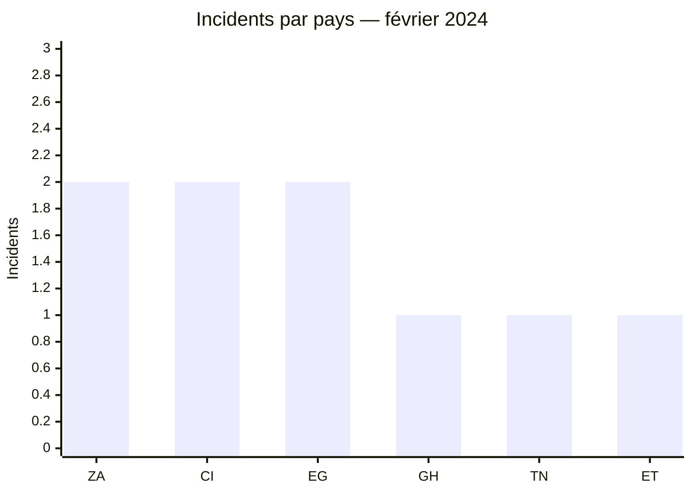
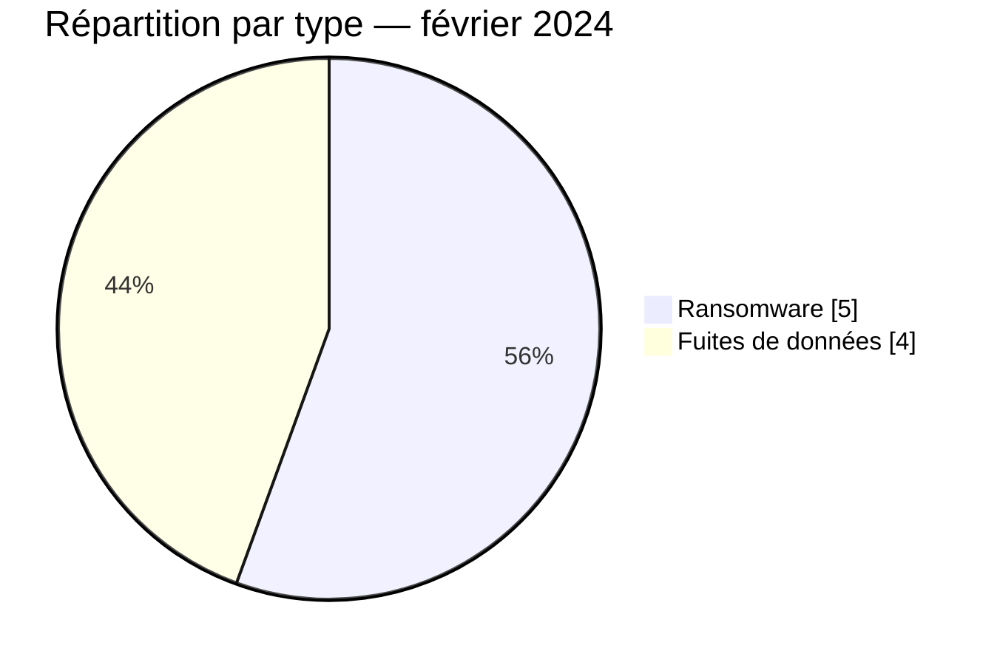

# Rapport CTI AFRINTEL — Février 2024

👉🏾 [English version](./README.md)

## 1. Résumé exécutif

Février 2024 compte **9 incidents documentés** : **5 revendications ransomware** et **4 fuites de données**. L’activité se répartit sur six pays, sans concentration comparable à celle observée en Afrique du Sud le mois précédent. L’Égypte et la Côte d’Ivoire enregistrent chacune deux incidents ; l’Afrique du Nord et l’Afrique de l’Ouest totalisent chacune trois occurrences.

Les quatre fuites concernent principalement des services numériques et des organismes publics. La publication visant 8WORX présente les éléments les plus structurés du mois et reçoit un niveau de confiance élevé dans le corpus. Les cinq publications ransomware restent des revendications : aucune télémétrie publique ne permet d’en établir le point d’entrée ou l’étendue opérationnelle.

Voir [victims_FR.md](./victims_FR.md) pour les données détaillées.

## 2. Méthodologie

Le rapport couvre les publications classées du 1er au 29 février 2024. Chaque organisation est comptée une fois et les catégories **Ransomware**, **Data Leak**, **Access Sale** et **Defacement** restent séparées. Les résultats décrivent l’activité visible dans les sources consultées, non l’ensemble des incidents survenus en Afrique.

Les statistiques dérivent des **9 incidents** de [victims_FR.md](./victims_FR.md), synchronisés avec [victims.md](./victims.md).

## 3. Vue globale

| Indicateur | Valeur |
|---|---:|
| Incidents | **9** |
| Pays | **6** |
| Ransomware | **5** |
| Fuites de données | **4** |
| Ventes d’accès / Défacement | **0 / 0** |

### Classement par pays

| Pays | Total | Ransomware | Fuite |
|---|---:|---:|---:|
| 🇿🇦 Afrique du Sud | 2 | 2 | 0 |
| 🇨🇮 Côte d’Ivoire | 2 | 1 | 1 |
| 🇪🇬 Égypte | 2 | 1 | 1 |
| 🇬🇭 Ghana | 1 | 0 | 1 |
| 🇹🇳 Tunisie | 1 | 1 | 0 |
| 🇪🇹 Éthiopie | 1 | 0 | 1 |
| **Total** | **9** | **5** | **4** |

### Répartition régionale

| Région | Incidents | Ransomware | Fuite |
|---|---:|---:|---:|
| Afrique du Nord | 3 | 2 | 1 |
| Afrique de l’Ouest | 3 | 1 | 2 |
| Afrique australe | 2 | 2 | 0 |
| Afrique de l’Est | 1 | 0 | 1 |
| **Total** | **9** | **5** | **4** |

### Répartition sectorielle normalisée

| Secteur | Incidents | Part |
|---|---:|---:|
| Gouvernement / Administration | 3 | 33,3 % |
| Technologies / Informatique | 2 | 22,2 % |
| Industrie / Fabrication | 2 | 22,2 % |
| Santé / Médical | 1 | 11,1 % |
| Eau / Services publics | 1 | 11,1 % |
| **Total** | **9** | **100 %** |

### Acteurs les plus visibles

| Acteur ou source | Incidents |
|---|---:|
| Tanaka et publications associées | 3 |
| LockBit3 | 2 |
| DragonForce, Hunters, Medusa, ThreatSec | 1 chacun |

## 4. Analyse détaillée par type d’incident

### 4.1 Ransomware

Les cinq publications concernent ArpuPlus, SOPEM Tunisie, The Aurum Institute, NPGCI et ERWAT. Deux touchent l’Afrique du Sud ; les autres étendent la visibilité ransomware à l’Égypte, la Tunisie et la Côte d’Ivoire. Cette dispersion est un fait de collecte, pas la preuve d’une campagne coordonnée.

### 4.2 Fuites de données

Les quatre fuites visent 8WORX, des ministères éthiopiens liés au commerce régional, le National Teaching Council du Ghana et l’Agence Emploi Jeunes de Côte d’Ivoire. Les échantillons renforcent la confiance dans l’existence de données structurées, mais ne valident ni les volumes globaux ni la méthode d’acquisition.

## 5. Impact sectoriel

Le secteur public représente un tiers du corpus. Les publications touchent l’administration générale, l’emploi et la régulation de la formation des enseignants. Les risques les plus directs sont l’hameçonnage ciblé, l’usurpation de comptes et l’exposition de données administratives. Dans l’eau et la santé, même une revendication non confirmée justifie de vérifier la continuité des services essentiels.

## 6. Profil des acteurs et évaluation du risque

| Pays | Niveau | Justification |
|---|---|---|
| 🇪🇬 Égypte | 🔴 Élevé | Deux incidents, dont une fuite à confiance élevée |
| 🇨🇮 Côte d’Ivoire | 🔴 Élevé | Ransomware et fuite touchant un organisme public |
| 🇿🇦 Afrique du Sud | 🟠 Moyen | Deux revendications ransomware |
| 🇬🇭 Ghana | 🟠 Moyen | Publication de données d’un organisme de régulation |
| 🇹🇳 Tunisie / 🇪🇹 Éthiopie | 🟡 Faible à moyen | Une publication chacune |

## 7. Tendances et lacunes de renseignement

- **Observé — confiance élevée :** les incidents sont presque équilibrés entre ransomware et fuites.
- **Observé — confiance élevée :** trois des quatre fuites concernent directement des organismes publics.
- **Lacune :** aucun rapport DFIR public n’a été identifié dans les sources consultées pour qualifier les cinq cas ransomware.
- **Lacune :** l’ancienneté et la représentativité de certains échantillons ne permettent pas d’extrapoler les volumes revendiqués.
- **Collecte attendue :** confirmations des victimes, notifications officielles et nouvelles traces de republication.

## 8. Cartographie MITRE ATT&CK contextuelle

| Statut | Technique | Utilisation |
|---|---|---|
| Préventif | T1486 — Data Encrypted for Impact | Détection du chiffrement pour les cinq revendications ransomware ; technique non confirmée |
| Préventif | T1567 — Exfiltration Over Web Service | Surveillance des sorties de données ; canal non observé |
| Hypothèse | T1078 — Valid Accounts | Scénario à examiner pour les environnements administratifs ; aucun compte compromis confirmé |

## 9. Recommandations

- **Secteur public :** revoir les accès privilégiés, les exports de données et les procédures de notification.
- **Santé et eau :** isoler les systèmes critiques et tester les plans de continuité.
- **Entreprises technologiques :** renforcer MFA, gestion des secrets et journalisation des actions administratives.
- **Toutes les organisations :** maintenir des sauvegardes immuables et une capacité de restauration testée.

## 10. Recommandations SOC et tactiques

| Qualification | Action |
|---|---|
| **Observé** | Surveiller les applications et domaines explicitement cités ; aucune chaîne d’intrusion n’est confirmée. |
| **Hypothèse** | Rechercher des connexions administratives anormales, exports massifs et créations d’archives autour des dates de publication. |
| **Préventif** | Alerter sur l’inhibition des sauvegardes, le chiffrement massif, les transferts sortants volumineux et l’usage inhabituel d’outils d’administration. |

## 11. Recommandations stratégiques

| Priorité | Qualification | Mesure |
|---:|---|---|
| 1 | **Observé** | Prioriser la protection des organismes publics présents dans le corpus. |
| 2 | **Hypothèse** | Vérifier si les mêmes identifiants ou applications relient plusieurs publications, sans présumer une campagne commune. |
| 3 | **Préventif** | Réduire la surface externe, imposer une MFA résistante au phishing et isoler les sauvegardes. |

## 12. Conclusion

Février présente un paysage plus dispersé que janvier. Le poids du secteur public et la coexistence de ransomware et de fuites imposent deux efforts parallèles : continuité d’activité d’un côté, validation et réduction de l’exposition des données de l’autre. Les sources publiques ne permettent pas d’aller plus loin sur les modes opératoires.

**AFRINTEL — TLP:CLEAR**
[Dépôt AFRINTEL](https://github.com/Hatchepsoute/AFRINTEL)
