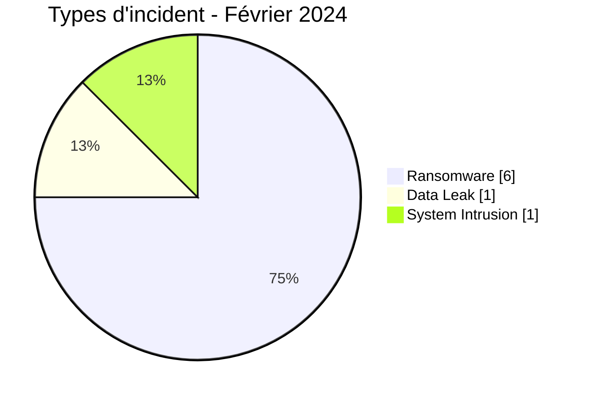

# Rapport CTI AFRINTEL - Cybermenaces en Afrique - Février 2024

👉🏾 [English version](./README.md)

## 1. Synthèse exécutive

En Février 2024, AFRINTEL retient **8 cyberincidents canoniques dans 5 pays**. Le mois est dominé par **Ransomware (6, 75,0 %)** puis **Data Leak (1, 12,5 %)**. Les pays les plus représentés sont **Afrique du Sud (4)**, **Égypte (1)**, **Tunisie (1)**. Les secteurs les plus visibles sont **Gouvernement / Administration (3)**, **Industrie / Fabrication (2)**, **Technologie / IT (1)**. Les labels acteur/groupe les plus fréquents sont `lockbit3` (3), `Unknown` (2), `medusa` (1). `Unknown` désigne une absence d'attribution, pas un groupe.

La maturité de preuve est répartie entre **Claim - Unverified: 5**, **Confirmed: 3**. Les claims ne sont pas convertis en confirmations sans preuve supplémentaire.

### 1.1 Étude comparative - Janvier vs Février 2024

> Cette comparaison utilise la **baseline corrigée de janvier 2024 à 8 incidents canoniques**, incluant la Data Leak de Daeyang University ajoutée rétrospectivement au 25 janvier 2024. Février reste à **8 incidents canoniques**.

#### 1.1.1 Évolution du volume global et des types d'incident

| Indicateur | Janvier 2024 | Février 2024 | Évolution |
|---|---:|---:|---:|
| Total | **8** | **8** | **Stable (0,0 %)** |
| Ransomware | 4 | 6 | **+2 (+50,0 %)** |
| Data Leak | 1 | 1 | **Stable** |
| Access Sale | 1 | 0 | **-1 (-100,0 %)** |
| DDoS | 0 | 0 | **Stable** |
| Defacement | 0 | 0 | **Stable** |
| Account Takeover | 0 | 0 | **Stable** |
| System Intrusion | 2 | 1 | **-1 (-50,0 %)** |
| Malware | 0 | 0 | **Stable** |
| Operational Fraud | 0 | 0 | **Stable** |

Le volume mensuel documenté reste donc **stable à 8 incidents**, mais sa composition évolue nettement. Le Ransomware passe de **4 à 6 fiches**, faisant progresser sa part de **50,0 % à 75,0 %**. Les Data Leak restent stables à une fiche, tandis que l'Access Sale disparaît et que les System Intrusion passent de deux à une fiche.

```mermaid
xychart-beta
    title "Comparaison des types d'incident - Janvier vs Février 2024"
    x-axis ["Ransomware", "Data Leak", "Access Sale", "System Intrusion"]
    y-axis "Incidents" 0 --> 6
    bar [4, 1, 1, 2]
    bar [6, 1, 0, 1]
```

**Légende des séries :** première série = janvier 2024 | deuxième série = février 2024.

#### 1.1.2 Évolution géographique

Janvier couvre **4 pays**, contre **5 en février**.

- **Janvier :** Afrique du Sud (4), Cameroun (2), Angola (1), Malawi (1).
- **Février :** Afrique du Sud (4), Égypte (1), Tunisie (1), Côte d'Ivoire (1), Malawi (1).

L'Afrique du Sud reste le pays le plus représenté sur les deux mois avec **4 incidents (50,0 %)**. Le Cameroun et l'Angola disparaissent du corpus de février, tandis que l'Égypte, la Tunisie et la Côte d'Ivoire apparaissent.

| Région | Janvier 2024 | Février 2024 |
|---|---:|---:|
| Afrique australe | 6 (75,0 %) | 5 (62,5 %) |
| Afrique centrale | 2 (25,0 %) | 0 |
| Afrique du Nord | 0 | 2 (25,0 %) |
| Afrique de l'Ouest | 0 | 1 (12,5 %) |

Février présente donc une dispersion géographique plus large, avec une extension du corpus depuis l'Afrique australe vers l'Afrique du Nord et l'Afrique de l'Ouest.

#### 1.1.3 Évolution sectorielle

| Signal sectoriel | Janvier 2024 | Février 2024 | Lecture |
|---|---:|---:|---|
| Commerce / E-commerce | 2 | 0 | Visibilité plus faible en février |
| Éducation / Université | 2 | 0 | Visibilité plus faible en février |
| Gouvernement / Administration | 1 | 3 | **+2 ; devient le premier secteur** |
| Industrie / Fabrication | 0 | 2 | **Devient visible** |
| Finance / Banque | 1 | 0 | Aucune fiche en février |
| Santé / Médical | 0 | 1 | Apparaît en février |
| Eau / Services publics | 0 | 1 | Apparaît en février |

Janvier était dominé par **Commerce / E-commerce** et **Éducation / Université**, avec deux fiches chacun. Février se déplace vers **Gouvernement / Administration (3)** et **Industrie / Fabrication (2)**.

#### 1.1.4 Visibilité des acteurs / groupes

- **Janvier :** `Unknown` (3), `lockbit3` (3), `cnHunter` (1), `X0Frankenstein` (1).
- **Février :** `lockbit3` (3), `Unknown` (2), `medusa` (1), `hunters` (1), `dragonforce` (1).

`lockbit3` reste stable à **3 fiches**. `Unknown` passe de 3 à 2. Les autres labels changent entièrement entre les deux mois, ce qui confirme que les classements mensuels d'acteurs doivent être interprétés comme des indicateurs de visibilité et non comme une mesure stable de prévalence.

#### 1.1.5 Maturité des preuves

| Position de preuve | Janvier 2024 | Février 2024 |
|---|---:|---:|
| Claim - Unverified | 4 (50,0 %) | 5 (62,5 %) |
| Confirmed | 3 (37,5 %) | 3 (37,5 %) |
| Claim - Data Sample Published | 1 (12,5 %) | 0 |
| **Total** | **8** | **8** |

Le nombre d'incidents confirmés reste **stable à trois**, mais février présente une proportion plus importante de revendications non vérifiées. Janvier comprend en plus une Data Leak accompagnée d'un échantillon, Daeyang University.

#### 1.1.6 Lecture CTI

Cinq signaux comparatifs ressortent :

1. **Le volume global reste stable :** 8 incidents sur chacun des deux mois.
2. **Le Ransomware devient plus dominant :** sa part passe de 50,0 % à 75,0 %.
3. **La dispersion géographique augmente :** de 4 à 5 pays et de 2 à 3 régions représentées.
4. **La visibilité du secteur public augmente fortement :** Gouvernement / Administration passe de 1 à 3 fiches.
5. **La maturité des preuves se dégrade légèrement :** les revendications non vérifiées passent de 50,0 % à 62,5 %, tandis que le nombre d'incidents confirmés reste inchangé.

Pour les SOC, le profil de février renforce les priorités autour de la **résilience ransomware, du contrôle des accès privilégiés, de l'intégrité des sauvegardes, de la continuité des services publics et de la détection des accès non autorisés aux données sensibles des citoyens ou employés**. Pour la CTI, cette comparaison montre qu'un volume stable peut masquer des évolutions importantes dans les types de menace, les secteurs exposés, la géographie et la qualité des preuves.
## 2. Méthodologie

- Un incident canonique correspond à un événement retenu dans le millésime 2024.
- Les découvertes/republications historiques sont conservées séparément et ne gonflent pas les statistiques 2024.
- La date d'incident ou la meilleure fenêtre soutenue prime ; la date de découverte AFRINTEL reste distincte.
- Les 9 types AFRINTEL sont utilisés ; une tentative est représentée par le statut, jamais par un type `Attempted Attack`.
- Un DDoS coordonné est compté par campagne.
- Type, statut, confiance, impact, attribution et source restent distincts.

## 3. Répartition par type d'incident

| Type | Fiches | Part |
|---|---|---|
| Ransomware | 6 | 75,0 % |
| Data Leak | 1 | 12,5 % |
| Access Sale | 0 | 0,0 % |
| DDoS | 0 | 0,0 % |
| Defacement | 0 | 0,0 % |
| Account Takeover | 0 | 0,0 % |
| System Intrusion | 1 | 12,5 % |
| Malware | 0 | 0,0 % |
| Operational Fraud | 0 | 0,0 % |

## 4. Pays x type

| Pays | Total | Ransomware | Data Leak | Access Sale | DDoS | Defacement | Account Takeover | System Intrusion | Malware | Operational Fraud |
|---|---|---|---|---|---|---|---|---|---|---|
| Afrique du Sud | 4 | 3 | 1 | 0 | 0 | 0 | 0 | 0 | 0 | 0 |
| Égypte | 1 | 1 | 0 | 0 | 0 | 0 | 0 | 0 | 0 | 0 |
| Tunisie | 1 | 1 | 0 | 0 | 0 | 0 | 0 | 0 | 0 | 0 |
| Côte d'Ivoire | 1 | 1 | 0 | 0 | 0 | 0 | 0 | 0 | 0 | 0 |
| Malawi | 1 | 0 | 0 | 0 | 0 | 0 | 0 | 1 | 0 | 0 |

## 5. Répartition régionale

| Région | Fiches | Part |
|---|---|---|
| Afrique australe | 5 | 62,5 % |
| Afrique du Nord | 2 | 25,0 % |
| Afrique de l'Ouest | 1 | 12,5 % |

## 6. Répartition sectorielle

| Secteur | Fiches | Part |
|---|---|---|
| Gouvernement / Administration | 3 | 37,5 % |
| Industrie / Fabrication | 2 | 25,0 % |
| Technologie / IT | 1 | 12,5 % |
| Santé / Médical | 1 | 12,5 % |
| Eau / Services publics | 1 | 12,5 % |

## 7. Acteurs / groupes

| Acteur / Groupe | Fiches | Part |
|---|---|---|
| lockbit3 | 3 | 37,5 % |
| Unknown | 2 | 25,0 % |
| medusa | 1 | 12,5 % |
| hunters | 1 | 12,5 % |
| dragonforce | 1 | 12,5 % |

## 8. Maturité des preuves

| Position de preuve | Fiches | Part |
|---|---|---|
| Claim - Unverified | 5 | 62,5 % |
| Confirmed | 3 | 37,5 % |

### Confiance

| Confiance | Fiches | Part |
|---|---|---|
| Low | 5 | 62,5 % |
| Very High | 2 | 25,0 % |
| High | 1 | 12,5 % |

## 9. Chronologie

```mermaid
timeline
    title AFRINTEL - Février 2024
    6 Février 2024 : ArpuPlus
- **Acteur / Groupe -** medusa
- **Secteur -** Technology / IT
- **Site web -** [arpuplus.com](https -//www.arpuplus.com)
- **Statut -** Claim - Unverified
- **Type d'incident -** Ransomware
- **Niveau de confiance -** Low
- **Niveau d'impact -** Level 2
- **Description victime -** ArpuPlus, fondée en 2003 au Caire en tant que filiale du groupe A15, est un constructeur de projets numériques (*venture builder*) et un fournisseur de services mobiles de premier plan dans la région MENA. Présente via 11 bureaux, elle fournit des plateformes de vidéo à la demande, de distribution musicale, de télésanté et de communication d'entreprise.

----------------------------
    10 Février 2024 : SOPEM Tunisie
- **Acteur / Groupe -** hunters
- **Secteur -** Manufacturing / Industry
- **Site web -** [sopem.com.tn](https -//www.sopem.com.tn)
- **Statut -** Claim - Unverified
- **Type d'incident -** Ransomware
- **Niveau de confiance -** Low
- **Niveau d'impact -** Level 2
- **Description victime -** SOPEM Tunisie (Société Tunisienne de Profilage de Métaux) est une entreprise manufacturière spécialisée dans le profilage et la transformation industrielle des métaux. Basée en Tunisie, elle fournit des composants industriels et des structures métalliques pour les secteurs du bâtiment et de l'ingénierie.

----------------------------
    13 Février 2024 : The Aurum Institute
- **Acteur / Groupe -** lockbit3
- **Secteur -** Healthcare / Medical
- **Site web -** [auruminstitute.org](https -//www.auruminstitute.org)
- **Statut -** Claim - Unverified
- **Type d'incident -** Ransomware
- **Niveau de confiance -** Low
- **Niveau d'impact -** Level 3
- **Description victime -** The Aurum Institute est une organisation africaine d'utilité publique de premier plan fondée en 1998 et basée à Johannesburg. Axée sur la recherche médicale et la santé publique, l'organisation génère des données scientifiques et déploie des programmes sanitaires mondiaux d'envergure, notamment contre le VIH et la tuberculose.

----------------------------
    16 Février 2024 : Government Pensions Administration Agency (GPAA) / Government Employees Pension Fund (GEPF)
- **Date de l'incident -** 16 février 2024
- **Date de publication initiale -** 12 mars 2024
- **Date de correction AFRINTEL -** 23 août 2026
- **Acteur / Groupe -** lockbit3
- **Secteur -** Government / Administration
- **Site web -** [gepf.co.za](https -//www.gepf.co.za/)
- **Statut -** Victim Confirmed + Threat Actor Claim
- **Type d'incident -** Ransomware
- **Niveau de confiance -** Very High
- **Niveau d'impact -** Level 4
- **Note de preuve -** L'événement ransomware et la compromission de données personnelles sont confirmés par la victime. Les affirmations de l'acteur sur l'exhaustivité ou une portée supplémentaire des données publiées restent séparées des faits confirmés.
- **Description victime -** La GPAA administre les prestations de retraite pour le compte du GEPF, l'un des plus importants fonds de pension d'Afrique, au service des fonctionnaires, retraités et bénéficiaires.
- **Analyse -** La GPAA a subi une cyberattaque le 16 février 2024. Le GEPF a ensuite confirmé que des criminels avaient lancé un ransomware contre les systèmes de la GPAA et qu'environ **168 000 dossiers de personnes** avaient été consultés. Les catégories de données confirmées incluent des informations d'identité, de pension, d'emploi, de salaire, d'état civil, bancaires et fiscales. LockBit a publié des données et revendiqué l'attaque. L'événement ransomware et la compromission de données sont confirmés par la victime ; AFRINTEL conserve l'impact confirmé de 168 000 dossiers séparément de toute revendication plus large de l'acteur.
- **Sources publiques -** [Notification officielle GEPF](https -//www.gepf.co.za/notice/notification-of-security-compromise-as-per-section-22-of-the-protection-of-personal-information-act-4-of-2013-popia/2/) | [Communiqué GEPF](https -//www.gepf.co.za/government-pensions-administration-agency-gpaa-data-breach/)

----------------------------
    23 Février 2024 : Companies and Intellectual Property Commission (CIPC)
- **Date de l'incident -** 23 février 2024
- **Date de publication initiale -** 29 février 2024
- **Date de correction AFRINTEL -** 23 août 2026
- **Acteur / Groupe -** Unknown
- **Secteur -** Government / Administration
- **Site web -** [cipc.co.za](https -//www.cipc.co.za/)
- **Statut -** Victim Confirmed - Multi-effect Incident
- **Type d'incident -** Data Leak
- **Niveau de confiance -** Very High
- **Niveau d'impact -** Level 4
- **Note de taxonomie -** `Data Leak` est retenu comme type AFRINTEL principal car l'accès non autorisé à des informations personnelles et leur exposition sont étayés par des sources officielles. Le comportement d'extorsion et le défacement du site sont conservés comme effets secondaires ; le déploiement d'un malware ransomware n'est pas établi.
- **Description victime -** La CIPC est l'autorité sud-africaine chargée des sociétés et de la propriété intellectuelle et conserve des dossiers relatifs aux entreprises, clients et employés.
- **Analyse -** Les rapports officiels de la CIPC indiquent qu'une violation de données a été détectée le 23 février 2024 et impliquait un accès non autorisé à ses systèmes. Des informations personnelles de clients et d'employés ont été illégalement consultées et exposées. Le rapport annuel de la CIPC précise également que les intrus ont menacé de chiffrer et de publier les données contre rançon, défiguré le site e-Services et envoyé des courriels malveillants à des employés. Les systèmes ont été isolés puis restaurés et les autorités policières et réglementaires ont été notifiées. L'attaquant reste non attribué publiquement. AFRINTEL enregistre donc `Data Leak` comme type contrôlé principal et conserve l'extorsion et le défacement comme effets secondaires.
- **Sources publiques -** [Notification POPIA CIPC](https -//www.cipc.co.za/?p=20614) | [Rapport Q4 CIPC](https -//www.cipc.co.za/wp-content/uploads/2026/04/CIPC_2023-24_Q4-Report-Narrative_vf_20240430.pdf) | [Rapport annuel CIPC](https -//www.cipc.co.za/wp-content/uploads/2025/01/CIPC-Annual-Report-2023-2024.pdf)

----------------------------
    27 Février 2024 : Nouvelle Parfumerie Gandour (NPGCI)
- **Acteur / Groupe -** lockbit3
- **Secteur -** Manufacturing / Industry
- **Site web -** [npgandour.com](https -//npgandour.com)
- **Statut -** Claim - Unverified
- **Type d'incident -** Ransomware
- **Niveau de confiance -** Low
- **Niveau d'impact -** Level 2
- **Description victime -** La Nouvelle Parfumerie Gandour (NPGCI) est une entreprise industrielle cosmétique leader en Afrique de l'Ouest, basée dans la zone industrielle de Yopougon à Abidjan, en Côte d'Ivoire. Fondée sur des principes de fabrication rigoureux, elle produit une vaste gamme de produits corporels, capillaires, bucco-dentaires et de parfumerie.

----------------------------
    29 Février 2024 : ERWAT (Ekurhuleni Water Care Company)
- **Acteur / Groupe -** dragonforce
- **Secteur -** Water / Utilities
- **Site web -** [erwat.co.za](https -//erwat.co.za)
- **Statut -** Claim - Unverified
- **Type d'incident -** Ransomware
- **Niveau de confiance -** Low
- **Niveau d'impact -** Level 3
- **Description victime -** ERWAT (Ekurhuleni Water Care Company) est une entreprise publique sud-africaine de premier plan créée en 1992, spécialisée dans l'assainissement et le traitement des eaux usées industrielles et domestiques. Elle assure la gestion des infrastructures d'épuration pour des milliers d'industries et plus de 3,5 millions d'habitants.

----------------------------
    Février 2024 - date exacte de l'incident non établie publiquement : Department of Immigration and Citizenship Services - Passport Issuance System
- **Date de l'incident -** Février 2024 - date exacte non établie publiquement
- **Date de publication initiale -** 21 février 2024
- **Date de correction AFRINTEL -** 23 août 2026
- **Acteur / Groupe -** Unknown
- **Secteur -** Government / Administration
- **Site web -** [immigration.gov.mw](https -//www.immigration.gov.mw/)
- **Statut -** Government Confirmed
- **Type d'incident -** System Intrusion
- **Niveau de confiance -** High
- **Niveau d'impact -** Level 4
- **Note de taxonomie -** La violation cyber et la perturbation du service sont confirmées. La demande de rançon a été déclarée publiquement, mais la cause technique exacte et le déploiement d'un ransomware restent contestés ou non résolus ; `System Intrusion` est retenu comme type principal.
- **Description victime -** Le Department of Immigration and Citizenship Services du Malawi exploite l'infrastructure nationale de délivrance des passeports.
- **Analyse -** Le président du Malawi a publiquement décrit l'indisponibilité du système de passeports comme une grave violation de cybersécurité et déclaré que des attaquants exigeaient une rançon. Le Department of Immigration a ensuite confirmé que les services de passeports avaient été perturbés par une violation de cybersécurité et que les données démographiques perdues avaient été récupérées. Toutefois, des organisations de la société civile et des déclarations de fournisseurs ont contesté certains aspects du récit technique gouvernemental et suggéré que des problèmes de licence ou de gestion du système avaient également pu contribuer à la panne. AFRINTEL enregistre donc la perturbation du service et la déclaration officielle de violation comme confirmées tout en maintenant la cause technique exacte et le déploiement d'un ransomware comme contestés.
- **Sources publiques -** [Communiqué du gouvernement du Malawi](https -//www.malawi.gov.mw/index.php/resources/documents/press-releases?download=145%3Aofficial-passport-press-release-from-the-department-of-immigration-and-citizenship-services) | [Malawi Broadcasting Corporation](https -//mbc.mw/?p=10487) | [Contexte VOA](https -//www.voanews.com/a/some-question-malawi-president-s-claim-that-cyberattack-caused-passport-problems-/7498879.html)

----------------------------
```

## 10. Analyse CTI par type

### Ransomware - 6

**6 fiche(s) (75,0 %).** Principaux pays : Afrique du Sud (3), Égypte (1), Tunisie (1). Les conclusions restent limitées aux éléments documentés ; le type ne permet pas d'inférer un vecteur ou un impact non observé.

### Data Leak - 1

**1 fiche(s) (12,5 %).** Principaux pays : Afrique du Sud (1). Les conclusions restent limitées aux éléments documentés ; le type ne permet pas d'inférer un vecteur ou un impact non observé.

### System Intrusion - 1

**1 fiche(s) (12,5 %).** Principaux pays : Malawi (1). Les conclusions restent limitées aux éléments documentés ; le type ne permet pas d'inférer un vecteur ou un impact non observé.

## 11. Incidents prioritaires pour revue

| Pays | Organisation | Type | Statut | Impact | Confiance |
|---|---|---|---|---|---|
| Afrique du Sud | Government Pensions Administration Agency (GPAA) / Government Employees Pension Fund (GEPF)
- **Date de l'incident:** 16 février 2024
- **Date de publication initiale:** 12 mars 2024
- **Date de correction AFRINTEL:** 23 août 2026
- **Acteur / Groupe:** lockbit3
- **Secteur:** Government / Administration
- **Site web:** [gepf.co.za](https://www.gepf.co.za/)
- **Statut:** Victim Confirmed + Threat Actor Claim
- **Type d'incident:** Ransomware
- **Niveau de confiance:** Very High
- **Niveau d'impact:** Level 4
- **Note de preuve:** L'événement ransomware et la compromission de données personnelles sont confirmés par la victime. Les affirmations de l'acteur sur l'exhaustivité ou une portée supplémentaire des données publiées restent séparées des faits confirmés.
- **Description victime:** La GPAA administre les prestations de retraite pour le compte du GEPF, l'un des plus importants fonds de pension d'Afrique, au service des fonctionnaires, retraités et bénéficiaires.
- **Analyse:** La GPAA a subi une cyberattaque le 16 février 2024. Le GEPF a ensuite confirmé que des criminels avaient lancé un ransomware contre les systèmes de la GPAA et qu'environ **168 000 dossiers de personnes** avaient été consultés. Les catégories de données confirmées incluent des informations d'identité, de pension, d'emploi, de salaire, d'état civil, bancaires et fiscales. LockBit a publié des données et revendiqué l'attaque. L'événement ransomware et la compromission de données sont confirmés par la victime ; AFRINTEL conserve l'impact confirmé de 168 000 dossiers séparément de toute revendication plus large de l'acteur.
- **Sources publiques:** [Notification officielle GEPF](https://www.gepf.co.za/notice/notification-of-security-compromise-as-per-section-22-of-the-protection-of-personal-information-act-4-of-2013-popia/2/) | [Communiqué GEPF](https://www.gepf.co.za/government-pensions-administration-agency-gpaa-data-breach/)

---------------------------- | Ransomware | Victim Confirmed + Threat Actor Claim | Level 4 | Very High |
| Afrique du Sud | Companies and Intellectual Property Commission (CIPC)
- **Date de l'incident:** 23 février 2024
- **Date de publication initiale:** 29 février 2024
- **Date de correction AFRINTEL:** 23 août 2026
- **Acteur / Groupe:** Unknown
- **Secteur:** Government / Administration
- **Site web:** [cipc.co.za](https://www.cipc.co.za/)
- **Statut:** Victim Confirmed - Multi-effect Incident
- **Type d'incident:** Data Leak
- **Niveau de confiance:** Very High
- **Niveau d'impact:** Level 4
- **Note de taxonomie:** `Data Leak` est retenu comme type AFRINTEL principal car l'accès non autorisé à des informations personnelles et leur exposition sont étayés par des sources officielles. Le comportement d'extorsion et le défacement du site sont conservés comme effets secondaires ; le déploiement d'un malware ransomware n'est pas établi.
- **Description victime:** La CIPC est l'autorité sud-africaine chargée des sociétés et de la propriété intellectuelle et conserve des dossiers relatifs aux entreprises, clients et employés.
- **Analyse:** Les rapports officiels de la CIPC indiquent qu'une violation de données a été détectée le 23 février 2024 et impliquait un accès non autorisé à ses systèmes. Des informations personnelles de clients et d'employés ont été illégalement consultées et exposées. Le rapport annuel de la CIPC précise également que les intrus ont menacé de chiffrer et de publier les données contre rançon, défiguré le site e-Services et envoyé des courriels malveillants à des employés. Les systèmes ont été isolés puis restaurés et les autorités policières et réglementaires ont été notifiées. L'attaquant reste non attribué publiquement. AFRINTEL enregistre donc `Data Leak` comme type contrôlé principal et conserve l'extorsion et le défacement comme effets secondaires.
- **Sources publiques:** [Notification POPIA CIPC](https://www.cipc.co.za/?p=20614) | [Rapport Q4 CIPC](https://www.cipc.co.za/wp-content/uploads/2026/04/CIPC_2023-24_Q4-Report-Narrative_vf_20240430.pdf) | [Rapport annuel CIPC](https://www.cipc.co.za/wp-content/uploads/2025/01/CIPC-Annual-Report-2023-2024.pdf)

---------------------------- | Data Leak | Victim Confirmed - Multi-effect Incident | Level 4 | Very High |
| Malawi | Department of Immigration and Citizenship Services - Passport Issuance System
- **Date de l'incident:** Février 2024 - date exacte non établie publiquement
- **Date de publication initiale:** 21 février 2024
- **Date de correction AFRINTEL:** 23 août 2026
- **Acteur / Groupe:** Unknown
- **Secteur:** Government / Administration
- **Site web:** [immigration.gov.mw](https://www.immigration.gov.mw/)
- **Statut:** Government Confirmed
- **Type d'incident:** System Intrusion
- **Niveau de confiance:** High
- **Niveau d'impact:** Level 4
- **Note de taxonomie:** La violation cyber et la perturbation du service sont confirmées. La demande de rançon a été déclarée publiquement, mais la cause technique exacte et le déploiement d'un ransomware restent contestés ou non résolus ; `System Intrusion` est retenu comme type principal.
- **Description victime:** Le Department of Immigration and Citizenship Services du Malawi exploite l'infrastructure nationale de délivrance des passeports.
- **Analyse:** Le président du Malawi a publiquement décrit l'indisponibilité du système de passeports comme une grave violation de cybersécurité et déclaré que des attaquants exigeaient une rançon. Le Department of Immigration a ensuite confirmé que les services de passeports avaient été perturbés par une violation de cybersécurité et que les données démographiques perdues avaient été récupérées. Toutefois, des organisations de la société civile et des déclarations de fournisseurs ont contesté certains aspects du récit technique gouvernemental et suggéré que des problèmes de licence ou de gestion du système avaient également pu contribuer à la panne. AFRINTEL enregistre donc la perturbation du service et la déclaration officielle de violation comme confirmées tout en maintenant la cause technique exacte et le déploiement d'un ransomware comme contestés.
- **Sources publiques:** [Communiqué du gouvernement du Malawi](https://www.malawi.gov.mw/index.php/resources/documents/press-releases?download=145%3Aofficial-passport-press-release-from-the-department-of-immigration-and-citizenship-services) | [Malawi Broadcasting Corporation](https://mbc.mw/?p=10487) | [Contexte VOA](https://www.voanews.com/a/some-question-malawi-president-s-claim-that-cyberattack-caused-passport-problems-/7498879.html)

---------------------------- | System Intrusion | Government Confirmed | Level 4 | High |
| Afrique du Sud | The Aurum Institute
- **Acteur / Groupe:** lockbit3
- **Secteur:** Healthcare / Medical
- **Site web:** [auruminstitute.org](https://www.auruminstitute.org)
- **Statut:** Claim - Unverified
- **Type d'incident:** Ransomware
- **Niveau de confiance:** Low
- **Niveau d'impact:** Level 3
- **Description victime:** The Aurum Institute est une organisation africaine d'utilité publique de premier plan fondée en 1998 et basée à Johannesburg. Axée sur la recherche médicale et la santé publique, l'organisation génère des données scientifiques et déploie des programmes sanitaires mondiaux d'envergure, notamment contre le VIH et la tuberculose.

---------------------------- | Ransomware | Claim - Unverified | Level 3 | Low |
| Afrique du Sud | ERWAT (Ekurhuleni Water Care Company)
- **Acteur / Groupe:** dragonforce
- **Secteur:** Water / Utilities
- **Site web:** [erwat.co.za](https://erwat.co.za)
- **Statut:** Claim - Unverified
- **Type d'incident:** Ransomware
- **Niveau de confiance:** Low
- **Niveau d'impact:** Level 3
- **Description victime:** ERWAT (Ekurhuleni Water Care Company) est une entreprise publique sud-africaine de premier plan créée en 1992, spécialisée dans l'assainissement et le traitement des eaux usées industrielles et domestiques. Elle assure la gestion des infrastructures d'épuration pour des milliers d'industries et plus de 3,5 millions d'habitants.

---------------------------- | Ransomware | Claim - Unverified | Level 3 | Low |

> Sélection structurée selon impact, statut et confiance ; ce n'est pas un classement absolu de gravité.

## 12. Intelligence gaps et corrections

- vecteur d'accès initial souvent inconnu ;
- date technique de compromission parfois différente de la date de publication ;
- volumes revendiqués rarement vérifiables intégralement ;
- attribution technique souvent limitée au compte de publication ;
- republications historiques suivies séparément.

## 13. Recommandations

- MFA résistante au phishing, PAM et moindre privilège ;
- segmentation, sauvegardes immuables et tests de restauration ;
- centralisation EDR/IAM/VPN/WAF/DNS/cloud/applications ;
- détection des exports massifs, archives inhabituelles et transferts sortants ;
- conservation séparée des dates d'incident, publication initiale, repost et découverte AFRINTEL.

## 14. Conclusion

Février 2024 contient **8 incidents canoniques**, soit le même volume documenté que la baseline corrigée de janvier 2024. La comparaison met donc en évidence un volume stable, mais une concentration ransomware plus forte, une dispersion géographique plus large et une visibilité accrue du secteur public en février.

👉🏾 [Victimes canoniques](./victims_FR.md)

**AFRINTEL** - TLP:CLEAR
