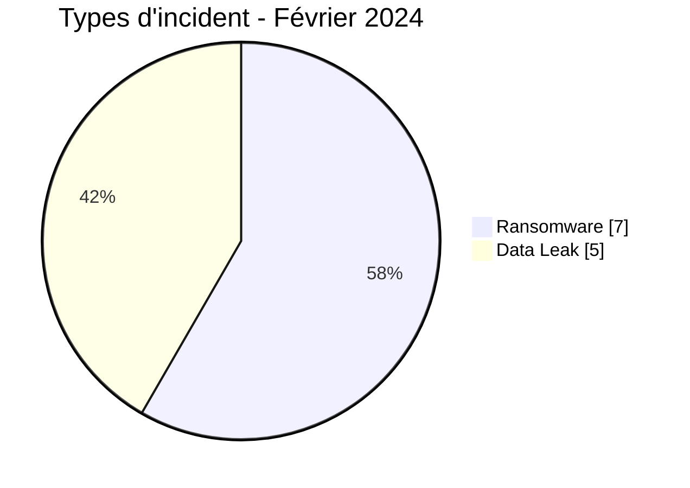
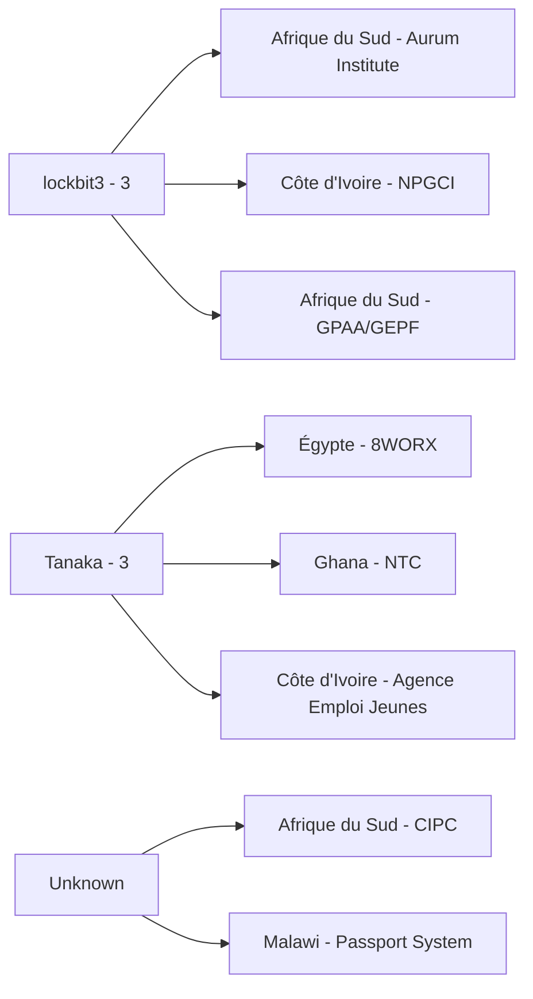
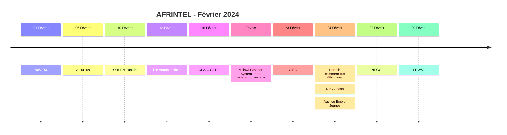

# Rapport CTI AFRINTEL - Février 2024

👉🏾 [English version](./README.md)

## 1. Résumé exécutif

AFRINTEL documente désormais **12 fiches incident** en février 2024 : **7 Ransomware** et **5 Data Leak**, dans **7 pays africains**. Aucun Access Sale, DDoS, Defacement ou Operational Fraud n'est présent dans le corpus corrigé de février.

Cette correction rétrospective ajoute trois dossiers précédemment absents : **GPAA/GEPF**, **CIPC** et le **système de délivrance des passeports du Malawi**. GPAA/GEPF correspond à un ransomware et une compromission de données personnelles confirmés par la victime. CIPC est enregistré principalement comme Data Leak, avec extorsion et défacement comme effets secondaires. Le Malawi est classé provisoirement en Ransomware car le gouvernement a déclaré une violation de cybersécurité et une demande de rançon, alors que la cause technique exacte reste contestée.

👉🏾 [Voir la liste complète des victimes](./victims_FR.md)

### 1.1 Comparaison avec le mois précédent

| Indicateur | Janvier 2024 | Février 2024 | Évolution |
|---|---:|---:|---:|
| Total incidents | 14 | **12** | **-2 (-14,3 %)** |
| Ransomware | 5 | **7** | **+2 (+40,0 %)** |
| Data Leak | 8 | **5** | **-3 (-37,5 %)** |
| Access Sale | 1 | **0** | **-1 (-100,0 %)** |
| DDoS | 0 | **0** | Stable |
| Defacement | 0 | **0** | Stable |
| Operational Fraud | 0 | **0** | Stable |

Le comparatif corrigé est sensiblement différent de l'ancien calcul 12 -> 9. Février reste inférieur à janvier en volume total, mais seulement de **14,3 %**, tandis que les Ransomware passent de 5 à 7.

## 2. Méthodologie

- **Période :** 1er au 29 février 2024.
- **Source de vérité :** couple harmonisé `victims_FR.md` / `victims.md`.
- **Comptage :** une fiche harmonisée correspond à un incident documenté.
- **Taxonomie :** Ransomware, Data Leak, Access Sale, DDoS, Defacement, Operational Fraud.
- **Corrections rétrospectives :** les incidents identifiés pendant l'audit historique du 23 août 2026 sont replacés dans leur mois réel de 2024 et conservent une date de correction AFRINTEL distincte.
- **GPAA/GEPF :** type principal Ransomware ; la compromission confirmée de données personnelles reste un effet du même incident, pas un second incident.
- **CIPC :** type principal Data Leak ; l'extorsion et le défacement sont conservés comme effets secondaires.
- **Système de passeports du Malawi :** mapping Ransomware provisoire ; la violation et la perturbation sont confirmées par le gouvernement, mais le déploiement technique exact d'un ransomware reste contesté.

## 3. Vue globale

### 3.1 Répartition par type d'incident

| Type d'incident | Fiches | Part |
|---|---:|---:|
| Ransomware | **7** | **58,3 %** |
| Data Leak | **5** | **41,7 %** |
| Access Sale | 0 | 0,0 % |
| DDoS | 0 | 0,0 % |
| Defacement | 0 | 0,0 % |
| Operational Fraud | 0 | 0,0 % |
| **Total** | **12** | **100 %** |

### 3.2 Répartition par pays

| Pays | Ransomware | Data Leak | Total |
|---|---:|---:|---:|
| 🇿🇦 Afrique du Sud | 3 | 1 | **4** |
| 🇪🇬 Égypte | 1 | 1 | 2 |
| 🇨🇮 Côte d'Ivoire | 1 | 1 | 2 |
| 🇬🇭 Ghana | 0 | 1 | 1 |
| 🇹🇳 Tunisie | 1 | 0 | 1 |
| 🇪🇹 Éthiopie | 0 | 1 | 1 |
| 🇲🇼 Malawi | 1 | 0 | 1 |
| **Total** | **7** | **5** | **12** |

### 3.3 Répartition régionale

| Région | Ransomware | Data Leak | Total |
|---|---:|---:|---:|
| Afrique australe | 4 | 1 | **5** |
| Afrique du Nord | 2 | 1 | **3** |
| Afrique de l'Ouest | 1 | 2 | **3** |
| Afrique de l'Est | 0 | 1 | **1** |
| Afrique centrale | 0 | 0 | **0** |
| **Total** | **7** | **5** | **12** |

### 3.4 Répartition sectorielle harmonisée

| Secteur | Fiches |
|---|---:|
| Government / Administration | **6** |
| Technology / IT | 2 |
| Manufacturing / Industry | 2 |
| Healthcare / Medical | 1 |
| Water / Utilities | 1 |
| **Total** | **12** |

### 3.5 Acteurs / groupes

| Acteur / Groupe | Fiches |
|---|---:|
| lockbit3 | **3** |
| Tanaka | **3** |
| Unknown | **2** |
| medusa | 1 |
| hunters | 1 |
| ThreatSec | 1 |
| dragonforce | 1 |

> `Unknown` désigne les dossiers non attribués. Le Malawi et la CIPC restent non attribués.

## 4. Analyse détaillée

### 4.1 Ransomware - 7 fiches

Le corpus corrigé de février contient sept fiches Ransomware.

L'ajout rétrospectif le plus significatif est **GPAA/GEPF**, où l'événement ransomware et l'accès à environ **168 000 dossiers de personnes** sont confirmés par la victime. Le dossier supplémentaire du système de passeports du Malawi conserve une réserve explicite : le gouvernement confirme une violation de cybersécurité et une demande de rançon, mais le déploiement technique d'un ransomware reste contesté.

### 4.2 Data Leak - 5 fiches

Le corpus Data Leak corrigé ajoute **CIPC** aux quatre dossiers déjà documentés. CIPC a officiellement signalé un accès non autorisé et l'exposition d'informations personnelles. Les menaces d'extorsion et le défacement du portail e-Services sont conservés comme effets secondaires et ne créent pas de fiches supplémentaires.

### 4.3 Qualification des preuves

Le corpus corrigé distingue explicitement :
- les faits confirmés par les victimes ;
- les revendications des acteurs ;
- les effets secondaires ;
- les mappings de taxonomie provisoires ;
- les volumes revendiqués et les volumes confirmés.

## 5. Principaux constats et lacunes

- Février passe de **9 à 12 fiches** après correction rétrospective.
- L'Afrique du Sud devient le pays le plus représenté avec **4 fiches**.
- Government / Administration devient le secteur dominant avec **6 fiches sur 12**.
- Les Ransomware représentent **58,3 %** du corpus corrigé.
- GPAA/GEPF augmente fortement l'impact confirmé du mois avec environ 168 000 dossiers concernés.
- Le Malawi reste analytiquement sensible : la perturbation et la déclaration gouvernementale de violation sont confirmées, tandis que la cause technique reste disputée.

## 6. Cartographie MITRE ATT&CK contextuelle

| Statut | Technique | Application |
|---|---|---|
| Observé / contexte ransomware confirmé | T1486 - Data Encrypted for Impact | Directement pertinent pour les cas ransomware confirmés comme GPAA/GEPF ; ne doit pas être étendu automatiquement à toutes les revendications. |
| Contextuel | T1005 - Data from Local System | Pertinent pour les fichiers locaux et données structurées exposés. |
| Contextuel | T1213 - Data from Information Repositories | Pertinent pour les bases et référentiels administratifs exposés. |
| Préventif | T1567 - Exfiltration Over Web Service | Contexte défensif lorsque le canal d'exfiltration n'est pas établi publiquement. |

## 7. Recommandations

- Séparer l'impact confirmé GPAA/GEPF des revendications plus larges de publication de LockBit.
- Conserver CIPC comme un seul incident multi-effets, et non comme des incidents Data Leak et Defacement séparés.
- Maintenir la réserve technique sur le Malawi et ne pas renforcer la qualification ransomware sans preuve technique primaire.
- Prioriser la protection des comptes privilégiés du secteur public, la protection de l'identité et la surveillance des exports de bases.
- Conserver séparément date de l'incident, date de publication et date de correction AFRINTEL.

## 8. Chronologie

## 9. Conclusion

Février 2024 contient désormais **12 fiches incident documentées dans 7 pays africains**, réparties entre **7 Ransomware et 5 Data Leak**.

Par rapport au janvier corrigé à 14 incidents, février baisse de **14,3 %**, tandis que les Ransomware progressent de **40,0 %** et les Data Leak reculent de **37,5 %**.

**AFRINTEL** - TLP:CLEAR
