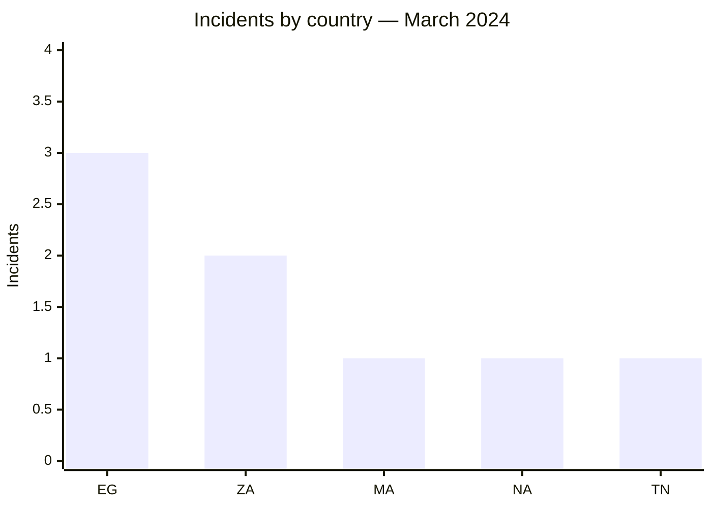
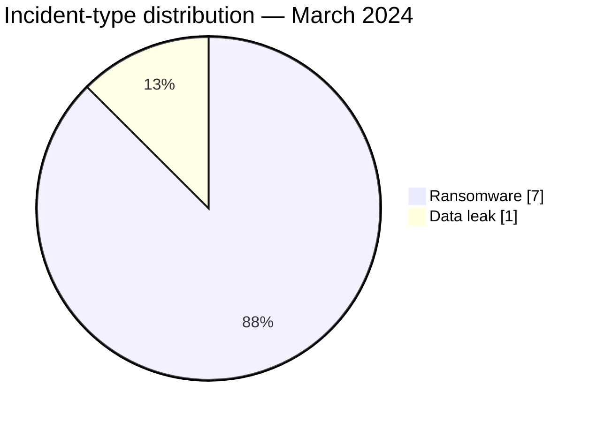

# AFRINTEL CTI Report — March 2024

👉🏾 [Version française](./README_FR.md)

## 1. Executive summary

March 2024 contains **8 documented incidents**: **7 ransomware claims** and **1 data leak**. Egypt ranks first with three publications, followed by South Africa with two. The entire corpus is concentrated in North Africa and Southern Africa.

LockBit3 appears four times and RansomHub twice. This repetition measures publication visibility, not a coordinated campaign. The only data leak concerns ESGC in Morocco; the observed sample increases confidence that a structured database existed but does not confirm the full volume or technical origin of the acquisition.

See [victims.md](./victims.md).

## 2. Methodology

This report covers publications assigned to March 2024. Each of the eight organizations is counted once and statuses describe the available evidence. No technical behavior is treated as observed solely because it is commonly associated with a named ransomware group.

Statistics derive from [victims.md](./victims.md), synchronized with [victims_FR.md](./victims_FR.md).

## 3. Global overview

| Indicator | Value |
|---|---:|
| Incidents | **8** |
| Countries | **5** |
| Ransomware | **7** |
| Data leaks | **1** |
| Access sales / Defacement | **0 / 0** |

### Country ranking

| Country | Total | Ransomware | Data leak |
|---|---:|---:|---:|
| 🇪🇬 Egypt | 3 | 3 | 0 |
| 🇿🇦 South Africa | 2 | 2 | 0 |
| 🇲🇦 Morocco | 1 | 0 | 1 |
| 🇳🇦 Namibia | 1 | 1 | 0 |
| 🇹🇳 Tunisia | 1 | 1 | 0 |
| **Total** | **8** | **7** | **1** |

### Regional distribution

| Region | Total | Ransomware | Data leak |
|---|---:|---:|---:|
| North Africa | 5 | 4 | 1 |
| Southern Africa | 3 | 3 | 0 |
| **Total** | **8** | **7** | **1** |

### Normalized sector distribution

| Sector | Incidents | Share |
|---|---:|---:|
| Finance / Banking | 2 | 25.0% |
| Government / Administration | 1 | 12.5% |
| Healthcare / Medical | 1 | 12.5% |
| Manufacturing / Industry | 1 | 12.5% |
| Media / Entertainment | 1 | 12.5% |
| Education / University | 1 | 12.5% |
| Oil & Energy | 1 | 12.5% |
| **Total** | **8** | **100%** |

### Most visible actors

| Actor | Incidents |
|---|---:|
| LockBit3 | 4 |
| RansomHub | 2 |
| Hunters | 1 |
| Unattributed source | 1 |

## 4. Detailed analysis by incident type

### 4.1 Ransomware

The seven publications cover public, financial, healthcare, industrial, energy, and media environments. Government Printing Works and PGESCo carry particular operational relevance, but the public corpus independently documents neither disruption, encryption, nor an exfiltrated volume.

### 4.2 Data leak

The ESGC publication references a 2021 database and approximately 500 entries. A sample was visible; personal data and password-related values are not reproduced. The sample supports plausible exposure without establishing a compromise that occurred in March 2024.

## 5. Sectoral impact

No sector clearly dominates except finance with two incidents. The sector spread increases the range of defensive scenarios but does not demonstrate a shared targeting strategy. Public, healthcare, and energy organizations should focus on operational continuity and control of privileged access.

## 6. Threat actor profile and risk assessment

| Country | Level | Rationale |
|---|---|---|
| 🇪🇬 Egypt | 🔴 High | Three ransomware claims across different sectors |
| 🇿🇦 South Africa | 🔴 High | Two publications, including a sensitive public entity |
| 🇲🇦 Morocco | 🟠 Medium | Leak with a sample, global volume unverified |
| 🇳🇦 Namibia / 🇹🇳 Tunisia | 🟡 Low to medium | One ransomware claim each |

## 7. Key trends and intelligence gaps

- **Observed — high confidence:** ransomware accounts for 7 of 8 incidents.
- **Observed — high confidence:** LockBit3 is associated with half the corpus.
- **Gap:** no public DFIR report was identified in the sources reviewed to confirm ransomware tradecraft.
- **Gap:** the sources do not establish whether the ESGC database was acquired in 2021 or republished later.
- **Collection need:** victim timelines, evidence of disruption, technical indicators, and provenance of the ESGC publication.

## 8. Contextual MITRE ATT&CK mapping

| Status | Technique | Use |
|---|---|---|
| Preventive | T1486 — Data Encrypted for Impact | Detection relevant to ransomware risk; encryption not publicly observed |
| Preventive | T1490 — Inhibit System Recovery | Backup-integrity control; behavior not observed |
| Preventive | T1567 — Exfiltration Over Web Service | Outbound-data monitoring; ESGC channel unknown |

## 9. Recommendations

- **Finance and public sector:** strengthen privileged-access controls and crisis procedures.
- **Healthcare and energy:** segment critical systems and test degraded operating modes.
- **Education:** reset affected accounts if exposure is confirmed and monitor credential reuse.
- **All organizations:** test restoration from isolated backups.

## 10. SOC and tactical recommendations

| Qualification | Action |
|---|---|
| **Observed** | Track the published domains and organizations; no intrusion TTP is confirmed by the corpus. |
| **Assumption** | Hunt for abnormal privileged authentication, database exports, and archive staging before publication dates. |
| **Preventive** | Alert on mass encryption, shadow-copy or backup deletion, and unusual outbound transfers. |

## 11. Strategic recommendations

| Priority | Qualification | Measure |
|---:|---|---|
| 1 | **Observed** | Prioritize the Egyptian and South African environments represented in the corpus. |
| 2 | **Assumption** | Check for shared exposed accounts or services without attributing an undocumented initial-access method. |
| 3 | **Preventive** | Reduce external exposure, require phishing-resistant MFA, and isolate backups. |

## 12. Conclusion

March is dominated by ransomware publications, with clear geographic concentration but limited public technical evidence. The ESGC leak provides more detail on data content than the other seven cases, without resolving acquisition timing. Defensive action should remain grounded in internal verification rather than presumed actor TTPs.

**AFRINTEL — TLP:CLEAR**
[AFRINTEL repository](https://github.com/Hatchepsoute/AFRINTEL)
