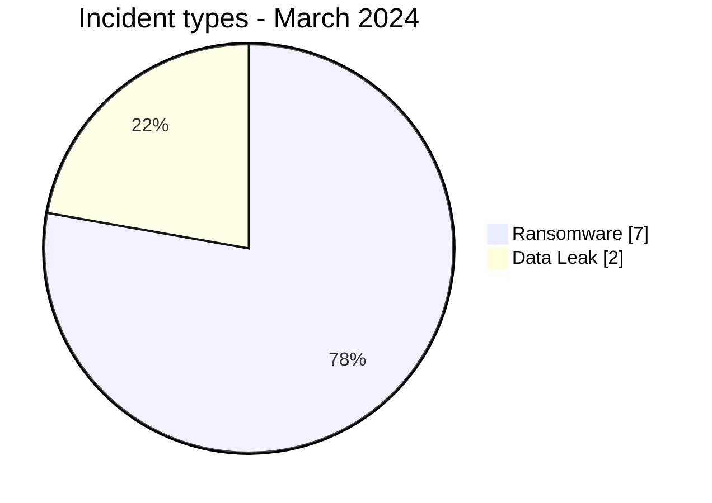
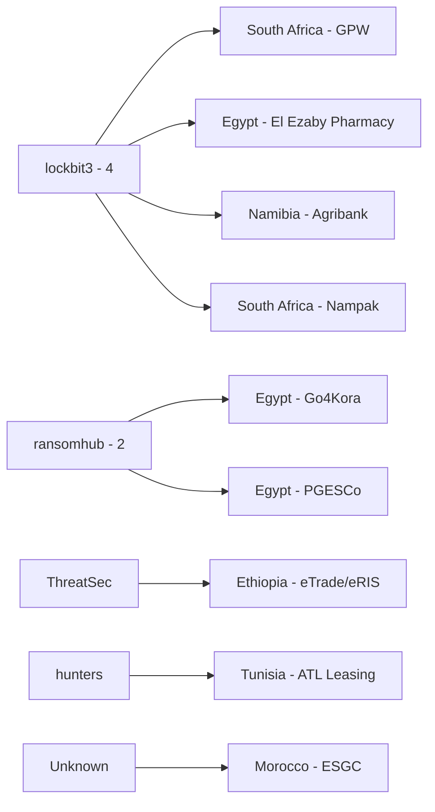
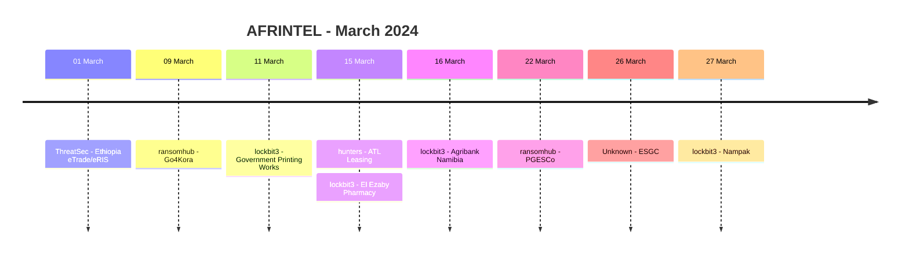

# AFRINTEL CTI Report - March 2024

👉🏾 [Version française](./README_FR.md)

## 1. Executive summary

AFRINTEL documents **9 incident records** in March 2024: **7 Ransomware** and **2 Data Leak**, across **6 African countries**. No Access Sale, DDoS, Defacement or Operational Fraud record is present in the validated March corpus.

Egypt ranks first with three incidents, followed by South Africa with two. `lockbit3` appears four times and `ransomhub` twice. This measures publication visibility, not a coordinated campaign.

The two Data Leak records concern ESGC in Morocco and a ThreatSec publication targeting Ethiopia's federal eTrade and eRIS portals. In the Ethiopian case, review of the provided five-page PDF supports the sample's structural plausibility but does not confirm provenance from the portals or the existence of all 43 claimed files.

👉🏾 [View the full victim list](./victims.md)

### 1.1 Month-over-month comparison

| Indicator | February 2024 | March 2024 | Change |
|---|---:|---:|---:|
| Total incidents | 12 | **9** | **-3 (-25.0%)** |
| Ransomware | 7 | **7** | **0 (stable)** |
| Data Leak | 5 | **2** | **-3 (-60.0%)** |
| Access Sale | 0 | **0** | Stable |
| DDoS | 0 | **0** | Stable |
| Defacement | 0 | **0** | Stable |
| Operational Fraud | 0 | **0** | Stable |

The corrected February baseline changes the month-over-month interpretation. March is **25.0% lower in total volume**, but the number of Ransomware records remains unchanged at 7. The decline comes entirely from Data Leak, which falls from 5 to 2.

## 2. Methodology

- **Period:** 1-31 March 2024.
- **Source of truth:** harmonized `victims_FR.md` / `victims.md`.
- **Counting:** one harmonized card equals one documented incident record.
- **Taxonomy:** Ransomware, Data Leak, Access Sale, DDoS, Defacement, Operational Fraud.
- **Retrospective correction registry:** none of the 10 identified missing 2024 incidents belongs to March, so no additional incident is injected into this month.
- The Ethiopia entry is assigned to March 1 according to the maintained AFRINTEL chronology, while its source publication is dated August 24, 2023.
- Technical behavior is not treated as observed solely because it is commonly associated with a named actor.

## 3. Global overview

### 3.1 Incident-type distribution

| Incident type | Records | Share |
|---|---:|---:|
| Ransomware | **7** | **77.8%** |
| Data Leak | **2** | **22.2%** |
| Access Sale | 0 | 0.0% |
| DDoS | 0 | 0.0% |
| Defacement | 0 | 0.0% |
| Operational Fraud | 0 | 0.0% |
| **Total** | **9** | **100%** |

### 3.2 Country distribution

| Country | Ransomware | Data Leak | Total |
|---|---:|---:|---:|
| 🇪🇬 Egypt | 3 | 0 | **3** |
| 🇿🇦 South Africa | 2 | 0 | **2** |
| 🇪🇹 Ethiopia | 0 | 1 | 1 |
| 🇲🇦 Morocco | 0 | 1 | 1 |
| 🇳🇦 Namibia | 1 | 0 | 1 |
| 🇹🇳 Tunisia | 1 | 0 | 1 |
| **Total** | **7** | **2** | **9** |

### 3.3 Regional distribution

| Region | Ransomware | Data Leak | Total |
|---|---:|---:|---:|
| North Africa | 4 | 1 | **5** |
| Southern Africa | 3 | 0 | **3** |
| East Africa | 0 | 1 | **1** |
| West Africa | 0 | 0 | 0 |
| Central Africa | 0 | 0 | 0 |
| **Total** | **7** | **2** | **9** |

### 3.4 Harmonized sector distribution

| Sector | Records |
|---|---:|
| Finance / Banking | 2 |
| Government / Administration | 2 |
| Media / Entertainment | 1 |
| Healthcare / Medical | 1 |
| Energy / Utilities | 1 |
| Education / University | 1 |
| Manufacturing / Industry | 1 |
| **Total** | **9** |

### 3.5 Actors / groups

| Actor / Group | Records |
|---|---:|
| lockbit3 | **4** |
| ransomhub | **2** |
| ThreatSec | 1 |
| hunters | 1 |
| Unknown | 1 |
| **Total** | **9** |

## 4. Detailed analysis

### 4.1 Ransomware - 7 records

The seven Ransomware records cover government, finance, healthcare, manufacturing, energy and media environments.

Government Printing Works and PGESCo have particular operational relevance, but the source corpus does not independently establish disruption, encryption or an exfiltrated volume for those claims.

### 4.2 Data Leak - 2 records

The ESGC publication references a 2021 database and approximately 500 entries. A sample was visible, but the complete dataset and alleged compromise were not independently verified.

The ThreatSec publication concerning Ethiopia claims collection of 43 files from eTrade and eRIS. The locally reviewed PDF contains five scanned pages of an Amharic-language administrative and contractual document with stamps, signatures and financial amounts. This supports documentary plausibility, but not direct provenance from the portals, the existence of the other 42 files or the acquisition method.

## 5. Key findings and intelligence gaps

- Ransomware accounts for **7 of 9 records (77.8%)**.
- `lockbit3` is associated with **4 of 9 records**.
- Compared with corrected February, Ransomware volume is stable while Data Leak drops by **60.0%**.
- The two Data Leak records provide samples, but neither establishes the full advertised scope.
- No public DFIR evidence in the reviewed corpus confirms a common ransomware intrusion chain.

## 6. Contextual MITRE ATT&CK mapping

| Status | Technique | Application |
|---|---|---|
| Preventive | T1486 - Data Encrypted for Impact | Relevant to Ransomware risk; encryption not publicly observed for the March claims. |
| Preventive | T1490 - Inhibit System Recovery | Backup-integrity control; behavior not observed in the corpus. |
| Contextual | T1213 - Data from Information Repositories | Relevant to structured repository/database exposure in Data Leak cases. |
| Preventive | T1567 - Exfiltration Over Web Service | Outbound-data monitoring context; acquisition and exfiltration channels remain unknown. |

## 7. Recommendations

- Finance and public-sector organizations should strengthen privileged-access controls and crisis procedures.
- Healthcare and energy organizations should segment critical systems and test degraded operating modes.
- Education organizations should reset affected accounts if exposure is confirmed and monitor credential reuse.
- All organizations should test restoration from isolated backups.
- Preserve source-publication dates separately from AFRINTEL assignment dates.

## 8. Timeline

## 9. Conclusion

March 2024 contains **9 documented incident records across 6 African countries**, comprising **7 Ransomware and 2 Data Leak**.

Compared with corrected February, total volume decreases by **25.0%**. Ransomware remains stable at 7 records, while Data Leak falls from 5 to 2.

**AFRINTEL** - TLP:CLEAR
