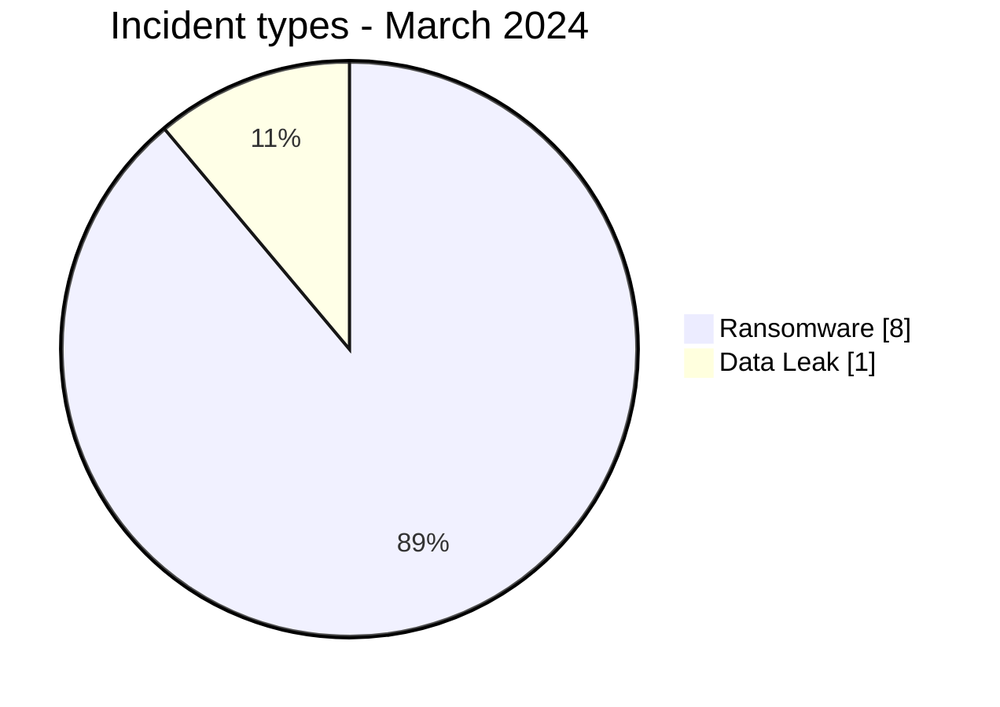

# AFRINTEL CTI Report - Cyber Threats in Africa - March 2024

👉🏾 [Version française](./README_FR.md)

## 1. Executive summary

In March 2024, AFRINTEL retains **9 canonical cyber incidents across 6 countries**. The month is led by **Ransomware (8, 88.9%)** followed by **Data Leak (1, 11.1%)**. Leading countries are **Egypt (3)**, **South Africa (2)**, **Tunisia (1)**. Leading sectors are **Government / Administration (2)**, **Finance / Banking (2)**, **Media / Entertainment (1)**. Most frequent actor/group labels are `lockbit3` (4), `ransomhub` (2), `Unknown` (2). `Unknown` means missing attribution, not an actor.

### 1.1 Month-over-month study

| Indicator | February 2024 | March 2024 | Change |
|---|---|---|---|
| Total | 8 | 9 | +1 (+12.5%) |
| Ransomware | 6 | 8 | +2 (+33.3%) |
| Data Leak | 1 | 1 | Stable |
| Access Sale | 0 | 0 | Stable |
| DDoS | 0 | 0 | Stable |
| Defacement | 0 | 0 | Stable |
| Account Takeover | 0 | 0 | Stable |
| System Intrusion | 1 | 0 | -1 (-100.0%) |
| Malware | 0 | 0 | Stable |
| Operational Fraud | 0 | 0 | Stable |

### 1.2 Comparative analysis

Monthly volume **increases by 1 incident(s)**. Structural changes are: Ransomware 6->8 (+2), System Intrusion 1->0 (-1). This describes the documented corpus and does not necessarily equal the change in real compromises across the continent.

## 2. Methodology

- One canonical incident equals one event retained in the 2024 year.
- Historical discoveries/republications are preserved separately and do not inflate 2024 statistics.
- Incident date or best-supported window takes precedence; AFRINTEL discovery date remains separate.
- Nine AFRINTEL types are used; attempts are represented by status, never by an `Attempted Attack` type.
- Coordinated DDoS is counted by campaign.
- Type, status, confidence, impact, attribution, and source remain separate.

## 3. Incident-type distribution

| Type | Records | Share |
|---|---|---|
| Ransomware | 8 | 88.9% |
| Data Leak | 1 | 11.1% |
| Access Sale | 0 | 0.0% |
| DDoS | 0 | 0.0% |
| Defacement | 0 | 0.0% |
| Account Takeover | 0 | 0.0% |
| System Intrusion | 0 | 0.0% |
| Malware | 0 | 0.0% |
| Operational Fraud | 0 | 0.0% |

## 4. Country x type

| Country | Total | Ransomware | Data Leak | Access Sale | DDoS | Defacement | Account Takeover | System Intrusion | Malware | Operational Fraud |
|---|---|---|---|---|---|---|---|---|---|---|
| Egypt | 3 | 3 | 0 | 0 | 0 | 0 | 0 | 0 | 0 | 0 |
| South Africa | 2 | 2 | 0 | 0 | 0 | 0 | 0 | 0 | 0 | 0 |
| Tunisia | 1 | 1 | 0 | 0 | 0 | 0 | 0 | 0 | 0 | 0 |
| Cabo Verde | 1 | 1 | 0 | 0 | 0 | 0 | 0 | 0 | 0 | 0 |
| Namibia | 1 | 1 | 0 | 0 | 0 | 0 | 0 | 0 | 0 | 0 |
| Morocco | 1 | 0 | 1 | 0 | 0 | 0 | 0 | 0 | 0 | 0 |

## 5. Regional distribution

| Region | Records | Share |
|---|---|---|
| North Africa | 5 | 55.6% |
| Southern Africa | 3 | 33.3% |
| West Africa | 1 | 11.1% |

## 6. Sector distribution

| Sector | Records | Share |
|---|---|---|
| Government / Administration | 2 | 22.2% |
| Finance / Banking | 2 | 22.2% |
| Media / Entertainment | 1 | 11.1% |
| Healthcare / Medical | 1 | 11.1% |
| Energy / Utilities | 1 | 11.1% |
| Education / University | 1 | 11.1% |
| Manufacturing / Industry | 1 | 11.1% |

## 7. Actors / groups

| Actor / Group | Records | Share |
|---|---|---|
| lockbit3 | 4 | 44.4% |
| ransomhub | 2 | 22.2% |
| Unknown | 2 | 22.2% |
| hunters | 1 | 11.1% |

## 8. Evidence maturity

| Evidence position | Records | Share |
|---|---|---|
| Claim - Unverified | 7 | 77.8% |
| Confirmed | 1 | 11.1% |
| Claim - Data Sample Published | 1 | 11.1% |

### Confidence

| Confidence | Records | Share |
|---|---|---|
| Low | 7 | 77.8% |
| Very High | 1 | 11.1% |
| Medium | 1 | 11.1% |

## 9. Timeline

```mermaid
timeline
    title AFRINTEL - March 2024
    9 Mars 2024 : Go4Kora
- **Acteur / Groupe -** ransomhub
- **Secteur -** Media / Entertainment
- **Site web -** [go4kora.tv](https -//go4kora.tv)
- **Statut -** Claim - Unverified
- **Type d'incident -** Ransomware
- **Niveau de confiance -** Low
- **Niveau d'impact -** Level 2
- **Description victime -** Go4Kora est un portail d'actualités sportives et de streaming en direct largement suivi en Égypte et dans la région MENA pour la diffusion du football.

----------------------------
    11 Mars 2024 : Government Printing Works (GPW)
- **Acteur / Groupe -** lockbit3
- **Secteur -** Government / Administration
- **Site web -** [gpw.gov.za](https -//www.gpw.gov.za)
- **Statut -** Claim - Unverified
- **Type d'incident -** Ransomware
- **Niveau de confiance -** Low
- **Niveau d'impact -** Level 3
- **Description victime -** Le Government Printing Works d'Afrique du Sud est une entité publique sous la tutelle du ministère de l'Intérieur, chargée de la production des documents d'identité sécurisés, des passeports et des bulletins officiels.

----------------------------
    15 Mars 2024 : ATL Leasing
- **Acteur / Groupe -** hunters
- **Secteur -** Finance / Banking
- **Site web -** [atlleasing.com.tn](https -//www.atlleasing.com.tn)
- **Statut -** Claim - Unverified
- **Type d'incident -** Ransomware
- **Niveau de confiance -** Low
- **Niveau d'impact -** Level 3
- **Description victime -** Arab Tunisian Leasing (ATL) est une institution financière de premier plan cotée à la Bourse de Tunis, spécialisée dans le financement par crédit-bail d'équipements professionnels et immobiliers.

----------------------------
    15 Mars 2024 : El Ezaby Pharmacy
- **Acteur / Groupe -** lockbit3
- **Secteur -** Healthcare / Medical
- **Site web -** [elezabypharmacy.com](https -//www.elezabypharmacy.com)
- **Statut -** Claim - Unverified
- **Type d'incident -** Ransomware
- **Niveau de confiance -** Low
- **Niveau d'impact -** Level 3
- **Description victime -** Pharmacies El Ezaby représente l'un des plus grands réseaux de distribution pharmaceutique en Égypte, exploitant de nombreuses officines et une logistique de livraison nationale.

----------------------------
    15 Mars 2024 - date rapportée : Assembleia Nacional de Cabo Verde
- **Date de l'incident -** 15 Mars 2024 - date rapportée
- **Date de publication initiale / source retenue -** 22 mars 2024
- **Date de découverte AFRINTEL -** 23 août 2026 - audit rétrospectif
- **Précision chronologique -** Début rapporté le vendredi 15 mars ; la publication de référence est du 22 mars.
- **Acteur / Groupe -** Unknown
- **Secteur -** Government / Administration
- **Site web -** [parlamento.cv](https -//www.parlamento.cv/)
- **Statut -** Victim Confirmed
- **Type d'incident -** Ransomware
- **Niveau de confiance -** Very High
- **Niveau d'impact -** Level 4
- **Analyse -** Le responsable de la communication et de la sécurité de l'information du Parlement a confirmé un ransomware ayant chiffré plusieurs serveurs dans un segment du réseau. Le fonctionnement parlementaire a été perturbé et certains serveurs ont dû être récupérés. Les sources examinées ne suffisent pas à établir une exfiltration de données ; elle n'est donc pas déduite.
- **Sources publiques -** [RTC Cabo Verde](https -//www.rtc.cv/noticia/noticia-details/ataque-cibernetico-esta-a-condicionar-o-funcionamento-da-assembleia-nacional-12835) | [KonBriefing](https -//konbriefing.com/en-topics/cyber-attacks-2024.html)

----------------------------
    16 Mars 2024 : Agribank Namibia
- **Acteur / Groupe -** lockbit3
- **Secteur -** Finance / Banking
- **Site web -** [agribank.com.na](https -//www.agribank.com.na)
- **Statut -** Claim - Unverified
- **Type d'incident -** Ransomware
- **Niveau de confiance -** Low
- **Niveau d'impact -** Level 3
- **Description victime -** L'Agricultural Bank of Namibia est une institution bancaire étatique spécialisée dans le financement de l'expansion agricole, de l'aquaculture et de l'acquisition de terres rurales.

----------------------------
    22 Mars 2024 : PGESCo
- **Acteur / Groupe -** ransomhub
- **Secteur -** Energy / Utilities
- **Site web -** [pgesco.com](https -//www.pgesco.com)
- **Statut -** Claim - Unverified
- **Type d'incident -** Ransomware
- **Niveau de confiance -** Low
- **Niveau d'impact -** Level 3
- **Description victime -** La Power Generation Engineering and Services Company (PGESCo) est une firme d'ingénierie égyptienne majeure fournissant des services de conseil et de gestion de projet pour les centrales électriques et les infrastructures pétrolières.

----------------------------
    26 Mars 2024 : Higher School of Commerce and Management (ESGC.MA)
- **Acteur / Groupe -** Unknown
- **Secteur -** Education / University
- **Site web -** [esgc.ma](https -//esgc.ma)
- **Statut -** Claim - Data Sample Published
- **Niveau de confiance -** Medium
- **Niveau d'impact -** Level 3
- **Type d'incident -** Data Leak
- **Description victime -** ESGC.MA est présentée comme un établissement marocain d'enseignement supérieur spécialisé dans le commerce et le management.

- **Analyse -** La publication de forum du 26 mars 2024 affirme qu'une base de 2021 contenait environ 500 entrées avec des noms, adresses électroniques, hashes de mots de passe, numéros de téléphone et dates de création de comptes. Un échantillon était affiché, mais le jeu de données complet et la compromission alléguée n'ont pas été vérifiés indépendamment. Les données personnelles et identifiants de l'échantillon ne sont pas reproduits ici.

----------------------------
    27 Mars 2024 : Nampak
- **Acteur / Groupe -** lockbit3
- **Secteur -** Manufacturing / Industry
- **Site web -** [nampak.com](https -//www.nampak.com)
- **Statut -** Claim - Unverified
- **Type d'incident -** Ransomware
- **Niveau de confiance -** Low
- **Niveau d'impact -** Level 2
- **Description victime -** Nampak est le plus grand fabricant d'emballages du continent africain, basé en Afrique du Sud, fournissant des solutions de conditionnement en métal, plastique, papier et verre.

----------------------------
```

## 10. CTI analysis by type

### Ransomware - 8

**8 record(s) (88.9%).** Leading countries: Egypt (3), South Africa (2), Tunisia (1). Conclusions remain limited to documented evidence; the incident type does not justify inferring an unobserved vector or impact.

### Data Leak - 1

**1 record(s) (11.1%).** Leading countries: Morocco (1). Conclusions remain limited to documented evidence; the incident type does not justify inferring an unobserved vector or impact.

## 11. Priority incidents for review

| Country | Organization | Type | Status | Impact | Confidence |
|---|---|---|---|---|---|
| Cabo Verde | Assembleia Nacional de Cabo Verde
- **Date de l'incident:** 15 Mars 2024 - date rapportée
- **Date de publication initiale / source retenue:** 22 mars 2024
- **Date de découverte AFRINTEL:** 23 août 2026 - audit rétrospectif
- **Précision chronologique:** Début rapporté le vendredi 15 mars ; la publication de référence est du 22 mars.
- **Acteur / Groupe:** Unknown
- **Secteur:** Government / Administration
- **Site web:** [parlamento.cv](https://www.parlamento.cv/)
- **Statut:** Victim Confirmed
- **Type d'incident:** Ransomware
- **Niveau de confiance:** Very High
- **Niveau d'impact:** Level 4
- **Analyse:** Le responsable de la communication et de la sécurité de l'information du Parlement a confirmé un ransomware ayant chiffré plusieurs serveurs dans un segment du réseau. Le fonctionnement parlementaire a été perturbé et certains serveurs ont dû être récupérés. Les sources examinées ne suffisent pas à établir une exfiltration de données ; elle n'est donc pas déduite.
- **Sources publiques:** [RTC Cabo Verde](https://www.rtc.cv/noticia/noticia-details/ataque-cibernetico-esta-a-condicionar-o-funcionamento-da-assembleia-nacional-12835) | [KonBriefing](https://konbriefing.com/en-topics/cyber-attacks-2024.html)

---------------------------- | Ransomware | Victim Confirmed | Level 4 | Very High |
| Morocco | Higher School of Commerce and Management (ESGC.MA)
- **Acteur / Groupe:** Unknown
- **Secteur:** Education / University
- **Site web:** [esgc.ma](https://esgc.ma)
- **Statut:** Claim - Data Sample Published
- **Niveau de confiance:** Medium
- **Niveau d'impact:** Level 3
- **Type d'incident:** Data Leak
- **Description victime:** ESGC.MA est présentée comme un établissement marocain d'enseignement supérieur spécialisé dans le commerce et le management.

- **Analyse:** La publication de forum du 26 mars 2024 affirme qu'une base de 2021 contenait environ 500 entrées avec des noms, adresses électroniques, hashes de mots de passe, numéros de téléphone et dates de création de comptes. Un échantillon était affiché, mais le jeu de données complet et la compromission alléguée n'ont pas été vérifiés indépendamment. Les données personnelles et identifiants de l'échantillon ne sont pas reproduits ici.

---------------------------- | Data Leak | Claim - Data Sample Published | Level 3 | Medium |
| South Africa | Government Printing Works (GPW)
- **Acteur / Groupe:** lockbit3
- **Secteur:** Government / Administration
- **Site web:** [gpw.gov.za](https://www.gpw.gov.za)
- **Statut:** Claim - Unverified
- **Type d'incident:** Ransomware
- **Niveau de confiance:** Low
- **Niveau d'impact:** Level 3
- **Description victime:** Le Government Printing Works d'Afrique du Sud est une entité publique sous la tutelle du ministère de l'Intérieur, chargée de la production des documents d'identité sécurisés, des passeports et des bulletins officiels.

---------------------------- | Ransomware | Claim - Unverified | Level 3 | Low |
| Tunisia | ATL Leasing
- **Acteur / Groupe:** hunters
- **Secteur:** Finance / Banking
- **Site web:** [atlleasing.com.tn](https://www.atlleasing.com.tn)
- **Statut:** Claim - Unverified
- **Type d'incident:** Ransomware
- **Niveau de confiance:** Low
- **Niveau d'impact:** Level 3
- **Description victime:** Arab Tunisian Leasing (ATL) est une institution financière de premier plan cotée à la Bourse de Tunis, spécialisée dans le financement par crédit-bail d'équipements professionnels et immobiliers.

---------------------------- | Ransomware | Claim - Unverified | Level 3 | Low |
| Egypt | El Ezaby Pharmacy
- **Acteur / Groupe:** lockbit3
- **Secteur:** Healthcare / Medical
- **Site web:** [elezabypharmacy.com](https://www.elezabypharmacy.com)
- **Statut:** Claim - Unverified
- **Type d'incident:** Ransomware
- **Niveau de confiance:** Low
- **Niveau d'impact:** Level 3
- **Description victime:** Pharmacies El Ezaby représente l'un des plus grands réseaux de distribution pharmaceutique en Égypte, exploitant de nombreuses officines et une logistique de livraison nationale.

---------------------------- | Ransomware | Claim - Unverified | Level 3 | Low |

> Structured selection based on impact, status, and confidence; not an absolute severity ranking.

## 12. Intelligence gaps and corrections

- initial-access vector often unknown;
- technical compromise date may differ from publication date;
- claimed volumes are rarely fully verifiable;
- technical attribution is often limited to the publication account;
- historical republications are tracked separately.

## 13. Recommendations

- phishing-resistant MFA, PAM, and least privilege;
- segmentation, immutable backups, and restoration testing;
- centralized EDR/IAM/VPN/WAF/DNS/cloud/application logging;
- detection of mass exports, unusual archives, and outbound transfers;
- separate preservation of incident, initial-publication, repost, and AFRINTEL discovery dates.

## 14. Conclusion

March 2024 contains **9 canonical incidents**. Month-over-month comparison uses the same taxonomy and chronology rules, except January where December 2023 remains `N/A` because no equivalent re-audit has been completed.

👉🏾 [Canonical victims](./victims.md)

**AFRINTEL** - TLP:CLEAR
