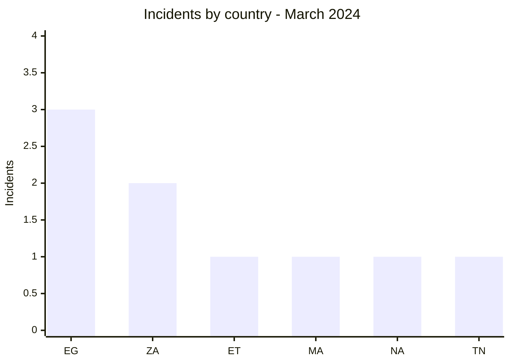
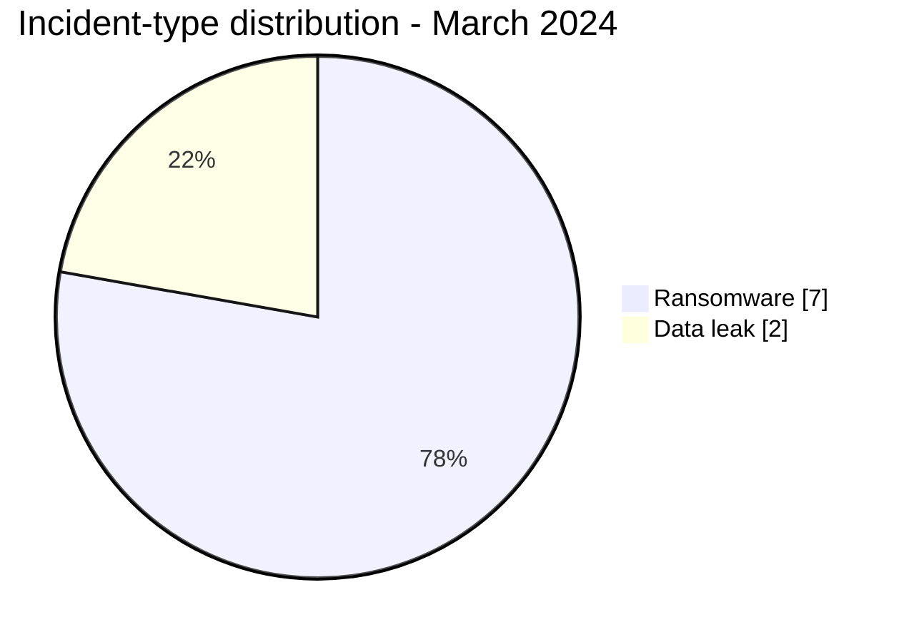

# AFRINTEL CTI Report - March 2024

👉🏾 [Version française](./README_FR.md)

## 1. Executive summary

March 2024 contains **9 documented incidents**: **7 ransomware claims** and **2 data leaks**. Egypt ranks first with three publications, followed by South Africa with two. The addition of Ethiopia extends the corpus to East Africa alongside North Africa and Southern Africa.

LockBit3 appears four times and RansomHub twice. This repetition measures publication visibility, not a coordinated campaign. The two data leaks concern ESGC in Morocco and a publication attributed to ThreatSec targeting Ethiopia's federal eTrade and eRIS portals. In the Ethiopian case, review of all five pages of the provided PDF supports the sample's structural plausibility but does not confirm its provenance from the portals or the 43 claimed files.

See [victims.md](./victims.md).

## 2. Methodology

This report covers the nine incidents assigned to March 2024. Each publication is counted once and statuses describe the available evidence. The Ethiopian entry is filed under March 1 at the maintainer's request, while its source publication is dated August 24, 2023. No technical behavior is treated as observed solely because it is commonly associated with a named actor.

Statistics derive from [victims.md](./victims.md), synchronized with [victims_FR.md](./victims_FR.md).

## 3. Global overview

| Indicator | Value |
|---|---:|
| Incidents | **9** |
| Countries | **6** |
| Ransomware | **7** |
| Data leaks | **2** |
| Access sales / Defacement | **0 / 0** |

### Country ranking

| Country | Total | Ransomware | Data leak |
|---|---:|---:|---:|
| 🇪🇬 Egypt | 3 | 3 | 0 |
| 🇿🇦 South Africa | 2 | 2 | 0 |
| 🇪🇹 Ethiopia | 1 | 0 | 1 |
| 🇲🇦 Morocco | 1 | 0 | 1 |
| 🇳🇦 Namibia | 1 | 1 | 0 |
| 🇹🇳 Tunisia | 1 | 1 | 0 |
| **Total** | **9** | **7** | **2** |

### Regional distribution

| Region | Total | Ransomware | Data leak |
|---|---:|---:|---:|
| North Africa | 5 | 4 | 1 |
| Southern Africa | 3 | 3 | 0 |
| East Africa | 1 | 0 | 1 |
| **Total** | **9** | **7** | **2** |

### Normalized sector distribution

| Sector | Incidents | Share |
|---|---:|---:|
| Finance / Banking | 2 | 22.2% |
| Government / Administration | 2 | 22.2% |
| Healthcare / Medical | 1 | 11.1% |
| Manufacturing / Industry | 1 | 11.1% |
| Media / Entertainment | 1 | 11.1% |
| Education / University | 1 | 11.1% |
| Oil & Energy | 1 | 11.1% |
| **Total** | **9** | **100%** |

Displayed shares are rounded to one decimal place; raw counts total 9.

### Most visible actors

| Actor | Incidents |
|---|---:|
| LockBit3 | 4 |
| RansomHub | 2 |
| Hunters | 1 |
| ThreatSec | 1 |
| Unattributed source | 1 |

## 4. Detailed analysis by incident type

### 4.1 Ransomware

The seven publications cover public, financial, healthcare, industrial, energy, and media environments. Government Printing Works and PGESCo carry particular operational relevance, but the public corpus independently documents neither disruption, encryption, nor an exfiltrated volume.

### 4.2 Data leak

The ESGC publication references a 2021 database and approximately 500 entries. A sample was visible; personal data and password-related values are not reproduced. The publication attributed to ThreatSec separately claims collection of 43 files from eTrade and eRIS. The single provided and reviewed PDF contains five scanned pages of an Amharic-language administrative and contractual document with stamps, signatures, and financial amounts. This documentary consistency confirms neither access to the two portals, the existence of the other 42 files, nor the acquisition method.

## 5. Sectoral impact

Finance and government each account for two incidents. The sector spread increases the range of defensive scenarios but does not demonstrate a shared targeting strategy. Public, healthcare, and energy organizations should focus on operational continuity, control of privileged access, and protection of administrative documents.

## 6. Threat actor profile and risk assessment

| Country | Level | Rationale |
|---|---|---|
| 🇪🇬 Egypt | 🔴 High | Three ransomware claims across different sectors |
| 🇿🇦 South Africa | 🔴 High | Two publications, including a sensitive public entity |
| 🇪🇹 Ethiopia | 🟠 Medium | Publication concerning two federal portals and a reviewed five-page PDF; provenance unconfirmed |
| 🇲🇦 Morocco | 🟠 Medium | Leak with a sample, global volume unverified |
| 🇳🇦 Namibia / 🇹🇳 Tunisia | 🟡 Low to medium | One ransomware claim each |

## 7. Key trends and intelligence gaps

- **Observed, high confidence:** ransomware accounts for 7 of 9 incidents.
- **Observed, high confidence:** LockBit3 is associated with four of nine incidents.
- **Observed, medium confidence:** both leaks include a published sample; only the provided Ethiopian PDF could be reviewed across all visible pages.
- **Gap:** no public DFIR report was identified in the sources reviewed to confirm ransomware tradecraft.
- **Gap:** the sources do not establish whether the ESGC database was acquired in 2021 or republished later, or directly link the Ethiopian PDF to eTrade or eRIS.
- **Collection need:** victim timelines, evidence of disruption, technical indicators, provenance of the ESGC publication, and evidence connecting the claimed files to the two Ethiopian portals.

## 8. Contextual MITRE ATT&CK mapping

| Status | Technique | Use |
|---|---|---|
| Preventive | T1486 - Data Encrypted for Impact | Detection relevant to ransomware risk; encryption not publicly observed |
| Preventive | T1490 - Inhibit System Recovery | Backup-integrity control; behavior not observed |
| Preventive | T1567 - Exfiltration Over Web Service | Outbound-data monitoring; acquisition and exfiltration channels unknown for both leaks |

## 9. Recommendations

- **Finance and public sector:** strengthen privileged-access controls and crisis procedures.
- **Healthcare and energy:** segment critical systems and test degraded operating modes.
- **Education:** reset affected accounts if exposure is confirmed and monitor credential reuse.
- **All organizations:** test restoration from isolated backups.

## 10. SOC and tactical recommendations

| Qualification | Action |
|---|---|
| **Observed** | Track the published domains and organizations; no intrusion TTP is confirmed by the corpus. |
| **Assumption** | Hunt for abnormal privileged authentication, database exports, and archive staging before publication dates. |
| **Preventive** | Alert on mass encryption, shadow-copy or backup deletion, and unusual outbound transfers. |

## 11. Strategic recommendations

| Priority | Qualification | Measure |
|---:|---|---|
| 1 | **Observed** | Prioritize the Egyptian and South African environments, together with the Ethiopian federal portals represented in the corpus. |
| 2 | **Assumption** | Check for shared exposed accounts or services without attributing an undocumented initial-access method. |
| 3 | **Preventive** | Reduce external exposure, require phishing-resistant MFA, and isolate backups. |

## 12. Conclusion

March remains dominated by ransomware publications, with clear geographic concentration but limited public technical evidence. The two leaks provide more documentary detail: an ESGC excerpt and a reviewed five-page Ethiopian PDF. They still do not resolve the complete timeline, technical provenance, or claimed global volumes. Defensive action should remain grounded in internal verification rather than presumed actor TTPs.

**AFRINTEL - TLP:CLEAR**
[AFRINTEL repository](https://github.com/Hatchepsoute/AFRINTEL)
