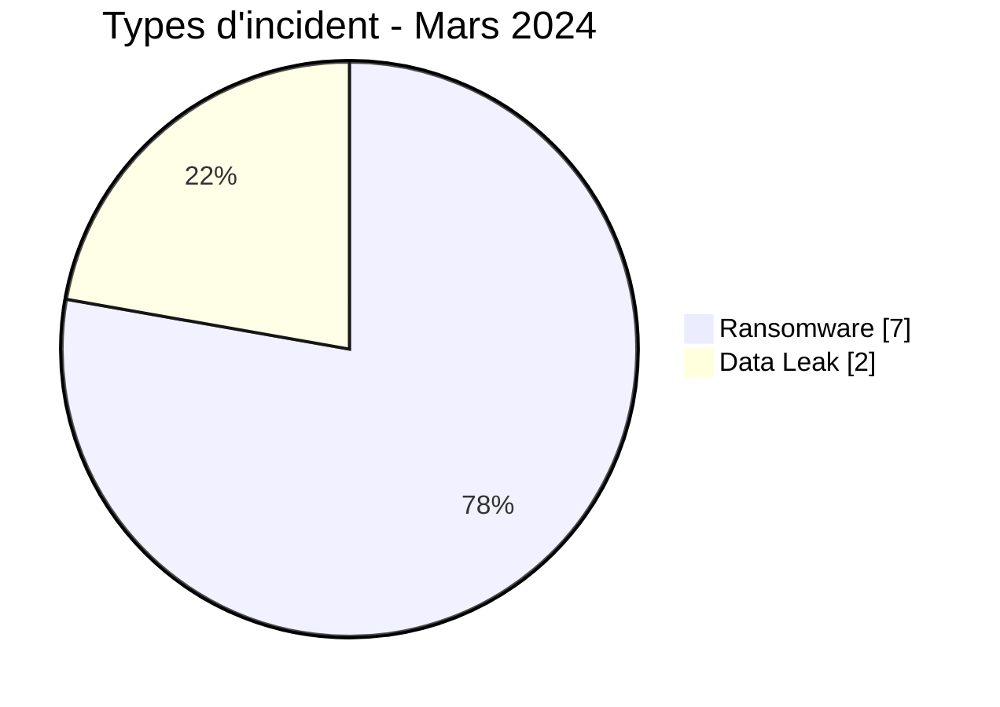
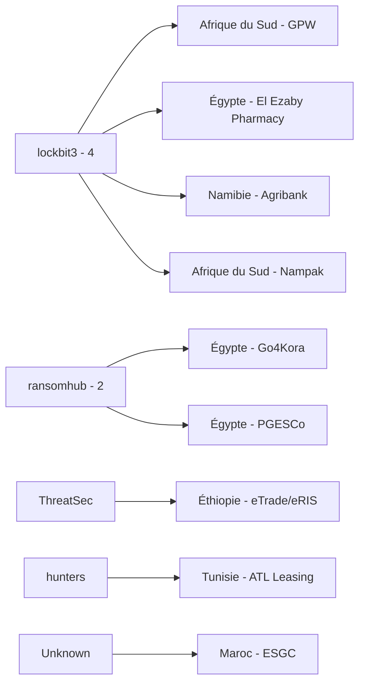
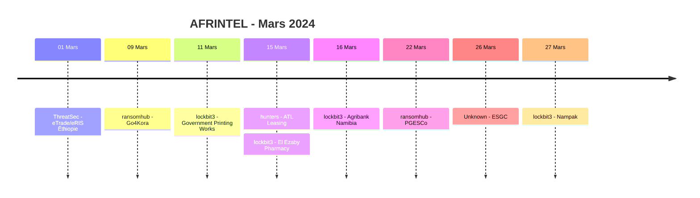

# Rapport CTI AFRINTEL - Mars 2024

👉🏾 [English version](./README.md)

## 1. Résumé exécutif

AFRINTEL documente **9 fiches incident** en mars 2024 : **7 Ransomware** et **2 Data Leak**, dans **6 pays africains**. Aucun Access Sale, DDoS, Defacement ou Operational Fraud n'est présent dans le corpus validé de mars.

L'Égypte arrive en tête avec trois incidents, devant l'Afrique du Sud avec deux. `lockbit3` apparaît quatre fois et `ransomhub` deux fois. Cette répétition mesure la visibilité des publications et ne démontre pas une campagne coordonnée.

Les deux Data Leak concernent ESGC au Maroc et une publication ThreatSec visant les portails fédéraux éthiopiens eTrade et eRIS. Dans le cas éthiopien, l'examen du PDF fourni de cinq pages soutient la plausibilité structurelle de l'échantillon, mais ne confirme ni sa provenance depuis les portails ni l'existence des 43 fichiers revendiqués.

👉🏾 [Voir la liste complète des victimes](./victims_FR.md)

### 1.1 Comparaison avec le mois précédent

| Indicateur | Février 2024 | Mars 2024 | Évolution |
|---|---:|---:|---:|
| Total incidents | 12 | **9** | **-3 (-25,0 %)** |
| Ransomware | 7 | **7** | **0 (stable)** |
| Data Leak | 5 | **2** | **-3 (-60,0 %)** |
| Access Sale | 0 | **0** | Stable |
| DDoS | 0 | **0** | Stable |
| Defacement | 0 | **0** | Stable |
| Operational Fraud | 0 | **0** | Stable |

Le février corrigé modifie l'interprétation mensuelle. Mars baisse de **25,0 %** en volume total, mais le nombre de Ransomware reste stable à 7. La baisse provient entièrement des Data Leak, qui passent de 5 à 2.

## 2. Méthodologie

- **Période :** 1er au 31 mars 2024.
- **Source de vérité :** couple harmonisé `victims_FR.md` / `victims.md`.
- **Comptage :** une fiche harmonisée correspond à un incident documenté.
- **Taxonomie :** Ransomware, Data Leak, Access Sale, DDoS, Defacement, Operational Fraud.
- **Registre de corrections rétrospectives :** aucun des 10 incidents manquants identifiés en 2024 ne concerne mars ; aucune fiche supplémentaire n'est donc injectée dans ce mois.
- La fiche éthiopienne est affectée au 1er mars selon la chronologie AFRINTEL maintenue, tandis que la publication source est datée du 24 août 2023.
- Aucun comportement technique n'est considéré comme observé sur la seule base de la réputation d'un acteur.

## 3. Vue globale

### 3.1 Répartition par type d'incident

| Type d'incident | Fiches | Part |
|---|---:|---:|
| Ransomware | **7** | **77,8 %** |
| Data Leak | **2** | **22,2 %** |
| Access Sale | 0 | 0,0 % |
| DDoS | 0 | 0,0 % |
| Defacement | 0 | 0,0 % |
| Operational Fraud | 0 | 0,0 % |
| **Total** | **9** | **100 %** |

### 3.2 Répartition par pays

| Pays | Ransomware | Data Leak | Total |
|---|---:|---:|---:|
| 🇪🇬 Égypte | 3 | 0 | **3** |
| 🇿🇦 Afrique du Sud | 2 | 0 | **2** |
| 🇪🇹 Éthiopie | 0 | 1 | 1 |
| 🇲🇦 Maroc | 0 | 1 | 1 |
| 🇳🇦 Namibie | 1 | 0 | 1 |
| 🇹🇳 Tunisie | 1 | 0 | 1 |
| **Total** | **7** | **2** | **9** |

### 3.3 Répartition régionale

| Région | Ransomware | Data Leak | Total |
|---|---:|---:|---:|
| Afrique du Nord | 4 | 1 | **5** |
| Afrique australe | 3 | 0 | **3** |
| Afrique de l'Est | 0 | 1 | **1** |
| Afrique de l'Ouest | 0 | 0 | 0 |
| Afrique centrale | 0 | 0 | 0 |
| **Total** | **7** | **2** | **9** |

### 3.4 Répartition sectorielle harmonisée

| Secteur | Fiches |
|---|---:|
| Finance / Banking | 2 |
| Government / Administration | 2 |
| Media / Entertainment | 1 |
| Healthcare / Medical | 1 |
| Energy / Utilities | 1 |
| Education / University | 1 |
| Manufacturing / Industry | 1 |
| **Total** | **9** |

### 3.5 Acteurs / groupes

| Acteur / Groupe | Fiches |
|---|---:|
| lockbit3 | **4** |
| ransomhub | **2** |
| ThreatSec | 1 |
| hunters | 1 |
| Unknown | 1 |
| **Total** | **9** |

## 4. Analyse détaillée

### 4.1 Ransomware - 7 fiches

Les sept fiches Ransomware couvrent les secteurs public, financier, médical, industriel, énergétique et médiatique.

Government Printing Works et PGESCo présentent une importance opérationnelle particulière, mais le corpus source ne permet pas d'établir indépendamment une perturbation, un chiffrement ou un volume exfiltré pour ces revendications.

### 4.2 Data Leak - 2 fiches

La publication ESGC mentionne une base de 2021 et environ 500 entrées. Un échantillon était visible, mais le jeu complet et la compromission alléguée n'ont pas été vérifiés indépendamment.

La publication ThreatSec concernant l'Éthiopie revendique 43 fichiers provenant d'eTrade et eRIS. Le PDF examiné localement comporte cinq pages scannées d'un document administratif et contractuel en amharique, avec cachets, signatures et montants financiers. Ces éléments soutiennent la plausibilité documentaire, mais pas la provenance directe depuis les portails, l'existence des 42 autres fichiers ni la méthode d'acquisition.

## 5. Principaux constats et lacunes

- Les Ransomware représentent **7 fiches sur 9 (77,8 %)**.
- `lockbit3` est associé à **4 fiches sur 9**.
- Par rapport au février corrigé, le volume Ransomware est stable tandis que les Data Leak baissent de **60,0 %**.
- Les deux Data Leak comportent des échantillons, sans permettre de confirmer l'ensemble des volumes revendiqués.
- Aucun élément DFIR public du corpus examiné ne confirme une chaîne d'intrusion ransomware commune.

## 6. Cartographie MITRE ATT&CK contextuelle

| Statut | Technique | Application |
|---|---|---|
| Préventif | T1486 - Data Encrypted for Impact | Pertinent pour le risque Ransomware ; chiffrement non observé publiquement dans les revendications de mars. |
| Préventif | T1490 - Inhibit System Recovery | Contrôle de l'intégrité des sauvegardes ; comportement non observé dans le corpus. |
| Contextuel | T1213 - Data from Information Repositories | Pertinent pour les expositions de bases et référentiels structurés des Data Leak. |
| Préventif | T1567 - Exfiltration Over Web Service | Contexte de surveillance des sorties ; canaux d'acquisition et d'exfiltration inconnus. |

## 7. Recommandations

- Les organismes financiers et publics doivent renforcer les contrôles d'accès privilégiés et les procédures de crise.
- Les secteurs santé et énergie doivent segmenter les systèmes critiques et tester les modes dégradés.
- Les établissements éducatifs doivent réinitialiser les comptes affectés si l'exposition est confirmée et surveiller la réutilisation d'identifiants.
- Toutes les organisations doivent tester la restauration depuis des sauvegardes isolées.
- Conserver séparément les dates de publication source et les dates d'affectation AFRINTEL.

## 8. Chronologie

## 9. Conclusion

Mars 2024 contient **9 fiches incident documentées dans 6 pays africains**, réparties entre **7 Ransomware et 2 Data Leak**.

Par rapport au février corrigé, le volume total baisse de **25,0 %**. Les Ransomware restent stables à 7 fiches, tandis que les Data Leak passent de 5 à 2.

**AFRINTEL** - TLP:CLEAR
