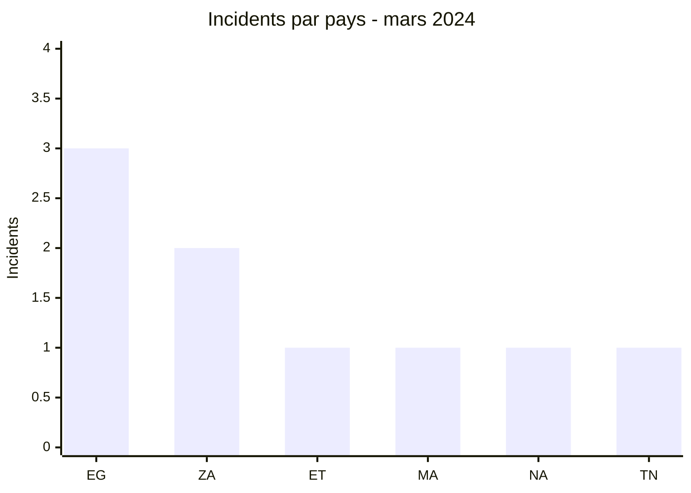
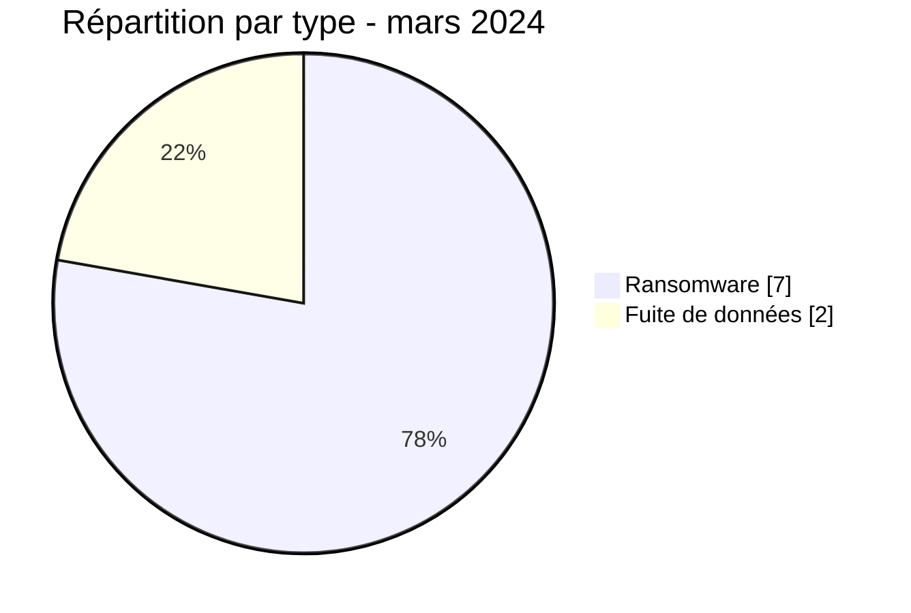

# Rapport CTI AFRINTEL - Mars 2024

👉🏾 [English version](./README.md)

## 1. Résumé exécutif

Mars 2024 réunit **9 incidents documentés** : **7 revendications ransomware** et **2 fuites de données**. L’Égypte arrive en tête avec trois publications, devant l’Afrique du Sud avec deux. L’ajout de l’Éthiopie étend le corpus à l’Afrique de l’Est, aux côtés de l’Afrique du Nord et de l’Afrique australe.

LockBit3 apparaît quatre fois et RansomHub deux fois. Cette répétition mesure la visibilité des publications, pas une campagne coordonnée. Les deux fuites de données concernent l’ESGC au Maroc et une publication attribuée à ThreatSec visant les portails fédéraux éthiopiens eTrade et eRIS. Dans le cas éthiopien, l’examen visuel des cinq pages du PDF fourni soutient la plausibilité structurelle de l’échantillon, mais ne confirme ni sa provenance depuis les portails ni les 43 fichiers revendiqués.

Voir [victims_FR.md](./victims_FR.md).

## 2. Méthodologie

Le rapport couvre les neuf incidents classés en mars 2024. Chaque publication est comptée une fois et les statuts décrivent le niveau de preuve disponible. La fiche éthiopienne est classée au 1er mars à la demande du mainteneur, tandis que sa publication source est datée du 24 août 2023. Aucun comportement technique n’est considéré comme observé sur la seule base de la réputation d’un acteur.

Les statistiques dérivent de [victims_FR.md](./victims_FR.md), synchronisé avec [victims.md](./victims.md).

## 3. Vue globale

| Indicateur | Valeur |
|---|---:|
| Incidents | **9** |
| Pays | **6** |
| Ransomware | **7** |
| Fuites de données | **2** |
| Ventes d’accès / Défacement | **0 / 0** |

### Classement par pays

| Pays | Total | Ransomware | Fuite |
|---|---:|---:|---:|
| 🇪🇬 Égypte | 3 | 3 | 0 |
| 🇿🇦 Afrique du Sud | 2 | 2 | 0 |
| 🇪🇹 Éthiopie | 1 | 0 | 1 |
| 🇲🇦 Maroc | 1 | 0 | 1 |
| 🇳🇦 Namibie | 1 | 1 | 0 |
| 🇹🇳 Tunisie | 1 | 1 | 0 |
| **Total** | **9** | **7** | **2** |

### Répartition régionale

| Région | Total | Ransomware | Fuite |
|---|---:|---:|---:|
| Afrique du Nord | 5 | 4 | 1 |
| Afrique australe | 3 | 3 | 0 |
| Afrique de l’Est | 1 | 0 | 1 |
| **Total** | **9** | **7** | **2** |

### Répartition sectorielle normalisée

| Secteur | Incidents | Part |
|---|---:|---:|
| Finance / Banque | 2 | 22,2 % |
| Gouvernement / Administration | 2 | 22,2 % |
| Santé / Médical | 1 | 11,1 % |
| Industrie / Fabrication | 1 | 11,1 % |
| Médias / Divertissement | 1 | 11,1 % |
| Éducation / Université | 1 | 11,1 % |
| Pétrole / Énergie | 1 | 11,1 % |
| **Total** | **9** | **100 %** |

Les parts affichées sont arrondies à un dixième ; les comptes bruts totalisent 9.

### Acteurs les plus visibles

| Acteur | Incidents |
|---|---:|
| LockBit3 | 4 |
| RansomHub | 2 |
| Hunters | 1 |
| ThreatSec | 1 |
| Source non attribuée | 1 |

## 4. Analyse détaillée par type d’incident

### 4.1 Ransomware

Les sept publications couvrent des environnements publics, financiers, médicaux, industriels, énergétiques et médiatiques. Government Printing Works et PGESCo présentent une importance opérationnelle particulière, mais le corpus public ne documente ni indisponibilité, ni chiffrement, ni volume exfiltré de manière indépendante.

### 4.2 Fuite de données

La publication ESGC mentionne une base de 2021 et environ 500 entrées. Un extrait était visible ; les données personnelles et valeurs de mots de passe ne sont pas reproduites. La publication attribuée à ThreatSec affirme pour sa part avoir collecté 43 fichiers depuis eTrade et eRIS. Le seul PDF fourni et examiné comporte cinq pages scannées d’un document administratif et contractuel en amharique, avec cachets, signatures et montants financiers. Cette cohérence documentaire ne confirme ni l’accès aux deux portails, ni l’existence des 42 autres fichiers, ni la méthode d’acquisition.

## 5. Impact sectoriel

La finance et le secteur gouvernemental comptent chacun deux incidents. La dispersion sectorielle augmente le nombre de scénarios défensifs à couvrir, mais elle ne démontre pas une stratégie de ciblage commune. Les établissements publics, médicaux et énergétiques doivent surtout vérifier la continuité opérationnelle, la maîtrise des accès privilégiés et la protection des documents administratifs.

## 6. Profil des acteurs et évaluation du risque

| Pays | Niveau | Justification |
|---|---|---|
| 🇪🇬 Égypte | 🔴 Élevé | Trois revendications ransomware dans des secteurs différents |
| 🇿🇦 Afrique du Sud | 🔴 Élevé | Deux publications, dont une entité publique sensible |
| 🇪🇹 Éthiopie | 🟠 Moyen | Publication concernant deux portails fédéraux et PDF de cinq pages examiné ; provenance non confirmée |
| 🇲🇦 Maroc | 🟠 Moyen | Fuite avec échantillon, volume global non vérifié |
| 🇳🇦 Namibie / 🇹🇳 Tunisie | 🟡 Faible à moyen | Une revendication ransomware chacune |

## 7. Tendances et lacunes de renseignement

- **Observé, confiance élevée :** le ransomware représente 7 incidents sur 9.
- **Observé, confiance élevée :** LockBit3 est associé à quatre incidents sur neuf.
- **Observé, confiance moyenne :** les deux fuites comportent un échantillon publié ; seul le PDF éthiopien fourni a pu être examiné dans son intégralité visuelle.
- **Lacune :** aucun rapport DFIR public n’a été identifié dans les sources consultées pour confirmer les modes opératoires des cas ransomware.
- **Lacune :** les sources ne permettent pas de déterminer si la base ESGC a été acquise en 2021 ou republiée ultérieurement, ni de relier directement le PDF éthiopien à eTrade ou eRIS.
- **Collecte attendue :** chronologies victimes, preuves d’indisponibilité, indicateurs techniques, origine de la publication ESGC et éléments reliant les fichiers revendiqués aux deux portails éthiopiens.

## 8. Cartographie MITRE ATT&CK contextuelle

| Statut | Technique | Utilisation |
|---|---|---|
| Préventif | T1486 - Data Encrypted for Impact | Détection adaptée au risque ransomware ; chiffrement non observé publiquement |
| Préventif | T1490 - Inhibit System Recovery | Contrôle de l’intégrité des sauvegardes ; comportement non observé |
| Préventif | T1567 - Exfiltration Over Web Service | Surveillance des sorties de données ; canaux d’acquisition et d’exfiltration inconnus pour les deux fuites |

## 9. Recommandations

- **Finance et secteur public :** renforcer les contrôles d’accès privilégiés et les procédures de crise.
- **Santé et énergie :** segmenter les systèmes critiques et tester les modes dégradés.
- **Éducation :** réinitialiser les comptes concernés si l’exposition est confirmée et surveiller les réutilisations d’identifiants.
- **Toutes les organisations :** tester la restauration depuis des sauvegardes isolées.

## 10. Recommandations SOC et tactiques

| Qualification | Action |
|---|---|
| **Observé** | Suivre les domaines et organisations publiés ; aucune TTP d’intrusion n’est confirmée par le corpus. |
| **Hypothèse** | Rechercher authentifications privilégiées anormales, exports de bases et préparation d’archives avant les dates de publication. |
| **Préventif** | Alerter sur le chiffrement massif, la suppression de copies de sauvegarde et les transferts sortants inhabituels. |

## 11. Recommandations stratégiques

| Priorité | Qualification | Mesure |
|---:|---|---|
| 1 | **Observé** | Prioriser les environnements égyptiens et sud-africains, ainsi que les portails fédéraux éthiopiens représentés dans le corpus. |
| 2 | **Hypothèse** | Examiner l’existence de comptes ou services exposés communs sans attribuer un accès initial non documenté. |
| 3 | **Préventif** | Réduire la surface externe, imposer MFA résistante au phishing et isoler les sauvegardes. |

## 12. Conclusion

Mars reste dominé par les publications ransomware, avec une concentration géographique nette mais peu de preuves techniques publiques. Les deux fuites apportent davantage de matière documentaire : un extrait ESGC et un PDF éthiopien examiné sur cinq pages. Elles ne résolvent toutefois ni la chronologie complète, ni la provenance technique, ni les volumes globaux revendiqués. La posture recommandée reste fondée sur la vérification interne, non sur l’attribution présumée de TTP.

**AFRINTEL - TLP:CLEAR**
[Dépôt AFRINTEL](https://github.com/Hatchepsoute/AFRINTEL)
