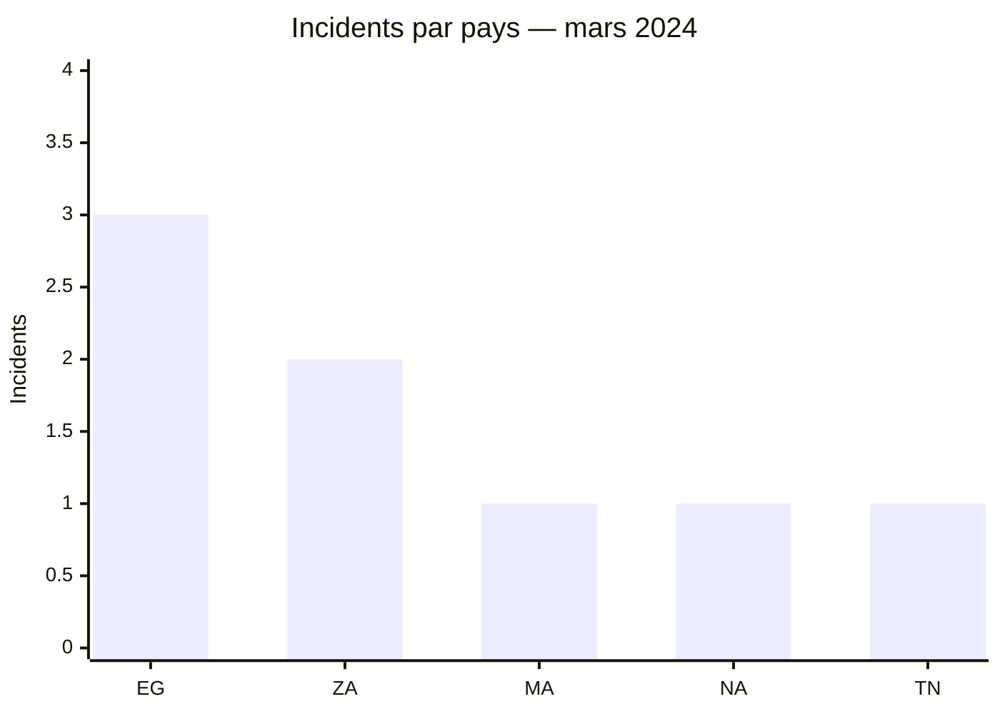
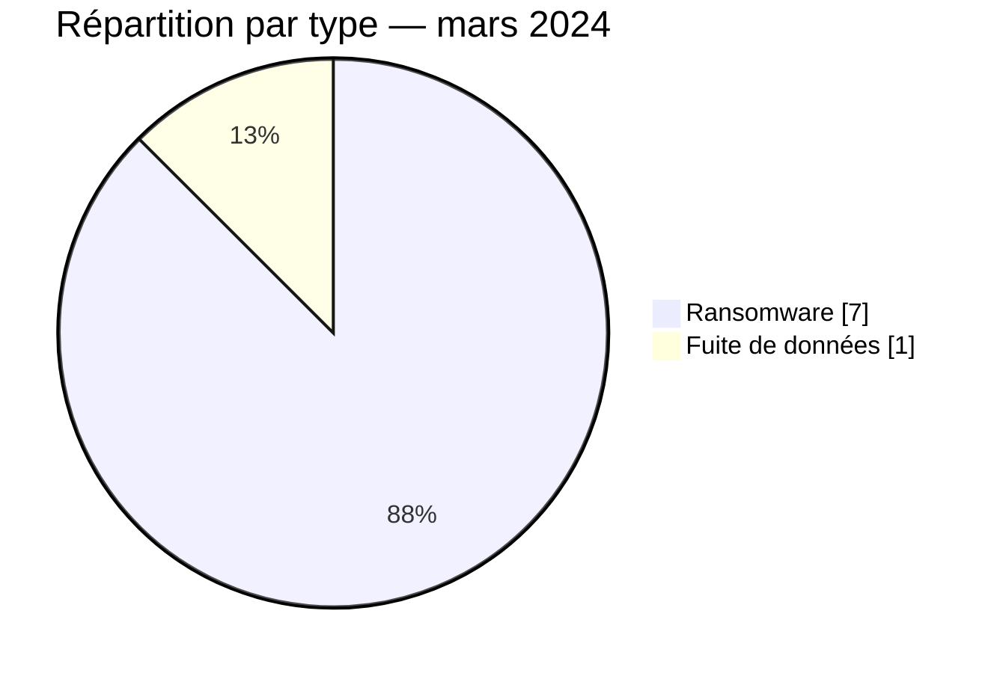

# Rapport CTI AFRINTEL — Mars 2024

👉🏾 [English version](./README.md)

## 1. Résumé exécutif

Mars 2024 réunit **8 incidents documentés** : **7 revendications ransomware** et **1 fuite de données**. L’Égypte arrive en tête avec trois publications, devant l’Afrique du Sud avec deux. La totalité du corpus se concentre en Afrique du Nord et en Afrique australe.

LockBit3 apparaît quatre fois et RansomHub deux fois. Cette répétition mesure la visibilité des publications, pas une campagne coordonnée. La seule fuite de données concerne l’ESGC au Maroc ; l’échantillon observé élève la confiance sur l’existence d’une base structurée, mais ne confirme pas le volume complet ni l’origine technique de l’acquisition.

Voir [victims_FR.md](./victims_FR.md).

## 2. Méthodologie

Le rapport couvre les publications classées en mars 2024. Les huit organisations sont comptées une fois et les statuts décrivent le niveau de preuve disponible. Aucun comportement technique n’est considéré comme observé sur la seule base de la réputation d’un groupe ransomware.

Les statistiques dérivent de [victims_FR.md](./victims_FR.md), synchronisé avec [victims.md](./victims.md).

## 3. Vue globale

| Indicateur | Valeur |
|---|---:|
| Incidents | **8** |
| Pays | **5** |
| Ransomware | **7** |
| Fuites de données | **1** |
| Ventes d’accès / Défacement | **0 / 0** |

### Classement par pays

| Pays | Total | Ransomware | Fuite |
|---|---:|---:|---:|
| 🇪🇬 Égypte | 3 | 3 | 0 |
| 🇿🇦 Afrique du Sud | 2 | 2 | 0 |
| 🇲🇦 Maroc | 1 | 0 | 1 |
| 🇳🇦 Namibie | 1 | 1 | 0 |
| 🇹🇳 Tunisie | 1 | 1 | 0 |
| **Total** | **8** | **7** | **1** |

### Répartition régionale

| Région | Total | Ransomware | Fuite |
|---|---:|---:|---:|
| Afrique du Nord | 5 | 4 | 1 |
| Afrique australe | 3 | 3 | 0 |
| **Total** | **8** | **7** | **1** |

### Répartition sectorielle normalisée

| Secteur | Incidents | Part |
|---|---:|---:|
| Finance / Banque | 2 | 25,0 % |
| Gouvernement / Administration | 1 | 12,5 % |
| Santé / Médical | 1 | 12,5 % |
| Industrie / Fabrication | 1 | 12,5 % |
| Médias / Divertissement | 1 | 12,5 % |
| Éducation / Université | 1 | 12,5 % |
| Pétrole / Énergie | 1 | 12,5 % |
| **Total** | **8** | **100 %** |

### Acteurs les plus visibles

| Acteur | Incidents |
|---|---:|
| LockBit3 | 4 |
| RansomHub | 2 |
| Hunters | 1 |
| Source non attribuée | 1 |

## 4. Analyse détaillée par type d’incident

### 4.1 Ransomware

Les sept publications couvrent des environnements publics, financiers, médicaux, industriels, énergétiques et médiatiques. Government Printing Works et PGESCo présentent une importance opérationnelle particulière, mais le corpus public ne documente ni indisponibilité, ni chiffrement, ni volume exfiltré de manière indépendante.

### 4.2 Fuite de données

La publication ESGC mentionne une base de 2021 et environ 500 entrées. Un extrait était visible ; les données personnelles et valeurs de mots de passe ne sont pas reproduites. L’échantillon soutient une exposition plausible, sans établir une compromission survenue en mars 2024.

## 5. Impact sectoriel

Aucun secteur ne domine nettement, à l’exception de la finance avec deux incidents. La dispersion sectorielle augmente le nombre de scénarios défensifs à couvrir, mais elle ne démontre pas une stratégie de ciblage commune. Les établissements publics, médicaux et énergétiques doivent surtout vérifier la continuité opérationnelle et la maîtrise des accès privilégiés.

## 6. Profil des acteurs et évaluation du risque

| Pays | Niveau | Justification |
|---|---|---|
| 🇪🇬 Égypte | 🔴 Élevé | Trois revendications ransomware dans des secteurs différents |
| 🇿🇦 Afrique du Sud | 🔴 Élevé | Deux publications, dont une entité publique sensible |
| 🇲🇦 Maroc | 🟠 Moyen | Fuite avec échantillon, volume global non vérifié |
| 🇳🇦 Namibie / 🇹🇳 Tunisie | 🟡 Faible à moyen | Une revendication ransomware chacune |

## 7. Tendances et lacunes de renseignement

- **Observé — confiance élevée :** le ransomware représente 7 incidents sur 8.
- **Observé — confiance élevée :** LockBit3 est associé à la moitié du corpus.
- **Lacune :** aucun rapport DFIR public n’a été identifié dans les sources consultées pour confirmer les modes opératoires des cas ransomware.
- **Lacune :** les sources ne permettent pas de déterminer si la base ESGC a été acquise en 2021 ou republiée ultérieurement.
- **Collecte attendue :** chronologies victimes, preuves d’indisponibilité, indicateurs techniques et origine de la publication ESGC.

## 8. Cartographie MITRE ATT&CK contextuelle

| Statut | Technique | Utilisation |
|---|---|---|
| Préventif | T1486 — Data Encrypted for Impact | Détection adaptée au risque ransomware ; chiffrement non observé publiquement |
| Préventif | T1490 — Inhibit System Recovery | Contrôle de l’intégrité des sauvegardes ; comportement non observé |
| Préventif | T1567 — Exfiltration Over Web Service | Surveillance des sorties de données ; canal ESGC inconnu |

## 9. Recommandations

- **Finance et secteur public :** renforcer les contrôles d’accès privilégiés et les procédures de crise.
- **Santé et énergie :** segmenter les systèmes critiques et tester les modes dégradés.
- **Éducation :** réinitialiser les comptes concernés si l’exposition est confirmée et surveiller les réutilisations d’identifiants.
- **Toutes les organisations :** tester la restauration depuis des sauvegardes isolées.

## 10. Recommandations SOC et tactiques

| Qualification | Action |
|---|---|
| **Observé** | Suivre les domaines et organisations publiés ; aucune TTP d’intrusion n’est confirmée par le corpus. |
| **Hypothèse** | Rechercher authentifications privilégiées anormales, exports de bases et préparation d’archives avant les dates de publication. |
| **Préventif** | Alerter sur le chiffrement massif, la suppression de copies de sauvegarde et les transferts sortants inhabituels. |

## 11. Recommandations stratégiques

| Priorité | Qualification | Mesure |
|---:|---|---|
| 1 | **Observé** | Prioriser les environnements égyptiens et sud-africains représentés dans le corpus. |
| 2 | **Hypothèse** | Examiner l’existence de comptes ou services exposés communs sans attribuer un accès initial non documenté. |
| 3 | **Préventif** | Réduire la surface externe, imposer MFA résistante au phishing et isoler les sauvegardes. |

## 12. Conclusion

Mars est dominé par les publications ransomware, avec une concentration géographique nette mais peu de preuves techniques publiques. La fuite ESGC apporte davantage de matière sur la nature des données que les sept autres cas, sans résoudre la chronologie de l’acquisition. La posture recommandée reste fondée sur la vérification interne, non sur l’attribution présumée de TTP.

**AFRINTEL — TLP:CLEAR**
[Dépôt AFRINTEL](https://github.com/Hatchepsoute/AFRINTEL)
