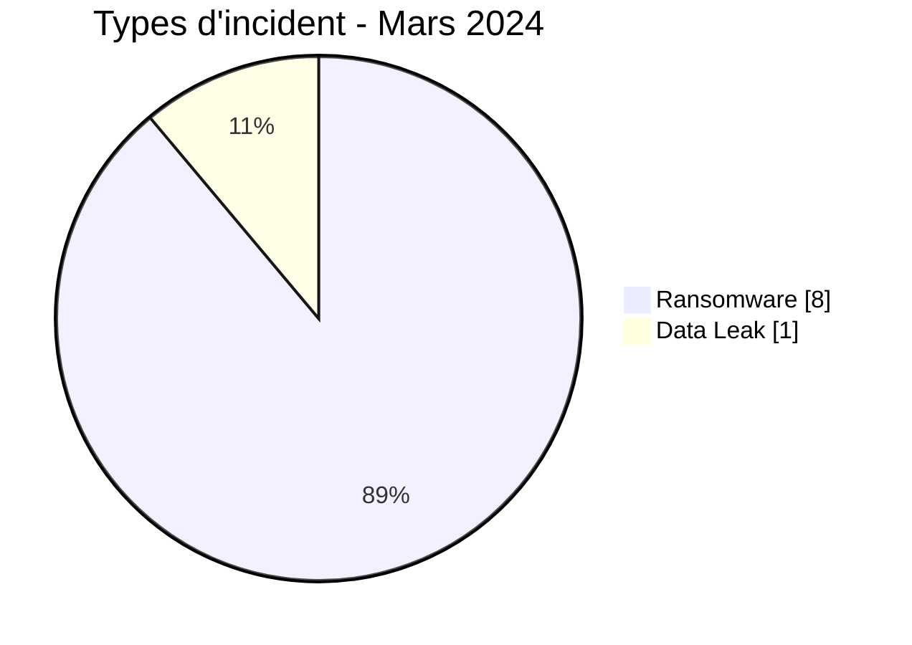

# Rapport CTI AFRINTEL - Cybermenaces en Afrique - Mars 2024

👉🏾 [English version](./README.md)

## 1. Synthèse exécutive

En Mars 2024, AFRINTEL retient **9 cyberincidents canoniques dans 6 pays**. Le mois est dominé par **Ransomware (8, 88,9 %)** puis **Data Leak (1, 11,1 %)**. Les pays les plus représentés sont **Égypte (3)**, **Afrique du Sud (2)**, **Tunisie (1)**. Les secteurs les plus visibles sont **Gouvernement / Administration (2)**, **Finance / Banque (2)**, **Médias / Divertissement (1)**. Les labels acteur/groupe les plus fréquents sont `lockbit3` (4), `ransomhub` (2), `Unknown` (2). `Unknown` désigne une absence d'attribution, pas un groupe.

La maturité de preuve est répartie entre **Claim - Unverified: 7**, **Confirmed: 1**, **Claim - Data Sample Published: 1**. Les claims ne sont pas convertis en confirmations sans preuve supplémentaire.

### 1.1 Étude comparative avec le mois précédent

| Indicateur | Février 2024 | Mars 2024 | Évolution |
|---|---|---|---|
| Total | 8 | 9 | +1 (+12,5 %) |
| Ransomware | 6 | 8 | +2 (+33,3 %) |
| Data Leak | 1 | 1 | Stable |
| Access Sale | 0 | 0 | Stable |
| DDoS | 0 | 0 | Stable |
| Defacement | 0 | 0 | Stable |
| Account Takeover | 0 | 0 | Stable |
| System Intrusion | 1 | 0 | -1 (-100,0 %) |
| Malware | 0 | 0 | Stable |
| Operational Fraud | 0 | 0 | Stable |

### 1.2 Analyse comparative

Le volume mensuel **augmente de 1 incident(s)**. Les variations structurantes sont : Ransomware 6->8 (+2), System Intrusion 1->0 (-1). Cette variation décrit le corpus documenté, pas nécessairement une variation équivalente du nombre réel de compromissions sur le continent.

## 2. Méthodologie

- Un incident canonique correspond à un événement retenu dans le millésime 2024.
- Les découvertes/republications historiques sont conservées séparément et ne gonflent pas les statistiques 2024.
- La date d'incident ou la meilleure fenêtre soutenue prime ; la date de découverte AFRINTEL reste distincte.
- Les 9 types AFRINTEL sont utilisés ; une tentative est représentée par le statut, jamais par un type `Attempted Attack`.
- Un DDoS coordonné est compté par campagne.
- Type, statut, confiance, impact, attribution et source restent distincts.

## 3. Répartition par type d'incident

| Type | Fiches | Part |
|---|---|---|
| Ransomware | 8 | 88,9 % |
| Data Leak | 1 | 11,1 % |
| Access Sale | 0 | 0,0 % |
| DDoS | 0 | 0,0 % |
| Defacement | 0 | 0,0 % |
| Account Takeover | 0 | 0,0 % |
| System Intrusion | 0 | 0,0 % |
| Malware | 0 | 0,0 % |
| Operational Fraud | 0 | 0,0 % |

## 4. Pays x type

| Pays | Total | Ransomware | Data Leak | Access Sale | DDoS | Defacement | Account Takeover | System Intrusion | Malware | Operational Fraud |
|---|---|---|---|---|---|---|---|---|---|---|
| Égypte | 3 | 3 | 0 | 0 | 0 | 0 | 0 | 0 | 0 | 0 |
| Afrique du Sud | 2 | 2 | 0 | 0 | 0 | 0 | 0 | 0 | 0 | 0 |
| Tunisie | 1 | 1 | 0 | 0 | 0 | 0 | 0 | 0 | 0 | 0 |
| Cabo Verde | 1 | 1 | 0 | 0 | 0 | 0 | 0 | 0 | 0 | 0 |
| Namibie | 1 | 1 | 0 | 0 | 0 | 0 | 0 | 0 | 0 | 0 |
| Maroc | 1 | 0 | 1 | 0 | 0 | 0 | 0 | 0 | 0 | 0 |

## 5. Répartition régionale

| Région | Fiches | Part |
|---|---|---|
| Afrique du Nord | 5 | 55,6 % |
| Afrique australe | 3 | 33,3 % |
| Afrique de l'Ouest | 1 | 11,1 % |

## 6. Répartition sectorielle

| Secteur | Fiches | Part |
|---|---|---|
| Gouvernement / Administration | 2 | 22,2 % |
| Finance / Banque | 2 | 22,2 % |
| Médias / Divertissement | 1 | 11,1 % |
| Santé / Médical | 1 | 11,1 % |
| Énergie / Services publics | 1 | 11,1 % |
| Éducation / Université | 1 | 11,1 % |
| Industrie / Fabrication | 1 | 11,1 % |

## 7. Acteurs / groupes

| Acteur / Groupe | Fiches | Part |
|---|---|---|
| lockbit3 | 4 | 44,4 % |
| ransomhub | 2 | 22,2 % |
| Unknown | 2 | 22,2 % |
| hunters | 1 | 11,1 % |

## 8. Maturité des preuves

| Position de preuve | Fiches | Part |
|---|---|---|
| Claim - Unverified | 7 | 77,8 % |
| Confirmed | 1 | 11,1 % |
| Claim - Data Sample Published | 1 | 11,1 % |

### Confiance

| Confiance | Fiches | Part |
|---|---|---|
| Low | 7 | 77,8 % |
| Very High | 1 | 11,1 % |
| Medium | 1 | 11,1 % |

## 9. Chronologie

```mermaid
timeline
    title AFRINTEL - Mars 2024
    9 Mars 2024 : Go4Kora
- **Acteur / Groupe -** ransomhub
- **Secteur -** Media / Entertainment
- **Site web -** [go4kora.tv](https -//go4kora.tv)
- **Statut -** Claim - Unverified
- **Type d'incident -** Ransomware
- **Niveau de confiance -** Low
- **Niveau d'impact -** Level 2
- **Description victime -** Go4Kora est un portail d'actualités sportives et de streaming en direct largement suivi en Égypte et dans la région MENA pour la diffusion du football.

----------------------------
    11 Mars 2024 : Government Printing Works (GPW)
- **Acteur / Groupe -** lockbit3
- **Secteur -** Government / Administration
- **Site web -** [gpw.gov.za](https -//www.gpw.gov.za)
- **Statut -** Claim - Unverified
- **Type d'incident -** Ransomware
- **Niveau de confiance -** Low
- **Niveau d'impact -** Level 3
- **Description victime -** Le Government Printing Works d'Afrique du Sud est une entité publique sous la tutelle du ministère de l'Intérieur, chargée de la production des documents d'identité sécurisés, des passeports et des bulletins officiels.

----------------------------
    15 Mars 2024 : ATL Leasing
- **Acteur / Groupe -** hunters
- **Secteur -** Finance / Banking
- **Site web -** [atlleasing.com.tn](https -//www.atlleasing.com.tn)
- **Statut -** Claim - Unverified
- **Type d'incident -** Ransomware
- **Niveau de confiance -** Low
- **Niveau d'impact -** Level 3
- **Description victime -** Arab Tunisian Leasing (ATL) est une institution financière de premier plan cotée à la Bourse de Tunis, spécialisée dans le financement par crédit-bail d'équipements professionnels et immobiliers.

----------------------------
    15 Mars 2024 : El Ezaby Pharmacy
- **Acteur / Groupe -** lockbit3
- **Secteur -** Healthcare / Medical
- **Site web -** [elezabypharmacy.com](https -//www.elezabypharmacy.com)
- **Statut -** Claim - Unverified
- **Type d'incident -** Ransomware
- **Niveau de confiance -** Low
- **Niveau d'impact -** Level 3
- **Description victime -** Pharmacies El Ezaby représente l'un des plus grands réseaux de distribution pharmaceutique en Égypte, exploitant de nombreuses officines et une logistique de livraison nationale.

----------------------------
    15 Mars 2024 - date rapportée : Assembleia Nacional de Cabo Verde
- **Date de l'incident -** 15 Mars 2024 - date rapportée
- **Date de publication initiale / source retenue -** 22 mars 2024
- **Date de découverte AFRINTEL -** 23 août 2026 - audit rétrospectif
- **Précision chronologique -** Début rapporté le vendredi 15 mars ; la publication de référence est du 22 mars.
- **Acteur / Groupe -** Unknown
- **Secteur -** Government / Administration
- **Site web -** [parlamento.cv](https -//www.parlamento.cv/)
- **Statut -** Victim Confirmed
- **Type d'incident -** Ransomware
- **Niveau de confiance -** Very High
- **Niveau d'impact -** Level 4
- **Analyse -** Le responsable de la communication et de la sécurité de l'information du Parlement a confirmé un ransomware ayant chiffré plusieurs serveurs dans un segment du réseau. Le fonctionnement parlementaire a été perturbé et certains serveurs ont dû être récupérés. Les sources examinées ne suffisent pas à établir une exfiltration de données ; elle n'est donc pas déduite.
- **Sources publiques -** [RTC Cabo Verde](https -//www.rtc.cv/noticia/noticia-details/ataque-cibernetico-esta-a-condicionar-o-funcionamento-da-assembleia-nacional-12835) | [KonBriefing](https -//konbriefing.com/en-topics/cyber-attacks-2024.html)

----------------------------
    16 Mars 2024 : Agribank Namibia
- **Acteur / Groupe -** lockbit3
- **Secteur -** Finance / Banking
- **Site web -** [agribank.com.na](https -//www.agribank.com.na)
- **Statut -** Claim - Unverified
- **Type d'incident -** Ransomware
- **Niveau de confiance -** Low
- **Niveau d'impact -** Level 3
- **Description victime -** L'Agricultural Bank of Namibia est une institution bancaire étatique spécialisée dans le financement de l'expansion agricole, de l'aquaculture et de l'acquisition de terres rurales.

----------------------------
    22 Mars 2024 : PGESCo
- **Acteur / Groupe -** ransomhub
- **Secteur -** Energy / Utilities
- **Site web -** [pgesco.com](https -//www.pgesco.com)
- **Statut -** Claim - Unverified
- **Type d'incident -** Ransomware
- **Niveau de confiance -** Low
- **Niveau d'impact -** Level 3
- **Description victime -** La Power Generation Engineering and Services Company (PGESCo) est une firme d'ingénierie égyptienne majeure fournissant des services de conseil et de gestion de projet pour les centrales électriques et les infrastructures pétrolières.

----------------------------
    26 Mars 2024 : Higher School of Commerce and Management (ESGC.MA)
- **Acteur / Groupe -** Unknown
- **Secteur -** Education / University
- **Site web -** [esgc.ma](https -//esgc.ma)
- **Statut -** Claim - Data Sample Published
- **Niveau de confiance -** Medium
- **Niveau d'impact -** Level 3
- **Type d'incident -** Data Leak
- **Description victime -** ESGC.MA est présentée comme un établissement marocain d'enseignement supérieur spécialisé dans le commerce et le management.

- **Analyse -** La publication de forum du 26 mars 2024 affirme qu'une base de 2021 contenait environ 500 entrées avec des noms, adresses électroniques, hashes de mots de passe, numéros de téléphone et dates de création de comptes. Un échantillon était affiché, mais le jeu de données complet et la compromission alléguée n'ont pas été vérifiés indépendamment. Les données personnelles et identifiants de l'échantillon ne sont pas reproduits ici.

----------------------------
    27 Mars 2024 : Nampak
- **Acteur / Groupe -** lockbit3
- **Secteur -** Manufacturing / Industry
- **Site web -** [nampak.com](https -//www.nampak.com)
- **Statut -** Claim - Unverified
- **Type d'incident -** Ransomware
- **Niveau de confiance -** Low
- **Niveau d'impact -** Level 2
- **Description victime -** Nampak est le plus grand fabricant d'emballages du continent africain, basé en Afrique du Sud, fournissant des solutions de conditionnement en métal, plastique, papier et verre.

----------------------------
```

## 10. Analyse CTI par type

### Ransomware - 8

**8 fiche(s) (88,9 %).** Principaux pays : Égypte (3), Afrique du Sud (2), Tunisie (1). Les conclusions restent limitées aux éléments documentés ; le type ne permet pas d'inférer un vecteur ou un impact non observé.

### Data Leak - 1

**1 fiche(s) (11,1 %).** Principaux pays : Maroc (1). Les conclusions restent limitées aux éléments documentés ; le type ne permet pas d'inférer un vecteur ou un impact non observé.

## 11. Incidents prioritaires pour revue

| Pays | Organisation | Type | Statut | Impact | Confiance |
|---|---|---|---|---|---|
| Cabo Verde | Assembleia Nacional de Cabo Verde
- **Date de l'incident:** 15 Mars 2024 - date rapportée
- **Date de publication initiale / source retenue:** 22 mars 2024
- **Date de découverte AFRINTEL:** 23 août 2026 - audit rétrospectif
- **Précision chronologique:** Début rapporté le vendredi 15 mars ; la publication de référence est du 22 mars.
- **Acteur / Groupe:** Unknown
- **Secteur:** Government / Administration
- **Site web:** [parlamento.cv](https://www.parlamento.cv/)
- **Statut:** Victim Confirmed
- **Type d'incident:** Ransomware
- **Niveau de confiance:** Very High
- **Niveau d'impact:** Level 4
- **Analyse:** Le responsable de la communication et de la sécurité de l'information du Parlement a confirmé un ransomware ayant chiffré plusieurs serveurs dans un segment du réseau. Le fonctionnement parlementaire a été perturbé et certains serveurs ont dû être récupérés. Les sources examinées ne suffisent pas à établir une exfiltration de données ; elle n'est donc pas déduite.
- **Sources publiques:** [RTC Cabo Verde](https://www.rtc.cv/noticia/noticia-details/ataque-cibernetico-esta-a-condicionar-o-funcionamento-da-assembleia-nacional-12835) | [KonBriefing](https://konbriefing.com/en-topics/cyber-attacks-2024.html)

---------------------------- | Ransomware | Victim Confirmed | Level 4 | Very High |
| Maroc | Higher School of Commerce and Management (ESGC.MA)
- **Acteur / Groupe:** Unknown
- **Secteur:** Education / University
- **Site web:** [esgc.ma](https://esgc.ma)
- **Statut:** Claim - Data Sample Published
- **Niveau de confiance:** Medium
- **Niveau d'impact:** Level 3
- **Type d'incident:** Data Leak
- **Description victime:** ESGC.MA est présentée comme un établissement marocain d'enseignement supérieur spécialisé dans le commerce et le management.

- **Analyse:** La publication de forum du 26 mars 2024 affirme qu'une base de 2021 contenait environ 500 entrées avec des noms, adresses électroniques, hashes de mots de passe, numéros de téléphone et dates de création de comptes. Un échantillon était affiché, mais le jeu de données complet et la compromission alléguée n'ont pas été vérifiés indépendamment. Les données personnelles et identifiants de l'échantillon ne sont pas reproduits ici.

---------------------------- | Data Leak | Claim - Data Sample Published | Level 3 | Medium |
| Afrique du Sud | Government Printing Works (GPW)
- **Acteur / Groupe:** lockbit3
- **Secteur:** Government / Administration
- **Site web:** [gpw.gov.za](https://www.gpw.gov.za)
- **Statut:** Claim - Unverified
- **Type d'incident:** Ransomware
- **Niveau de confiance:** Low
- **Niveau d'impact:** Level 3
- **Description victime:** Le Government Printing Works d'Afrique du Sud est une entité publique sous la tutelle du ministère de l'Intérieur, chargée de la production des documents d'identité sécurisés, des passeports et des bulletins officiels.

---------------------------- | Ransomware | Claim - Unverified | Level 3 | Low |
| Tunisie | ATL Leasing
- **Acteur / Groupe:** hunters
- **Secteur:** Finance / Banking
- **Site web:** [atlleasing.com.tn](https://www.atlleasing.com.tn)
- **Statut:** Claim - Unverified
- **Type d'incident:** Ransomware
- **Niveau de confiance:** Low
- **Niveau d'impact:** Level 3
- **Description victime:** Arab Tunisian Leasing (ATL) est une institution financière de premier plan cotée à la Bourse de Tunis, spécialisée dans le financement par crédit-bail d'équipements professionnels et immobiliers.

---------------------------- | Ransomware | Claim - Unverified | Level 3 | Low |
| Égypte | El Ezaby Pharmacy
- **Acteur / Groupe:** lockbit3
- **Secteur:** Healthcare / Medical
- **Site web:** [elezabypharmacy.com](https://www.elezabypharmacy.com)
- **Statut:** Claim - Unverified
- **Type d'incident:** Ransomware
- **Niveau de confiance:** Low
- **Niveau d'impact:** Level 3
- **Description victime:** Pharmacies El Ezaby représente l'un des plus grands réseaux de distribution pharmaceutique en Égypte, exploitant de nombreuses officines et une logistique de livraison nationale.

---------------------------- | Ransomware | Claim - Unverified | Level 3 | Low |

> Sélection structurée selon impact, statut et confiance ; ce n'est pas un classement absolu de gravité.

## 12. Intelligence gaps et corrections

- vecteur d'accès initial souvent inconnu ;
- date technique de compromission parfois différente de la date de publication ;
- volumes revendiqués rarement vérifiables intégralement ;
- attribution technique souvent limitée au compte de publication ;
- republications historiques suivies séparément.

## 13. Recommandations

- MFA résistante au phishing, PAM et moindre privilège ;
- segmentation, sauvegardes immuables et tests de restauration ;
- centralisation EDR/IAM/VPN/WAF/DNS/cloud/applications ;
- détection des exports massifs, archives inhabituelles et transferts sortants ;
- conservation séparée des dates d'incident, publication initiale, repost et découverte AFRINTEL.

## 14. Conclusion

Mars 2024 contient **9 incidents canoniques**. La comparaison avec le mois précédent est calculée sur la même taxonomie et les mêmes règles chronologiques, sauf janvier où décembre 2023 reste `N/A` faute de réaudit homogène.

👉🏾 [Victimes canoniques](./victims_FR.md)

**AFRINTEL** - TLP:CLEAR
