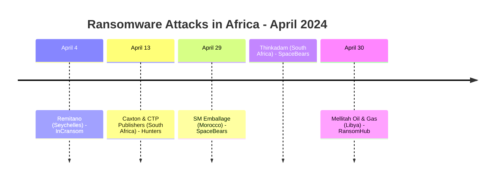
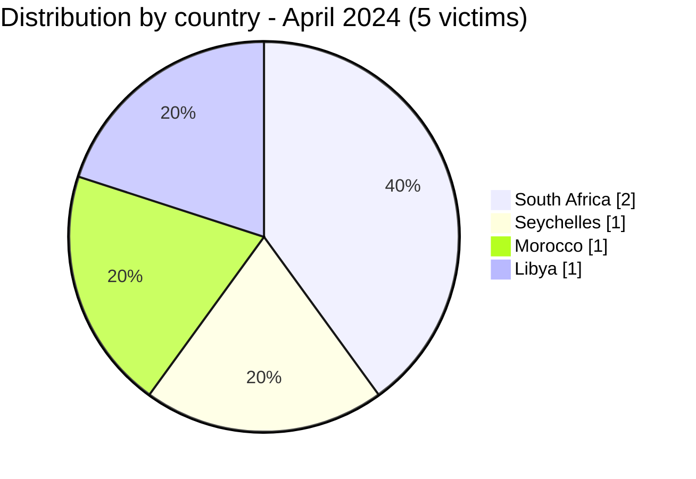

[](https://github.com/Hatchepsoute/AFRINTEL)


# CTI Report - April 2024: Energy and crypto assets targeted across the continent

👉🏾 [Version française disponible ici](./README_FR.md)

### 1. Executive summary

In April 2024, Africa recorded **5 documented ransomware victims** across 5 different countries. The month is notable for two high-profile targets: a **major Libyan oil & gas joint venture** (~1 TB exfiltrated) and a **cryptocurrency exchange platform** in the Seychelles. The SpaceBears group appears for the first time with two simultaneous claims.

👉🏾 [Victims list](./victims.md)

**Key figures:**
- 🔹 **5 victims** identified
- 🔹 **4 active groups**: InCransom (1), Hunters (1), SpaceBears (2), RansomHub (1)
- 🔹 **Countries affected**: South Africa (2), Seychelles (1), Morocco (1), Libya (1)
- 🔹 **Sectors**: Banking/Crypto, Media & Publishing, Manufacturing/Packaging, Technologies, Oil & Gas

---

### 2. Attack timeline

| Date | Victim | Country | Ransomware group |
|------|--------|---------|-----------------|
| April 4 | Remitano (Cryptocurrency Exchange) | Seychelles | InCransom |
| April 13 | Caxton and CTP Publishers and Printers | South Africa | Hunters |
| April 29 | SM Emballage | Morocco | SpaceBears |
| April 29 | Thinkadam | South Africa | SpaceBears |
| April 30 | Mellitah Oil & Gas (Eni / NOC JV) | Libya | RansomHub |



---

### 3. Victim analysis

#### 3.1 By country

| Country | Number of attacks |
|---------|-----------------|
| South Africa | 2 |
| Seychelles | 1 |
| Morocco | 1 |
| Libya | 1 |



#### 3.2 By sector

| Sector | Count |
|--------|-------|
| Banking / Crypto assets | 1 |
| Media & Publishing | 1 |
| Manufacturing / Industrial Packaging | 1 |
| Technologies | 1 |
| Oil & Gas / Energy | 1 |

```mermaid
xychart-beta
    title "Targeted Sectors - April 2024"
    x-axis ["Banking/Crypto", "Media", "Manufacturing", "Technologies", "Oil & Gas"]
    y-axis "Number of attacks" 0 to 2
    bar [1, 1, 1, 1, 1]
```

#### 3.3 Ransomware groups

| Ransomware group | Number of attacks |
|-----------------|-----------------|
| SpaceBears | 2 |
| InCransom | 1 |
| Hunters | 1 |
| RansomHub | 1 |

```mermaid
gantt
    title Active Ransomware Groups - April 2024
    dateFormat X
    axisFormat %s
    section SpaceBears
    SpaceBears : 0, 2
    section InCransom
    InCransom : 0, 1
    section Hunters
    Hunters : 0, 1
    section RansomHub
    RansomHub : 0, 1
```



---

### 4. Key observations

- **High-impact energy sector attack**: Mellitah Oil & Gas (Eni/NOC joint venture in Libya) is claimed by RansomHub with approximately **1 TB of exfiltrated data**, the highest-impact claim of the month, involving a strategic energy asset co-owned by an international major.
- **Cryptocurrency in the crosshairs**: Remitano (Seychelles-registered P2P crypto exchange) is targeted by InCransom. This same victim will be claimed again in August 2024 by a different group (Meow), an early double-claim pattern.
- **SpaceBears emergence**: the group strikes twice on April 29 (Morocco and South Africa simultaneously), signalling a coordinated campaign or active prospection phase.
- **Media targeted**: Caxton and CTP Publishers, one of South Africa's largest print/media groups, highlights ransomware actors' interest in organizations holding large consumer datasets.

---

```mermaid
xychart-beta
    title "Monthly Evolution of Attacks (Jan - Apr 2024)"
    x-axis ["Jan", "Feb", "Mar", "Apr"]
    y-axis "Number of attacks" 0 to 10
    bar [3, 5, 7, 5]
```

### 5. Recommendations

| Domain | Recommended action |
|--------|--------------------|
| Oil & Gas / Energy | Assess vendor access controls, implement data loss prevention (DLP), monitor bulk data transfers. |
| Crypto / Fintech platforms | Enforce MFA on all admin interfaces, monitor API anomalies, prepare incident response plans. |
| Media & Publishing | Protect subscriber and advertiser databases, segment editorial systems from business IT. |
| Manufacturing | Audit internet-facing systems, enforce patch management for industrial platforms. |
| All organizations | Track SpaceBears and RansomHub IOCs, both show increasing African activity. |

---

*Report generated from AFRINTEL OSINT data. Free distribution (TLP:CLEAR)*
