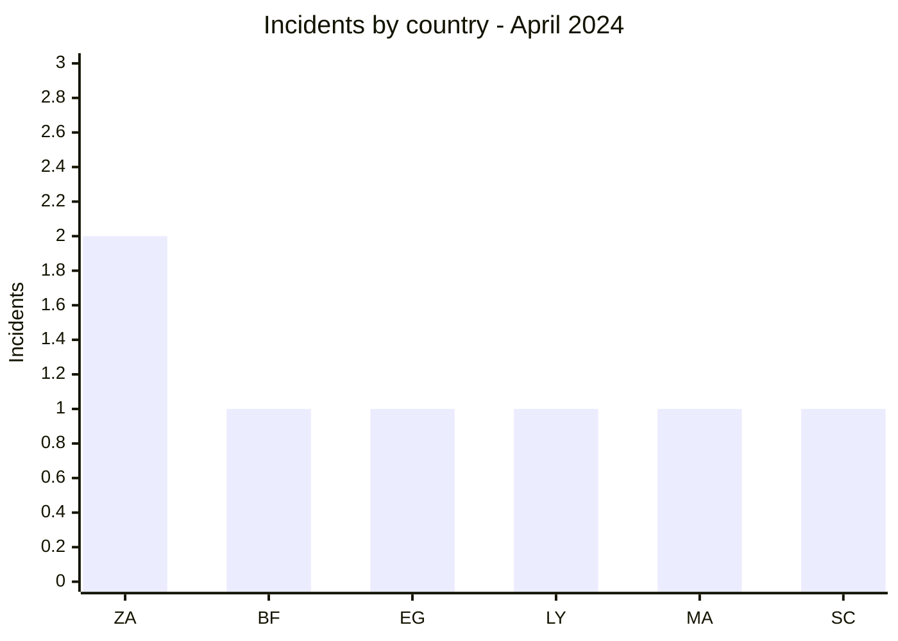
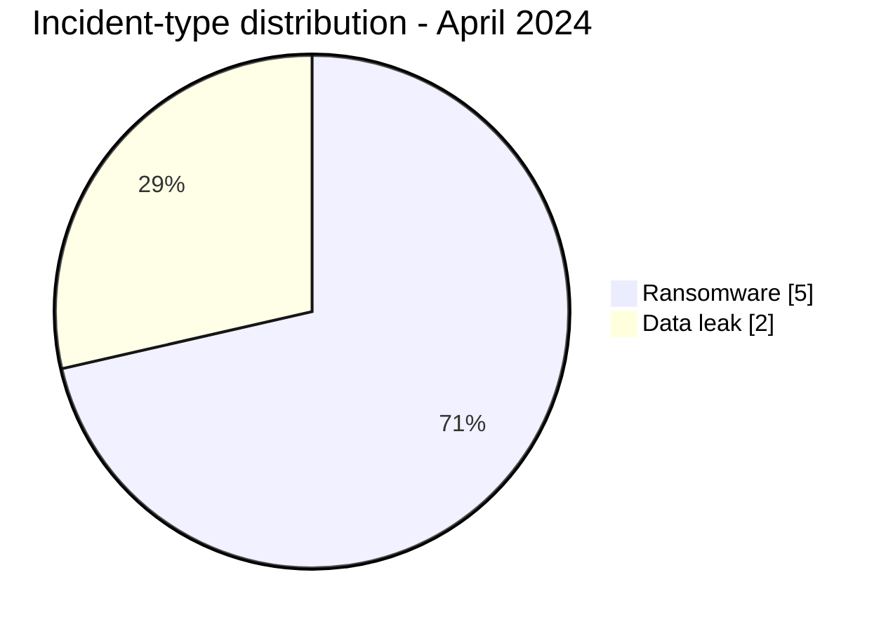

# AFRINTEL CTI Report - April 2024

👉🏾 [Version française](./README_FR.md)

## 1. Executive summary

April 2024 contains **7 incidents**: **5 ransomware claims** and **2 data leaks**. South Africa accounts for two publications, while five other countries appear once each. The corpus spans four regions, including the Indian Ocean through the Remitano publication in Seychelles.

SpaceBears is the only actor associated with two organizations. Simultaneous publication is not enough to establish a coordinated campaign. The ONEF leak in Burkina Faso and the Vezeeta Pharmacy leak in Egypt are the month's sample-backed incidents in the corpus.

See [victims.md](./victims.md).

## 2. Methodology

This report covers publications assigned to April 2024. Incidents are deduplicated by organization and separated into AFRINTEL's four categories. Technical findings are limited to visible source evidence; practices commonly associated with a group are not treated as facts of the month.

Statistics derive from [victims.md](./victims.md), synchronized with [victims_FR.md](./victims_FR.md).

## 3. Global overview

| Indicator | Value |
|---|---:|
| Incidents / Countries | **7 / 6** |
| Ransomware | **5** |
| Data leaks | **2** |
| Access sales / Defacement | **0 / 0** |

### Country ranking

| Country | Total | Ransomware | Data leak |
|---|---:|---:|---:|
| 🇿🇦 South Africa | 2 | 2 | 0 |
| 🇧🇫 Burkina Faso | 1 | 0 | 1 |
| 🇪🇬 Egypt | 1 | 0 | 1 |
| 🇱🇾 Libya | 1 | 1 | 0 |
| 🇲🇦 Morocco | 1 | 1 | 0 |
| 🇸🇨 Seychelles | 1 | 1 | 0 |
| **Total** | **7** | **5** | **2** |

### Regional distribution

| Region | Total | Ransomware | Data leak |
|---|---:|---:|---:|
| Southern Africa | 2 | 2 | 0 |
| North Africa | 3 | 2 | 1 |
| West Africa | 1 | 0 | 1 |
| Indian Ocean | 1 | 1 | 0 |
| **Total** | **7** | **5** | **2** |

### Normalized sector distribution

| Sector | Incidents | Share |
|---|---:|---:|
| Finance / Banking | 1 | 14.3% |
| Media / Entertainment | 1 | 14.3% |
| Government / Administration | 1 | 14.3% |
| Manufacturing / Industry | 1 | 14.3% |
| Technology / IT | 1 | 14.3% |
| Oil & Energy | 1 | 14.3% |
| Healthcare / Online Pharmacy | 1 | 14.3% |
| **Total** | **7** | **100%** |

### Most visible actors

| Actor | Incidents |
|---|---:|
| SpaceBears | 2 |
| Hunters, INC Ransom, Pedi, RansomHub, EgyptLeaks | 1 each |

## 4. Detailed analysis by incident type

### 4.1 Ransomware

The publications concern Remitano, Caxton and CTP, SM Emballage, Thinkadam, and Mellitah Oil & Gas. Finance and energy increase the potential impact, but no public source in the corpus confirms disruption, encryption, or exfiltration.

### 4.2 Data leak

The ONEF publication contains a sample associated with a Burkinabè employment and training body. The Vezeeta Pharmacy publication separately presents an order extract attributed to an Egyptian online-pharmacy platform. In both cases, available evidence does not establish completeness or the date of initial access.

## 5. Sectoral impact

Sector distribution is fully dispersed, with one incident in each of seven sectors. This lack of concentration limits broad sector conclusions. Energy, public employment services, and finance nevertheless warrant higher priority because of their functions.

## 6. Threat actor profile and risk assessment

| Scope | Level | Rationale |
|---|---|---|
| 🇿🇦 South Africa | 🔴 High | Two claims in media and technology |
| 🇱🇾 Libya | 🔴 High | Publication involving an oil joint venture |
| 🇧🇫 Burkina Faso | 🟠 Medium | Sample-backed leak involving a public body |
| 🇲🇦 Morocco / 🇸🇨 Seychelles | 🟡 Low to medium | One claim each |

## 7. Key trends and intelligence gaps

- **Observed - high confidence:** five of seven incidents are ransomware claims.
- **Observed - high confidence:** no sector records more than one incident.
- **Gap:** no public DFIR report was identified in the sources reviewed for the ransomware cases.
- **Gap:** the ONEF sample does not validate the full volume or acquisition timeline.
- **Collection need:** victim confirmation, service status, and later sample publications.

## 8. Contextual MITRE ATT&CK mapping

| Status | Technique | Use |
|---|---|---|
| Preventive | T1486 - Data Encrypted for Impact | Encryption detection; not confirmed in the five claims |
| Preventive | T1490 - Inhibit System Recovery | Backup controls; behavior not observed |
| Preventive | T1567 - Exfiltration Over Web Service | Outbound monitoring; ONEF channel unknown |

## 9. Recommendations

- **Energy:** segment industrial and administrative environments and test continuity procedures.
- **Public sector:** review data exports and access to the ONEF application.
- **Finance and technology:** strengthen privileged access and secret management.
- **All published victims:** preserve logs and test restoration.

## 10. SOC and tactical recommendations

| Qualification | Action |
|---|---|
| **Observed** | Monitor the explicitly cited assets; no intrusion TTP is confirmed. |
| **Assumption** | Hunt for abnormal remote-access and privileged-account use around publication dates. |
| **Preventive** | Detect mass encryption, backup inhibition, database exports, and high-volume transfers. |

## 11. Strategic recommendations

| Priority | Qualification | Measure |
|---:|---|---|
| 1 | **Observed** | Prioritize the energy and public services represented in the corpus. |
| 2 | **Assumption** | Check for a common denominator between the two SpaceBears publications without declaring a campaign. |
| 3 | **Preventive** | Reduce external exposure, deploy phishing-resistant MFA, and isolate backups. |

## 12. Conclusion

April is a low-volume month with considerable sector diversity. The repeated SpaceBears publications and the presence of sensitive organizations warrant monitoring without exceeding the evidence. ONEF and Vezeeta remain the most actionable cases for validating data exposure.

**AFRINTEL - TLP:CLEAR**

[AFRINTEL repository](https://github.com/Hatchepsoute/AFRINTEL)
