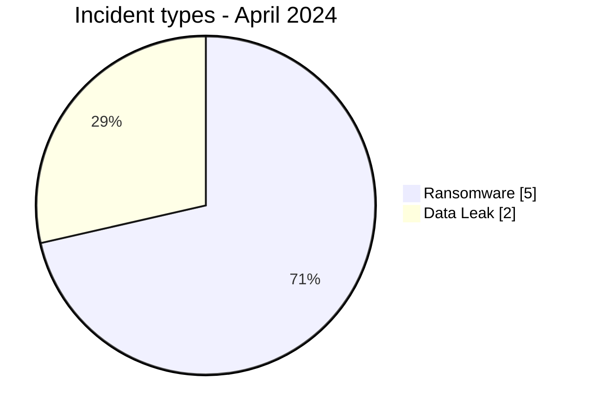
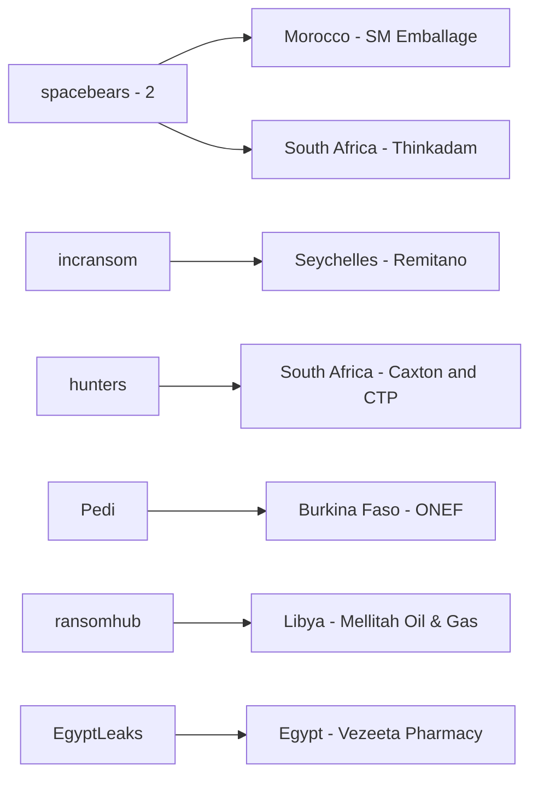
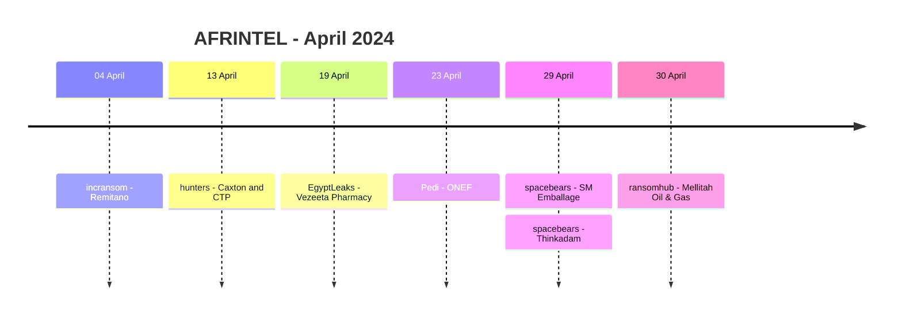

# AFRINTEL CTI Report - April 2024

👉🏾 [Version française](./README_FR.md)

## 1. Executive summary

AFRINTEL documents **7 incident records** in April 2024: **5 Ransomware** and **2 Data Leak**, across **6 African countries**. No Access Sale, DDoS, Defacement or Operational Fraud record is present in the validated April corpus.

South Africa accounts for two records. Burkina Faso, Egypt, Libya, Morocco and Seychelles each account for one. The seven incidents are distributed across seven different controlled sectors, so the month does not show a measurable sector concentration.

`spacebears` is the only actor associated with two organizations. The two Data Leak records, ONEF in Burkina Faso and Vezeeta Pharmacy in Egypt, include visible sample material. For the five Ransomware records, the available corpus supports the existence of the actor publications but does not independently confirm encryption, operational disruption or exfiltration.

👉🏾 [View the full victim list](./victims.md)

### 1.1 Month-over-month comparison

| Indicator | March 2024 | April 2024 | Change |
|---|---:|---:|---:|
| Total incidents | 9 | **7** | **-2 (-22.2%)** |
| Ransomware | 7 | **5** | **-2 (-28.6%)** |
| Data Leak | 2 | **2** | **0 (stable)** |
| Access Sale | 0 | **0** | Stable |
| DDoS | 0 | **0** | Stable |
| Defacement | 0 | **0** | Stable |
| Operational Fraud | 0 | **0** | Stable |

April records **22.2% fewer incidents** than March. The decrease is entirely attributable to Ransomware, which falls from 7 to 5. Data Leak remains stable at 2 records.

## 2. Methodology

- **Period:** 1-30 April 2024.
- **Source of truth:** harmonized `victims_FR.md` / `victims.md`.
- **Counting:** one harmonized card equals one documented incident record.
- **Taxonomy:** Ransomware, Data Leak, Access Sale, DDoS, Defacement, Operational Fraud.
- **Retrospective correction registry:** none of the 10 identified missing 2024 incidents belongs to April, so no additional record is injected into this month.
- Technical findings are limited to visible source evidence. Behaviors commonly associated with a ransomware group are not treated as observed facts unless the card contains supporting evidence.
- Claimed record volumes and potential impacts remain distinct from directly reviewed evidence.

## 3. Global overview

### 3.1 Incident-type distribution

| Incident type | Records | Share |
|---|---:|---:|
| Ransomware | **5** | **71.4%** |
| Data Leak | **2** | **28.6%** |
| Access Sale | 0 | 0.0% |
| DDoS | 0 | 0.0% |
| Defacement | 0 | 0.0% |
| Operational Fraud | 0 | 0.0% |
| **Total** | **7** | **100%** |

### 3.2 Country distribution

| Country | Ransomware | Data Leak | Total |
|---|---:|---:|---:|
| 🇿🇦 South Africa | 2 | 0 | **2** |
| 🇧🇫 Burkina Faso | 0 | 1 | 1 |
| 🇪🇬 Egypt | 0 | 1 | 1 |
| 🇱🇾 Libya | 1 | 0 | 1 |
| 🇲🇦 Morocco | 1 | 0 | 1 |
| 🇸🇨 Seychelles | 1 | 0 | 1 |
| **Total** | **5** | **2** | **7** |

### 3.3 Regional distribution

| Region | Ransomware | Data Leak | Total |
|---|---:|---:|---:|
| North Africa | 2 | 1 | **3** |
| Southern Africa | 2 | 0 | **2** |
| West Africa | 0 | 1 | **1** |
| Indian Ocean | 1 | 0 | **1** |
| **Total** | **5** | **2** | **7** |

### 3.4 Harmonized sector distribution

| Sector | Records | Share |
|---|---:|---:|
| Finance / Banking | 1 | 14.3% |
| Media / Entertainment | 1 | 14.3% |
| Government / Administration | 1 | 14.3% |
| Manufacturing / Industry | 1 | 14.3% |
| Technology / IT | 1 | 14.3% |
| Energy / Utilities | 1 | 14.3% |
| Healthcare / Medical | 1 | 14.3% |
| **Total** | **7** | **100%** |

### 3.5 Actors / groups

| Actor / Group | Records |
|---|---:|
| spacebears | **2** |
| incransom | 1 |
| hunters | 1 |
| Pedi | 1 |
| ransomhub | 1 |
| EgyptLeaks | 1 |
| **Total** | **7** |

## 4. Detailed analysis

### 4.1 Ransomware - 5 records

The five Ransomware records concern **Remitano**, **Caxton and CTP Publishers and Printers**, **SM Emballage**, **Thinkadam** and **Mellitah Oil & Gas**.

All five are `Claim - Unverified`. The victim cards state that no accessible leaked file, database extract or screenshot was observed for these listings at collection time. The corpus therefore supports the fact that the organizations were published by the named ransomware groups, but does not independently establish intrusion, encryption, disruption, exfiltration volume or dataset completeness.

`spacebears` appears twice, against SM Emballage and Thinkadam. This repetition is an observed publication pattern only and is insufficient to establish a coordinated campaign or shared initial-access vector.

### 4.2 Data Leak - 2 records

The **ONEF** record is based on a forum publication presenting a database associated with `onef.gov.bf` and showing the structure of an `actualite` application table. The screenshot does not establish authenticity, completeness or initial access method.

The **Vezeeta Pharmacy** record is based on a publication attributed to EgyptLeaks advertising approximately **133,000 order records** covering 2021-2023. A visible sample contains fields related to contact, zone, order status, payment, branch, products and delivery addresses. AFRINTEL did not receive the complete archive and therefore does not validate the claimed 133,000-record total, acquisition method, completeness or current validity of the data.

## 5. Key findings and intelligence gaps

- Ransomware remains the dominant incident type with **5 of 7 records (71.4%)**.
- April's total volume is lower than March, but Data Leak remains unchanged at two records.
- No sector appears more than once, preventing a defensible conclusion about a dominant sector in April.
- ONEF and Vezeeta provide more direct documentary value than the five Ransomware listings because sample material is visible.
- No public DFIR evidence in the reviewed April corpus establishes the technical intrusion chains of the five Ransomware records.
- The claimed Vezeeta volume and the authenticity/completeness of the ONEF database remain unresolved collection gaps.

## 6. Contextual MITRE ATT&CK mapping

| Status | Technique | Application |
|---|---|---|
| Preventive | T1486 - Data Encrypted for Impact | Relevant to ransomware monitoring; encryption is not confirmed in the five April claims. |
| Preventive | T1490 - Inhibit System Recovery | Relevant backup-protection control; behavior not observed in the April evidence. |
| Contextual | T1213 - Data from Information Repositories | Relevant to database/repository exposure represented by ONEF and Vezeeta. |
| Preventive | T1567 - Exfiltration Over Web Service | Outbound-data monitoring context; exfiltration channels are not established. |

## 7. Recommendations

- Preserve and correlate logs around the publication dates before raising confidence in ransomware claims.
- For energy and financial environments, prioritize continuity, privileged-access controls and isolated backups.
- For ONEF and Vezeeta, validate backend access history, abnormal exports and affected-record scope before treating advertised volumes as confirmed.
- Monitor for later actor publications that may add samples or change evidence status.
- Maintain separate fields for actor claim, victim confirmation, sample publication and technical validation.

## 8. Timeline

## 9. Conclusion

April 2024 closes with **7 documented incident records across 6 African countries**, consisting of **5 Ransomware claims and 2 Data Leak records**. Compared with March, the monthly corpus decreases by **22.2%**, from 9 to 7 incidents. This reduction is driven by Ransomware, which falls from 7 to 5, while Data Leak remains stable at 2.

The month does not reveal a defensible sector concentration: each of the seven records belongs to a different harmonized sector. The geographic picture is similarly dispersed, with only South Africa appearing more than once. `spacebears` is the only actor represented twice, but the available evidence does not support interpreting those two publications as a coordinated campaign or as proof of a shared intrusion method.

The quality of evidence also differs significantly by incident type. The five Ransomware entries remain unverified actor claims without accessible technical artifacts confirming encryption, disruption or exfiltration. By contrast, ONEF and Vezeeta include visible data samples and therefore offer a stronger basis for exposure assessment, while still leaving important uncertainties regarding authenticity, completeness, acquisition method and total affected volume.

For CTI monitoring, the priority after April is therefore not to infer additional technical detail from actor reputation, but to **follow the evidence lifecycle**: victim confirmation, later sample publication, technical indicators, service disruption, confirmed affected-record counts and possible republication of the same material. This distinction is necessary to keep AFRINTEL's historical statistics useful without turning cybercriminal claims into confirmed compromises.

**AFRINTEL** - TLP:CLEAR
