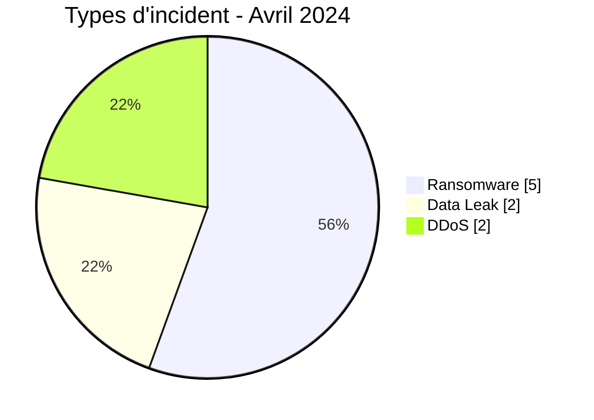

# Rapport CTI AFRINTEL - Cybermenaces en Afrique - Avril 2024

👉🏾 [English version](./README.md)

## 1. Synthèse exécutive

En Avril 2024, AFRINTEL retient **9 cyberincidents canoniques dans 6 pays**. Le mois est dominé par **Ransomware (5, 55,6 %)** puis **DDoS (2, 22,2 %)**. Les pays les plus représentés sont **Afrique du Sud (3)**, **Libye (2)**, **Seychelles (1)**. Les secteurs les plus visibles sont **Finance / Banque (2)**, **Médias / Divertissement (2)**, **Santé / Médical (1)**. Les labels acteur/groupe les plus fréquents sont `Unknown` (2), `spacebears` (2), `incransom` (1). `Unknown` désigne une absence d'attribution, pas un groupe.

La maturité de preuve est répartie entre **Claim - Unverified: 5**, **Confirmed: 2**, **Claim - Data Sample Published: 2**. Les claims ne sont pas convertis en confirmations sans preuve supplémentaire.

### 1.1 Étude comparative avec le mois précédent

| Indicateur | Mars 2024 | Avril 2024 | Évolution |
|---|---|---|---|
| Total | 9 | 9 | Stable |
| Ransomware | 8 | 5 | -3 (-37,5 %) |
| Data Leak | 1 | 2 | +1 (+100,0 %) |
| Access Sale | 0 | 0 | Stable |
| DDoS | 0 | 2 | +2 (nouveau) |
| Defacement | 0 | 0 | Stable |
| Account Takeover | 0 | 0 | Stable |
| System Intrusion | 0 | 0 | Stable |
| Malware | 0 | 0 | Stable |
| Operational Fraud | 0 | 0 | Stable |

### 1.2 Analyse comparative

Le volume mensuel **reste stable de 0 incident(s)**. Les variations structurantes sont : Ransomware 8->5 (-3), DDoS 0->2 (+2), Data Leak 1->2 (+1). Cette variation décrit le corpus documenté, pas nécessairement une variation équivalente du nombre réel de compromissions sur le continent.

## 2. Méthodologie

- Un incident canonique correspond à un événement retenu dans le millésime 2024.
- Les découvertes/republications historiques sont conservées séparément et ne gonflent pas les statistiques 2024.
- La date d'incident ou la meilleure fenêtre soutenue prime ; la date de découverte AFRINTEL reste distincte.
- Les 9 types AFRINTEL sont utilisés ; une tentative est représentée par le statut, jamais par un type `Attempted Attack`.
- Un DDoS coordonné est compté par campagne.
- Type, statut, confiance, impact, attribution et source restent distincts.

## 3. Répartition par type d'incident

| Type | Fiches | Part |
|---|---|---|
| Ransomware | 5 | 55,6 % |
| Data Leak | 2 | 22,2 % |
| Access Sale | 0 | 0,0 % |
| DDoS | 2 | 22,2 % |
| Defacement | 0 | 0,0 % |
| Account Takeover | 0 | 0,0 % |
| System Intrusion | 0 | 0,0 % |
| Malware | 0 | 0,0 % |
| Operational Fraud | 0 | 0,0 % |

## 4. Pays x type

| Pays | Total | Ransomware | Data Leak | Access Sale | DDoS | Defacement | Account Takeover | System Intrusion | Malware | Operational Fraud |
|---|---|---|---|---|---|---|---|---|---|---|
| Afrique du Sud | 3 | 2 | 0 | 0 | 1 | 0 | 0 | 0 | 0 | 0 |
| Libye | 2 | 1 | 0 | 0 | 1 | 0 | 0 | 0 | 0 | 0 |
| Seychelles | 1 | 1 | 0 | 0 | 0 | 0 | 0 | 0 | 0 | 0 |
| Égypte | 1 | 0 | 1 | 0 | 0 | 0 | 0 | 0 | 0 | 0 |
| Burkina Faso | 1 | 0 | 1 | 0 | 0 | 0 | 0 | 0 | 0 | 0 |
| Maroc | 1 | 1 | 0 | 0 | 0 | 0 | 0 | 0 | 0 | 0 |

## 5. Répartition régionale

| Région | Fiches | Part |
|---|---|---|
| Afrique du Nord | 4 | 44,4 % |
| Afrique australe | 3 | 33,3 % |
| Océan Indien | 1 | 11,1 % |
| Afrique de l'Ouest | 1 | 11,1 % |

## 6. Répartition sectorielle

| Secteur | Fiches | Part |
|---|---|---|
| Finance / Banque | 2 | 22,2 % |
| Médias / Divertissement | 2 | 22,2 % |
| Santé / Médical | 1 | 11,1 % |
| Gouvernement / Administration | 1 | 11,1 % |
| Industrie / Fabrication | 1 | 11,1 % |
| Technologie / IT | 1 | 11,1 % |
| Énergie / Services publics | 1 | 11,1 % |

## 7. Acteurs / groupes

| Acteur / Groupe | Fiches | Part |
|---|---|---|
| Unknown | 2 | 22,2 % |
| spacebears | 2 | 22,2 % |
| incransom | 1 | 11,1 % |
| hunters | 1 | 11,1 % |
| EgyptLeaks | 1 | 11,1 % |
| Pedi | 1 | 11,1 % |
| ransomhub | 1 | 11,1 % |

## 8. Maturité des preuves

| Position de preuve | Fiches | Part |
|---|---|---|
| Claim - Unverified | 5 | 55,6 % |
| Confirmed | 2 | 22,2 % |
| Claim - Data Sample Published | 2 | 22,2 % |

### Confiance

| Confiance | Fiches | Part |
|---|---|---|
| Low | 5 | 55,6 % |
| Very High | 2 | 22,2 % |
| Medium | 2 | 22,2 % |

## 9. Chronologie

```mermaid
timeline
    title AFRINTEL - Avril 2024
    1-3 Avril 2024 : Central Bank of Libya (CBL)
- **Date de l'incident -** 1-3 Avril 2024
- **Date de publication initiale / source retenue -** 8 avril 2024
- **Date de découverte AFRINTEL -** 23 août 2026 - audit rétrospectif
- **Précision chronologique -** Campagne couvrant les événements des 1er et 3 avril.
- **Acteur / Groupe -** Unknown
- **Secteur -** Finance / Banking
- **Site web -** [cbl.gov.ly](https -//cbl.gov.ly/)
- **Statut -** Victim Confirmed
- **Type d'incident -** DDoS
- **Niveau de confiance -** Very High
- **Niveau d'impact -** Level 3
- **Analyse -** Le 1er avril, la plateforme de réservation de devises a subi une attaque DDoS affectant l'accès. Le 3 avril, le site officiel a subi une attaque du même type. AFRINTEL compte cette séquence comme une seule campagne DDoS et non comme un incident distinct par service ou domaine.
- **Sources publiques -** [Libya Observer](https -//libyaobserver.ly/sites/default/files/issues/172.pdf) | [KonBriefing](https -//konbriefing.com/en-topics/cyber-attacks-2024.html)

----------------------------
    1-2 Avril 2024 : Moneyweb
- **Date de l'incident -** 1-2 Avril 2024
- **Date de publication initiale / source retenue -** 3 avril 2024
- **Date de découverte AFRINTEL -** 23 août 2026 - audit rétrospectif
- **Précision chronologique -** Deux vagues documentées les 1er et 2 avril, comptées comme une seule campagne.
- **Acteur / Groupe -** Unknown
- **Secteur -** Media / Entertainment
- **Site web -** [moneyweb.co.za](https -//www.moneyweb.co.za/)
- **Statut -** Victim Confirmed
- **Type d'incident -** DDoS
- **Niveau de confiance -** Very High
- **Niveau d'impact -** Level 3
- **Analyse -** Moneyweb a documenté une première attaque DDoS d'environ 12 heures le 1er avril, suivie d'une seconde de plus de 8 heures le 2 avril. La victime a estimé environ 1,015 milliard de requêtes et a reçu un message d'extorsion. AFRINTEL conserve l'extorsion comme contexte et `DDoS` comme type principal unique.
- **Sources publiques -** [Moneyweb](https -//www.moneyweb.co.za/in-depth/investigations/massive-cyberattack-targets-moneywebs-banxso-articles/) | [KonBriefing](https -//konbriefing.com/en-topics/cyber-attacks-2024.html)

----------------------------
    04 Avril 2024 : Remitano (Cryptocurrency Exchange)
- **Acteur / Groupe -** incransom
- **Secteur -** Finance / Banking
- **Site web -** N/A (Mobile App & Exchange Platform)
- **Statut -** Claim - Unverified
- **Niveau de confiance -** Low
- **Niveau d'impact -** Level 3
- **Type d'incident -** Ransomware

- **Note de fiabilité -**
  Remitano (Cryptocurrency Exchange) figure sur le site de fuite du groupe incransom. AFRINTEL n'a observé aucun échantillon, capture ou extrait de données accessible associé à cette publication au moment de la collecte, et la revendication n'a pas été confirmée de manière indépendante par l'organisation.

- **Description -**
  Remitano est une plateforme internationale d'échange de crypto-monnaies en pair-à-pair (P2P) sécurisée par séquestre, permettant l'achat, la vente et le stockage d'actifs numériques avec des devises fiduciaires.

- **Analyse -**
  AFRINTEL a recensé Remitano (Cryptocurrency Exchange) (Seychelles) comme victime revendiquée par le groupe ransomware incransom. Aucun fichier divulgué, extrait de base de données ou capture d'écran n'était accessible pour analyse, ce qui ne permet pas d'évaluer l'ampleur, le volume ni la sensibilité des données éventuellement exposées. Compte tenu de l'activité de l'organisation dans le secteur Institutions bancaires et financières / Crypto-actifs, une compromission de ce type exposerait généralement des données de comptes clients, de paiement ou financières, avec des risques associés de phishing, de fraude ou de perturbation de l'activité. AFRINTEL ne confirme ni l'intrusion, ni l'exfiltration de données, ni l'existence d'un jeu de données complet sur la seule base de cette publication.

- **Recommandations -**
  1. Examiner la surface d'attaque externe, les services d'accès distant et l'intégrité des sauvegardes à la suite de cette publication par incransom, et vérifier la disponibilité de sauvegardes hors ligne ou immuables.
  2. Surveiller toute publication ultérieure d'échantillons de données liés à cette revendication et préparer des procédures de protection des données clients et de paiement et de réponse à incident adaptées au secteur financier en cas d'éléments de compromission avérés.
    13 Avril 2024 : Caxton and CTP Publishers and Printers
- **Acteur / Groupe -** hunters
- **Secteur -** Media / Entertainment
- **Site web -** https -//www.caxton.co.za
- **Statut -** Claim - Unverified
- **Niveau de confiance -** Low
- **Niveau d'impact -** Level 2
- **Type d'incident -** Ransomware

- **Note de fiabilité -**
  Caxton and CTP Publishers and Printers figure sur le site de fuite du groupe hunters. AFRINTEL n'a observé aucun échantillon, capture ou extrait de données accessible associé à cette publication au moment de la collecte, et la revendication n'a pas été confirmée de manière indépendante par l'organisation.

- **Description -**
  Caxton & CTP est l'un des plus grands éditeurs et imprimeurs de journaux, de magazines et d'emballages commerciaux en Afrique du Sud.

- **Analyse -**
  AFRINTEL a recensé Caxton and CTP Publishers and Printers (Afrique du Sud) comme victime revendiquée par le groupe ransomware hunters. Aucun fichier divulgué, extrait de base de données ou capture d'écran n'était accessible pour analyse, ce qui ne permet pas d'évaluer l'ampleur, le volume ni la sensibilité des données éventuellement exposées. Compte tenu de l'activité de l'organisation dans le secteur Médias, édition et audiovisuel, une compromission de ce type exposerait généralement des données employés, clients ou opérationnelles, avec des risques associés de phishing, de fraude ou de perturbation de l'activité. AFRINTEL ne confirme ni l'intrusion, ni l'exfiltration de données, ni l'existence d'un jeu de données complet sur la seule base de cette publication.

- **Recommandations -**
  1. Examiner la surface d'attaque externe, les services d'accès distant et l'intégrité des sauvegardes à la suite de cette publication par hunters, et vérifier la disponibilité de sauvegardes hors ligne ou immuables.
  2. Surveiller toute publication ultérieure d'échantillons de données liés à cette revendication et préparer des procédures de protection des données et de réponse à incident en cas d'éléments de compromission avérés.
    19 Avril 2024 : Vezeeta Pharmacy (vezeeta.com)

- **Date de publication initiale -** 19 avril 2024
- **Date de détection AFRINTEL -** 21 août 2026
- **Acteur / Groupe -** EgyptLeaks
- **Secteur -** Healthcare / Medical
- **Site web -** [vezeeta.com](https -//www.vezeeta.com)
- **Statut -** Claim - Data Sample Published
- **Niveau de confiance -** Medium
- **Niveau d'impact -** Level 3
- **Type d'incident -** Data Leak

- **Description -**

  Vezeeta est une plateforme égyptienne de réservation de soins et de services de pharmacie en ligne. La publication vise spécifiquement Vezeeta Pharmacy et annonce des données de commandes.

- **Analyse -**

  **Observed  -** Une publication attribuée à EgyptLeaks, datée du 19 avril 2024, propose à la vente environ 133 000 enregistrements de commandes de Vezeeta Pharmacy couvrant 2021, 2022 et 2023. La publication affiche un échantillon de lignes de commandes comprenant des champs de contact, de zone, de statut de commande, de paiement, de branche, de produits et d'adresses de livraison. Les valeurs personnelles visibles dans l'échantillon n'ont pas été reprises dans AFRINTEL.

  **Assumption  -** La concordance entre le nom de Vezeeta Pharmacy, le domaine vezeeta.com, les noms de branches et la structure d'un export de commandes est compatible avec une exposition de données clients en Égypte. Si les données sont authentiques, elles pourraient faciliter le phishing ciblé, la fraude à la livraison, l'usurpation de personnel ou de pharmacies et l'exposition d'informations de santé indirectement déduites des produits commandés.

  **Unknown  -** AFRINTEL n'a pas reçu l'archive complète ni confirmé les 133 000 commandes, la méthode d'acquisition, l'exhaustivité, la validité actuelle des coordonnées, la présence de données médicales protégées ou une confirmation de Vezeeta. L'analyse repose sur la capture et l'extrait visibles ; aucun nom, téléphone, adresse, produit associé à une personne ou identifiant de commande n'est reproduit.
    23 Avril 2024 : ONEF (Observatoire national de l’emploi et de la formation)
- **Acteur / Groupe -** Pedi
- **Secteur -** Government / Administration
- **Site web -** [onef.gov.bf](https -//onef.gov.bf)
- **Statut -** Claim - Data Sample Published
- **Niveau de confiance -** Medium
- **Niveau d'impact -** Level 3
- **Type d'incident -** Data Leak
- **Description -** L’Observatoire national de l’emploi et de la formation (ONEF) est une institution publique burkinabè consacrée aux informations sur l’emploi et la formation professionnelle.
- **Analyse -** Une publication sur un forum présente une base associée à onef.gov.bf comme une diffusion SQL gratuite et montre la structure d’une table applicative nommée `actualite`, avec des champs liés aux actualités et aux métadonnées de publication. La capture ne permet pas d’établir l’authenticité, l’exhaustivité ou la méthode d’accès initiale. AFRINTEL enregistre cette publication comme une revendication accompagnée d’un échantillon et ne reproduit aucune valeur de la base.
    29 Avril 2024 : SM EMBALLAGE
- **Acteur / Groupe -** spacebears
- **Secteur -** Manufacturing / Industry
- **Site web -** https -//smemballage.com/
- **Statut -** Claim - Unverified
- **Niveau de confiance -** Low
- **Niveau d'impact -** Level 2
- **Type d'incident -** Ransomware

- **Note de fiabilité -**
  SM EMBALLAGE figure sur le site de fuite du groupe spacebears. AFRINTEL n'a observé aucun échantillon, capture ou extrait de données accessible associé à cette publication au moment de la collecte, et la revendication n'a pas été confirmée de manière indépendante par l'organisation.

- **Description -**
  SM Emballage est une entreprise marocaine spécialisée dans la conception et la fabrication d'emballages personnalisés et de solutions de protection pour le secteur agroalimentaire et industriel.

- **Analyse -**
  AFRINTEL a recensé SM EMBALLAGE (Maroc) comme victime revendiquée par le groupe ransomware spacebears. Aucun fichier divulgué, extrait de base de données ou capture d'écran n'était accessible pour analyse, ce qui ne permet pas d'évaluer l'ampleur, le volume ni la sensibilité des données éventuellement exposées. Compte tenu de l'activité de l'organisation dans le secteur Industrie manufacturière / Emballages industriels, une compromission de ce type exposerait généralement des données fournisseurs, clients ou opérationnelles, avec des risques associés de phishing, de fraude ou de perturbation de l'activité. AFRINTEL ne confirme ni l'intrusion, ni l'exfiltration de données, ni l'existence d'un jeu de données complet sur la seule base de cette publication.

- **Recommandations -**
  1. Examiner la surface d'attaque externe, les services d'accès distant et l'intégrité des sauvegardes à la suite de cette publication par spacebears, et vérifier la disponibilité de sauvegardes hors ligne ou immuables.
  2. Surveiller toute publication ultérieure d'échantillons de données liés à cette revendication et préparer des procédures de protection des données opérationnelles et de réponse à incident en cas d'éléments de compromission avérés.
    29 Avril 2024 : Thinkadam
- **Acteur / Groupe -** spacebears
- **Secteur -** Technology / IT
- **Site web -** https -//www.thinkadam.co/
- **Statut -** Claim - Unverified
- **Niveau de confiance -** Low
- **Niveau d'impact -** Level 2
- **Type d'incident -** Ransomware

- **Note de fiabilité -**
  Thinkadam figure sur le site de fuite du groupe spacebears. AFRINTEL n'a observé aucun échantillon, capture ou extrait de données accessible associé à cette publication au moment de la collecte, et la revendication n'a pas été confirmée de manière indépendante par l'organisation.

- **Description -**
  Thinkadam fournit des solutions technologiques avancées de verrouillage d'appareils à destination de l'industrie du crédit sur smartphones, visant à réduire les défauts de paiement.

- **Analyse -**
  AFRINTEL a recensé Thinkadam (Afrique du Sud) comme victime revendiquée par le groupe ransomware spacebears. Aucun fichier divulgué, extrait de base de données ou capture d'écran n'était accessible pour analyse, ce qui ne permet pas d'évaluer l'ampleur, le volume ni la sensibilité des données éventuellement exposées. Compte tenu de l'activité de l'organisation dans le secteur Technologies de l'information / Téléphonie, une compromission de ce type exposerait généralement des données clients, partenaires ou techniques internes, avec des risques associés de phishing, de fraude ou de perturbation de l'activité. AFRINTEL ne confirme ni l'intrusion, ni l'exfiltration de données, ni l'existence d'un jeu de données complet sur la seule base de cette publication.

- **Recommandations -**
  1. Examiner la surface d'attaque externe, les services d'accès distant et l'intégrité des sauvegardes à la suite de cette publication par spacebears, et vérifier la disponibilité de sauvegardes hors ligne ou immuables.
  2. Surveiller toute publication ultérieure d'échantillons de données liés à cette revendication et préparer des procédures de protection des données clients et de réponse à incident adaptées au secteur technologique en cas d'éléments de compromission avérés.
    30 Avril 2024 : Mellitah Oil & Gas (Eni / NOC Joint Venture)
- **Acteur / Groupe -** ransomhub
- **Secteur -** Energy / Utilities
- **Site web -** N/A
- **Statut -** Claim - Unverified
- **Niveau de confiance -** Low
- **Niveau d'impact -** Level 3
- **Type d'incident -** Ransomware

- **Note de fiabilité -**
  Mellitah Oil & Gas (Eni / NOC Joint Venture) figure sur le site de fuite du groupe ransomhub. AFRINTEL n'a observé aucun échantillon, capture ou extrait de données accessible associé à cette publication au moment de la collecte, et la revendication n'a pas été confirmée de manière indépendante par l'organisation.

- **Description -**
  Mellitah Oil & Gas est un consortium d'exploration et d'exploitation énergétique majeur en Libye, opéré conjointement par la National Oil Corporation (NOC) et la major italienne Eni.

- **Analyse -**
  AFRINTEL a recensé Mellitah Oil & Gas (Eni / NOC Joint Venture) (Libye) comme victime revendiquée par le groupe ransomware ransomhub. Aucun fichier divulgué, extrait de base de données ou capture d'écran n'était accessible pour analyse, ce qui ne permet pas d'évaluer l'ampleur, le volume ni la sensibilité des données éventuellement exposées. Compte tenu de l'activité de l'organisation dans le secteur Énergie / Pétrole & Gaz, une compromission de ce type exposerait généralement des données employés, clients ou opérationnelles, avec des risques associés de phishing, de fraude ou de perturbation de l'activité. AFRINTEL ne confirme ni l'intrusion, ni l'exfiltration de données, ni l'existence d'un jeu de données complet sur la seule base de cette publication.

- **Recommandations -**
  1. Examiner la surface d'attaque externe, les services d'accès distant et l'intégrité des sauvegardes à la suite de cette publication par ransomhub, et vérifier la disponibilité de sauvegardes hors ligne ou immuables.
  2. Surveiller toute publication ultérieure d'échantillons de données liés à cette revendication et préparer des procédures de protection des données et de réponse à incident en cas d'éléments de compromission avérés.
```

## 10. Analyse CTI par type

### Ransomware - 5

**5 fiche(s) (55,6 %).** Principaux pays : Afrique du Sud (2), Seychelles (1), Maroc (1). Les conclusions restent limitées aux éléments documentés ; le type ne permet pas d'inférer un vecteur ou un impact non observé.

### DDoS - 2

**2 fiche(s) (22,2 %).** Principaux pays : Libye (1), Afrique du Sud (1). Les conclusions restent limitées aux éléments documentés ; le type ne permet pas d'inférer un vecteur ou un impact non observé.

### Data Leak - 2

**2 fiche(s) (22,2 %).** Principaux pays : Égypte (1), Burkina Faso (1). Les conclusions restent limitées aux éléments documentés ; le type ne permet pas d'inférer un vecteur ou un impact non observé.

## 11. Incidents prioritaires pour revue

| Pays | Organisation | Type | Statut | Impact | Confiance |
|---|---|---|---|---|---|
| Libye | Central Bank of Libya (CBL)
- **Date de l'incident:** 1-3 Avril 2024
- **Date de publication initiale / source retenue:** 8 avril 2024
- **Date de découverte AFRINTEL:** 23 août 2026 - audit rétrospectif
- **Précision chronologique:** Campagne couvrant les événements des 1er et 3 avril.
- **Acteur / Groupe:** Unknown
- **Secteur:** Finance / Banking
- **Site web:** [cbl.gov.ly](https://cbl.gov.ly/)
- **Statut:** Victim Confirmed
- **Type d'incident:** DDoS
- **Niveau de confiance:** Very High
- **Niveau d'impact:** Level 3
- **Analyse:** Le 1er avril, la plateforme de réservation de devises a subi une attaque DDoS affectant l'accès. Le 3 avril, le site officiel a subi une attaque du même type. AFRINTEL compte cette séquence comme une seule campagne DDoS et non comme un incident distinct par service ou domaine.
- **Sources publiques:** [Libya Observer](https://libyaobserver.ly/sites/default/files/issues/172.pdf) | [KonBriefing](https://konbriefing.com/en-topics/cyber-attacks-2024.html)

---------------------------- | DDoS | Victim Confirmed | Level 3 | Very High |
| Afrique du Sud | Moneyweb
- **Date de l'incident:** 1-2 Avril 2024
- **Date de publication initiale / source retenue:** 3 avril 2024
- **Date de découverte AFRINTEL:** 23 août 2026 - audit rétrospectif
- **Précision chronologique:** Deux vagues documentées les 1er et 2 avril, comptées comme une seule campagne.
- **Acteur / Groupe:** Unknown
- **Secteur:** Media / Entertainment
- **Site web:** [moneyweb.co.za](https://www.moneyweb.co.za/)
- **Statut:** Victim Confirmed
- **Type d'incident:** DDoS
- **Niveau de confiance:** Very High
- **Niveau d'impact:** Level 3
- **Analyse:** Moneyweb a documenté une première attaque DDoS d'environ 12 heures le 1er avril, suivie d'une seconde de plus de 8 heures le 2 avril. La victime a estimé environ 1,015 milliard de requêtes et a reçu un message d'extorsion. AFRINTEL conserve l'extorsion comme contexte et `DDoS` comme type principal unique.
- **Sources publiques:** [Moneyweb](https://www.moneyweb.co.za/in-depth/investigations/massive-cyberattack-targets-moneywebs-banxso-articles/) | [KonBriefing](https://konbriefing.com/en-topics/cyber-attacks-2024.html)

---------------------------- | DDoS | Victim Confirmed | Level 3 | Very High |
| Égypte | Vezeeta Pharmacy (vezeeta.com)

- **Date de publication initiale:** 19 avril 2024
- **Date de détection AFRINTEL:** 21 août 2026
- **Acteur / Groupe:** EgyptLeaks
- **Secteur:** Healthcare / Medical
- **Site web:** [vezeeta.com](https://www.vezeeta.com)
- **Statut:** Claim - Data Sample Published
- **Niveau de confiance:** Medium
- **Niveau d'impact:** Level 3
- **Type d'incident:** Data Leak

- **Description:**

  Vezeeta est une plateforme égyptienne de réservation de soins et de services de pharmacie en ligne. La publication vise spécifiquement Vezeeta Pharmacy et annonce des données de commandes.

- **Analyse:**

  **Observed :** Une publication attribuée à EgyptLeaks, datée du 19 avril 2024, propose à la vente environ 133 000 enregistrements de commandes de Vezeeta Pharmacy couvrant 2021, 2022 et 2023. La publication affiche un échantillon de lignes de commandes comprenant des champs de contact, de zone, de statut de commande, de paiement, de branche, de produits et d'adresses de livraison. Les valeurs personnelles visibles dans l'échantillon n'ont pas été reprises dans AFRINTEL.

  **Assumption :** La concordance entre le nom de Vezeeta Pharmacy, le domaine vezeeta.com, les noms de branches et la structure d'un export de commandes est compatible avec une exposition de données clients en Égypte. Si les données sont authentiques, elles pourraient faciliter le phishing ciblé, la fraude à la livraison, l'usurpation de personnel ou de pharmacies et l'exposition d'informations de santé indirectement déduites des produits commandés.

  **Unknown :** AFRINTEL n'a pas reçu l'archive complète ni confirmé les 133 000 commandes, la méthode d'acquisition, l'exhaustivité, la validité actuelle des coordonnées, la présence de données médicales protégées ou une confirmation de Vezeeta. L'analyse repose sur la capture et l'extrait visibles ; aucun nom, téléphone, adresse, produit associé à une personne ou identifiant de commande n'est reproduit. | Data Leak | Claim - Data Sample Published | Level 3 | Medium |
| Burkina Faso | ONEF (Observatoire national de l’emploi et de la formation)
- **Acteur / Groupe:** Pedi
- **Secteur:** Government / Administration
- **Site web:** [onef.gov.bf](https://onef.gov.bf)
- **Statut:** Claim - Data Sample Published
- **Niveau de confiance:** Medium
- **Niveau d'impact:** Level 3
- **Type d'incident:** Data Leak
- **Description:** L’Observatoire national de l’emploi et de la formation (ONEF) est une institution publique burkinabè consacrée aux informations sur l’emploi et la formation professionnelle.
- **Analyse:** Une publication sur un forum présente une base associée à onef.gov.bf comme une diffusion SQL gratuite et montre la structure d’une table applicative nommée `actualite`, avec des champs liés aux actualités et aux métadonnées de publication. La capture ne permet pas d’établir l’authenticité, l’exhaustivité ou la méthode d’accès initiale. AFRINTEL enregistre cette publication comme une revendication accompagnée d’un échantillon et ne reproduit aucune valeur de la base. | Data Leak | Claim - Data Sample Published | Level 3 | Medium |
| Seychelles | Remitano (Cryptocurrency Exchange)
- **Acteur / Groupe:** incransom
- **Secteur:** Finance / Banking
- **Site web:** N/A (Mobile App & Exchange Platform)
- **Statut:** Claim - Unverified
- **Niveau de confiance:** Low
- **Niveau d'impact:** Level 3
- **Type d'incident:** Ransomware

- **Note de fiabilité:**
  Remitano (Cryptocurrency Exchange) figure sur le site de fuite du groupe incransom. AFRINTEL n'a observé aucun échantillon, capture ou extrait de données accessible associé à cette publication au moment de la collecte, et la revendication n'a pas été confirmée de manière indépendante par l'organisation.

- **Description:**
  Remitano est une plateforme internationale d'échange de crypto-monnaies en pair-à-pair (P2P) sécurisée par séquestre, permettant l'achat, la vente et le stockage d'actifs numériques avec des devises fiduciaires.

- **Analyse:**
  AFRINTEL a recensé Remitano (Cryptocurrency Exchange) (Seychelles) comme victime revendiquée par le groupe ransomware incransom. Aucun fichier divulgué, extrait de base de données ou capture d'écran n'était accessible pour analyse, ce qui ne permet pas d'évaluer l'ampleur, le volume ni la sensibilité des données éventuellement exposées. Compte tenu de l'activité de l'organisation dans le secteur Institutions bancaires et financières / Crypto-actifs, une compromission de ce type exposerait généralement des données de comptes clients, de paiement ou financières, avec des risques associés de phishing, de fraude ou de perturbation de l'activité. AFRINTEL ne confirme ni l'intrusion, ni l'exfiltration de données, ni l'existence d'un jeu de données complet sur la seule base de cette publication.

- **Recommandations:**
  1. Examiner la surface d'attaque externe, les services d'accès distant et l'intégrité des sauvegardes à la suite de cette publication par incransom, et vérifier la disponibilité de sauvegardes hors ligne ou immuables.
  2. Surveiller toute publication ultérieure d'échantillons de données liés à cette revendication et préparer des procédures de protection des données clients et de paiement et de réponse à incident adaptées au secteur financier en cas d'éléments de compromission avérés. | Ransomware | Claim - Unverified | Level 3 | Low |

> Sélection structurée selon impact, statut et confiance ; ce n'est pas un classement absolu de gravité.

## 12. Intelligence gaps et corrections

- vecteur d'accès initial souvent inconnu ;
- date technique de compromission parfois différente de la date de publication ;
- volumes revendiqués rarement vérifiables intégralement ;
- attribution technique souvent limitée au compte de publication ;
- republications historiques suivies séparément.

## 13. Recommandations

- MFA résistante au phishing, PAM et moindre privilège ;
- segmentation, sauvegardes immuables et tests de restauration ;
- centralisation EDR/IAM/VPN/WAF/DNS/cloud/applications ;
- détection des exports massifs, archives inhabituelles et transferts sortants ;
- conservation séparée des dates d'incident, publication initiale, repost et découverte AFRINTEL.

## 14. Conclusion

Avril 2024 contient **9 incidents canoniques**. La comparaison avec le mois précédent est calculée sur la même taxonomie et les mêmes règles chronologiques, sauf janvier où décembre 2023 reste `N/A` faute de réaudit homogène.

👉🏾 [Victimes canoniques](./victims_FR.md)

**AFRINTEL** - TLP:CLEAR
