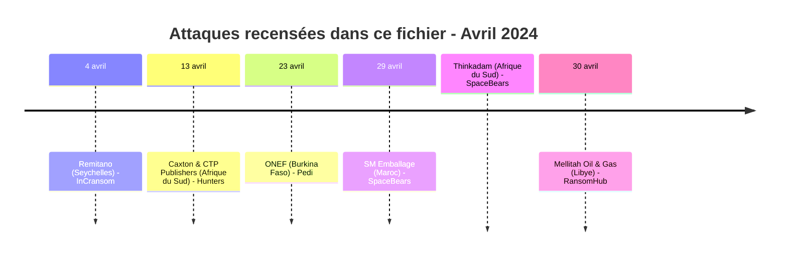
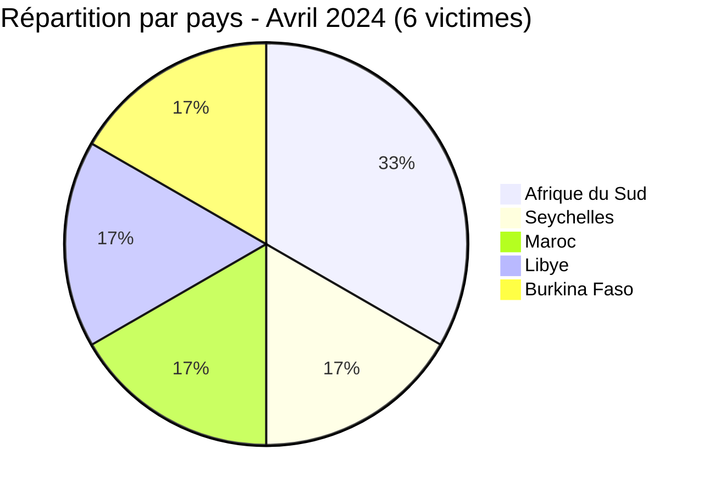

[](https://github.com/Hatchepsoute/AFRINTEL)


# Rapport CTI - Avril 2024 : Énergie et crypto-actifs dans le viseur

👉🏾 [English version available here](./README.md)

### 1. Résumé exécutif

En avril 2024, l'Afrique a enregistré **6 victimes** documentées : **5 revendications de ransomware** dans 5 pays différents, ainsi qu'**1 revendication de fuite de données** au Burkina Faso. Le mois est marqué par deux cibles ransomware de premier plan : une **coentreprise pétrolière libyenne majeure** (~1 To exfiltré) et une **plateforme d'échange de cryptomonnaies** aux Seychelles. Le groupe SpaceBears apparaît pour la première fois avec deux revendications simultanées, aux côtés d'une revendication de fuite de données distincte visant une agence gouvernementale burkinabè de l'emploi.

👉🏾 [Liste des victimes](./victims_FR.md)

**Chiffres clés :**
- 🔹 **6 victimes** identifiées
- 🔹 **5 sources actives** : InCransom (1), Hunters (1), SpaceBears (2), RansomHub (1), Pedi (1)
- 🔹 **Pays touchés** : Afrique du Sud (2), Seychelles (1), Maroc (1), Libye (1), Burkina Faso (1)
- 🔹 **Secteurs** : Banque/Crypto, Médias & Édition, Industrie/Emballage, Technologies, Pétrole & Gaz, Gouvernement/Emploi et formation
- 🔹 **Types d'incident** : Ransomware (5), Fuite de données (1)
### Vue agrégée mensuelle de l’exposition

La vue CTI mensuelle regroupe les fuites de données et les ventes d’accès sous **exposition des données** : **1 fiches** (16.7% du corpus mensuel). Les fiches sources restent la référence ; une vente d’accès ne prouve pas à elle seule l’exfiltration de données.


---

### 2. Chronologie des attaques

| Date | Victime | Pays | Acteur / Groupe | Type |
|------|---------|------|------------------|------|
| 4 avril | Remitano (Plateforme d'échange crypto) | Seychelles | InCransom | Ransomware |
| 13 avril | Caxton and CTP Publishers and Printers | Afrique du Sud | Hunters | Ransomware |
| 23 avril | ONEF (Observatoire national de l'emploi et de la formation) | Burkina Faso | Pedi | Fuite de données (échantillon SQL) |
| 29 avril | SM Emballage | Maroc | SpaceBears | Ransomware |
| 29 avril | Thinkadam | Afrique du Sud | SpaceBears | Ransomware |
| 30 avril | Mellitah Oil & Gas (Eni / NOC JV) | Libye | RansomHub | Ransomware |



---

### 3. Analyse des victimes

#### 3.1 Par pays

| Pays | Nombre d'attaques |
|------|-----------------|
| Afrique du Sud | 2 |
| Seychelles | 1 |
| Maroc | 1 |
| Libye | 1 |
| Burkina Faso | 1 |



#### 3.2 Par secteur

| Secteur | Nombre |
|---------|--------|
| Banque / Crypto-actifs | 1 |
| Médias & Édition | 1 |
| Industrie / Emballage industriel | 1 |
| Technologies | 1 |
| Pétrole & Gaz / Énergie | 1 |
| Gouvernement / Emploi et formation | 1 |

```mermaid
xychart-beta
    title "Secteurs ciblés - Avril 2024"
    x-axis ["Banque/Crypto", "Médias", "Industrie", "Technologies", "Pétrole & Gaz", "Gouvernement/Emploi"]
    y-axis "Nombre d'attaques" 0 to 2
    bar [1, 1, 1, 1, 1, 1]
```

#### 3.3 Groupes ransomware

| Groupe ransomware | Nombre d'attaques |
|-----------------|-----------------|
| SpaceBears | 2 |
| InCransom | 1 |
| Hunters | 1 |
| RansomHub | 1 |

#### 3.4 Sources de fuite de données

| Source | Nombre de revendications |
|--------|--------------------------|
| Pedi | 1 |

```mermaid
gantt
    title Groupes ransomware actifs - Avril 2024
    dateFormat X
    axisFormat %s
    section SpaceBears
    SpaceBears : 0, 2
    section InCransom
    InCransom : 0, 1
    section Hunters
    Hunters : 0, 1
    section RansomHub
    RansomHub : 0, 1
```



---

### 4. Points d'attention

- **Attaque à fort impact sur le secteur énergétique** : Mellitah Oil & Gas (coentreprise Eni/NOC en Libye) est revendiquée par RansomHub avec environ **1 To de données exfiltrées**, l'impact le plus élevé du mois, impliquant un actif énergétique stratégique co-détenu par une major internationale.
- **Crypto dans le viseur** : Remitano (plateforme d'échange P2P enregistrée aux Seychelles) est ciblée par InCransom. Cette même victime sera revendiquée à nouveau en août 2024 par un autre groupe (Meow), un pattern de double-claim précoce.
- **Émergence de SpaceBears** : le groupe frappe deux fois le 29 avril (Maroc et Afrique du Sud simultanément), signalant une campagne coordonnée ou une phase de prospection active.
- **Médias ciblés** : Caxton and CTP Publishers, l'un des plus grands groupes d'impression/médias d'Afrique du Sud, souligne l'intérêt des acteurs malveillants pour les organisations détenant de larges bases de données consommateurs.
- **Revendication burkinabè de fuite de données** : ONEF (Observatoire national de l'emploi et de la formation), découverte le 23 avril 2024, correspond à une publication de forum par l'acteur `Pedi` présentant une base associée à onef.gov.bf comme une diffusion SQL gratuite. La capture montre la structure d'une table d'actualités/publications mais ne permet pas d'établir l'authenticité du jeu de données ni la méthode d'accès initiale. Elle n'est pas attribuée à un groupe ransomware et est comptabilisée séparément comme une fuite de données visant une institution publique burkinabè de l'emploi.

---

```mermaid
xychart-beta
    title "Évolution mensuelle des attaques (Jan - Avr 2024)"
    x-axis ["Jan", "Fév", "Mar", "Avr"]
    y-axis "Nombre d'attaques" 0 to 14
    bar [12, 5, 8, 6]
```

### 5. Recommandations

| Domaine | Action recommandée |
|---------|--------------------|
| Pétrole & Gaz / Énergie | Auditer les contrôles d'accès fournisseurs, déployer une solution DLP, surveiller les transferts massifs de données. |
| Plateformes crypto / Fintech | Imposer le MFA sur toutes les interfaces admin, surveiller les anomalies API, préparer un plan de réponse aux incidents. |
| Médias & Édition | Protéger les bases abonnés et annonceurs, segmenter les systèmes éditoriaux du SI métier. |
| Industrie | Auditer les systèmes exposés sur Internet, appliquer le patch management pour les plateformes industrielles. |
| Gouvernement / emploi et formation | L'ONEF devrait vérifier la revendication dans les journaux applicatifs et de base de données, confirmer l'authenticité de l'export SQL référencé et faire pivoter les identifiants en cas d'exposition confirmée. |
| Toutes organisations | Suivre les IOCs de SpaceBears et RansomHub, les deux groupes montrent une activité africaine croissante. |

---

*Rapport généré à partir des données OSINT AFRINTEL. Diffusion libre (TLP:CLEAR)*
