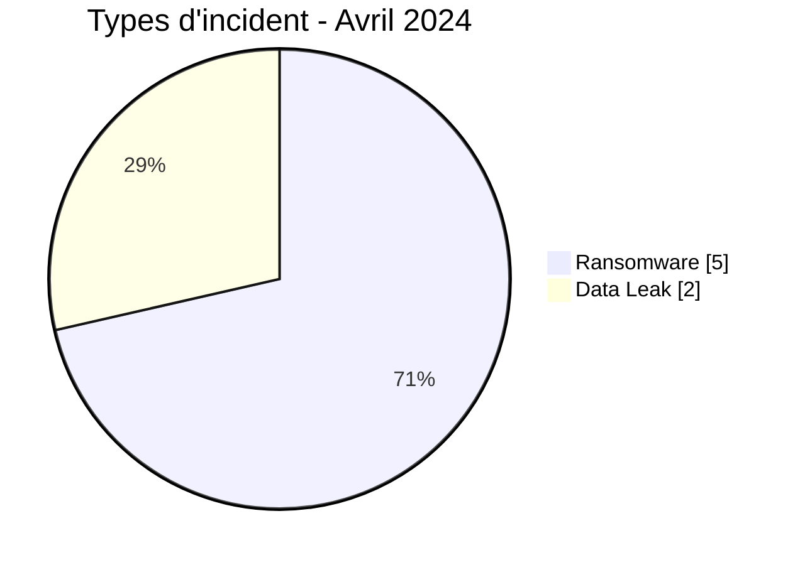
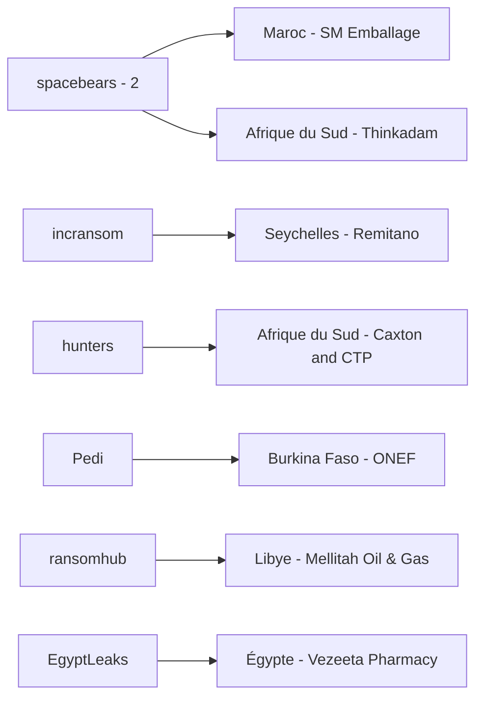
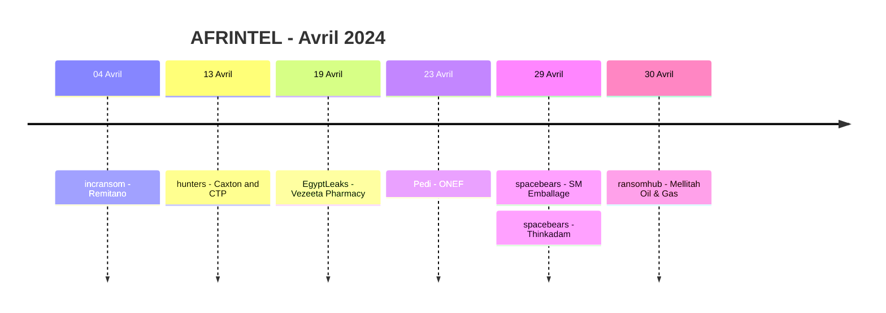

# Rapport CTI AFRINTEL - Avril 2024

👉🏾 [English version](./README.md)

## 1. Résumé exécutif

AFRINTEL documente **7 fiches incident** en avril 2024 : **5 Ransomware** et **2 Data Leak**, dans **6 pays africains**. Aucun Access Sale, DDoS, Defacement ou Operational Fraud n'est présent dans le corpus validé d'avril.

L'Afrique du Sud représente deux fiches. Le Burkina Faso, l'Égypte, la Libye, le Maroc et les Seychelles en comptent une chacun. Les sept incidents appartiennent à sept secteurs contrôlés différents, ce qui ne permet pas d'établir une concentration sectorielle mesurable sur le mois.

`spacebears` est le seul acteur associé à deux organisations. Les deux Data Leak, ONEF au Burkina Faso et Vezeeta Pharmacy en Égypte, disposent d'éléments d'échantillon visibles. Pour les cinq Ransomware, le corpus permet d'établir l'existence des publications des groupes, mais ne confirme pas indépendamment le chiffrement, la perturbation opérationnelle ou l'exfiltration.

👉🏾 [Voir la liste complète des victimes](./victims_FR.md)

### 1.1 Comparaison avec le mois précédent

| Indicateur | Mars 2024 | Avril 2024 | Évolution |
|---|---:|---:|---:|
| Total incidents | 9 | **7** | **-2 (-22,2 %)** |
| Ransomware | 7 | **5** | **-2 (-28,6 %)** |
| Data Leak | 2 | **2** | **0 (stable)** |
| Access Sale | 0 | **0** | Stable |
| DDoS | 0 | **0** | Stable |
| Defacement | 0 | **0** | Stable |
| Operational Fraud | 0 | **0** | Stable |

Avril compte **22,2 % d'incidents en moins** que mars. La baisse provient entièrement des Ransomware, qui passent de 7 à 5. Les Data Leak restent stables à 2 fiches.

## 2. Méthodologie

- **Période :** 1er au 30 avril 2024.
- **Source de vérité :** couple harmonisé `victims_FR.md` / `victims.md`.
- **Comptage :** une fiche harmonisée correspond à un incident documenté.
- **Taxonomie :** Ransomware, Data Leak, Access Sale, DDoS, Defacement, Operational Fraud.
- **Registre de corrections rétrospectives :** aucun des 10 incidents manquants identifiés en 2024 ne concerne avril ; aucune fiche supplémentaire n'est donc injectée dans ce mois.
- Les constats techniques sont limités aux éléments visibles dans les sources. Les comportements généralement associés à un groupe ransomware ne sont pas considérés comme observés sans preuve dans la fiche.
- Les volumes revendiqués et les impacts potentiels restent distincts des éléments directement examinés.

## 3. Vue globale

### 3.1 Répartition par type d'incident

| Type d'incident | Fiches | Part |
|---|---:|---:|
| Ransomware | **5** | **71,4 %** |
| Data Leak | **2** | **28,6 %** |
| Access Sale | 0 | 0,0 % |
| DDoS | 0 | 0,0 % |
| Defacement | 0 | 0,0 % |
| Operational Fraud | 0 | 0,0 % |
| **Total** | **7** | **100 %** |

### 3.2 Répartition par pays

| Pays | Ransomware | Data Leak | Total |
|---|---:|---:|---:|
| 🇿🇦 Afrique du Sud | 2 | 0 | **2** |
| 🇧🇫 Burkina Faso | 0 | 1 | 1 |
| 🇪🇬 Égypte | 0 | 1 | 1 |
| 🇱🇾 Libye | 1 | 0 | 1 |
| 🇲🇦 Maroc | 1 | 0 | 1 |
| 🇸🇨 Seychelles | 1 | 0 | 1 |
| **Total** | **5** | **2** | **7** |

### 3.3 Répartition régionale

| Région | Ransomware | Data Leak | Total |
|---|---:|---:|---:|
| Afrique du Nord | 2 | 1 | **3** |
| Afrique australe | 2 | 0 | **2** |
| Afrique de l'Ouest | 0 | 1 | **1** |
| Océan Indien | 1 | 0 | **1** |
| **Total** | **5** | **2** | **7** |

### 3.4 Répartition sectorielle harmonisée

| Secteur | Fiches | Part |
|---|---:|---:|
| Finance / Banking | 1 | 14,3 % |
| Media / Entertainment | 1 | 14,3 % |
| Government / Administration | 1 | 14,3 % |
| Manufacturing / Industry | 1 | 14,3 % |
| Technology / IT | 1 | 14,3 % |
| Energy / Utilities | 1 | 14,3 % |
| Healthcare / Medical | 1 | 14,3 % |
| **Total** | **7** | **100 %** |

### 3.5 Acteurs / groupes

| Acteur / Groupe | Fiches |
|---|---:|
| spacebears | **2** |
| incransom | 1 |
| hunters | 1 |
| Pedi | 1 |
| ransomhub | 1 |
| EgyptLeaks | 1 |
| **Total** | **7** |

## 4. Analyse détaillée

### 4.1 Ransomware - 5 fiches

Les cinq fiches Ransomware concernent **Remitano**, **Caxton and CTP Publishers and Printers**, **SM Emballage**, **Thinkadam** et **Mellitah Oil & Gas**.

Les cinq restent `Claim - Unverified`. Les fiches indiquent qu'aucun fichier divulgué, extrait de base ou capture liée aux listings n'était accessible au moment de la collecte. Le corpus permet donc d'établir que les organisations ont été publiées par les groupes indiqués, mais ne permet pas de confirmer indépendamment l'intrusion, le chiffrement, l'indisponibilité, le volume exfiltré ou l'exhaustivité d'un éventuel jeu de données.

`spacebears` apparaît deux fois, contre SM Emballage et Thinkadam. Il s'agit d'un motif de publication observé, insuffisant pour établir une campagne coordonnée ou un vecteur d'accès initial commun.

### 4.2 Data Leak - 2 fiches

La fiche **ONEF** repose sur une publication de forum présentant une base associée à `onef.gov.bf` et montrant la structure d'une table applicative `actualite`. La capture ne permet pas d'établir l'authenticité, l'exhaustivité ou la méthode d'accès initiale.

La fiche **Vezeeta Pharmacy** repose sur une publication attribuée à EgyptLeaks annonçant environ **133 000 commandes** couvrant 2021-2023. L'échantillon visible contient des champs liés aux contacts, zones, statuts de commande, paiements, branches, produits et adresses de livraison. AFRINTEL n'a pas reçu l'archive complète et ne valide donc ni le total annoncé de 133 000 enregistrements, ni la méthode d'acquisition, ni l'exhaustivité ou la validité actuelle des données.

## 5. Principaux constats et lacunes

- Les Ransomware restent dominants avec **5 fiches sur 7 (71,4 %)**.
- Le volume total d'avril est inférieur à mars, mais les Data Leak restent stables à deux.
- Aucun secteur n'apparaît plus d'une fois, ce qui empêche de conclure à un secteur dominant en avril.
- ONEF et Vezeeta apportent davantage de matière documentaire directe que les cinq listings Ransomware grâce aux échantillons visibles.
- Aucun élément DFIR public dans le corpus d'avril ne permet d'établir les chaînes d'intrusion techniques des cinq Ransomware.
- Le volume revendiqué pour Vezeeta et l'authenticité/exhaustivité de la base ONEF restent des lacunes de collecte.

## 6. Cartographie MITRE ATT&CK contextuelle

| Statut | Technique | Application |
|---|---|---|
| Préventif | T1486 - Data Encrypted for Impact | Pertinent pour la surveillance Ransomware ; le chiffrement n'est pas confirmé dans les cinq revendications d'avril. |
| Préventif | T1490 - Inhibit System Recovery | Contrôle utile pour les sauvegardes ; comportement non observé dans les preuves d'avril. |
| Contextuel | T1213 - Data from Information Repositories | Pertinent pour les expositions de bases/référentiels représentées par ONEF et Vezeeta. |
| Préventif | T1567 - Exfiltration Over Web Service | Contexte de surveillance des flux sortants ; canaux d'exfiltration non établis. |

## 7. Recommandations

- Préserver et corréler les journaux autour des dates de publication avant d'élever le niveau de confiance d'une revendication Ransomware.
- Pour l'énergie et la finance, prioriser la continuité, les contrôles d'accès privilégiés et les sauvegardes isolées.
- Pour ONEF et Vezeeta, vérifier l'historique des accès backend, les exports anormaux et l'étendue réelle des données concernées avant de considérer les volumes annoncés comme confirmés.
- Surveiller les publications ultérieures des acteurs susceptibles d'ajouter des échantillons ou de modifier le niveau de preuve.
- Maintenir des champs distincts pour revendication d'acteur, confirmation victime, publication d'échantillon et validation technique.

## 8. Chronologie

## 9. Conclusion

Avril 2024 se clôt sur **7 fiches incident documentées dans 6 pays africains**, réparties entre **5 Ransomware et 2 Data Leak**. Par rapport à mars, le corpus mensuel baisse de **22,2 %**, passant de 9 à 7 incidents. Cette diminution est entièrement portée par les Ransomware, qui passent de 7 à 5, tandis que les Data Leak restent stables à 2.

Le mois ne fait apparaître aucune concentration sectorielle défendable : chacune des sept fiches appartient à un secteur harmonisé différent. La dispersion géographique est également forte, seule l'Afrique du Sud apparaissant plus d'une fois. `spacebears` est le seul acteur visible sur deux organisations, mais les éléments disponibles ne permettent ni de qualifier ces deux publications de campagne coordonnée, ni d'en déduire un vecteur d'intrusion commun.

La qualité de preuve varie également fortement selon le type d'incident. Les cinq entrées Ransomware restent des revendications non vérifiées, sans artefact technique accessible permettant de confirmer un chiffrement, une perturbation ou une exfiltration. À l'inverse, ONEF et Vezeeta disposent d'échantillons visibles et fournissent donc une base plus concrète pour évaluer une exposition de données, tout en laissant ouvertes des questions importantes sur l'authenticité, l'exhaustivité, la méthode d'acquisition et le volume réellement affecté.

Pour la veille CTI, l'enjeu après avril est donc moins d'extrapoler les modes opératoires supposés des groupes que de **suivre le cycle de vie des preuves** : confirmation par la victime, nouvelles publications d'échantillons, indicateurs techniques, perturbation de service, nombre confirmé de personnes ou d'enregistrements affectés et éventuelle republication du même matériel. Cette discipline permet de conserver des statistiques AFRINTEL utiles historiquement sans transformer des revendications cybercriminelles en compromissions confirmées.

**AFRINTEL** - TLP:CLEAR
