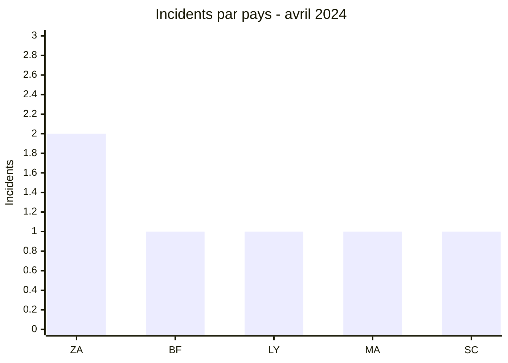
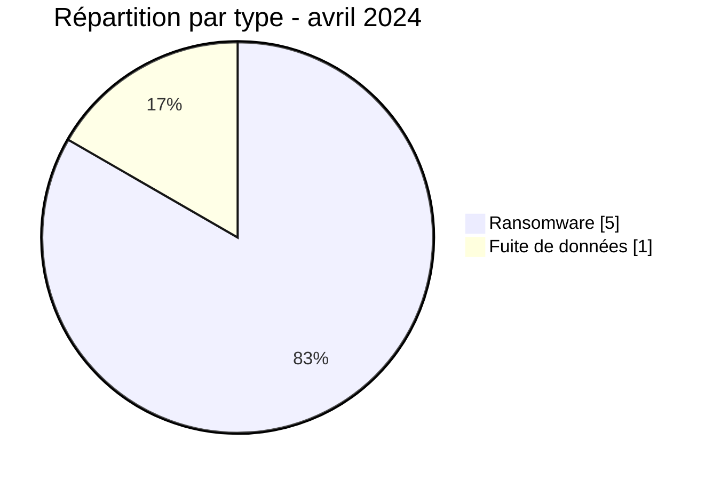

# Rapport CTI AFRINTEL - Avril 2024

👉🏾 [English version](./README.md)

## 1. Résumé exécutif

Avril 2024 compte **6 incidents** : **5 revendications ransomware** et **1 fuite de données**. L’Afrique du Sud représente deux publications ; quatre autres pays apparaissent une fois chacun. Le corpus traverse quatre régions, dont l’océan Indien avec la publication visant Remitano aux Seychelles.

SpaceBears est le seul acteur associé à deux organisations. Cette simultanéité ne suffit pas à conclure à une campagne coordonnée. La fuite visant l’ONEF au Burkina Faso est le seul incident du mois accompagné d’un échantillon de données dans le corpus.

Voir [victims_FR.md](./victims_FR.md).

## 2. Méthodologie

Le rapport couvre les publications classées en avril 2024. Les incidents sont dédupliqués par organisation et ventilés selon les quatre catégories AFRINTEL. Les constats techniques sont limités aux éléments visibles dans les sources ; les pratiques généralement attribuées aux groupes ne sont pas traitées comme des faits du mois.

Les statistiques dérivent de [victims_FR.md](./victims_FR.md), synchronisé avec [victims.md](./victims.md).

## 3. Vue globale

| Indicateur | Valeur |
|---|---:|
| Incidents / Pays | **6 / 5** |
| Ransomware | **5** |
| Fuites de données | **1** |
| Ventes d’accès / Défacement | **0 / 0** |

### Classement par pays

| Pays | Total | Ransomware | Fuite |
|---|---:|---:|---:|
| 🇿🇦 Afrique du Sud | 2 | 2 | 0 |
| 🇧🇫 Burkina Faso | 1 | 0 | 1 |
| 🇱🇾 Libye | 1 | 1 | 0 |
| 🇲🇦 Maroc | 1 | 1 | 0 |
| 🇸🇨 Seychelles | 1 | 1 | 0 |
| **Total** | **6** | **5** | **1** |

### Répartition régionale

| Région | Total | Ransomware | Fuite |
|---|---:|---:|---:|
| Afrique australe | 2 | 2 | 0 |
| Afrique du Nord | 2 | 2 | 0 |
| Afrique de l’Ouest | 1 | 0 | 1 |
| Océan Indien | 1 | 1 | 0 |
| **Total** | **6** | **5** | **1** |

### Répartition sectorielle normalisée

| Secteur | Incidents | Part |
|---|---:|---:|
| Finance / Banque | 1 | 16,7 % |
| Médias / Divertissement | 1 | 16,7 % |
| Gouvernement / Administration | 1 | 16,7 % |
| Industrie / Fabrication | 1 | 16,7 % |
| Technologies / Informatique | 1 | 16,7 % |
| Pétrole / Énergie | 1 | 16,7 % |
| **Total** | **6** | **100 %** |

### Acteurs les plus visibles

| Acteur | Incidents |
|---|---:|
| SpaceBears | 2 |
| Hunters, INC Ransom, Pedi, RansomHub | 1 chacun |

## 4. Analyse détaillée par type d’incident

### 4.1 Ransomware

Les publications concernent Remitano, Caxton and CTP, SM Emballage, Thinkadam et Mellitah Oil & Gas. Les secteurs financier et énergétique augmentent l’impact potentiel, mais aucune source publique du corpus ne confirme une interruption, un chiffrement ou une exfiltration.

### 4.2 Fuite de données

La publication ONEF présente un échantillon attribué à un organisme burkinabè chargé de l’emploi et de la formation. Les éléments disponibles rendent plausible l’existence d’une base liée au service, sans permettre de vérifier son exhaustivité ni la date de l’accès initial.

## 5. Impact sectoriel

La répartition sectorielle est parfaitement dispersée : un incident dans chacun des six secteurs. Cette absence de concentration réduit la valeur d’une conclusion sectorielle générale. En revanche, l’énergie, les services publics de l’emploi et la finance doivent être traités avec une priorité supérieure en raison de leurs fonctions.

## 6. Profil des acteurs et évaluation du risque

| Périmètre | Niveau | Justification |
|---|---|---|
| 🇿🇦 Afrique du Sud | 🔴 Élevé | Deux revendications dans les médias et la technologie |
| 🇱🇾 Libye | 🔴 Élevé | Publication visant une coentreprise pétrolière |
| 🇧🇫 Burkina Faso | 🟠 Moyen | Fuite avec échantillon visant un organisme public |
| 🇲🇦 Maroc / 🇸🇨 Seychelles | 🟡 Faible à moyen | Une revendication chacune |

## 7. Tendances et lacunes de renseignement

- **Observé - confiance élevée :** cinq incidents sur six relèvent du ransomware.
- **Observé - confiance élevée :** aucun secteur ne compte plus d’un incident.
- **Lacune :** aucun rapport DFIR public n’a été identifié dans les sources consultées pour les cas ransomware.
- **Lacune :** l’échantillon ONEF ne permet pas de valider le volume complet ou la chronologie d’acquisition.
- **Collecte attendue :** confirmations victimes, état des services et nouvelles publications d’échantillons.

## 8. Cartographie MITRE ATT&CK contextuelle

| Statut | Technique | Utilisation |
|---|---|---|
| Préventif | T1486 - Data Encrypted for Impact | Détection du chiffrement ; non confirmé dans les cinq revendications |
| Préventif | T1490 - Inhibit System Recovery | Contrôle des sauvegardes ; comportement non observé |
| Préventif | T1567 - Exfiltration Over Web Service | Surveillance des flux sortants ; canal ONEF inconnu |

## 9. Recommandations

- **Énergie :** segmenter les environnements industriels et administratifs, puis tester les procédures de continuité.
- **Secteur public :** revoir les exports de données et les accès à l’application ONEF.
- **Finance et technologie :** renforcer les accès privilégiés et la gestion des secrets.
- **Toutes les victimes publiées :** préserver les journaux et tester les restaurations.

## 10. Recommandations SOC et tactiques

| Qualification | Action |
|---|---|
| **Observé** | Surveiller les actifs explicitement cités ; aucune TTP d’intrusion n’est confirmée. |
| **Hypothèse** | Rechercher un usage anormal des accès distants et des comptes privilégiés autour des dates de publication. |
| **Préventif** | Détecter le chiffrement massif, l’inhibition des sauvegardes, les exports de bases et les transferts volumineux. |

## 11. Recommandations stratégiques

| Priorité | Qualification | Mesure |
|---:|---|---|
| 1 | **Observé** | Donner la priorité aux services énergétiques et publics cités. |
| 2 | **Hypothèse** | Vérifier un éventuel dénominateur commun entre les deux publications SpaceBears sans conclure à une campagne. |
| 3 | **Préventif** | Réduire la surface externe, déployer MFA résistante au phishing et isoler les sauvegardes. |

## 12. Conclusion

Avril est un mois de faible volume mais de forte diversité sectorielle. La répétition de SpaceBears et la présence d’organisations sensibles méritent un suivi, sans dépasser ce que les sources établissent. L’ONEF demeure le cas le plus exploitable pour la validation d’une exposition de données.

**AFRINTEL - TLP:CLEAR**

[Dépôt AFRINTEL](https://github.com/Hatchepsoute/AFRINTEL)
