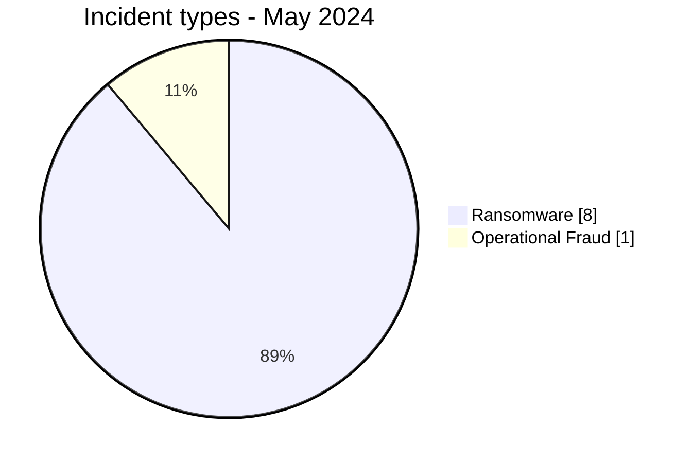

# AFRINTEL CTI Report - Cyber Threats in Africa - May 2024

👉🏾 [Version française](./README_FR.md)

## 1. Executive summary

In May 2024, AFRINTEL retains **9 canonical cyber incidents across 6 countries**. The month is led by **Ransomware (8, 88.9%)** followed by **Operational Fraud (1, 11.1%)**. Leading countries are **South Africa (3)**, **Egypt (2)**, **Nigeria (1)**. Leading sectors are **Finance / Banking (3)**, **Professional / Business Services (2)**, **Construction / Real Estate (1)**. Most frequent actor/group labels are `lockbit3` (4), `blacksuit` (1), `ransomhub` (1). `Unknown` means missing attribution, not an actor.

### 1.1 Month-over-month study

| Indicator | April 2024 | May 2024 | Change |
|---|---|---|---|
| Total | 9 | 9 | Stable |
| Ransomware | 5 | 8 | +3 (+60.0%) |
| Data Leak | 2 | 0 | -2 (-100.0%) |
| Access Sale | 0 | 0 | Stable |
| DDoS | 2 | 0 | -2 (-100.0%) |
| Defacement | 0 | 0 | Stable |
| Account Takeover | 0 | 0 | Stable |
| System Intrusion | 0 | 0 | Stable |
| Malware | 0 | 0 | Stable |
| Operational Fraud | 0 | 1 | +1 (new) |

### 1.2 Comparative analysis

Monthly volume **remains stable by 0 incident(s)**. Structural changes are: Ransomware 5->8 (+3), Data Leak 2->0 (-2), DDoS 2->0 (-2), Operational Fraud 0->1 (+1). This describes the documented corpus and does not necessarily equal the change in real compromises across the continent.

## 2. Methodology

- One canonical incident equals one event retained in the 2024 year.
- Historical discoveries/republications are preserved separately and do not inflate 2024 statistics.
- Incident date or best-supported window takes precedence; AFRINTEL discovery date remains separate.
- Nine AFRINTEL types are used; attempts are represented by status, never by an `Attempted Attack` type.
- Coordinated DDoS is counted by campaign.
- Type, status, confidence, impact, attribution, and source remain separate.

## 3. Incident-type distribution

| Type | Records | Share |
|---|---|---|
| Ransomware | 8 | 88.9% |
| Data Leak | 0 | 0.0% |
| Access Sale | 0 | 0.0% |
| DDoS | 0 | 0.0% |
| Defacement | 0 | 0.0% |
| Account Takeover | 0 | 0.0% |
| System Intrusion | 0 | 0.0% |
| Malware | 0 | 0.0% |
| Operational Fraud | 1 | 11.1% |

## 4. Country x type

| Country | Total | Ransomware | Data Leak | Access Sale | DDoS | Defacement | Account Takeover | System Intrusion | Malware | Operational Fraud |
|---|---|---|---|---|---|---|---|---|---|---|
| South Africa | 3 | 2 | 0 | 0 | 0 | 0 | 0 | 0 | 0 | 1 |
| Egypt | 2 | 2 | 0 | 0 | 0 | 0 | 0 | 0 | 0 | 0 |
| Nigeria | 1 | 1 | 0 | 0 | 0 | 0 | 0 | 0 | 0 | 0 |
| Namibia | 1 | 1 | 0 | 0 | 0 | 0 | 0 | 0 | 0 | 0 |
| Ivory Coast | 1 | 1 | 0 | 0 | 0 | 0 | 0 | 0 | 0 | 0 |
| Senegal | 1 | 1 | 0 | 0 | 0 | 0 | 0 | 0 | 0 | 0 |

## 5. Regional distribution

| Region | Records | Share |
|---|---|---|
| Southern Africa | 4 | 44.4% |
| West Africa | 3 | 33.3% |
| North Africa | 2 | 22.2% |

## 6. Sector distribution

| Sector | Records | Share |
|---|---|---|
| Finance / Banking | 3 | 33.3% |
| Professional / Business Services | 2 | 22.2% |
| Construction / Real Estate | 1 | 11.1% |
| Healthcare / Medical | 1 | 11.1% |
| Technology / IT | 1 | 11.1% |
| Government / Administration | 1 | 11.1% |

## 7. Actors / groups

| Actor / Group | Records | Share |
|---|---|---|
| lockbit3 | 4 | 44.4% |
| blacksuit | 1 | 11.1% |
| ransomhub | 1 | 11.1% |
| hunters | 1 | 11.1% |
| arcusmedia | 1 | 11.1% |
| Unknown | 1 | 11.1% |

## 8. Evidence maturity

| Evidence position | Records | Share |
|---|---|---|
| Claim - Unverified | 8 | 88.9% |
| Confirmed | 1 | 11.1% |

### Confidence

| Confidence | Records | Share |
|---|---|---|
| Low | 8 | 88.9% |
| Very High | 1 | 11.1% |

## 9. Timeline

```mermaid
timeline
    title AFRINTEL - May 2024
    6 Mai 2024 : Nestoil
- **Acteur / Groupe -** blacksuit
- **Secteur -** Construction / Real Estate
- **Site web -** [nestoilgroup.com](https -//www.nestoilgroup.com)
- **Statut -** Claim - Unverified
- **Type d'incident -** Ransomware
- **Niveau de confiance -** Low
- **Niveau d'impact -** Level 2
- **Description victime -** Nestoil est une entreprise commerciale majeure opérant dans le secteur des construction, contribuant de manière significative au tissu économique régional en Nigeria.

----------------------------
    6 Mai 2024 : Elarabygroup
- **Acteur / Groupe -** lockbit3
- **Secteur -** Professional / Business Services
- **Site web -** [elarabygroup.com](https -//www.elarabygroup.com)
- **Statut -** Claim - Unverified
- **Type d'incident -** Ransomware
- **Niveau de confiance -** Low
- **Niveau d'impact -** Level 2
- **Description victime -** Elarabygroup est une entreprise commerciale majeure opérant dans le secteur des business services, contribuant de manière significative au tissu économique régional en Egypt.

----------------------------
    7 Mai 2024 : Lenmed
- **Acteur / Groupe -** lockbit3
- **Secteur -** Healthcare / Medical
- **Site web -** [lenmed.co.za](https -//www.lenmed.co.za)
- **Statut -** Claim - Unverified
- **Type d'incident -** Ransomware
- **Niveau de confiance -** Low
- **Niveau d'impact -** Level 3
- **Description victime -** Lenmed est une entreprise commerciale majeure opérant dans le secteur des healthcare services, contribuant de manière significative au tissu économique régional en South Africa.

----------------------------
    7 Mai 2024 : Kamo jou trading
- **Acteur / Groupe -** ransomhub
- **Secteur -** Finance / Banking
- **Site web -** [kamojou.co.za](https -//www.kamojou.co.za)
- **Statut -** Claim - Unverified
- **Type d'incident -** Ransomware
- **Niveau de confiance -** Low
- **Niveau d'impact -** Level 3
- **Description victime -** Kamo jou trading est une entreprise commerciale majeure opérant dans le secteur des finance, contribuant de manière significative au tissu économique régional en South Africa.

----------------------------
    9 Mai 2024 : Eif.na
- **Acteur / Groupe -** lockbit3
- **Secteur -** Finance / Banking
- **Site web -** [eif.org.na](https -//www.eif.org.na)
- **Statut -** Claim - Unverified
- **Type d'incident -** Ransomware
- **Niveau de confiance -** Low
- **Niveau d'impact -** Level 3
- **Description victime -** Eif.na est une entreprise commerciale majeure opérant dans le secteur des financial organizations, contribuant de manière significative au tissu économique régional en Namibia.

----------------------------
    13 Mai 2024 : Treasury of cote d'ivoire
- **Acteur / Groupe -** hunters
- **Secteur -** Finance / Banking
- **Site web -** [tresor.gouv.ci](https -//www.tresor.gouv.ci)
- **Statut -** Claim - Unverified
- **Type d'incident -** Ransomware
- **Niveau de confiance -** Low
- **Niveau d'impact -** Level 3
- **Description victime -** Treasury of cote d'ivoire est une entreprise commerciale majeure opérant dans le secteur des finance, contribuant de manière significative au tissu économique régional en Côte d'Ivoire.

----------------------------
    16 Mai 2024 : Egyptian sudanese
- **Acteur / Groupe -** arcusmedia
- **Secteur -** Professional / Business Services
- **Site web -** Not validated from the provided source
- **Statut -** Claim - Unverified
- **Type d'incident -** Ransomware
- **Niveau de confiance -** Low
- **Niveau d'impact -** Level 2
- **Description victime -** Egyptian sudanese est une entreprise commerciale majeure opérant dans le secteur des services, contribuant de manière significative au tissu économique régional en Egypt.

----------------------------
    25 Mai 2024 : Sysroad
- **Acteur / Groupe -** lockbit3
- **Secteur -** Technology / IT
- **Site web -** [sysroad.com](https -//www.sysroad.com)
- **Statut -** Claim - Unverified
- **Type d'incident -** Ransomware
- **Niveau de confiance -** Low
- **Niveau d'impact -** Level 2
- **Description victime -** Sysroad est une entreprise commerciale majeure opérant dans le secteur des information technologies consulting, contribuant de manière significative au tissu économique régional en Senegal.

----------------------------
    Mai 2024 - date exacte de l'incident non divulguée publiquement : Department of Public Works and Infrastructure (DPWI)
- **Date de l'incident -** Mai 2024 - date exacte non divulguée publiquement
- **Date de publication initiale -** 10 juillet 2024
- **Date de correction AFRINTEL -** 23 août 2026
- **Acteur / Groupe -** Unknown
- **Secteur -** Government / Administration
- **Site web -** [publicworks.gov.za](https -//www.publicworks.gov.za/)
- **Statut -** Government Confirmed - Forensic Investigation
- **Type d'incident -** Operational Fraud
- **Niveau de confiance -** Very High
- **Niveau d'impact -** Level 4
- **Note de taxonomie -** `Operational Fraud` est retenu car l'événement confirmé correspond à un vol financier cyberactivé associé à une compromission de système. Les sources publiques n'établissent ni le déploiement d'un ransomware, ni une fuite de données autonome, ni le chemin technique exact de l'intrusion.
- **Description victime -** Le Department of Public Works and Infrastructure d'Afrique du Sud gère les bâtiments publics, les infrastructures et les fonctions gouvernementales liées au patrimoine immobilier.
- **Analyse -** Le gouvernement sud-africain a indiqué qu'une activité cybercriminelle avait permis de détourner des fonds importants du DPWI sur une longue période et que le dernier incident, en mai 2024, avait entraîné le vol supplémentaire de **24 millions de rands**. Cette perte a déclenché une enquête forensique complète impliquant les Hawks, le SAPS, la State Security Agency et des spécialistes en cybersécurité. Des responsables gouvernementaux ont également évoqué une possible collusion entre des personnes internes et des criminels. La source publique ne permet pas d'établir le chemin d'intrusion exact, la faiblesse précise des contrôles de paiement ni l'identité des attaquants. AFRINTEL enregistre donc l'événement de mai comme un incident Operational Fraud confirmé par le gouvernement, impliquant un vol financier cyberactivé et une compromission de système, sans attribuer une famille de malware ou une technique d'accès non étayée.
- **Source publique -** [SAnews - enquête DPWI](https -//www.sanews.gov.za/south-africa/dpwi-investigates-theft-r300-million)

----------------------------
```

## 10. CTI analysis by type

### Ransomware - 8

**8 record(s) (88.9%).** Leading countries: Egypt (2), South Africa (2), Nigeria (1). Conclusions remain limited to documented evidence; the incident type does not justify inferring an unobserved vector or impact.

### Operational Fraud - 1

**1 record(s) (11.1%).** Leading countries: South Africa (1). Conclusions remain limited to documented evidence; the incident type does not justify inferring an unobserved vector or impact.

## 11. Priority incidents for review

| Country | Organization | Type | Status | Impact | Confidence |
|---|---|---|---|---|---|
| South Africa | Department of Public Works and Infrastructure (DPWI)
- **Date de l'incident:** Mai 2024 - date exacte non divulguée publiquement
- **Date de publication initiale:** 10 juillet 2024
- **Date de correction AFRINTEL:** 23 août 2026
- **Acteur / Groupe:** Unknown
- **Secteur:** Government / Administration
- **Site web:** [publicworks.gov.za](https://www.publicworks.gov.za/)
- **Statut:** Government Confirmed - Forensic Investigation
- **Type d'incident:** Operational Fraud
- **Niveau de confiance:** Very High
- **Niveau d'impact:** Level 4
- **Note de taxonomie:** `Operational Fraud` est retenu car l'événement confirmé correspond à un vol financier cyberactivé associé à une compromission de système. Les sources publiques n'établissent ni le déploiement d'un ransomware, ni une fuite de données autonome, ni le chemin technique exact de l'intrusion.
- **Description victime:** Le Department of Public Works and Infrastructure d'Afrique du Sud gère les bâtiments publics, les infrastructures et les fonctions gouvernementales liées au patrimoine immobilier.
- **Analyse:** Le gouvernement sud-africain a indiqué qu'une activité cybercriminelle avait permis de détourner des fonds importants du DPWI sur une longue période et que le dernier incident, en mai 2024, avait entraîné le vol supplémentaire de **24 millions de rands**. Cette perte a déclenché une enquête forensique complète impliquant les Hawks, le SAPS, la State Security Agency et des spécialistes en cybersécurité. Des responsables gouvernementaux ont également évoqué une possible collusion entre des personnes internes et des criminels. La source publique ne permet pas d'établir le chemin d'intrusion exact, la faiblesse précise des contrôles de paiement ni l'identité des attaquants. AFRINTEL enregistre donc l'événement de mai comme un incident Operational Fraud confirmé par le gouvernement, impliquant un vol financier cyberactivé et une compromission de système, sans attribuer une famille de malware ou une technique d'accès non étayée.
- **Source publique:** [SAnews - enquête DPWI](https://www.sanews.gov.za/south-africa/dpwi-investigates-theft-r300-million)

---------------------------- | Operational Fraud | Government Confirmed - Forensic Investigation | Level 4 | Very High |
| South Africa | Lenmed
- **Acteur / Groupe:** lockbit3
- **Secteur:** Healthcare / Medical
- **Site web:** [lenmed.co.za](https://www.lenmed.co.za)
- **Statut:** Claim - Unverified
- **Type d'incident:** Ransomware
- **Niveau de confiance:** Low
- **Niveau d'impact:** Level 3
- **Description victime:** Lenmed est une entreprise commerciale majeure opérant dans le secteur des healthcare services, contribuant de manière significative au tissu économique régional en South Africa.

---------------------------- | Ransomware | Claim - Unverified | Level 3 | Low |
| South Africa | Kamo jou trading
- **Acteur / Groupe:** ransomhub
- **Secteur:** Finance / Banking
- **Site web:** [kamojou.co.za](https://www.kamojou.co.za)
- **Statut:** Claim - Unverified
- **Type d'incident:** Ransomware
- **Niveau de confiance:** Low
- **Niveau d'impact:** Level 3
- **Description victime:** Kamo jou trading est une entreprise commerciale majeure opérant dans le secteur des finance, contribuant de manière significative au tissu économique régional en South Africa.

---------------------------- | Ransomware | Claim - Unverified | Level 3 | Low |
| Namibia | Eif.na
- **Acteur / Groupe:** lockbit3
- **Secteur:** Finance / Banking
- **Site web:** [eif.org.na](https://www.eif.org.na)
- **Statut:** Claim - Unverified
- **Type d'incident:** Ransomware
- **Niveau de confiance:** Low
- **Niveau d'impact:** Level 3
- **Description victime:** Eif.na est une entreprise commerciale majeure opérant dans le secteur des financial organizations, contribuant de manière significative au tissu économique régional en Namibia.

---------------------------- | Ransomware | Claim - Unverified | Level 3 | Low |
| Ivory Coast | Treasury of cote d'ivoire
- **Acteur / Groupe:** hunters
- **Secteur:** Finance / Banking
- **Site web:** [tresor.gouv.ci](https://www.tresor.gouv.ci)
- **Statut:** Claim - Unverified
- **Type d'incident:** Ransomware
- **Niveau de confiance:** Low
- **Niveau d'impact:** Level 3
- **Description victime:** Treasury of cote d'ivoire est une entreprise commerciale majeure opérant dans le secteur des finance, contribuant de manière significative au tissu économique régional en Côte d'Ivoire.

---------------------------- | Ransomware | Claim - Unverified | Level 3 | Low |

> Structured selection based on impact, status, and confidence; not an absolute severity ranking.

## 12. Intelligence gaps and corrections

- initial-access vector often unknown;
- technical compromise date may differ from publication date;
- claimed volumes are rarely fully verifiable;
- technical attribution is often limited to the publication account;
- historical republications are tracked separately.

## 13. Recommendations

- phishing-resistant MFA, PAM, and least privilege;
- segmentation, immutable backups, and restoration testing;
- centralized EDR/IAM/VPN/WAF/DNS/cloud/application logging;
- detection of mass exports, unusual archives, and outbound transfers;
- separate preservation of incident, initial-publication, repost, and AFRINTEL discovery dates.

## 14. Conclusion

May 2024 contains **9 canonical incidents**. Month-over-month comparison uses the same taxonomy and chronology rules, except January where December 2023 remains `N/A` because no equivalent re-audit has been completed.

👉🏾 [Canonical victims](./victims.md)

**AFRINTEL** - TLP:CLEAR
