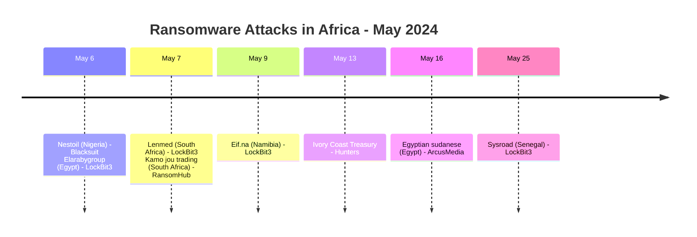
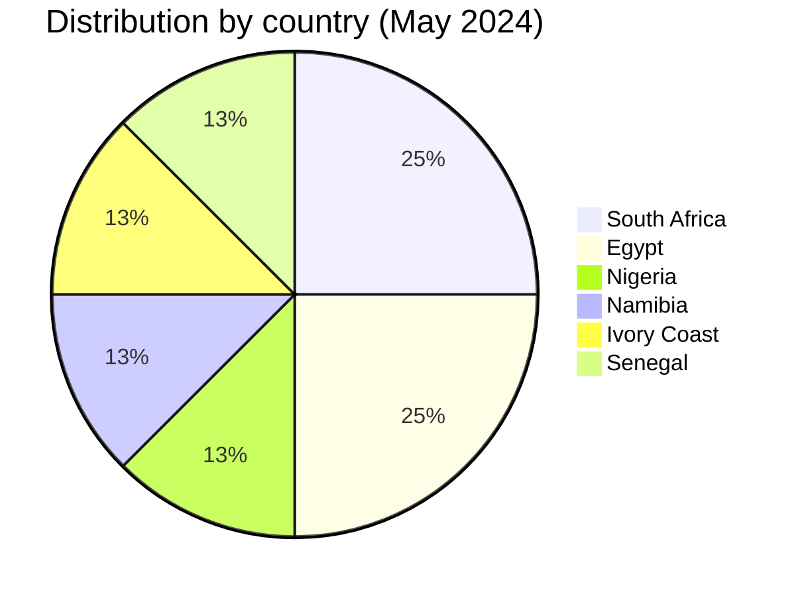
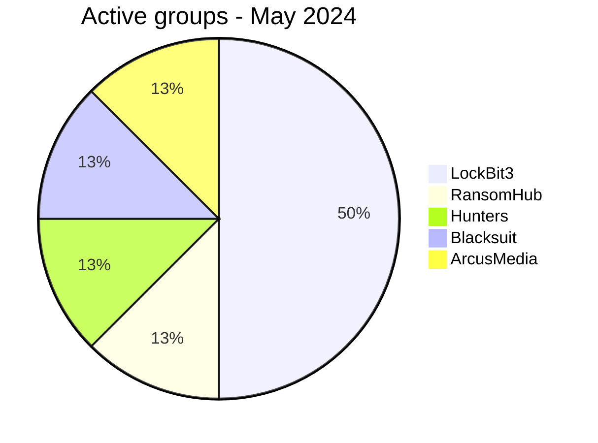

# CTI Report - May 2024: Ransomware Wave in Africa
👉🏾 [French version available here](./README_FR.md)

### 1. Executive summary

In May 2024, Africa recorded **8 documented ransomware victims**. The month was marked by diverse threat actors and an unprecedented target: the **Ivory Coast Public Treasury**.

👉🏾 [Victims list](./victims.md)

**Key figures:**
- 🔹 **8 victims** identified
- 🔹 **5 different groups**: LockBit3 (4 attacks), RansomHub (1), Hunters (1), Blacksuit (1), ArcusMedia (1)
- 🔹 **Countries affected**: South Africa (2), Egypt (2), Nigeria (1), Namibia (1), Ivory Coast (1), Senegal (1)
- 🔹 **Sectors**: Finance / Treasury (3), Healthcare (1), Construction (1), Business Services (1), IT Consulting (1), Generic Services (1)

### Monthly aggregate exposure view

The monthly CTI view combines data leaks and access sales as **data exposure**: **0 records** (0.0% of the monthly corpus). Source cards remain authoritative; an access sale does not by itself prove data exfiltration.

---

### 2. Attack timeline

| Date       | Victim                          | Country          | Ransomware group |
|------------|----------------------------------|------------------|------------------|
| May 6      | Nestoil                          | Nigeria          | Blacksuit        |
| May 6      | Elarabygroup                     | Egypt            | LockBit3         |
| May 7      | Lenmed                           | South Africa     | LockBit3         |
| May 7      | Kamo jou trading                 | South Africa     | RansomHub        |
| May 9      | Eif.na                           | Namibia          | LockBit3         |
| May 13     | Ivory Coast Treasury             | Ivory Coast      | Hunters          |
| May 16     | Egyptian sudanese                | Egypt            | ArcusMedia       |
| May 25     | Sysroad                          | Senegal          | LockBit3         |

---

### 3. Victim analysis

#### 3.1 By country

| Country          | Number of attacks |
|------------------|------------------|
| South Africa     | 2                |
| Egypt            | 2                |
| Nigeria          | 1                |
| Namibia          | 1                |
| Ivory Coast      | 1                |
| Senegal          | 1                |

#### 3.2 By sector

| Sector                        | Count |
|-------------------------------|-------|
| Finance / Public Treasury     | 3     |
| Healthcare                    | 1     |
| Construction                  | 1     |
| Business Services             | 1     |
| IT Consulting                 | 1     |
| Generic Services              | 1     |

#### 3.3 Ransomware groups

| Ransomware group | Number of attacks |
|------------------|------------------|
| LockBit3         | 4                |
| RansomHub        | 1                |
| Hunters          | 1                |
| Blacksuit        | 1                |
| ArcusMedia       | 1                |

---

### 4. Key observations

- **LockBit3** remains dominant (50% of attacks).
- **Government target**: The Ivory Coast Treasury (Hunters) shows cybercriminals' interest in state financial institutions.
- **Healthcare sector**: Lenmed (South Africa) is the only healthcare victim this month, but recurring (also hit in August 2024).
- **Geography**: 6 distinct countries, no over-concentration.

---

### 5. Recommendations for May 2024

| Domain                        | Recommended action |
|-------------------------------|--------------------|
| Financial institutions        | Enhance privileged access monitoring and network segmentation. |
| Healthcare providers          | Implement daily offline backups. |
| IT consulting firms           | Audit RDP/VPN access, enforce MFA. |

---

*Report from AFRINTEL OSINT data - Free distribution (TLP:CLEAR)*
