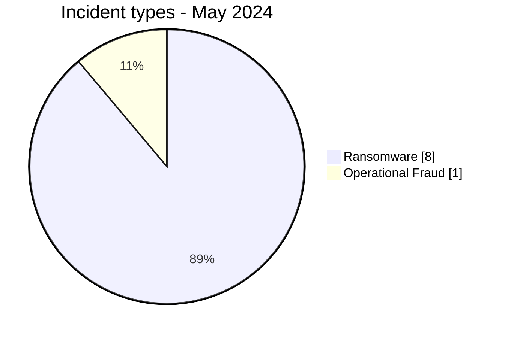
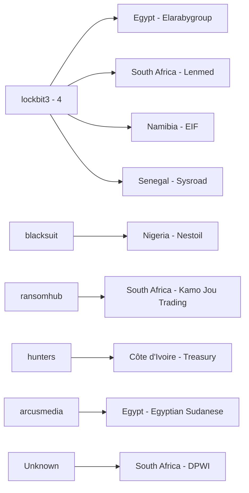
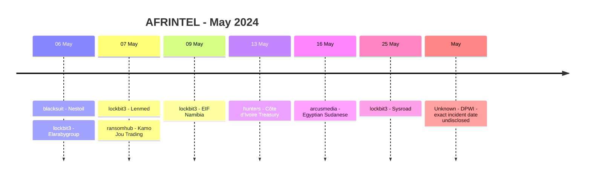

# AFRINTEL CTI Report - May 2024

👉🏾 [Version française](./README_FR.md)

## 1. Executive summary

AFRINTEL now documents **9 incident records** in May 2024: **8 Ransomware** and **1 Operational Fraud**, across **6 African countries**. No Data Leak, Access Sale, DDoS or Defacement record is present in the corrected May corpus.

The retrospective correction adds the **Department of Public Works and Infrastructure (DPWI)** in South Africa. The government-confirmed May event involved cyber-enabled financial theft resulting in a further **R24 million** being stolen and triggered a multi-agency forensic investigation. The exact technical intrusion path and attacker identity remain unresolved, so the event is classified as `Operational Fraud` rather than forced into Ransomware or Data Leak.

Among the eight Ransomware records, `lockbit3` accounts for four publications. Finance / Banking is the most represented sector with three records. The source corpus does not provide usable technical samples for those eight Ransomware claims, so publication activity must remain separate from independently confirmed compromise.

👉🏾 [View the full victim list](./victims.md)

### 1.1 Month-over-month comparison

| Indicator | April 2024 | May 2024 | Change |
|---|---:|---:|---:|
| Total incidents | 7 | **9** | **+2 (+28.6%)** |
| Ransomware | 5 | **8** | **+3 (+60.0%)** |
| Data Leak | 2 | **0** | **-2 (-100.0%)** |
| Access Sale | 0 | **0** | Stable |
| DDoS | 0 | **0** | Stable |
| Defacement | 0 | **0** | Stable |
| Operational Fraud | 0 | **1** | **New category observed** |

May reverses the decline observed in April. Total volume increases by **28.6%**, driven by three additional Ransomware records compared with April and the addition of one confirmed Operational Fraud case. Data Leak falls from two records to zero.

## 2. Methodology

- **Period:** 1-31 May 2024.
- **Source of truth:** harmonized `victims_FR.md` / `victims.md`.
- **Counting:** one harmonized card equals one documented incident record.
- **Taxonomy:** Ransomware, Data Leak, Access Sale, DDoS, Defacement, Operational Fraud.
- **Retrospective correction:** DPWI is one of the 10 missing 2024 incidents identified during the 23 August 2026 historical audit and is assigned to May according to the government's incident chronology.
- **DPWI classification:** Operational Fraud is used because cyber-enabled financial theft and system compromise are confirmed, while ransomware, standalone data leakage and the technical intrusion path are not established.
- Ransomware claims remain claims unless victim confirmation or technical evidence supports a higher evidence status.

## 3. Global overview

### 3.1 Incident-type distribution

| Incident type | Records | Share |
|---|---:|---:|
| Ransomware | **8** | **88.9%** |
| Operational Fraud | **1** | **11.1%** |
| Data Leak | 0 | 0.0% |
| Access Sale | 0 | 0.0% |
| DDoS | 0 | 0.0% |
| Defacement | 0 | 0.0% |
| **Total** | **9** | **100%** |

### 3.2 Country distribution

| Country | Ransomware | Operational Fraud | Total |
|---|---:|---:|---:|
| 🇿🇦 South Africa | 2 | 1 | **3** |
| 🇪🇬 Egypt | 2 | 0 | **2** |
| 🇨🇮 Côte d'Ivoire | 1 | 0 | 1 |
| 🇳🇦 Namibia | 1 | 0 | 1 |
| 🇳🇬 Nigeria | 1 | 0 | 1 |
| 🇸🇳 Senegal | 1 | 0 | 1 |
| **Total** | **8** | **1** | **9** |

### 3.3 Regional distribution

| Region | Ransomware | Operational Fraud | Total |
|---|---:|---:|---:|
| Southern Africa | 3 | 1 | **4** |
| West Africa | 3 | 0 | **3** |
| North Africa | 2 | 0 | **2** |
| **Total** | **8** | **1** | **9** |

### 3.4 Harmonized sector distribution

| Sector | Records | Share |
|---|---:|---:|
| Finance / Banking | 3 | 33.3% |
| Professional / Business Services | 2 | 22.2% |
| Construction / Real Estate | 1 | 11.1% |
| Healthcare / Medical | 1 | 11.1% |
| Technology / IT | 1 | 11.1% |
| Government / Administration | 1 | 11.1% |
| **Total** | **9** | **100%** |

### 3.5 Actors / groups

| Actor / Group | Records |
|---|---:|
| lockbit3 | **4** |
| blacksuit | 1 |
| ransomhub | 1 |
| hunters | 1 |
| arcusmedia | 1 |
| Unknown | 1 |
| **Total** | **9** |

## 4. Detailed analysis

### 4.1 Ransomware - 8 records

The eight Ransomware records concern **Nestoil**, **Elarabygroup**, **Lenmed**, **Kamo Jou Trading**, **EIF Namibia**, the **Côte d'Ivoire Treasury**, **Egyptian Sudanese** and **Sysroad**.

All eight retain `Claim - Unverified`. The source cards do not provide a usable data sample, DFIR report or victim confirmation establishing encryption, operational disruption or exfiltration. `lockbit3` represents four of the eight publications, but this concentration alone does not establish shared tradecraft, a common initial-access vector or a coordinated campaign.

### 4.2 Operational Fraud - DPWI

DPWI is the only `Operational Fraud` record in May. Unlike the eight Ransomware entries, the existence and financial impact of this event are government-confirmed.

The South African government reported that cybercriminal activity had siphoned substantial funds over a prolonged period and that the latest May incident caused a further **R24 million** loss. The incident triggered a forensic investigation involving the Hawks, SAPS, State Security Agency and cybersecurity specialists. Possible insider collusion was raised as an investigative hypothesis.

The public record does not establish the exact system entry point, payment-control weakness or attacker identity. These unknowns are preserved rather than replaced with an assumed malware family or ATT&CK technique.

## 5. Key findings and intelligence gaps

- The corrected May corpus rises from **8 to 9 records** after adding DPWI.
- Ransomware dominates numerically with **8 of 9 records (88.9%)**, but those eight are unverified publications rather than eight confirmed compromises.
- DPWI is the strongest evidence-backed event of the month because both the cyber-enabled financial theft and financial loss are confirmed by government reporting.
- South Africa becomes the most represented country with **3 records**.
- Finance / Banking remains the largest sector with **3 records**, while DPWI adds Government / Administration to the sector distribution.
- No usable public sample or DFIR evidence is available in the source corpus for the eight Ransomware records.
- DPWI's initial access, attacker identity and exact control failure remain open intelligence requirements.

## 6. Contextual MITRE ATT&CK mapping

| Status | Technique | Application |
|---|---|---|
| Preventive | T1486 - Data Encrypted for Impact | Defensive monitoring for Ransomware claims; encryption is not publicly confirmed in the eight cases. |
| Preventive | T1490 - Inhibit System Recovery | Relevant resilience control; behavior is not observed in the source corpus. |
| Assumption | T1078 - Valid Accounts | Possible access scenario to investigate internally, not an observed May fact. |
| Not mapped | DPWI technical intrusion path | No ATT&CK technique is asserted because the public evidence does not establish the mechanism used to enable the theft. |

## 7. Recommendations

- Separate leak-site publication activity from confirmed operational incidents in executive reporting.
- For finance and government environments, reinforce payment authorization, segregation of duties, privileged-access review and fraud-monitoring controls.
- For DPWI-like cases, correlate payment events with IAM, endpoint, email, ERP and administrative logs before attributing a technical access path.
- For the eight Ransomware claims, preserve logs and monitor for later victim statements, samples or leak-site updates before raising confidence.
- Maintain immutable backups and tested restoration procedures without assuming that every ransomware listing proves encryption.

## 8. Timeline

## 9. Conclusion

May 2024 closes with **9 documented incident records across 6 African countries**, comprising **8 Ransomware claims and 1 government-confirmed Operational Fraud incident**. Compared with April, the monthly corpus increases from 7 to 9 records, a rise of **28.6%**. Ransomware rises from 5 to 8, while the two Data Leak records observed in April disappear from the May corpus.

The numerical dominance of Ransomware must not be confused with evidence strength. All eight Ransomware records remain unverified actor publications in the available dataset: no usable public sample, victim confirmation or DFIR material establishes encryption, disruption or exfiltration for those cases. `lockbit3` accounts for half of these Ransomware publications, but that visibility does not by itself demonstrate common tradecraft or a coordinated campaign.

DPWI changes the analytical character of the month because it is not merely a criminal claim. Government reporting confirms a cyber-enabled financial theft associated with system compromise and a further loss of **R24 million** in May. The response escalated to a multi-agency forensic investigation, while possible insider collusion was raised as an investigative hypothesis. At the same time, the public record leaves the technical intrusion path, payment-control weakness and attacker identity unresolved. AFRINTEL therefore records what is confirmed without converting those unknowns into unsupported technical conclusions.

From a CTI perspective, May demonstrates why **incident volume and evidence maturity must be read together**. A month can be overwhelmingly composed of Ransomware publications while its strongest confirmed cyber impact comes from a different category. The priority for follow-up is therefore twofold: continue monitoring the eight ransomware claims for later evidence, and track the DPWI investigation for verified findings on access, internal control failures, insider involvement and attribution. This evidence-led approach preserves the historical value of AFRINTEL while preventing claims, hypotheses and confirmed events from being treated as equivalent.

**AFRINTEL** - TLP:CLEAR
