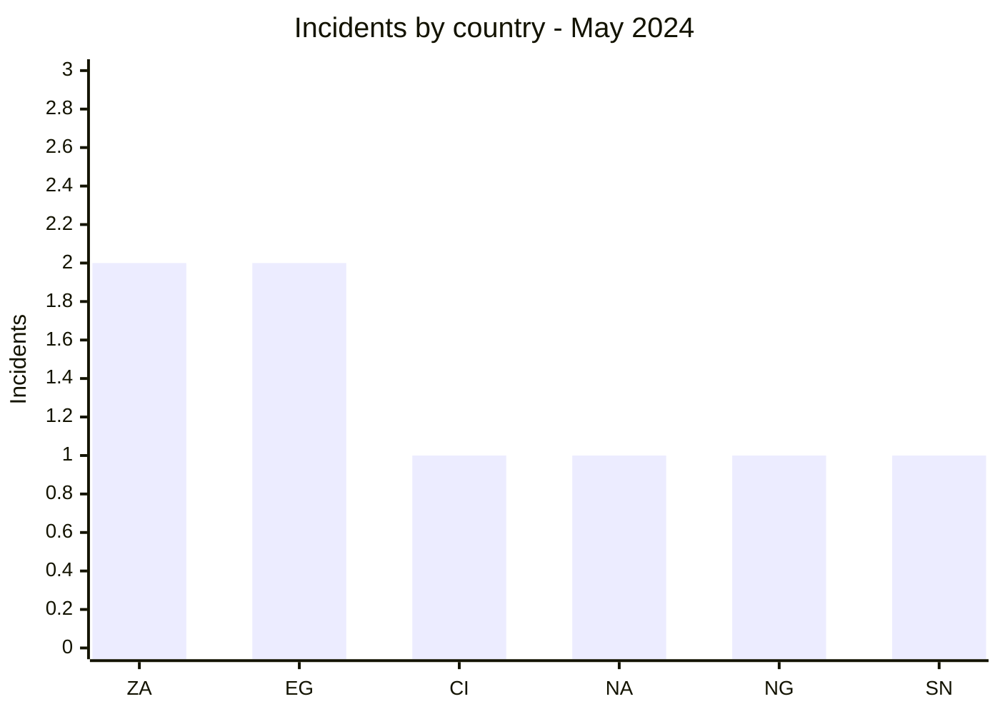
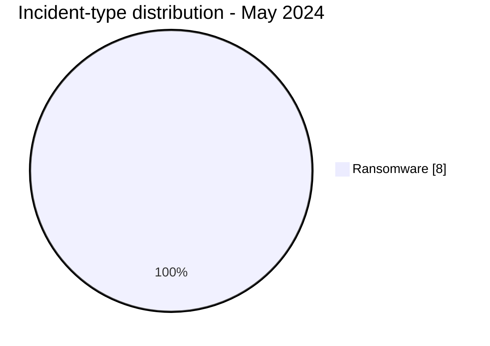

# AFRINTEL CTI Report - May 2024

👉🏾 [Version française](./README_FR.md)

## 1. Executive summary

All **8 incidents** recorded in May 2024 are **ransomware claims**. South Africa and Egypt each account for two publications; four other countries appear once. West Africa, Southern Africa, and North Africa record three, three, and two incidents respectively.

LockBit3 represents half of the corpus. Finance and professional services are the most visible sectors, but no usable sample is documented in the month's sources. The report therefore measures publication activity, not eight independently confirmed compromises.

See [victims.md](./victims.md).

## 2. Methodology

The corpus covers publications assigned to May 2024. One organization equals one incident, even if several sources mention it. All eight cases retain the public status supported by available evidence; no access or impact technique is inferred from a group name alone.

Statistics derive from [victims.md](./victims.md), synchronized with [victims_FR.md](./victims_FR.md).

## 3. Global overview

| Indicator | Value |
|---|---:|
| Incidents / Countries | **8 / 6** |
| Ransomware | **8** |
| Data leak / Access sale / Defacement | **0 / 0 / 0** |

### Country ranking

| Country | Incidents |
|---|---:|
| 🇿🇦 South Africa | 2 |
| 🇪🇬 Egypt | 2 |
| 🇨🇮 Côte d’Ivoire | 1 |
| 🇳🇦 Namibia | 1 |
| 🇳🇬 Nigeria | 1 |
| 🇸🇳 Senegal | 1 |
| **Total** | **8** |

### Regional distribution

| Region | Incidents |
|---|---:|
| West Africa | 3 |
| Southern Africa | 3 |
| North Africa | 2 |
| **Total** | **8** |

### Normalized sector distribution

| Sector | Incidents | Share |
|---|---:|---:|
| Finance / Banking | 3 | 37.5% |
| Professional / Business Services | 2 | 25.0% |
| Construction / Real Estate | 1 | 12.5% |
| Healthcare / Medical | 1 | 12.5% |
| Technology / IT | 1 | 12.5% |
| **Total** | **8** | **100%** |

### Most visible actors

| Actor | Incidents |
|---|---:|
| LockBit3 | 4 |
| Arcus Media, BlackSuit, Hunters, RansomHub | 1 each |

## 4. Detailed analysis by incident type

### 4.1 Ransomware

The publications concern Nestoil, Elaraby Group, Lenmed, Kamo Jou Trading, EIF Namibia, the Côte d’Ivoire Treasury, Egyptian Sudanese, and Sysroad. Financial services account for three cases, including a public financial administration. No public corpus evidence establishes encryption, disruption, or confirmed exfiltration.

### 4.2 Leaks, access sales, and defacement

No incident in these three categories is recorded in May. This absence only describes AFRINTEL's monitored sources during the period.

## 5. Sectoral impact

Finance ranks first with three incidents, followed by professional services. The Côte d’Ivoire Treasury and Lenmed carry the most sensitive implications because of their functions. The absence of samples prevents assessment of the data potentially involved or the true scale of events.

## 6. Threat actor profile and risk assessment

| Scope | Level | Rationale |
|---|---|---|
| 🇿🇦 South Africa | 🔴 High | Two publications, including a healthcare network |
| 🇨🇮 Côte d’Ivoire | 🔴 High | Publication involving the Treasury |
| 🇪🇬 Egypt | 🟠 Medium | Two claims without public technical evidence |
| 🇳🇦 Namibia / 🇳🇬 Nigeria / 🇸🇳 Senegal | 🟡 Low to medium | One claim each |

## 7. Key trends and intelligence gaps

- **Observed - high confidence:** the corpus consists entirely of ransomware claims.
- **Observed - high confidence:** LockBit3 is associated with four of eight incidents.
- **Gap:** no public DFIR report or usable sample was identified in the sources reviewed.
- **Gap:** victim operational status and the existence of exfiltration remain unknown.
- **Collection need:** victim communications, regulatory notices, and leak-site updates.

## 8. Contextual MITRE ATT&CK mapping

| Status | Technique | Use |
|---|---|---|
| Preventive | T1486 - Data Encrypted for Impact | Encryption monitoring; no public technical confirmation |
| Preventive | T1490 - Inhibit System Recovery | Backup and recovery-copy monitoring |
| Assumption | T1078 - Valid Accounts | Access scenario to test; no compromised account observed |

## 9. Recommendations

- **Finance:** require phishing-resistant MFA, review remote access, and control exports.
- **Healthcare:** isolate clinical applications and test continuity procedures.
- **IT providers:** separate customer access and rotate privileged secrets.
- **All organizations:** maintain immutable backups verified through restoration.

## 10. SOC and tactical recommendations

| Qualification | Action |
|---|---|
| **Observed** | Track the eight published organizations; no technical TTP is confirmed. |
| **Assumption** | Hunt for unusual remote access and archive staging before publication dates. |
| **Preventive** | Alert on mass encryption, backup deletion, and abnormal administration tooling. |

## 11. Strategic recommendations

| Priority | Qualification | Measure |
|---:|---|---|
| 1 | **Observed** | Prioritize finance, healthcare, and technology providers represented in the corpus. |
| 2 | **Assumption** | Assess identity and edge-device exposure without presenting these vectors as observed. |
| 3 | **Preventive** | Implement ASM, phishing-resistant MFA, and isolated backups. |

## 12. Conclusion

May is homogeneous by incident type but offers limited public technical depth. LockBit3's concentration and the presence of financial organizations justify increased attention without establishing a shared tradecraft. Internal validation and resilience remain the priorities.

**AFRINTEL - TLP:CLEAR**

[AFRINTEL repository](https://github.com/Hatchepsoute/AFRINTEL)
