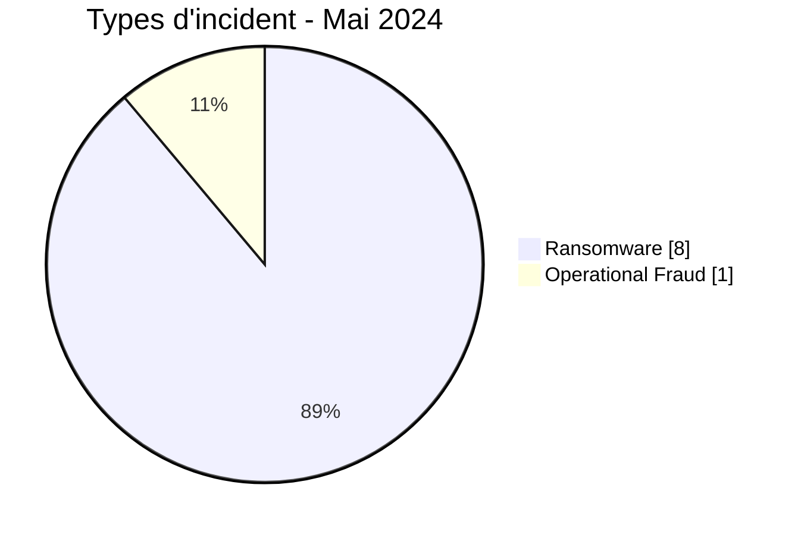
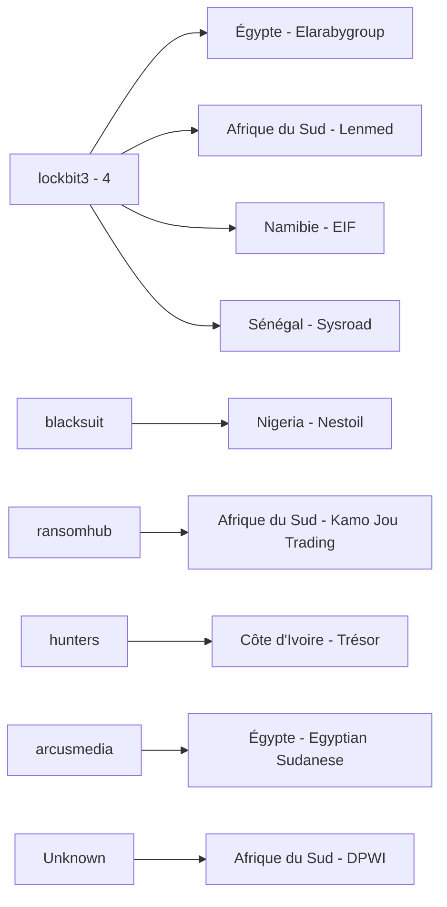
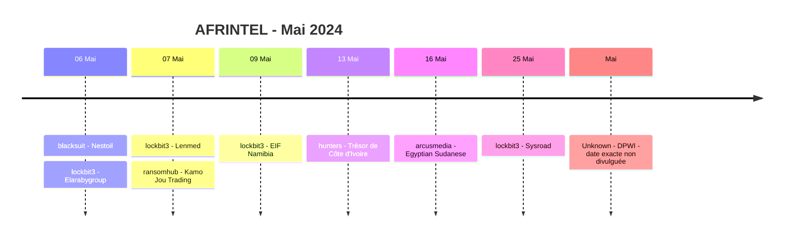

# Rapport CTI AFRINTEL - Mai 2024

👉🏾 [English version](./README.md)

## 1. Résumé exécutif

AFRINTEL documente désormais **9 fiches incident** en mai 2024 : **8 Ransomware** et **1 Operational Fraud**, dans **6 pays africains**. Aucun Data Leak, Access Sale, DDoS ou Defacement n'est présent dans le corpus corrigé de mai.

La correction rétrospective ajoute le **Department of Public Works and Infrastructure (DPWI)** en Afrique du Sud. L'événement de mai, confirmé par le gouvernement, correspond à un vol financier cyberactivé ayant entraîné le détournement supplémentaire de **24 millions de rands** et le lancement d'une enquête forensique impliquant plusieurs services. Le chemin d'intrusion technique exact et l'identité des attaquants restent non résolus ; le dossier est donc classé `Operational Fraud` plutôt que forcé dans Ransomware ou Data Leak.

Parmi les huit fiches Ransomware, `lockbit3` représente quatre publications. Finance / Banking est le secteur le plus représenté avec trois fiches. Le corpus source ne fournit pas d'échantillon technique exploitable pour ces huit revendications Ransomware ; l'activité de publication doit donc rester distincte d'une compromission indépendamment confirmée.

👉🏾 [Voir la liste complète des victimes](./victims_FR.md)

### 1.1 Comparaison avec le mois précédent

| Indicateur | Avril 2024 | Mai 2024 | Évolution |
|---|---:|---:|---:|
| Total incidents | 7 | **9** | **+2 (+28,6 %)** |
| Ransomware | 5 | **8** | **+3 (+60,0 %)** |
| Data Leak | 2 | **0** | **-2 (-100,0 %)** |
| Access Sale | 0 | **0** | Stable |
| DDoS | 0 | **0** | Stable |
| Defacement | 0 | **0** | Stable |
| Operational Fraud | 0 | **1** | **Nouvelle catégorie observée** |

Mai inverse la baisse observée en avril. Le volume total augmente de **28,6 %**, sous l'effet de trois fiches Ransomware supplémentaires par rapport à avril et de l'ajout d'un cas confirmé d'Operational Fraud. Les Data Leak passent de deux à zéro.

## 2. Méthodologie

- **Période :** 1er au 31 mai 2024.
- **Source de vérité :** couple harmonisé `victims_FR.md` / `victims.md`.
- **Comptage :** une fiche harmonisée correspond à un incident documenté.
- **Taxonomie :** Ransomware, Data Leak, Access Sale, DDoS, Defacement, Operational Fraud.
- **Correction rétrospective :** DPWI fait partie des 10 incidents 2024 identifiés comme manquants lors de l'audit historique du 23 août 2026 et est replacé en mai selon la chronologie gouvernementale.
- **Classement DPWI :** Operational Fraud est utilisé car le vol financier cyberactivé et la compromission de système sont confirmés, alors qu'un ransomware, une fuite de données autonome et le chemin technique de l'intrusion ne sont pas établis.
- Les revendications Ransomware restent des revendications tant qu'une confirmation victime ou une preuve technique ne permet pas d'élever leur statut.

## 3. Vue globale

### 3.1 Répartition par type d'incident

| Type d'incident | Fiches | Part |
|---|---:|---:|
| Ransomware | **8** | **88,9 %** |
| Operational Fraud | **1** | **11,1 %** |
| Data Leak | 0 | 0,0 % |
| Access Sale | 0 | 0,0 % |
| DDoS | 0 | 0,0 % |
| Defacement | 0 | 0,0 % |
| **Total** | **9** | **100 %** |

### 3.2 Répartition par pays

| Pays | Ransomware | Operational Fraud | Total |
|---|---:|---:|---:|
| 🇿🇦 Afrique du Sud | 2 | 1 | **3** |
| 🇪🇬 Égypte | 2 | 0 | **2** |
| 🇨🇮 Côte d'Ivoire | 1 | 0 | 1 |
| 🇳🇦 Namibie | 1 | 0 | 1 |
| 🇳🇬 Nigeria | 1 | 0 | 1 |
| 🇸🇳 Sénégal | 1 | 0 | 1 |
| **Total** | **8** | **1** | **9** |

### 3.3 Répartition régionale

| Région | Ransomware | Operational Fraud | Total |
|---|---:|---:|---:|
| Afrique australe | 3 | 1 | **4** |
| Afrique de l'Ouest | 3 | 0 | **3** |
| Afrique du Nord | 2 | 0 | **2** |
| **Total** | **8** | **1** | **9** |

### 3.4 Répartition sectorielle harmonisée

| Secteur | Fiches | Part |
|---|---:|---:|
| Finance / Banking | 3 | 33,3 % |
| Professional / Business Services | 2 | 22,2 % |
| Construction / Real Estate | 1 | 11,1 % |
| Healthcare / Medical | 1 | 11,1 % |
| Technology / IT | 1 | 11,1 % |
| Government / Administration | 1 | 11,1 % |
| **Total** | **9** | **100 %** |

### 3.5 Acteurs / groupes

| Acteur / Groupe | Fiches |
|---|---:|
| lockbit3 | **4** |
| blacksuit | 1 |
| ransomhub | 1 |
| hunters | 1 |
| arcusmedia | 1 |
| Unknown | 1 |
| **Total** | **9** |

## 4. Analyse détaillée

### 4.1 Ransomware - 8 fiches

Les huit fiches Ransomware concernent **Nestoil**, **Elarabygroup**, **Lenmed**, **Kamo Jou Trading**, **EIF Namibia**, le **Trésor de Côte d'Ivoire**, **Egyptian Sudanese** et **Sysroad**.

Les huit restent `Claim - Unverified`. Les fiches sources ne fournissent ni échantillon de données exploitable, ni rapport DFIR, ni confirmation victime établissant un chiffrement, une perturbation opérationnelle ou une exfiltration. `lockbit3` représente quatre des huit publications, mais cette concentration ne permet pas à elle seule d'établir un mode opératoire commun, un vecteur d'accès initial partagé ou une campagne coordonnée.

### 4.2 Operational Fraud - DPWI

DPWI constitue l'unique fiche `Operational Fraud` de mai. Contrairement aux huit entrées Ransomware, l'existence de l'événement et son impact financier sont confirmés par le gouvernement.

Le gouvernement sud-africain a indiqué qu'une activité cybercriminelle avait permis de détourner des fonds importants sur une longue période et que le dernier incident de mai avait entraîné une perte supplémentaire de **24 millions de rands**. L'événement a déclenché une enquête forensique impliquant les Hawks, le SAPS, la State Security Agency et des spécialistes de la cybersécurité. Une possible collusion interne a été évoquée comme hypothèse d'enquête.

Le dossier public ne permet pas d'établir le point d'entrée exact, la faiblesse des contrôles de paiement ou l'identité des attaquants. Ces inconnues sont conservées telles quelles plutôt que remplacées par une famille de malware ou une technique ATT&CK supposée.

## 5. Principaux constats et lacunes

- Le corpus corrigé de mai passe de **8 à 9 fiches** après l'ajout de DPWI.
- Les Ransomware dominent numériquement avec **8 fiches sur 9 (88,9 %)**, mais ces huit fiches correspondent à des publications non vérifiées et non à huit compromissions confirmées.
- DPWI est le dossier disposant du niveau de preuve le plus solide du mois, puisque le vol financier cyberactivé et la perte financière sont confirmés par des sources gouvernementales.
- L'Afrique du Sud devient le pays le plus représenté avec **3 fiches**.
- Finance / Banking reste le premier secteur avec **3 fiches**, tandis que DPWI ajoute Government / Administration à la répartition sectorielle.
- Aucun échantillon public exploitable ni élément DFIR n'est disponible dans le corpus source pour les huit Ransomware.
- Le vecteur d'accès initial de DPWI, l'identité des attaquants et la défaillance exacte des contrôles restent des besoins de renseignement ouverts.

## 6. Cartographie MITRE ATT&CK contextuelle

| Statut | Technique | Application |
|---|---|---|
| Préventif | T1486 - Data Encrypted for Impact | Surveillance défensive pour les revendications Ransomware ; chiffrement non confirmé publiquement dans les huit cas. |
| Préventif | T1490 - Inhibit System Recovery | Contrôle de résilience pertinent ; comportement non observé dans le corpus source. |
| Hypothèse | T1078 - Valid Accounts | Scénario d'accès possible à vérifier en interne, et non fait observé en mai. |
| Non cartographié | Chemin d'intrusion DPWI | Aucune technique ATT&CK n'est affirmée car les éléments publics ne permettent pas d'établir le mécanisme ayant permis le vol. |

## 7. Recommandations

- Séparer dans les synthèses exécutives l'activité de publication des leak sites et les incidents opérationnels confirmés.
- Pour la finance et le secteur public, renforcer les autorisations de paiement, la séparation des tâches, la revue des accès privilégiés et les contrôles antifraude.
- Pour les dossiers comparables à DPWI, corréler les événements de paiement avec les journaux IAM, endpoints, messagerie, ERP et administration avant d'attribuer un chemin d'accès technique.
- Pour les huit revendications Ransomware, préserver les journaux et surveiller les futures déclarations victimes, échantillons ou mises à jour des leak sites avant d'élever le niveau de confiance.
- Maintenir des sauvegardes immuables et des restaurations testées sans supposer qu'un listing ransomware prouve nécessairement un chiffrement.

## 8. Chronologie

## 9. Conclusion

Mai 2024 se clôt sur **9 fiches incident documentées dans 6 pays africains**, réparties entre **8 Ransomware et 1 Operational Fraud confirmé par le gouvernement**. Par rapport à avril, le corpus mensuel passe de 7 à 9 incidents, soit une hausse de **28,6 %**. Les Ransomware progressent de 5 à 8, tandis que les deux Data Leak observés en avril disparaissent du corpus de mai.

La domination numérique du Ransomware ne doit cependant pas être confondue avec la solidité des preuves. Les huit fiches Ransomware restent des publications d'acteurs non vérifiées dans les données disponibles : aucun échantillon public exploitable, aucune confirmation de victime ni élément DFIR ne permet d'établir un chiffrement, une interruption ou une exfiltration pour ces dossiers. `lockbit3` représente la moitié de ces publications, mais cette visibilité ne démontre ni un mode opératoire commun ni une campagne coordonnée.

DPWI modifie en revanche la lecture analytique du mois, car il ne s'agit pas simplement d'une revendication criminelle. Les sources gouvernementales confirment un vol financier cyberactivé associé à une compromission de système et une perte supplémentaire de **24 millions de rands** en mai. La réponse a conduit à une enquête forensique multi-agences, tandis qu'une éventuelle collusion interne a été évoquée comme hypothèse d'enquête. Dans le même temps, le dossier public ne permet pas d'établir le chemin technique de l'intrusion, la faiblesse précise des contrôles de paiement ni l'identité des attaquants. AFRINTEL conserve donc ces inconnues sans les transformer en conclusions techniques non étayées.

Du point de vue CTI, mai illustre pourquoi **le volume d'incidents et la maturité des preuves doivent être analysés ensemble**. Un mois peut être très largement composé de publications Ransomware alors que son impact cyber confirmé le plus significatif relève d'une autre catégorie. Le suivi doit donc poursuivre deux objectifs : surveiller les huit revendications ransomware pour détecter de nouvelles preuves et suivre l'enquête DPWI pour identifier d'éventuels résultats vérifiés sur l'accès initial, les défaillances de contrôle, l'implication interne et l'attribution. Cette approche fondée sur les preuves permet de préserver la valeur historique d'AFRINTEL sans placer au même niveau revendications, hypothèses et événements confirmés.

**AFRINTEL** - TLP:CLEAR
